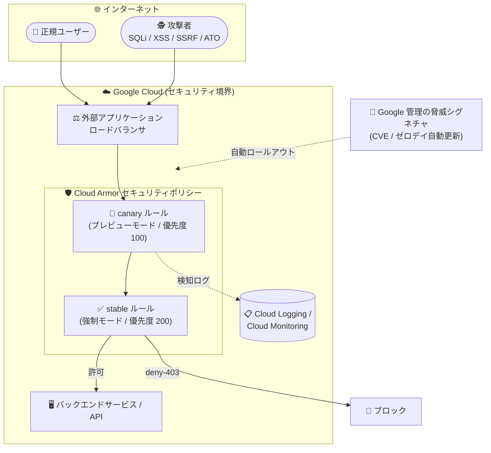

# Google Cloud Armor: マネージドルールセット (Preview)

**リリース日**: 2026-09-02

**サービス**: Google Cloud Armor

**機能**: マネージドルールセット (Managed Rulesets)

**ステータス**: Preview

📊 [このアップデートのインフォグラフィックを見る](https://takech9203.github.io/google-cloud-news-summary/20260902-cloud-armor-managed-rulesets-preview.html)

## 概要

Google Cloud Armor のマネージドルールセット (Managed Rulesets) が Preview として利用可能になりました。マネージドルールは、自動的に最新の状態に保たれる脅威シグネチャを使用して、バックエンドサービスや API を幅広い Web アプリケーションの脅威から保護する機能です。シグネチャは Google Cloud が脅威フィードに基づいてキュレーション・検証し、新たに発見された CVE やゼロデイ脆弱性に対する保護を自動的にロールアウトします。

従来の事前構成 WAF ルール (OWASP Core Rule Set ベース) と異なり、マネージドルールは Cloud Armor セキュリティポリシーに直接統合され、手動でのシグネチャ更新を不要にし、構成ドリフトを削減します。SQL インジェクションや XSS といった従来型の攻撃カテゴリに加え、アカウント乗っ取り、認証バイパス、SSRF、データ漏洩、悪意のあるファイルアップロードなど 13 の脅威カテゴリをカバーします。WAF の運用負荷を下げたいセキュリティチームや、CVE 対応のスピードを重視する組織が主な対象です。

**アップデート前の課題**

- 事前構成 WAF ルール (OWASP CRS ベース) では、新しい CRS バージョン (例: v3.3 → v4.22) への移行やルールのバージョン管理をユーザー自身が行う必要があった
- 新たに発見された CVE やゼロデイ脆弱性への対応は、リリースノートを確認して cve-canary ルールなどを手動で適用する運用が必要だった
- アカウント乗っ取り、SSRF、データ漏洩、スパムなど、OWASP CRS のカテゴリに含まれない脅威タイプは、カスタム CEL ルールを自作して対応する必要があった

**アップデート後の改善**

- 脅威シグネチャの更新が Google Cloud によって管理され、メンテナンスウィンドウなしでセキュリティポリシーに自動ロールアウトされるようになった
- 緊急性の高いゼロデイ脆弱性はアクティブなルールに直接パッチが適用され、手動のロジック変更なしにエンドポイントが保護されるようになった
- `stable` / `canary` のバージョンピニングにより、組織のリスク許容度に応じた更新戦略を選択できるようになった
- `evaluateManagedRules()` 式により、CEL (Common Expression Language) のカスタムルール内でネイティブに評価でき、きめ細かい条件制御と組み合わせられるようになった

## アーキテクチャ図



Google が自動更新する脅威シグネチャがセキュリティポリシー内のマネージドルールに反映され、ロードバランサ経由のトラフィックを検査します。canary 版をプレビューモード (高優先度)、stable 版を強制モード (低優先度) で併用することで、新ルールの影響をログで検証してから本番トラフィックに適用できます。

## サービスアップデートの詳細

### 主要機能

1. **自動化された脅威インテリジェンス**
   - 新しいシグネチャは脅威フィードに対してキュレーション・検証され、既知の CVE や新興の攻撃に対する保護を手動のロジック変更なしで提供
   - シグネチャ更新は Google Cloud が管理し、メンテナンスウィンドウなしでセキュリティポリシーに自動ロールアウト

2. **ゼロデイ脆弱性のカバレッジ**
   - 緊急性・時間的制約の高い脆弱性は、アクティブなルールに直接パッチとして適用され、エンドポイントを保護
   - stable 版でもゼロデイルールについては更新が迅速化 (expedited) される

3. **柔軟なバージョンピニング**
   - `stable` (本番検証済み・推奨): Google が自動更新する、本番トラフィック向けの安全なベースライン
   - `canary` (早期アクセス): 早期公開シグネチャを含む自動更新版。stable 版に先行してプレビューモードでの実行が推奨される

4. **CEL (Common Expression Language) 統合**
   - `evaluateManagedRules('カテゴリ:バージョン')` 式で、カスタムルール内でネイティブに評価可能
   - きめ細かい条件制御と組み合わせた柔軟なポリシー設計が可能

## 技術仕様

### 対応する脅威カテゴリ (13 カテゴリ)

| カテゴリ | 内容 | 構文リファレンス |
|------|------|------|
| アカウント乗っ取り | クレデンシャルスタッフィング、ブルートフォース、セッション悪用を検知 | `account_takeover:canary` |
| 認証バイパス | サインインフロー、セッションチェック、トークン検証の回避を検知 | `authentication_bypass:canary` |
| 自動化攻撃 | 既知のスキャナー、エクスプロイトツール、非人間トラフィックを検知 | `automated_attack:canary` |
| バックドア・トロイの木馬 | Web シェルや既知のバックドアに関連する通信・実行パターンを検知 | `backdoor_trojan:canary` |
| データ漏洩 | 内部 IP、認証情報、API キー、PII の漏洩を検出 | `data_leakage:canary` |
| ファイルアップロード | Web シェル、実行ファイル、偽装ペイロードなど悪意のあるファイルのアップロードを検知 | `file_upload:canary` |
| LFI | パストラバーサルやローカルファイルインクルージョンによる制限ファイルへのアクセスを検出 | `lfi:canary` |
| その他 | 未分類の攻撃、不正な形式のリクエスト、一般的な異常パターンを検知 | `misc:canary` |
| RFI | リモートコード実行や信頼できないファイルのインクルードを試みるペイロードを検知 | `rfi:canary` |
| スパム | ボットやスクリプトによるフォームスパム、コメントスパム、一括送信を検知 | `spam:canary` |
| SQLi | SQL クエリを操作してバックエンドデータにアクセス・改変・破壊するリクエストを検知 | `sqli:canary` |
| SSRF | サーバーに内部または未承認の外部リクエストを発行させる試みを検出 | `ssrf:canary` |
| XSS | セッションハイジャック、ページ改ざん、ユーザーデータ窃取につながるスクリプト注入を検出 | `xss:canary` |

各カテゴリには `canary` に加えて `stable` バージョンも利用できます (例: `sqli:stable`)。canary / stable のマネージドルールは、追加の脆弱性カバレッジ拡大のため時間とともに進化します。

### サポート範囲

| 項目 | 詳細 |
|------|------|
| 対応セキュリティポリシー | グローバルおよびリージョナルのバックエンドセキュリティポリシー |
| 評価方式 | CEL カスタムルール内の `evaluateManagedRules()` 式 |
| バージョン戦略 | `stable` (本番検証済み・推奨) / `canary` (早期アクセス) |
| 提供形態 | Cloud Armor Standard / Enterprise 両ティアのオプションアドオン |
| ステータス | Preview (Pre-GA Offerings Terms が適用) |

## 設定方法

### 前提条件

1. Cloud Armor セキュリティポリシーがサポートされるロードバランサ (バックエンドサービス) を使用していること
2. セキュリティポリシーの作成・更新権限を持っていること

### 手順

#### ステップ 1: セキュリティポリシーの作成

```bash
gcloud compute security-policies create POLICY_NAME \
    --global
```

#### ステップ 2: マネージドルールをポリシーに追加

stable 版の SQL インジェクション (sqli) マネージドルールを deny アクションで追加します。

```bash
gcloud compute security-policies rules create 100 \
    --security-policy POLICY_NAME \
    --action deny-403 \
    --expression "evaluateManagedRules('sqli:stable')"
```

#### ステップ 3: バックエンドサービスにポリシーをアタッチ

```bash
gcloud compute backend-services update BACKEND_SERVICE \
    --global \
    --security-policy POLICY_NAME
```

セキュリティポリシーはバックエンドサービスにアタッチするまで有効になりません。

#### 応用: canary 版をプレビューモードで併用

新ルールが本番トラフィックをブロックする前にログで評価するため、canary 版をプレビューモード (高優先度)、stable 版を強制モード (低優先度) で併用します。

```bash
# canary 版をプレビューモードで追加 (優先度 100)
gcloud compute security-policies rules create 100 \
    --security-policy POLICY_NAME \
    --action deny-403 \
    --expression "evaluateManagedRules('xss:canary')" \
    --preview

# stable 版を強制モードで追加 (優先度 200)
gcloud compute security-policies rules create 200 \
    --security-policy POLICY_NAME \
    --action deny-403 \
    --expression "evaluateManagedRules('xss:stable')"
```

## メリット

### ビジネス面

- **運用負荷の削減**: シグネチャ更新は Google Cloud が管理し、メンテナンスウィンドウなしで自動ロールアウトされるため、セキュリティチームは開発・運用に集中できる
- **CVE 対応の迅速化**: 新たに発見された CVE やゼロデイ脆弱性への対応が自動化され、脆弱性公開から保護適用までのギャップを短縮できる
- **カバレッジの拡大**: OWASP CRS ベースの事前構成ルールではカバーされないアカウント乗っ取り、SSRF、データ漏洩、スパムなどの脅威カテゴリに対応できる

### 技術面

- **構成ドリフトの削減**: セキュリティポリシーへの直接統合により、手動のシグネチャ更新に起因する構成ドリフトを削減
- **安全な更新検証フロー**: canary 版のプレビューモード + stable 版の強制モードという組み合わせで、新ルールの影響を本番適用前にログで検証可能
- **CEL ネイティブ統合**: `evaluateManagedRules()` をカスタムルールの条件式と組み合わせ、きめ細かい制御が可能

## デメリット・制約事項

### 制限事項

- Preview 段階の機能であり、Pre-GA Offerings Terms が適用される (「現状有姿」での提供、サポートが限定される可能性がある)
- マネージドルールはグローバルおよびリージョナルの「バックエンド」セキュリティポリシーでサポートされる (エッジセキュリティポリシーでのサポートは記載なし)
- マネージドルールは Cloud Armor Standard / Enterprise のオプションアドオンとして提供される (料金ページを参照)

### 考慮すべき点

- マネージドルール (canary / stable) はカバレッジ拡大のため時間とともに進化するため、正当なリクエストが誤検知されないか、プレビューモードとログでの継続的な検証が推奨される
- canary 版は早期公開シグネチャを含むため、本番トラフィックに強制モードで直接適用せず、プレビューモードでの先行評価が推奨される
- 既存の事前構成 WAF ルール (OWASP CRS ベース) とは別の機能であり、既存ポリシーとの優先度設計を検討する必要がある

## ユースケース

### ユースケース 1: 公開 API のゼロデイ脆弱性対策の自動化

**シナリオ**: 外部アプリケーションロードバランサ経由で公開している API に対し、新たな CVE が公開されるたびに手動で WAF ルールを更新しており、対応の遅れがリスクになっている。

**実装例**:
```bash
gcloud compute security-policies rules create 100 \
    --security-policy api-protection-policy \
    --action deny-403 \
    --expression "evaluateManagedRules('rfi:stable')"
```

**効果**: ゼロデイ脆弱性のパッチが Google によってアクティブなルールに直接適用され、手動対応なしで API エンドポイントが保護される。

### ユースケース 2: ログインエンドポイントのアカウント乗っ取り対策

**シナリオ**: EC サイトのログインページに対するクレデンシャルスタッフィングやブルートフォース攻撃を、カスタムルールの自作なしで防ぎたい。

**実装例**:
```bash
gcloud compute security-policies rules create 100 \
    --security-policy login-protection-policy \
    --action deny-403 \
    --expression "evaluateManagedRules('account_takeover:canary')" \
    --preview
```

**効果**: OWASP CRS ではカバーされないアカウント乗っ取り系の脅威を、Google 管理のシグネチャで検知できる。まずプレビューモードで誤検知を検証し、問題がなければ強制モードに昇格する。

## 料金

マネージドルールは、Cloud Armor Standard および Cloud Armor Enterprise (Paygo / Annual) のいずれのティアでも「オプションアドオン」として提供されます。具体的なアドオン料金は公式料金ページを参照してください。

なお、Cloud Armor の一般的な料金体系は以下のとおりです。

| ティア | 料金体系 |
|--------|-----------------|
| Cloud Armor Standard | 従量課金 (ポリシー単位、ルール単位、リクエスト単位) |
| Cloud Armor Enterprise Paygo | $200/月/プロジェクト + 3 リソース目以降 $200/月/保護リソース (WAF 利用はバンドル) |
| Cloud Armor Enterprise Annual | $3,000/月/請求先アカウント (12 か月コミット) + 101 リソース目以降 $30/月/保護リソース (WAF 利用はバンドル) |

プレビューモードのルールにも通常のリクエスト単位の料金が発生する点に注意してください。

詳細: [Cloud Armor 料金ページ](https://cloud.google.com/armor/pricing)

## 関連サービス・機能

- **Cloud Load Balancing (外部アプリケーションロードバランサ)**: Cloud Armor セキュリティポリシーはバックエンドサービスにアタッチして使用する。マネージドルールはグローバル / リージョナルのバックエンドセキュリティポリシーで利用可能
- **事前構成 WAF ルール (OWASP CRS)**: OWASP Core Rule Set (v4.22 など) ベースの既存の WAF ルール。マネージドルールは自動更新とカテゴリ拡張によりこれを補完する
- **Cloud Armor Adaptive Protection**: L7 DDoS 攻撃をトラフィックパターン分析で検知する Enterprise 機能。シグネチャベースのマネージドルールと相互補完的
- **Google Threat Intelligence**: 脅威インテリジェンスデータに基づくトラフィック制御 (Enterprise 機能)
- **Cloud Logging / Cloud Monitoring**: プレビューモードのルールの検知結果はログで確認でき、canary ルールの評価・チューニングに活用する

## 参考リンク

- 📊 [インフォグラフィック](https://takech9203.github.io/google-cloud-news-summary/20260902-cloud-armor-managed-rulesets-preview.html)
- [公式リリースノート](https://docs.cloud.google.com/release-notes#September_02_2026)
- [Managed rules overview (公式ドキュメント)](https://docs.cloud.google.com/armor/docs/managed-rules-overview)
- [Set up managed rules (設定手順)](https://docs.cloud.google.com/armor/docs/set-up-managed-rules)
- [Cloud Armor security policy overview](https://docs.cloud.google.com/armor/docs/security-policy-overview)
- [Cloud Armor best practices](https://docs.cloud.google.com/armor/docs/best-practices)
- [料金ページ](https://cloud.google.com/armor/pricing)

## まとめ

Cloud Armor マネージドルールセットは、WAF シグネチャの更新を Google に委ねることで CVE・ゼロデイ対応を自動化し、OWASP CRS ではカバーされないアカウント乗っ取りや SSRF などの脅威カテゴリにも対応する重要なアップデートです。まずは canary 版をプレビューモードで既存のセキュリティポリシーに追加し、ログで誤検知を検証した上で stable 版の強制モード適用を検討することを推奨します。Preview 段階のため、本番環境への適用は Pre-GA の利用条件を確認した上で判断してください。

---

**タグ**: Cloud Armor, WAF, セキュリティ, マネージドルール, Preview, ゼロデイ, CVE, DDoS
