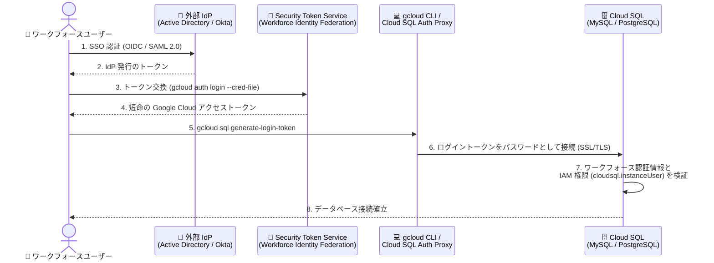

# Cloud SQL: Workforce Identity Federation 認証のサポート

**リリース日**: 2026-09-02

**サービス**: Cloud SQL for MySQL / Cloud SQL for PostgreSQL

**機能**: Workforce Identity Federation 認証 (サードパーティ IAM 認証)

**ステータス**: 一般提供 (Feature)

📊 [このアップデートのインフォグラフィックを見る](https://takech9203.github.io/google-cloud-news-summary/20260902-cloud-sql-workforce-identity-federation.html)

## 概要

Cloud SQL for MySQL および Cloud SQL for PostgreSQL が **Workforce Identity Federation 認証** (サードパーティ IAM 認証とも呼ばれる) をサポートしました。これにより、Microsoft Active Directory や Okta などの外部 ID プロバイダ (IdP) の ID を使用して、**Google アカウントを持たずに** Cloud SQL インスタンスへ直接認証・接続できるようになります。

Workforce Identity Federation は、外部 IdP のユーザー (従業員、パートナー、契約社員など) を Google Cloud に連携させる仕組みで、ユーザーアカウントを Google Cloud 側に保存しない「同期レス (sync-less)」なアーキテクチャが特徴です。今回のアップデートで Cloud SQL に新しいユーザータイプ `CLOUD_IAM_WORKFORCE_IDENTITY` が追加され、Workforce Identity Pool のプリンシパルがデータベースユーザーとしてログインできるようになりました。ログイン時には Cloud SQL がワークフォース認証情報とプロジェクトレベルの IAM 権限を検証します。

すでに Microsoft Entra ID / Active Directory Federation Services (AD FS) / Okta などのエンタープライズ IdP で ID を一元管理している組織にとって、データベースアクセスの認証を既存の ID 基盤に統合できる重要なアップデートです。特に、Cloud Identity への ID 同期を行っていない大規模組織や、複雑な ID 管理要件を持つ企業の Solutions Architect にとって注目すべき機能です。

**アップデート前の課題**

- Cloud SQL の IAM データベース認証は Google アカウント (Cloud Identity / Google Workspace のユーザーやサービスアカウント) を前提としており、外部 IdP のみで ID を管理する組織はドメインの確認や Cloud Identity への ID 同期 (例: Google Cloud Directory Sync) が必要だった
- 外部 IdP のユーザーが Cloud SQL に接続するには、組み込みデータベース認証 (パスワード認証) を利用するなど、企業の ID 基盤と分離された認証情報の管理が必要だった
- データベースアクセスの権限管理が企業 IdP と分断され、入退社やロール変更時のアクセス制御を一元化しにくかった

**アップデート後の改善**

- 外部 IdP (Microsoft Active Directory、Okta など) の ID をそのまま使用して Cloud SQL インスタンスに認証できるようになった (Google アカウント不要)
- ドメイン確認や Cloud Identity への ID 同期が不要になり、運用オーバーヘッドが削減された
- データベースアクセスを既存のエンタープライズ IdP で一元管理でき、セキュリティが向上した
- 複雑な ID 管理要件を持つ大規模組織でもスケールしやすい認証基盤を構築できるようになった

## アーキテクチャ図



外部 IdP で SSO 認証したユーザーが、Security Token Service でトークンを交換し、生成したログイントークンを使って Cloud SQL インスタンスに接続する認証フローです。Cloud SQL はログイン時にワークフォース認証情報とプロジェクトレベルの IAM 権限を検証します。

## サービスアップデートの詳細

### 主要機能

1. **`CLOUD_IAM_WORKFORCE_IDENTITY` ユーザータイプ**
   - Workforce Identity Pool のプリンシパルを Cloud SQL のデータベースユーザーとして追加できる新しいユーザータイプ
   - ユーザー ID は Workforce Identity プロバイダの属性マッピングで提供される値 (通常はメールアドレス、例: `cruz@example.com`) と一致させる必要がある
   - Console / gcloud / Terraform / REST API で作成可能

2. **既存 IdP との連携 (Google アカウント不要)**
   - OIDC または SAML 2.0 をサポートする任意の IdP (Microsoft Entra ID、AD FS、Okta など) と連携可能
   - ID は Google Cloud に同期・保存されず、ログイン時にトークン交換で検証される (OAuth 2.0 Token Exchange、RFC 8693 準拠)
   - IAM の `principal://` (個別ユーザー) または `principalSet://` (プール全体) でアクセス権を付与

3. **既存の IAM 認証基盤との統合**
   - インスタンス側は既存の IAM 認証フラグ (`cloudsql_iam_authentication` / `cloudsql.iam_authentication`) を有効化するだけで利用可能
   - `gcloud sql generate-login-token` によるログイントークン生成、Cloud SQL Auth Proxy の `--auto-iam-authn` フラグによる自動 IAM 認証に対応

## 技術仕様

### 前提条件と対応バージョン

| 項目 | 詳細 |
|------|------|
| 対応エンジン | Cloud SQL for MySQL 8.0 以降 / Cloud SQL for PostgreSQL 13 以降 |
| ユーザータイプ | `CLOUD_IAM_WORKFORCE_IDENTITY` |
| 必要なインスタンス設定 | MySQL: `cloudsql_iam_authentication=on` / PostgreSQL: `cloudsql.iam_authentication=on` |
| IdP プロトコル | OpenID Connect (OIDC)、SAML 2.0 |
| 事前構成 | 組織レベルの Workforce Identity Pool とプロバイダの構成、サービスアカウント インパーソネーションの設定、最新の gcloud CLI |

### 必要な IAM ロール

| 操作 | ロール |
|------|--------|
| インスタンスの管理 | Cloud SQL Admin (`roles/cloudsql.admin`) |
| インスタンスへの接続 | Cloud SQL Instance User (`roles/cloudsql.instanceUser`) |
| Cloud SQL Auth Proxy 経由の接続 | Cloud SQL Client (`roles/cloudsql.client`) |
| IAM ポリシーの管理 | Project IAM Admin (`roles/resourcemanager.projectIamAdmin`) |

### プリンシパル識別子の形式

```text
# 個別ユーザーに付与する場合
principal://iam.googleapis.com/locations/global/workforcePools/POOL_ID/subject/USER_ID

# プール全体に付与する場合
principalSet://iam.googleapis.com/locations/global/workforcePools/POOL_ID/*
```

## 設定方法

### 前提条件

1. 最新の gcloud CLI をインストールしていること
2. Google Cloud 組織で Workforce Identity Federation のプールとプロバイダを構成済みであること
3. サービスアカウント インパーソネーションを設定済みであること
4. Cloud SQL インスタンスが MySQL 8.0 以降または PostgreSQL 13 以降であること

### 手順

#### ステップ 1: インスタンスで IAM 認証を有効化

```bash
# MySQL の場合
gcloud sql instances patch INSTANCE_NAME \
  --database-flags=cloudsql_iam_authentication=on

# PostgreSQL の場合
gcloud sql instances patch INSTANCE_NAME \
  --database-flags=cloudsql.iam_authentication=on
```

インスタンスの IAM 認証フラグを有効にします。Console、Terraform、REST API でも設定できます。

#### ステップ 2: ワークフォース ID ユーザーをインスタンスに追加

```bash
gcloud sql users create USER_ID \
  --instance=INSTANCE_NAME \
  --type=CLOUD_IAM_WORKFORCE_IDENTITY
```

`USER_ID` には Workforce Identity プロバイダの属性マッピングと一致する値 (通常はメールアドレス) を指定します。

#### ステップ 3: IAM ロールを付与

```bash
# 個別ユーザーに付与する場合
gcloud projects add-iam-policy-binding PROJECT_ID \
  --member="principal://iam.googleapis.com/locations/global/workforcePools/POOL_ID/subject/USER_ID" \
  --role="roles/cloudsql.instanceUser"

# プール全体に付与する場合
gcloud projects add-iam-policy-binding PROJECT_ID \
  --member="principalSet://iam.googleapis.com/locations/global/workforcePools/POOL_ID/*" \
  --role="roles/cloudsql.instanceUser"
```

#### ステップ 4: データベース権限を付与

```sql
GRANT SELECT ON TABLE_NAME TO "USER_ID";
```

ワークフォース ID ユーザーの作成時にデータベースロールを指定するか、データベース内で手動で権限を付与します。

#### ステップ 5: インスタンスに接続

```bash
# ワークフォース ID で gcloud に認証
gcloud auth login --cred-file=CONFIGURATION_FILE

# MySQL に接続
export MYSQL_PWD=$(gcloud sql generate-login-token)
mysql --host=INSTANCE_IP --user=USER_ID \
  --database=DB_NAME --ssl-mode=REQUIRED

# PostgreSQL に接続
export PGPASSWORD=$(gcloud sql generate-login-token)
psql "host=INSTANCE_IP user=USER_ID dbname=DB_NAME sslmode=require"
```

Cloud SQL Auth Proxy を使用する場合は `--auto-iam-authn` フラグを付けて起動します。

```bash
./cloud-sql-proxy INSTANCE_CONNECTION_NAME --auto-iam-authn
```

## メリット

### ビジネス面

- **運用オーバーヘッドの削減**: ドメインの確認や Cloud Identity への ID 同期が不要になり、ID 管理の二重運用を解消できる
- **ガバナンスの強化**: データベースアクセスを既存のエンタープライズ IdP で一元管理でき、入退社時のアクセス制御やコンプライアンス対応が容易になる
- **大規模組織への適合**: 複雑な ID 管理要件を持つ大規模組織でもスケールしやすい (公式ドキュメントでも "Ease of scale" として明記)

### 技術面

- **同期レスなアーキテクチャ**: ID は Google Cloud に保存されず、ログイン時のトークン交換 (RFC 8693) で検証されるため、同期ツール (GCDS など) が不要
- **短命トークンによる認証**: パスワードの代わりに `gcloud sql generate-login-token` で生成する短命のログイントークンを使用し、長期的な認証情報の漏洩リスクを低減
- **既存ツールチェーンとの統合**: Cloud SQL Auth Proxy の自動 IAM 認証 (`--auto-iam-authn`) や Terraform (`google_sql_user` の `type = "CLOUD_IAM_WORKFORCE_IDENTITY"`) にそのまま対応

## デメリット・制約事項

### 制限事項

- **プール間のユーザー ID 重複**: Cloud SQL は、異なる Workforce Pool や IdP にまたがる同一ユーザー ID のサブジェクトを区別できない。複数のプール / プロバイダを使用する場合は、別プールの同名サブジェクトに `roles/cloudsql.instanceUser` を付与しないよう IAM ポリシーで制御する必要がある
- **ログインクォータ**: インスタンスあたり毎分 12,000 ログイン (成功・失敗を含む) のクォータがあり、超過するとログインが一時的に利用不可になる。頻繁なログインを避け、承認済みネットワークでログインを制限することが推奨される
- **対応バージョン**: MySQL 8.0 以降 / PostgreSQL 13 以降のインスタンスが必要

### 考慮すべき点

- Workforce Identity Pool とプロバイダは Google Cloud 組織レベルで構成する必要があり、組織管理者との調整が必要
- ユーザー ID は IdP の属性マッピング (通常はメールアドレス) と一致させる必要があるため、属性マッピングの設計を事前に確認する
- インスタンス管理やロール付与には `roles/cloudsql.admin` や `roles/resourcemanager.projectIamAdmin` などの権限が必要

## ユースケース

### ユースケース 1: Okta で ID 管理する企業のデータベースアクセス統合

**シナリオ**: 全社の ID を Okta で管理しており、Google アカウントを従業員に配布していない企業が、データ分析チームに Cloud SQL for PostgreSQL へのアクセスを提供したい。

**実装例**:
```bash
# 分析チームのワークフォースユーザーを追加
gcloud sql users create analyst@example.com \
  --instance=analytics-db \
  --type=CLOUD_IAM_WORKFORCE_IDENTITY

# 個別ユーザーに接続権限を付与
gcloud projects add-iam-policy-binding my-project \
  --member="principal://iam.googleapis.com/locations/global/workforcePools/okta-pool/subject/analyst@example.com" \
  --role="roles/cloudsql.instanceUser"
```

**効果**: Okta の SSO とライフサイクル管理をそのまま活用でき、退職時は Okta 側で無効化するだけでデータベースアクセスも遮断できる。

### ユースケース 2: Active Directory を利用する組織のパスワードレス化

**シナリオ**: オンプレミスの Microsoft Active Directory (AD FS) で ID を管理する組織が、Cloud SQL for MySQL の組み込みパスワード認証を廃止し、認証を AD に一元化したい。

**効果**: データベースパスワードの発行・ローテーション運用が不要になり、短命のログイントークンによる認証へ移行することでセキュリティ体制が強化される。

## 料金

Workforce Identity Federation 認証機能自体に追加料金の記載はありません。Cloud SQL インスタンスの利用料金は通常どおり適用されます。詳細は料金ページを参照してください。

- [Cloud SQL 料金](https://cloud.google.com/sql/pricing)

## 関連サービス・機能

- **Workforce Identity Federation (IAM)**: 本機能の基盤となる ID 連携サービス。組織レベルでプールとプロバイダを構成し、OIDC / SAML 2.0 対応の IdP と連携する
- **Cloud SQL IAM データベース認証**: Google アカウント (ユーザー / サービスアカウント) 向けの既存の IAM 認証。今回のアップデートで外部 IdP の ID にも認証範囲が拡大された
- **Cloud SQL Auth Proxy**: `--auto-iam-authn` フラグにより、ワークフォース ID での自動 IAM 認証接続に対応
- **Cloud Audit Logs**: Workforce Identity Pool 内のユーザーによるアクセスはプール ID とともに監査ログに記録される
- **Secret Manager**: 組み込みパスワード認証を継続利用する場合のシークレット管理の選択肢。本機能によりパスワード管理自体を削減できる

## 参考リンク

- 📊 [インフォグラフィック](https://takech9203.github.io/google-cloud-news-summary/20260902-cloud-sql-workforce-identity-federation.html)
- [公式リリースノート](https://docs.cloud.google.com/release-notes#September_02_2026)
- [Workforce Identity Federation authentication (Cloud SQL for MySQL)](https://docs.cloud.google.com/sql/docs/mysql/workforce-authentication)
- [Workforce Identity Federation authentication (Cloud SQL for PostgreSQL)](https://docs.cloud.google.com/sql/docs/postgres/workforce-authentication)
- [Workforce Identity Federation の概要 (IAM)](https://docs.cloud.google.com/iam/docs/workforce-identity-federation)
- [Cloud SQL 料金](https://cloud.google.com/sql/pricing)

## まとめ

Cloud SQL for MySQL / PostgreSQL が Workforce Identity Federation に対応したことで、Microsoft Active Directory や Okta などの外部 IdP の ID をそのまま使ったデータベース認証が可能になり、Google アカウントの配布や ID 同期が不要になりました。エンタープライズ IdP で ID を一元管理している組織は、対象インスタンス (MySQL 8.0+ / PostgreSQL 13+) での IAM 認証フラグの有効化と Workforce Identity Pool の構成を検討し、パスワードベースのデータベース認証からの移行を進めることを推奨します。

---

**タグ**: #CloudSQL #MySQL #PostgreSQL #WorkforceIdentityFederation #IAM #認証 #セキュリティ #Okta #ActiveDirectory
