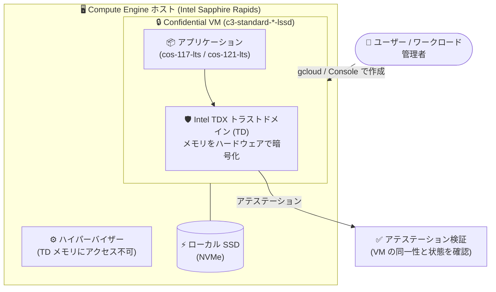

# Confidential VM: c3-standard-*-lssd マシンタイプでの Intel TDX サポートが GA

**リリース日**: 2026-09-02

**サービス**: Confidential VM (Compute Engine)

**機能**: c3-standard-*-lssd マシンタイプでの Intel TDX サポート

**ステータス**: GA (一般提供)

📊 [このアップデートのインフォグラフィックを見る](https://takech9203.github.io/google-cloud-news-summary/20260902-confidential-vm-intel-tdx-c3-lssd-ga.html)

## 概要

Compute Engine の Confidential VM において、ローカル SSD 付きの C3 マシンタイプ (`c3-standard-*-lssd`) での Intel TDX (Trust Domain Extensions) サポートが一般提供 (GA) になりました。これにより、ローカル SSD の高速なローカルストレージ性能と、ハードウェアベースのメモリ暗号化・アテステーションを提供する TEE (Trusted Execution Environment) を、本番ワークロードで組み合わせて利用できます。

Intel TDX は、VM 内部に隔離されたトラストドメイン (TD) を作成し、ハードウェア拡張機能によってメモリの管理と暗号化を行う Confidential Computing 技術です。ハイパーバイザーからもアクセスできない専用ハードウェアで暗号鍵を生成・保持し、DRAM の解析やメモリ内容のキャプチャ・改ざん・再配置といった物理アクセスを伴う攻撃への防御を強化します。

このアップデートの対象ユーザーは、機密データを扱いながら高い I/O 性能を必要とするワークロード (データベース、キャッシュ、スクラッチ領域を多用する分析処理など) を Compute Engine 上で運用するユーザーです。なお、同じ `c3-standard-*-lssd` マシンタイプを Confidential GKE Nodes として利用する GKE 側のアップデート (2026-09-03 公開) は別レポートで扱っており、本レポートは Compute Engine / Confidential VM の観点に絞って解説します。

**アップデート前の課題**

- Intel TDX の Confidential VM でローカル SSD を利用する構成は GA ではなく、本番ワークロードでの採用が難しかった
- C3 シリーズの Confidential VM (Intel TDX) はローカル SSD なしの `c3-standard-*` 構成が中心で、ローカル NVMe SSD の低レイテンシ・高スループットを必要とするワークロードを TEE 内で実行する選択肢が限られていた

**アップデート後の改善**

- `c3-standard-*-lssd` マシンタイプで Intel TDX を有効にした Confidential VM を GA として作成できるようになった
- ローカル SSD を必要とする高 I/O ワークロード (一時データ処理、キャッシュ、高速スクラッチ領域など) を、使用中データが暗号化された TEE 内で本番運用できるようになった
- サポート対象 OS イメージとして Container-Optimized OS (`cos-117-lts`、`cos-121-lts`) が明確に定義された

## アーキテクチャ図



`c3-standard-*-lssd` マシンタイプ上で Intel TDX のトラストドメインがワークロードのメモリをハードウェア暗号化で保護し、ハイパーバイザーからの隔離を実現します。ローカル NVMe SSD を高速ストレージとして利用しつつ、アテステーションで VM の完全性を検証できます。

## サービスアップデートの詳細

### 主要機能

1. **c3-standard-*-lssd での Intel TDX が GA**
   - ローカル SSD が構成に含まれる C3 マシンタイプで、Intel TDX ベースの Confidential VM を一般提供として作成可能
   - Intel TDX の制限事項として、ローカル SSD は `c3-standard-*-lssd` マシンタイプでのみサポートされる (TDX でローカル SSD を使う唯一の構成)

2. **ハードウェアベースの隔離とアテステーション**
   - 暗号鍵は専用ハードウェアで生成・保持され、ハイパーバイザーからアクセス不可
   - アテステーションにより、VM の同一性と状態 (主要コンポーネントが改ざんされていないこと) を検証可能

3. **Container-Optimized OS のサポート**
   - `c3-standard-*-lssd` 上の Intel TDX Confidential VM では、OS イメージファミリーとして `cos-117-lts` と `cos-121-lts` がサポートされる

## 技術仕様

### サポート構成

| 項目 | 詳細 |
|------|------|
| マシンタイプ | `c3-standard-*-lssd` |
| CPU プラットフォーム | Intel Sapphire Rapids |
| Confidential Computing 技術 | Intel TDX |
| ライブマイグレーション | 非サポート (メンテナンスポリシーは `TERMINATE` を指定) |
| GPU | 非サポート |
| サポート OS イメージファミリー | `cos-117-lts`、`cos-121-lts` |
| 永続ディスク | NVMe インターフェースの Balanced Persistent Disk のみサポート |

## 設定方法

### 前提条件

1. Intel TDX + `c3-standard-*-lssd` をサポートするゾーンを選択する (「利用可能リージョン」参照)
2. サポート対象の OS イメージファミリー (`cos-117-lts` または `cos-121-lts`) を使用する
3. Confidential VM は新規作成が必要 (既存インスタンスを Confidential VM に変換することはできない)

### 手順

#### ステップ 1: Intel TDX を有効にした c3-standard-*-lssd インスタンスを作成

```bash
gcloud compute instances create my-tdx-lssd-instance \
    --machine-type=c3-standard-4-lssd \
    --zone=us-central1-a \
    --confidential-compute-type=TDX \
    --maintenance-policy=TERMINATE \
    --image-project=cos-cloud \
    --image-family=cos-121-lts
```

`--confidential-compute-type=TDX` で Intel TDX を指定します。Intel TDX の場合、`--min-cpu-platform` フラグは指定不要です。ライブマイグレーションがサポートされないため、`--maintenance-policy=TERMINATE` を指定します。

#### ステップ 2: サポートされる OS イメージの確認 (任意)

```bash
gcloud compute images list \
    --filter="guestOsFeatures[].type:(TDX_CAPABLE)"
```

`TDX_CAPABLE` タグが付いたイメージが Intel TDX の隔離とアテステーションをサポートします。

## メリット

### ビジネス面

- **コンプライアンス対応の拡大**: 使用中データの暗号化 (Confidential Computing) が求められる規制業界のワークロードでも、ローカル SSD の性能を活かした構成を GA サポートの下で採用できる
- **本番運用の安心感**: Preview ではなく GA となったことで、本番ワークロードへの適用判断がしやすくなる

### 技術面

- **高 I/O 性能と機密性の両立**: ローカル NVMe SSD の低レイテンシストレージと、Intel TDX によるハードウェアメモリ暗号化を同一インスタンスで利用できる
- **アテステーションによる完全性検証**: VM の同一性と状態を検証し、主要コンポーネントが改ざんされていないことを確認できる
- **ハイパーバイザーからの隔離**: 暗号鍵は専用ハードウェア内にのみ存在し、ハイパーバイザーからアクセスできない

## デメリット・制約事項

### 制限事項 (Intel TDX)

- ローカル SSD は `c3-standard-*-lssd` マシンタイプでのみサポート
- ライブマイグレーションは非サポート
- 標準 VM と比較してシャットダウンに時間がかかる (メモリサイズが大きいほど遅延が増加)
- 永続ディスクは NVMe インターフェースの Balanced Persistent Disk のみサポート
- 単一テナントノードグループ (sole-tenant node groups) でのプロビジョニング不可
- セキュリティ上の制約により、CPUID 命令が返す CPU アーキテクチャ情報が制限される場合があり、CPUID 値に依存するワークロードの性能に影響する可能性がある
- kdump は非サポート (代わりにゲストコンソールログを使用)
- TDX halt 修正パッチが未適用のゲストイメージでは halt 時間が長くなり性能が劣化する可能性がある
- Intel TDX の Confidential VM は予約 (reservations) をサポートしない

### 考慮すべき点 (Confidential VM 共通)

- 既存インスタンスの Confidential VM への変換は不可 (新規作成が必要)
- ディスクは NVMe インターフェースが必須 (SCSI 非サポート)、アタッチ可能なディスクは最大 40 個
- メモリ量に比例してブート時間が長くなり、SSH 接続の確立にも通常の VM より時間がかかる
- 非 Confidential VM と比較してネットワーク帯域幅が低下し、レイテンシが増加する可能性がある

## ユースケース

### ユースケース 1: 機密データを扱う高速データ処理

**シナリオ**: 金融・医療などの規制業界で、個人情報を含むデータセットに対する一時的な変換・集計処理を行う。処理中のデータはメモリ上でも保護が求められ、中間ファイルの読み書きに高速なローカルストレージが必要。

**実装例**:
```bash
gcloud compute instances create secure-etl-worker \
    --machine-type=c3-standard-8-lssd \
    --zone=us-east4-b \
    --confidential-compute-type=TDX \
    --maintenance-policy=TERMINATE \
    --image-project=cos-cloud \
    --image-family=cos-121-lts
```

**効果**: 使用中データが Intel TDX によりハードウェアレベルで暗号化された状態のまま、ローカル NVMe SSD をスクラッチ領域として使う高スループットな処理を実行できる。

### ユースケース 2: TEE 内でのコンテナワークロード実行

**シナリオ**: Container-Optimized OS 上でコンテナ化された機密ワークロードを実行し、クラウド事業者の運用者やハイパーバイザーからもデータを隔離したい。

**効果**: サポート対象の `cos-117-lts` / `cos-121-lts` イメージを使い、TDX トラストドメイン内でコンテナを実行できる。アテステーションで実行環境の完全性を検証した上で、機密データの処理を開始する運用が可能になる。

## 料金

Confidential VM は、ベースとなるマシンタイプの料金に加えて Confidential Computing の利用料金が発生します。`c3-standard-*-lssd` はローカル SSD 容量を含むマシンタイプです。詳細な料金は公式料金ページを参照してください。

- [Confidential VM の料金](https://docs.cloud.google.com/confidential-computing/confidential-vm/pricing)
- [Compute Engine の料金 (VM インスタンス)](https://cloud.google.com/compute/vm-instance-pricing)

## 利用可能リージョン

`c3-standard-*-lssd` マシンタイプでの Intel TDX は、以下のゾーンでサポートされています。

| リージョン | ゾーン |
|-----------|--------|
| asia-southeast1 | asia-southeast1-a、asia-southeast1-b |
| europe-west4 | europe-west4-a、europe-west4-b |
| southamerica-east1 | southamerica-east1-a |
| us-central1 | us-central1-a、us-central1-b |
| us-east4 | us-east4-b、us-east4-c |
| us-east5 | us-east5-b、us-east5-c |
| us-west1 | us-west1-b |

## 関連サービス・機能

- **Confidential GKE Nodes**: 同じ `c3-standard-*-lssd` マシンタイプを GKE の Confidential Nodes として利用する GKE 側のアップデート (2026-09-03 公開) も GA になっている (別レポートで解説)
- **ローカル SSD**: `c3-standard-*-lssd` に含まれる高速な NVMe ローカルストレージ。Intel TDX でローカル SSD を使える唯一の構成
- **Container-Optimized OS**: 本構成でサポートされる OS イメージファミリー (`cos-117-lts`、`cos-121-lts`)
- **アテステーション**: Confidential VM の同一性と状態を検証する仕組み。TEE の信頼性確認に利用

## 参考リンク

- 📊 [インフォグラフィック](https://takech9203.github.io/google-cloud-news-summary/20260902-confidential-vm-intel-tdx-c3-lssd-ga.html)
- [公式リリースノート](https://docs.cloud.google.com/release-notes#September_02_2026)
- [Confidential VM の概要](https://docs.cloud.google.com/confidential-computing/confidential-vm/docs/confidential-vm-overview)
- [サポートされる構成 (マシンタイプ、CPU、ゾーン)](https://docs.cloud.google.com/confidential-computing/confidential-vm/docs/supported-configurations)
- [Confidential VM インスタンスの作成](https://docs.cloud.google.com/confidential-computing/confidential-vm/docs/create-a-confidential-vm-instance)
- [料金ページ](https://docs.cloud.google.com/confidential-computing/confidential-vm/pricing)

## まとめ

`c3-standard-*-lssd` での Intel TDX サポートの GA により、ローカル NVMe SSD の高い I/O 性能と Confidential Computing による使用中データの保護を、本番ワークロードで両立できるようになりました。機密データを扱う高 I/O ワークロードを運用しているチームは、サポートゾーン (12 ゾーン) と OS イメージ (`cos-117-lts` / `cos-121-lts`)、ライブマイグレーション非対応などの制約を確認した上で、Confidential VM への移行を検討することを推奨します。

---

**タグ**: #ConfidentialVM #ComputeEngine #IntelTDX #ConfidentialComputing #LocalSSD #C3 #Security #GA
