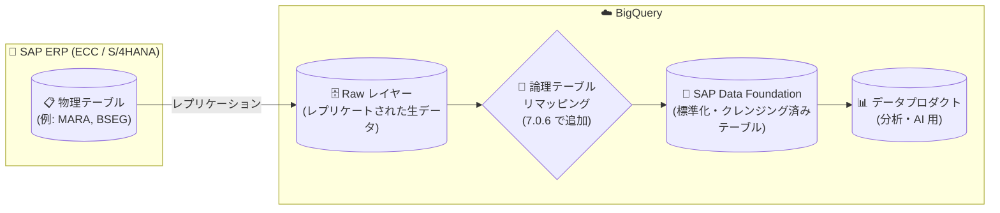

# Cortex Framework: Release 7.0.6 (論理 SAP テーブルリマッピング対応・developer skills の custom/ スキャフォールディング追加)

**リリース日**: 2026-09-02

**サービス**: Cortex Framework

**機能**: Release 7.0.6 (Fixed)

**ステータス**: Announcement (メンテナンスリリース)

📊 [このアップデートのインフォグラフィックを見る](https://takech9203.github.io/google-cloud-news-summary/20260902-cortex-framework-release-7-0-6.html)

## 概要

Google Cloud Cortex Framework の Release 7.0.6 が公開された。本リリースは修正 (Fixed) を中心とした小規模なメンテナンスリリースで、以下の 2 点が含まれる。

1. **SAP Data Foundation における論理 SAP テーブルリマッピングのサポート追加**: SAP Data Foundation は、SAP ECC / S/4HANA からレプリケートされた生データを BigQuery 上で標準化・クレンジングするデータ基盤レイヤーである。今回のリリースで、論理的なテーブル名の再マッピング (remapping) に対応した。
2. **全 developer skills への custom/ ディレクトリのスキャフォールディング追加**: Cortex Framework はリポジトリの `.agents/skills/` ディレクトリに AI コーディングアシスタント (Gemini + Antigravity など) 向けのエージェントスキルを同梱している。今回、ローカル拡張 (local extensions) 用の `custom/` ディレクトリの雛形生成がすべての developer skills に追加された。

Cortex Framework を SAP データ分析基盤として利用している、またはエージェントスキルを使ってカスタムデータプロダクトを開発しているデータエンジニア・開発者に関係するアップデートである。

**アップデート前の課題**

- SAP Data Foundation では、BigQuery にレプリケートされたテーブルが SAP の物理テーブルと同じ名前・構造であることが前提だった。SAP のバージョンやアドオン、レプリケーションツールの仕様によるテーブル名の差異がある場合、失敗するビューを手動で調整するといった対応が必要だった (v6 運用ガイドに記載の既知の考慮事項)
- カスタムコードを Dataform ワークスペースに直接置く場合、`definitions/custom/` ディレクトリ配下に配置しないと次回の `cortex-deploy` 実行時に削除・上書きされる仕様があり、ローカル拡張用のディレクトリ構成は利用者が意識して用意する必要があった

**アップデート後の改善**

- SAP Data Foundation で論理 SAP テーブルのリマッピングがサポートされ、物理テーブル名と論理的なテーブル定義の対応付けをフレームワーク側で扱えるようになった
- すべての developer skills が `custom/` ディレクトリのスキャフォールディング (雛形生成) を行うようになり、コアフレームワークの更新で上書きされないローカル拡張の置き場所が最初から用意されるようになった

## アーキテクチャ図

SAP からレプリケートされた生データが Data Foundation レイヤーで標準化される流れの中に、論理テーブルリマッピングが加わり、物理テーブル名と論理定義の差異をフレームワークが吸収できるようになった。

## サービスアップデートの詳細

### 主要機能

1. **論理 SAP テーブルリマッピング (SAP Data Foundation)**
   - SAP Data Foundation は raw レイヤーのレプリケートデータを、安定した標準化テーブルに変換するレイヤー (スキーマシールディング、自動重複排除、Z/Y カスタムフィールドの自動伝播などを提供)
   - 今回のリリースで論理 SAP テーブルの再マッピングに対応し、物理テーブルと論理テーブル定義の対応付けが可能になった

2. **developer skills への custom/ ディレクトリスキャフォールディング**
   - Cortex Framework は `.agents/skills/` に `create-data-product`、`validate-data-product`、`query-sap-ddic` などのエージェントスキルを同梱しており、AI コーディングアシスタントによるデータプロダクト開発を支援している
   - すべての developer skills に、ローカル拡張用の `custom/` ディレクトリの雛形生成が追加された。カスタム開発をコアパッケージ更新から分離して保護する、フレームワークの拡張性設計 (カスタム名前空間・`definitions/custom/` の保護規約) に沿った改善である

## 技術仕様

| 項目 | 詳細 |
|------|------|
| リリースバージョン | 7.0.6 |
| リリースタイプ | Announcement / Fixed (メンテナンスリリース) |
| 対象コンポーネント | SAP Data Foundation、developer skills (`.agents/skills/`) |
| 対応ソースシステム | SAP ECC、SAP S/4HANA |
| テーブル設定 | `config/cortex/data_foundation/sap` 配下の `table_settings.yaml` で構成 |
| 直近のリリース履歴 | 7.0.5 (2026-09-01)、7.0.4 (2026-08-26)、7.0.3 (2026-08-14) |

## メリット

### ビジネス面

- **SAP 環境差異への追従コスト削減**: レプリケーションツールや SAP バージョンによるテーブル名の差異に起因する手作業の修正が減り、デプロイの安定性が向上する
- **カスタム開発の安全性向上**: ローカル拡張の置き場所が標準化され、フレームワーク更新時にカスタマイズが失われるリスクを避けやすくなる

### 技術面

- **論理・物理テーブルの分離**: Data Foundation のスキーマシールディングの考え方に沿って、物理テーブル名の変化を下流のデータプロダクトから隠蔽できる
- **スキル駆動開発との一貫性**: エージェントスキルが生成するディレクトリ構造に `custom/` が含まれるため、AI アシスタントによる開発でも拡張性のベストプラクティスが自動的に適用される

## デメリット・制約事項

### 考慮すべき点

- 本リリースはバージョン 7 系のメンテナンスリリースであり、v6 以前を利用中の場合は v7 のモジュラーアーキテクチャへの移行が前提となる
- 論理テーブルリマッピングの具体的な設定方法は、公式ドキュメント (データ基盤の設定・`table_settings.yaml`) を確認して適用すること

## 関連サービス・機能

- **BigQuery**: Cortex Framework のデータ基盤・データプロダクトが構築される基盤。標準化テーブルと分析モデルは BigQuery 上に展開される
- **Dataform**: Cortex Framework のデータ変換パイプライン (SQLX/JS) の実行基盤。`cortex-deploy` によるデプロイで利用される
- **Gemini / Antigravity (AI コーディングアシスタント)**: developer skills を読み込んでカスタムデータプロダクトの計画・スキャフォールディング・検証を行う
- **BigQuery Connector for SAP**: SAP から BigQuery への raw データレプリケーションに利用される代表的な手段

## 参考リンク

- 📊 [インフォグラフィック](https://takech9203.github.io/google-cloud-news-summary/20260902-cortex-framework-release-7-0-6.html)
- [公式リリースノート](https://docs.cloud.google.com/release-notes#September_02_2026)
- [Cortex Framework リリースノート](https://docs.cloud.google.com/cortex/docs/release-notes)
- [Data Foundation 概要](https://docs.cloud.google.com/cortex/docs/data-foundation)
- [SAP ERP ソースシステム統合](https://docs.cloud.google.com/cortex/docs/source-system-integration/sap-erp)
- [エージェントスキルによるデータプロダクト構築](https://docs.cloud.google.com/cortex/docs/agentic-skills-for-data-product-building)
- [拡張性ガイド](https://docs.cloud.google.com/cortex/docs/extensibility-guide)

## まとめ

Release 7.0.6 は小規模なメンテナンスリリースだが、SAP テーブル名の差異を吸収する論理リマッピングと、ローカル拡張を保護する `custom/` ディレクトリの標準化という、SAP データ基盤の運用性と拡張性に直結する改善が含まれている。Cortex Framework v7 で SAP Data Foundation を運用しているチームは、`uv run cortex-deploy` 前に本バージョンへの更新と設定ドキュメントの確認を推奨する。

---

**タグ**: #CortexFramework #SAP #DataFoundation #BigQuery #Dataform #AgentSkills #リリース
