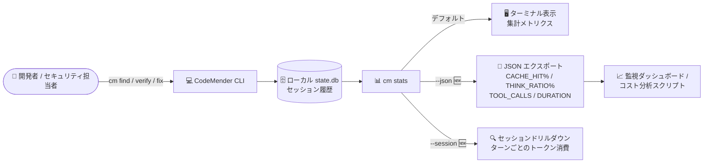

# Gemini Enterprise Agent Platform: CodeMender アップデート (cm stats の JSON 出力・セッションドリルダウンとバグ修正)

**リリース日**: 2026-09-02

**サービス**: Gemini Enterprise Agent Platform

**機能**: CodeMender アップデート (機械可読メトリクス、セッションドリルダウン、バグ修正)

**ステータス**: Fixed / Update (CodeMender は Preview)

📊 [このアップデートのインフォグラフィックを見る](https://takech9203.github.io/google-cloud-news-summary/20260902-gemini-agent-platform-codemender-updates.html)

## 概要

Gemini Enterprise Agent Platform 上のコードセキュリティエージェント CodeMender に複数のアップデートがリリースされた。CodeMender はコードベースの脆弱性をスキャン (`cm find`)、PoC エクスプロイトの実行により悪用可能性を検証 (`cm verify`)、検証済みパッチを生成・適用 (`cm fix`) する自律型 AI エージェントで、ローカルの CLI/デーモンとクラウド側のホスト型推論エンジンで構成される。

今回のリリースは可観測性 (オブザーバビリティ) の強化とバグ修正が中心である。(1) `cm stats` に `--json` フラグが追加され、集計およびセッション単位のメトリクス (`CACHE_HIT%`、`THINK_RATIO%`、`TOOL_CALLS`、`DURATION`) を機械可読形式でエクスポートできるようになった。(2) `cm stats --session <id>` で特定セッションのターンごとのトークン消費を詳細に確認できるようになった。(3) コードベース検索の信頼性向上、`cm report import` の失敗修正、プレビューモードの空ディレクトリ作成問題の修正、ワークスペースリセット失敗時の誤った検証判定の防止など、複数のバグ修正が含まれる。

CodeMender をチームや CI/CD パイプラインで運用しており、トークン消費コストの監視・分析を自動化したい開発チーム・セキュリティチームにとって価値のあるアップデートである。

**アップデート前の課題**

- CodeMender のトークン消費メトリクスは CLI のステータスラインや終了時サマリーなど人が読む形式が中心で、集計メトリクスを外部の監視・分析ツールに機械可読形式で取り込む手段がなかった
- セッション単位でターンごとのトークン消費を掘り下げて調査する手段がなく、トークン消費が多いセッションの原因分析が難しかった
- コードベース検索がバイナリアーカイブや通常ファイル以外 (非レギュラーファイル) に遭遇すると信頼性が低下することがあった
- `cm report import` がネイティブ JSON レポートや新規ファイルを参照する finding のインポートに失敗することがあった
- プレビューモードでユーザー確認前に空のディレクトリがディスク上に作成されてしまうことがあった
- ワークスペースのリセットに失敗した場合でも検証が実行され、誤った検証判定 (verification verdict) が返されることがあった

**アップデート後の改善**

- `cm stats --json` により、集計およびセッション単位のメトリクス (`CACHE_HIT%`、`THINK_RATIO%`、`TOOL_CALLS`、`DURATION`) を JSON でエクスポートし、スクリプトやダッシュボードに連携できるようになった
- `cm stats --session <id>` により、特定セッションのターンごとのトークン消費をドリルダウンして調査できるようになった
- コードベース走査時にバイナリアーカイブと非レギュラーファイルをスキップするようになり、検索の信頼性が向上した
- `cm report import` がネイティブ JSON レポートおよび新規ファイル参照を含む finding を正しく処理するようになった
- プレビューモードがユーザー確認前にディスク上へ空ディレクトリを作成しなくなった
- ワークスペースリセットが失敗した場合に誤った検証判定を返さないようになった

## アーキテクチャ図



CodeMender はセッション状態をローカルの SQLite データベース (`state.db`) で管理しており、今回 `cm stats` に追加された `--json` フラグと `--session` フラグにより、集計メトリクスの外部ツール連携と特定セッションのターン単位の分析が可能になった。

## サービスアップデートの詳細

### 主要機能

1. **機械可読メトリクス: `cm stats --json`**
   - `cm stats` に `--json` フラグが追加され、集計およびセッション単位のメトリクスを JSON 形式でエクスポートできる
   - エクスポートされるメトリクスは `CACHE_HIT%` (キャッシュヒット率)、`THINK_RATIO%` (思考トークン比率)、`TOOL_CALLS` (ツール呼び出し回数)、`DURATION` (実行時間)
   - スクリプトや監視基盤への取り込みが容易になり、トークン消費・実行効率の継続的なトラッキングを自動化できる

2. **セッションドリルダウン: `cm stats --session <id>`**
   - 特定のセッション ID を指定して、ターンごとのトークン消費を詳細に確認できる
   - セッション ID は `cm session list` で確認できる
   - トークン消費が突出したセッションの原因 (どのターンで消費が集中したか) を特定するのに役立つ

3. **バグ修正**
   - コードベース走査時にバイナリアーカイブと非レギュラーファイルをスキップするようになり、コードベース検索の信頼性が向上
   - `cm report import` がネイティブ JSON レポートや新規ファイルを参照する finding のインポートに失敗する問題を修正
   - プレビューモードでユーザー確認前に空ディレクトリがディスク上に作成される問題を修正
   - ワークスペースリセット失敗時に誤った検証判定が返されることを防止

## 技術仕様

### `cm stats` の新オプション

| オプション | 説明 |
|-----------|------|
| `--json` 🆕 | 集計およびセッション単位のメトリクスを JSON 形式でエクスポート |
| `--session <id>` 🆕 | 指定セッションのターンごとのトークン消費を表示 |

### エクスポートされるメトリクス

| メトリクス | 説明 |
|-----------|------|
| `CACHE_HIT%` | キャッシュヒット率 |
| `THINK_RATIO%` | 思考 (推論) トークンの比率 |
| `TOOL_CALLS` | ツール呼び出し回数 |
| `DURATION` | 実行時間 |

### 関連する CodeMender の仕組み (公式ドキュメントより)

| 項目 | 詳細 |
|------|------|
| セッション管理 | すべてのスキャン・検証・修復はローカルの SQLite データベース (`state.db`) に記録されるステートフルなセッションとして管理される |
| トークン表示 | 実行中は `--compact` によるステータスライン、完了時は 1 行サマリーで入力/出力/合計トークンを表示。合計にはモデルの内部推論トークンが含まれることがある |
| 課金トークン | プロジェクト全体の課金済みトークン使用量は Cloud Billing のレポートで確認 |
| `cm report import` | サードパーティの静的解析・脆弱性スキャンツールの JSON findings ファイル (`--file`) をインポートし、検証・修復ワークフローに接続 |
| プレビュー/確認 | `cm fix` はデフォルトで各ファイル変更をディスクへ書き込む前にユーザー確認を求める |

## 設定方法

### 前提条件

1. CodeMender CLI がインストール・構成済みであること ([Set up environment](https://docs.cloud.google.com/gemini-enterprise-agent-platform/codemender/set-up-environment))
2. 新機能を利用するには CLI を最新バージョンに更新すること (`cm update` で即時更新可能)

### 手順

#### ステップ 1: CLI の更新

```bash
# 最新バージョンへ即時更新 (24 時間スロットルを無視、非対話)
cm update
```

#### ステップ 2: 集計メトリクスの JSON エクスポート

```bash
# 集計およびセッション単位のメトリクスを JSON で出力
cm stats --json

# 例: jq と組み合わせてスクリプトで処理
cm stats --json | jq .
```

#### ステップ 3: 特定セッションのドリルダウン

```bash
# セッション ID を確認
cm session list

# ターンごとのトークン消費を確認
cm stats --session SESSION_ID
```

## メリット

### ビジネス面

- **コスト可視化の自動化**: トークン消費メトリクスを機械可読形式で取得できるため、CodeMender の運用コストをダッシュボードで継続的に監視し、予算管理に組み込める
- **運用の信頼性向上**: レポートインポートやワークスペースリセットに関するバグ修正により、CI/CD パイプラインでの自動化ワークフローの安定性が高まる

### 技術面

- **外部ツール連携**: `--json` 出力により、監視基盤や BI ツール、コスト分析スクリプトへの取り込みが容易になる
- **トークン消費の原因分析**: セッションドリルダウンでターンごとの消費を確認でき、`THINK_RATIO%` や `CACHE_HIT%` を手がかりに非効率なセッションを特定できる
- **検証結果の正確性向上**: ワークスペースリセット失敗時の誤判定防止により、検証判定 (悪用可能/不可能) の信頼性が向上する
- **大規模リポジトリでの安定性**: バイナリアーカイブや非レギュラーファイルを含むリポジトリでもコードベース検索が安定して動作する

## デメリット・制約事項

### 制限事項

- CodeMender は Preview 段階であり、Pre-GA Offerings Terms が適用される (サポートが限定される場合がある)
- 本リリースノート時点では、`cm stats` の JSON 出力スキーマの詳細 (フィールド構造) は公式ドキュメントで確認できていない。実際の出力を確認のうえスクリプトを実装することを推奨

### 考慮すべき点

- `cm stats` のメトリクスはローカルの `state.db` に基づくセッション統計であり、プロジェクト全体の課金済みトークン使用量の確認には Cloud Billing のレポートを併用する必要がある
- CodeMender はホストシステム上でコマンドを実行し、ファイルを直接変更する可能性があるため、サンドボックス設定 (デフォルト有効) を維持することが推奨される

## ユースケース

### ユースケース 1: CI/CD パイプラインでのトークンコスト監視の自動化

**シナリオ**: セキュリティチームが夜間の CI パイプラインで `cm find` / `cm verify` を定期実行しており、スキャン対象の拡大に伴うトークン消費の推移を監視ダッシュボードで追跡したい。

**実装例**:
```bash
# パイプラインの最後にメトリクスを JSON でエクスポートし、監視基盤へ送信
cm stats --json > /tmp/cm_stats.json
# 例: 集計結果を BigQuery やモニタリングツールにロードして推移を可視化
```

**効果**: `CACHE_HIT%`、`TOOL_CALLS`、`DURATION` などの推移を自動収集でき、トークン消費の異常増加やキャッシュ効率の低下を早期に検知できる。

### ユースケース 2: トークン消費が突出したセッションの原因調査

**シナリオ**: あるスキャンセッションのトークン消費が通常の数倍に達した。どの処理段階で消費が集中したのかを特定し、スキャン対象の分割 (10〜50 ファイル単位の推奨バッチ) やコンテキスト指定の見直しにつなげたい。

**実装例**:
```bash
# 消費の多いセッションを特定
cm session list
cm stats --json | jq .

# ターンごとのトークン消費をドリルダウン
cm stats --session SESSION_ID
```

**効果**: ターン単位の消費内訳から、思考トークン比率の高いターンやツール呼び出しが集中したターンを特定でき、スキャン戦略の改善によるコスト最適化が可能になる。

### ユースケース 3: サードパーティスキャナ findings のインポート安定化

**シナリオ**: 静的解析ツールの検出結果を JSON で `cm report import` に取り込み、CodeMender の検証・修復ワークフローに接続しているが、新規追加ファイルを参照する finding でインポートが失敗していた。

**効果**: 今回の修正により、ネイティブ JSON レポートや新規ファイルを参照する finding も正しくインポートでき、`cm verify` → `cm fix` への自動接続が安定する。

## 料金

今回のアップデート自体に追加料金はない。CodeMender の利用はトークン消費に基づいて課金され、`cm stats` はそのセッション統計を可視化する機能である。プロジェクト全体の課金済みトークン使用量とコストトレンドは Cloud Billing のレポートで確認できる。

- [Gemini Enterprise Agent Platform 料金ページ](https://cloud.google.com/gemini-enterprise-agent-platform/generative-ai/pricing)
- [Cloud Billing レポートの確認方法](https://docs.cloud.google.com/billing/docs/how-to/reports)

## 利用可能リージョン

CodeMender はグローバルに利用可能。

## 関連サービス・機能

- **Gemini Enterprise Agent Platform**: CodeMender のホスト基盤。エージェントの推論・オーケストレーションを Interactions API 経由で提供
- **Cloud Billing**: プロジェクト全体の課金済みトークン使用量とコストトレンドの確認。`cm stats` のローカル統計と併用する
- **サードパーティセキュリティスキャナ**: 静的解析・脆弱性スキャンツールの findings を `cm report import` で取り込み、検証・修復ワークフローに接続 ([Import third-party security findings](https://docs.cloud.google.com/gemini-enterprise-agent-platform/codemender/import-findings))
- **CodeMender セッション管理**: `cm session list` / `resume` / `cancel` によるステートフルなセッション運用。`cm stats --session` のドリルダウンと組み合わせて利用 ([Manage sessions and reports](https://docs.cloud.google.com/gemini-enterprise-agent-platform/codemender/manage-sessions))

## 参考リンク

- 📊 [インフォグラフィック](https://takech9203.github.io/google-cloud-news-summary/20260902-gemini-agent-platform-codemender-updates.html)
- [公式リリースノート](https://docs.cloud.google.com/release-notes#September_02_2026)
- [CodeMender ドキュメント](https://docs.cloud.google.com/gemini-enterprise-agent-platform/codemender)
- [Manage sessions and reports](https://docs.cloud.google.com/gemini-enterprise-agent-platform/codemender/manage-sessions)
- [Import third-party security findings](https://docs.cloud.google.com/gemini-enterprise-agent-platform/codemender/import-findings)
- [Fix and patch vulnerabilities](https://docs.cloud.google.com/gemini-enterprise-agent-platform/codemender/fix-and-patch)
- [料金ページ](https://cloud.google.com/gemini-enterprise-agent-platform/generative-ai/pricing)

## まとめ

今回の CodeMender アップデートは、`cm stats --json` と `cm stats --session <id>` によるトークン消費の可観測性強化が中心であり、CodeMender を継続運用するチームにとってコスト監視・分析の自動化を進める好機となる。あわせて `cm report import` やワークスペースリセット時の誤判定防止などの修正により、CI/CD での自動化ワークフローの信頼性も向上している。まず `cm update` で CLI を最新化し、`cm stats --json` の出力を確認してコスト監視パイプラインへの組み込みを検討することを推奨する。

---

**タグ**: Gemini Enterprise Agent Platform, CodeMender, セキュリティ, AI エージェント, 可観測性, トークン管理, 脆弱性管理, DevSecOps
