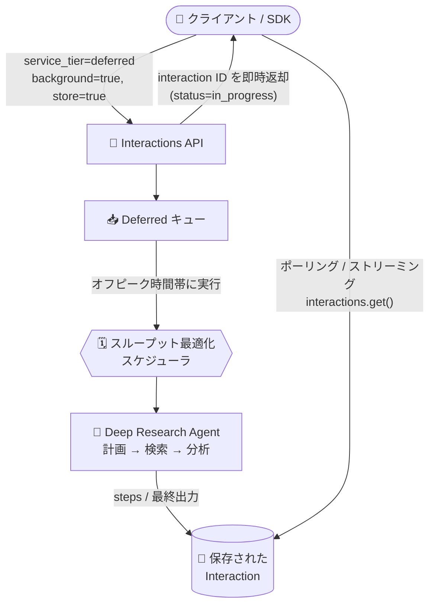

# Gemini Enterprise Agent Platform: 自律エージェントスケジューリング向け Deferred Tier (Preview)

**リリース日**: 2026-09-02

**サービス**: Gemini Enterprise Agent Platform

**機能**: Deferred tier for autonomous agent scheduling

**ステータス**: Preview

📊 [このアップデートのインフォグラフィックを見る](https://takech9203.github.io/google-cloud-news-summary/20260902-gemini-agent-platform-deferred-tier-preview.html)

## 概要

Gemini Enterprise Agent Platform に、自律エージェントのスケジューリング向けの **Deferred Tier (遅延実行ティア)** が Preview として追加されました。Deferred Tier は、レイテンシに敏感でないバックグラウンドエージェントワークロードを自動的にキューイングし、オフピーク時間帯に実行するようスケジューリングする、スループット最適化型のスケジューラです。

大規模なドキュメント合成や長時間の調査 (Deep Research) のようなマルチステップのエージェントワークフローをリアルタイムモデルで実行すると、不要なインフラ負荷が発生し、リソース枯渇 (429) エラーを引き起こすことがあります。Deferred Tier は、ライブチャットクエリと同じ即時性で長時間タスクを扱うのではなく、複雑なマルチステップワークフローをオフピーク時間帯にキューイングすることで、高い成功率と全体スループットを実現します。さらに、消費トークンに対して **50% の割引** が適用されるため、本番環境でのエージェント運用コストの管理にも寄与します。

対象ユーザーは、金融調査、法務デューデリジェンス、競合インテリジェンス、セキュリティスキャンなど、数時間のターンアラウンドタイムを許容できるバックグラウンドタスクを大規模に運用する組織です。現時点でサポートされるエージェントは Deep Research Agent です。

**アップデート前の課題**

- 長時間実行のバックグラウンドエージェントもリアルタイムのチャットクエリと同じ優先度・同じクォータで処理されるため、モデルキャパシティの制約によるリソース枯渇 (429) エラーが発生しやすかった
- バックグラウンドワークロードが Standard Tier のクォータを消費し、リアルタイムの本番トラフィックと競合していた
- レイテンシ耐性のあるワークロードに対しても標準料金が適用され、コスト最適化の手段が限られていた

**アップデート後の改善**

- `service_tier="deferred"` を指定するだけで、非レイテンシセンシティブなワークロードが自動的にキューイングされ、オフピーク時間帯に実行されるようになった
- Deferred ワークロードの消費トークンに対して 50% の割引が適用され、モデル推論コストを削減できるようになった
- 重いバックグラウンドワークロードをオフピークに移動することで 429 エラーとレート制限が緩和され、Standard Tier のクォータをリアルタイム用途に解放できるようになった

## アーキテクチャ図



クライアントが `service_tier="deferred"` でタスクを送信すると、API は interaction ID を即時に返して非同期でタスクを受理します。スケジューラがオフピーク時間帯にタスクを実行し、クライアントはポーリングまたはストリーミングで進捗と結果を取得します。

## サービスアップデートの詳細

### 主要機能

1. **50% トークン割引**
   - Deferred ワークロードで消費されるトークンに対し、標準リクエスト比で 50% の割引が適用される
   - 本番環境でのエージェント運用コストの管理・削減が可能

2. **レート制限の緩和 (Higher throughput)**
   - 重い非同期ワークロードをオフピークに移動することで、モデルキャパシティ制約による 429 エラーとレート制限を緩和
   - Standard Tier のクォータをリアルタイムの本番ニーズのために解放できる

3. **非同期タスク受理と進捗トラッキング**
   - リクエスト送信時に API がタスクを非同期で受理し、interaction ID を即時返却 (`status="in_progress"`)
   - ポーリング (`client.interactions.get()`) またはストリーミング (`stream=True` + `last_event_id` による再接続) で進捗を追跡可能
   - `client.interactions.cancel()` によるタスクのキャンセルにも対応 (`queued`、`in_progress`、`requires_action` 状態のとき)

4. **完了タイムアウト (Completion timeout)**
   - タスクの 95% を 24 時間以内に完了させることを目標とする
   - 24 時間以内に完了しないタスクは期限切れとなり `failed` 状態に遷移
   - 実際のキュー待機時間はリージョンのクラスタキャパシティと需要に依存

## 技術仕様

### Deferred Tier の仕様

| 項目 | 詳細 |
|------|------|
| ステータス | Preview (Pre-GA Offerings Terms 適用) |
| 指定方法 (Python SDK) | `service_tier="deferred"` |
| 指定方法 (REST API) | `"service_tier": "deferred"` (interaction リクエスト内) |
| サポートエージェント | Deep Research Agent |
| 料金 | 消費トークンに対して 50% 割引 |
| 完了目標 | 95% のタスクを 24 時間以内に完了 |
| タイムアウト時の挙動 | 期限切れとなり `failed` 状態に遷移 |
| タスク作成時の制約 | `stream=False` が必須 (作成後の取得時はストリーミング可) |
| 終了ステータス | `completed` / `failed` / `cancelled` |

### Python SDK でのタスク作成例

```python
from google import genai

client = genai.Client(
    enterprise=True,
    project="PROJECT_ID",
    location="global",
)

interaction = client.interactions.create(
    input="Analyze the latest market trends in renewable energy storage.",
    agent="deep-research-preview-04-2026",  # エージェント識別子
    service_tier="deferred",  # オフピークスケジューリングで実行
    background=True,          # 応答を待たず即時リターン
    store=True,               # 後からポーリング/ストリーミングできるよう状態を永続化
    stream=False,             # タスク作成時は stream=False が必須
)

print(f"Interaction ID: {interaction.id}")
print(f"Status: {interaction.status}")          # in_progress
print(f"Service tier: {interaction.service_tier}")  # deferred
```

## 設定方法

### 前提条件

1. Gemini Enterprise Agent Platform が利用可能な Google Cloud プロジェクト
2. Deep Research Agent へのアクセス (Preview)

### 手順

#### ステップ 1: Deferred Tier でタスクを作成

`client.interactions.create()` に `service_tier="deferred"`、`background=True`、`store=True`、`stream=False` を指定してタスクを送信します。API はタスクを非同期で受理し、interaction ID を即時に返却します。

#### ステップ 2: タスクの進捗を監視

```python
TERMINAL_STATES = ("completed", "failed", "cancelled")

while True:
    current = client.interactions.get(interaction.id)
    if current.status in TERMINAL_STATES:
        break
    time.sleep(15)  # 15〜30 秒間隔でのポーリングを推奨
```

ポーリングのほか、`client.interactions.get()` に `stream=True` を指定してリアルタイムにイベント (思考の途中経過、テキストデルタ、ステータス更新) をストリーミングすることも可能です。接続が切断された場合は `last_event_id` を渡して再接続すると、続きからイベントを受信できます。

#### ステップ 3: 最終出力とトークン使用量を取得

`completed` 状態に達すると、`steps` リストに全トランスクリプトが格納されます。`store=True` で保存されているため、interaction ID を使って任意のセッションからいつでも結果を取得できます。`usage` フィールドから入力・出力・合計トークン数も確認できます。

## メリット

### ビジネス面

- **コスト削減**: Deferred ワークロードの消費トークンに 50% 割引が適用され、大規模なバックグラウンド調査タスクの運用コストを大幅に削減できる
- **本番トラフィックの保護**: バックグラウンドタスクをオフピークに逃がすことで、Standard Tier のクォータをユーザー向けのリアルタイム用途に確保できる

### 技術面

- **429 エラーの緩和**: 長時間実行のバックグラウンドタスクによるリソース枯渇エラーとインフラ負荷を軽減できる
- **運用性の高い非同期モデル**: interaction ID の即時返却、ポーリング/ストリーミングによる進捗追跡、`last_event_id` による再接続、キャンセル API など、長時間タスクの運用に必要な仕組みが揃っている

## デメリット・制約事項

### 制限事項

- Preview 段階であり、Pre-GA Offerings Terms が適用される (サポートが限定的な場合がある)
- サポートされるエージェントは現時点で Deep Research Agent のみ
- タスク作成時は `stream=False` が必須 (ストリーミングは作成後の取得時のみ)
- 24 時間以内に完了しないタスクは期限切れとなり `failed` 状態に遷移する

### 考慮すべき点

- 実行タイミングはスケジューラ任せとなり、キュー待機時間はリージョンのクラスタキャパシティと需要に依存するため、実行時刻を保証する必要があるワークロードには不向き
- レイテンシ要件のあるインタラクティブなワークロードには従来どおり Standard Tier を使用する必要がある
- `failed` への遷移 (タイムアウト) を考慮したリトライ設計が必要

## ユースケース

### ユースケース 1: 金融 — 日次・週次の株式/市場調査

**シナリオ**: 資産運用会社が毎晩、対象銘柄群の市場動向調査を Deep Research Agent で自動実行する。結果は翌朝までに揃っていればよく、即時性は不要。

**実装例**:
```python
interaction = client.interactions.create(
    input="Analyze today's market movements and news for the watchlist.",
    agent="deep-research-preview-04-2026",
    service_tier="deferred",
    background=True,
    store=True,
    stream=False,
)
```

**効果**: オフピーク実行によりトークンコストを 50% 削減しつつ、日中のリアルタイムクォータを温存できる。

### ユースケース 2: 法務・コンプライアンス — 複数ドキュメントのデューデリジェンス

**シナリオ**: M&A や規制対応のため、大量のドキュメントを横断するデューデリジェンス調査をバックグラウンドで実行する。

**効果**: 長時間のマルチステップ調査を 429 エラーを気にせず実行でき、`store=True` により完了後いつでも結果を取得できる。

### ユースケース 3: セキュリティ — コードベースの脆弱性スキャンと修正

**シナリオ**: コードベース全体の脆弱性スキャンと修正案生成を定期的なバックグラウンドタスクとして実行する。

**効果**: 継続的なセキュリティタスクを低コストで運用でき、本番のリアルタイムワークロードへの影響を回避できる。

## 料金

Deferred Tier で実行されるワークロードの消費トークンには、標準リクエストと比較して **50% の割引** が適用されます。詳細な料金は公式の料金ページを参照してください。

- [Gemini Enterprise Agent Platform - Generative AI Pricing](https://cloud.google.com/gemini-enterprise-agent-platform/generative-ai/pricing)

## 関連サービス・機能

- **Deep Research Agent**: 現時点で Deferred Tier をサポートする唯一のエージェント。計画 → 検索 → 分析のマルチステップ調査を実行する
- **Interactions API (Python SDK / REST API)**: Deferred タスクの作成 (`interactions.create`)、進捗取得 (`interactions.get`)、キャンセル (`interactions.cancel`) を提供
- **Standard Tier**: レイテンシセンシティブなリアルタイムワークロード向けのティア。Deferred Tier の利用により Standard Tier のクォータを解放できる

## 参考リンク

- 📊 [インフォグラフィック](https://takech9203.github.io/google-cloud-news-summary/20260902-gemini-agent-platform-deferred-tier-preview.html)
- [公式リリースノート](https://docs.cloud.google.com/release-notes#September_02_2026)
- [ドキュメント: Autonomous agent scheduling](https://docs.cloud.google.com/gemini-enterprise-agent-platform/scale/efficiency/autonomous-scheduling)
- [ドキュメント: Deep Research Agent](https://docs.cloud.google.com/gemini-enterprise-agent-platform/agents/use-deep-research)
- [料金ページ](https://cloud.google.com/gemini-enterprise-agent-platform/generative-ai/pricing)

## まとめ

Deferred Tier は、レイテンシ耐性のあるバックグラウンドエージェントワークロードに対して「50% のトークン割引」と「429 エラー/レート制限の緩和」を同時に実現する、エージェント本番運用のコスト・信頼性最適化機能です。Deep Research Agent を用いた定期的な調査・分析タスクを運用している場合は、`service_tier="deferred"` の指定だけで導入できるため、Preview 段階から評価を始めることを推奨します。24 時間の完了目標とタイムアウト時の `failed` 遷移を踏まえたリトライ設計もあわせて検討してください。

---

**タグ**: `Gemini Enterprise Agent Platform`, `Deferred Tier`, `自律エージェント`, `Deep Research Agent`, `スケジューリング`, `コスト最適化`, `Preview`
