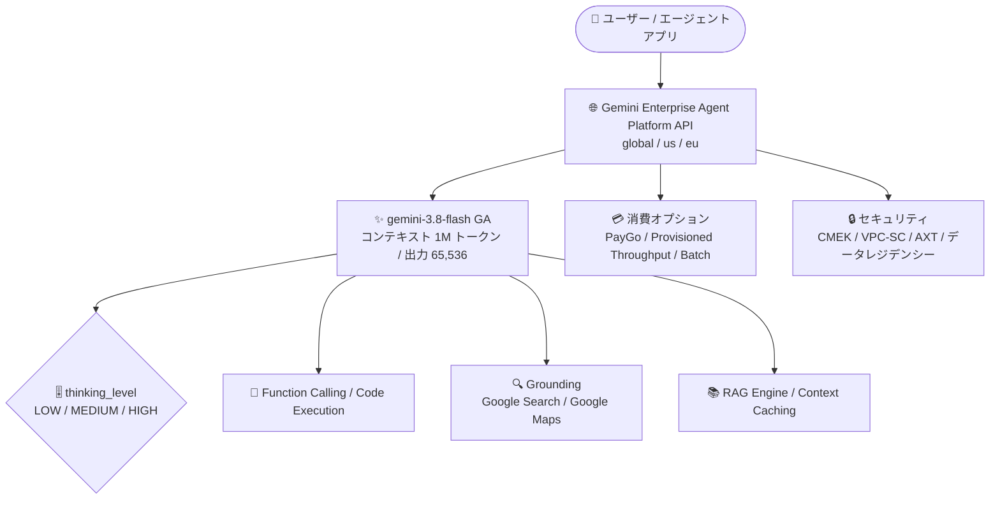

# Gemini Enterprise Agent Platform: Gemini 3.8 Flash が一般提供 (GA) 開始

**リリース日**: 2026-09-02

**サービス**: Gemini Enterprise Agent Platform

**機能**: Gemini 3.8 Flash の一般提供 (GA)

**ステータス**: GA (一般提供)

📊 [このアップデートのインフォグラフィックを見る](https://takech9203.github.io/google-cloud-news-summary/20260902-gemini-agent-platform-gemini-3-8-flash-ga.html)

## 概要

Gemini Enterprise Agent Platform 上で **Gemini 3.8 Flash** が一般提供 (GA) となり、本番環境での利用が可能になりました。Gemini 3.8 Flash は Google が「最も知的なワークホースモデル」と位置付けるモデルで、ソフトウェアエンジニアリング、エージェントタスク、専門分野におけるマルチステップ推論において、前世代の 3.7 Flash から大幅な性能向上を実現しています。多くの場合、より高コストなフロンティアモデルに迫る性能を発揮するとされています。

Gemini Flash ラインは Gemini 3 ファミリーにおける主力のエージェント向けワークホースモデルであり、深い推論を担う Pro モデルと、高スループットの Flash-Lite モデルの間を橋渡しする位置付けです。3.8 Flash は 3.7 Flash と比較して精度と信頼性が向上する一方でトークン消費量が増える傾向がありますが、`thinking_level` (LOW / MEDIUM / HIGH) によるエフォート制御で消費量を調整できます。

同日、Gemini Enterprise (Web アプリ) 側でも Gemini 3.8 Flash が global、us、eu リージョンで GA となっており、エージェント開発基盤とエンドユーザー向けアプリの両面で最新 Flash モデルが本番利用可能になりました。

**アップデート前の課題**

- Gemini 3.8 Flash は Agent Platform 上で本番利用 (GA) の対象ではなく、SLA を前提としたエンタープライズの本番ワークロードには前世代の 3.7 Flash などを使う必要があった
- Terminal-bench 2.1 (81.6%) や τ³-bench Banking (30.9%) など、エージェント系ベンチマークで 3.7 Flash の性能には改善余地があった
- 複雑なエージェントタスクでフロンティア級の性能が必要な場合、より高コストな Pro 系モデルを選択する必要があった

**アップデート後の改善**

- Gemini 3.8 Flash (モデル ID: `gemini-3.8-flash`) が GA となり、本番環境で利用可能になった
- Terminal-bench 2.1 で 90.8% (3.7 Flash: 81.6%)、τ³-bench Banking で 38.1% (同: 30.9%) など、エージェント・コーディング系ベンチマークが大幅に向上した
- Global に加えて us / eu のマルチリージョンで利用でき、データレジデンシー要件のあるワークロードにも対応可能になった
- Provisioned Throughput、Batch inference、Pay-as-you-go (Standard / Flex / Priority PayGo) の各消費オプション、CMEK / VPC-SC / AXT などのセキュリティコントロールが GA モデルとして利用できる

## アーキテクチャ図



Gemini 3.8 Flash は Agent Platform 経由で global / us / eu リージョンから呼び出し、thinking_level によるエフォート制御と各種ツール (Function Calling、Grounding、RAG Engine など) を組み合わせてエージェントワークフローを構築できます。

## サービスアップデートの詳細

### 主要機能

1. **エージェント・コーディング性能の大幅向上**
   - Terminal-bench 2.1: 90.8% (3.7 Flash: 81.6%)
   - SWE-Bench Pro: 61.6% (同: 60.4%)、SWE-Atlas: 51.9% (同: 48.0%)
   - τ³-bench Banking: 38.1% (同: 30.9%)、CharXiv (マルチモーダル): 86.2% (同: 84.5%)
   - Humanity's Last Exam (HLE) は 45.4% と 3.7 Flash (45.7%) とほぼ同等

2. **thinking_level によるエフォート制御**
   - LOW / MEDIUM (デフォルト) / HIGH の 3 段階で推論の深さとトークン消費のバランスを調整可能
   - `thinking_level="MINIMAL"` は 3.8 Flash では利用不可 (指定すると API バリデーションエラー)
   - レイテンシ重視のタスクは LOW、複雑なエージェントタスクは MEDIUM/HIGH を推奨

3. **マルチモーダル入力とロングコンテキスト**
   - 入力: テキスト、画像、音声、動画 / 出力: テキスト
   - コンテキストウィンドウ 1,048,576 トークン、最大出力 65,536 トークン
   - 動画は最大約 45 分 (音声付き) / 約 1 時間 (音声なし)、音声は最大約 8.4 時間

4. **ツールとエコシステム対応**
   - Function Calling、Code Execution、Grounding (Google Search / Google Maps) をサポート
   - Structured Output、Context Caching (暗黙的/明示的)、RAG Engine、URL Context、Chat Completions (OpenAI 互換) をサポート
   - Computer Use と Agentic video understanding は Preview として利用可能
   - Gemini Live API と Tuning は非対応

## 技術仕様

### モデル仕様比較 (Gemini 3 ファミリー)

| 項目 | Gemini 3.8 Flash | Gemini 3.7 Flash | Gemini 3.1 Pro |
|------|------------------|------------------|----------------|
| モデル ID | `gemini-3.8-flash` | `gemini-3.7-flash` | `gemini-3.1-pro-preview` |
| ステージ | GA | GA | Preview |
| コンテキストウィンドウ | 1,048,576 | 1,048,576 | 1,048,576 |
| 最大出力トークン | 65,536 | 65,536 | 65,536 |
| 対応リージョン | Global、マルチリージョン (us / eu) | Global、マルチリージョン | Global |
| thinking_level | LOW / MEDIUM / HIGH (デフォルト: MEDIUM) | LOW / MEDIUM / HIGH (デフォルト: MEDIUM) | LOW / MEDIUM / HIGH (デフォルト: HIGH) |
| 主な用途 | エージェントワークフロー、コーディング、インタラクティブな動画理解 | 汎用エージェントワークフロー、マルチステップオーケストレーション | 深い推論、高複雑度タスク |

### API 規約上の重要な変更点 (Gemini 3 ファミリー共通)

| 項目 | 詳細 |
|------|------|
| `temperature` / `top_k` / `top_p` | バックエンドで無視される (thinking_level と response_schema で制御) |
| `frequency_penalty` / `presence_penalty` / `candidate_count` | 指定すると API エラー。レガシーコードから削除が必要 |
| `thinking_budget` (整数) | 文字列 enum の `thinking_level` に置き換え |
| Function Calling | FunctionResponse は直前の FunctionCall の id / name / 実行回数に厳密に一致する必要あり |
| チャット履歴 | `model` ロールで終わる履歴やプレフィル済み model ターンは不可 |

### セキュリティコントロール

オンライン予測、バッチ推論、コンテキストキャッシュのそれぞれで、データレジデンシー、CMEK、VPC Service Controls、Access Transparency (AXT) に対応しています。

## 設定方法

### 前提条件

1. 課金が有効な Google Cloud プロジェクト
2. Agent Platform API の有効化
3. Application Default Credentials (ADC) または API キーによる認証
4. 最新の `google-genai` SDK (`pip install --upgrade google-genai`)

### 手順

#### ステップ 1: SDK からの基本リクエスト (Python)

```python
from google import genai

client = genai.Client(enterprise=True, project="PROJECT_ID", location="global")
response = client.models.generate_content(
    model="gemini-3.8-flash",
    contents="How does AI work?",
)
print(response.text)
```

#### ステップ 2: REST API での呼び出し

```bash
curl -X POST \
  -H "Authorization: Bearer $(gcloud auth print-access-token)" \
  -H "Content-Type: application/json" \
  https://aiplatform.googleapis.com/v1/projects/PROJECT_ID/locations/global/publishers/google/models/gemini-3.8-flash:generateContent \
  -d '{
    "contents": {
      "role": "USER",
      "parts": { "text": "Why is the sky blue?" }
    }
  }'
```

#### ステップ 3: 3.7 Flash / 3.6 Flash からの移行

1. API 呼び出しのモデル文字列を `gemini-3.8-flash` に変更
2. 整数の `thinking_budget` を文字列 enum の `thinking_level` (LOW / MEDIUM / HIGH) に置き換え
3. `temperature`、`top_p`、`top_k`、`candidate_count`、`frequency_penalty`、`presence_penalty` を削除
4. 会話履歴からプレフィル済みの model ターンを削除

## メリット

### ビジネス面

- **本番利用が可能に**: GA となったことで、エンタープライズの本番ワークロードで安心して採用できる
- **コスト効率の高いフロンティア級性能**: Flash 価格帯でフロンティアモデルに迫る性能が得られ、Pro 系モデルからのコスト最適化余地がある
- **データレジデンシー対応**: us / eu マルチリージョンと各種セキュリティコントロール (CMEK、VPC-SC、AXT) により、規制業種でも採用しやすい

### 技術面

- **エージェントタスクの精度向上**: Terminal-bench 2.1 で 9 ポイント超の改善など、ツール利用を伴う長時間タスクの成功率が向上
- **エフォート制御**: thinking_level によりレイテンシ・コスト・精度のトレードオフをタスク単位で調整可能
- **柔軟な消費オプション**: Standard / Flex / Priority PayGo、Provisioned Throughput、Batch inference から選択可能

## デメリット・制約事項

### 制限事項

- `thinking_level="MINIMAL"` は利用不可 (指定すると API バリデーションエラー)
- Gemini Live API と Tuning (チューニング) は非対応
- Fixed quota (固定クォータ) は非対応
- Computer Use と Agentic video understanding は Preview 段階

### 考慮すべき点

- 特に高いエフォートレベルでは、性能最大化のためにトークン消費が 3.7 Flash より増える場合がある。コンピュート効率が最優先の場合は低い thinking_level の利用、または 3.7 Flash の継続利用を検討する
- `temperature` などの従来のサンプリングパラメータは無視され、`frequency_penalty` などはエラーになるため、レガシーコードの移行時に修正が必要
- HLE のように 3.7 Flash とほぼ同等のベンチマークもあり、ワークロードごとの評価が推奨される

## ユースケース

### ユースケース 1: 長時間の自律的コーディングエージェント

**シナリオ**: CI/CD パイプラインの障害調査や、リポジトリ全体にまたがるリファクタリングなど、ターミナル操作とコード編集を繰り返す長時間タスクをエージェントに任せたい。

**実装例**:
```python
response = client.models.generate_content(
    model="gemini-3.8-flash",
    contents=task_prompt,
    config={"thinking_config": {"thinking_level": "HIGH"}},
)
```

**効果**: Terminal-bench 2.1 が 81.6% から 90.8% に向上しており、ツール実行を伴うマルチステップタスクの完遂率向上が期待できる。

### ユースケース 2: レイテンシ重視のマルチモーダル処理

**シナリオ**: 動画のトランスクリプト検索やメタデータ抽出など、深い推論よりも応答速度が重要なタスクを処理したい。

**効果**: `thinking_level="LOW"` を指定することで推論オーバーヘッドを抑え、1M トークンのコンテキストウィンドウを活かして長時間の動画・音声を効率的に処理できる。

## 料金

Gemini Enterprise Agent Platform 上での料金は [Agent Platform の料金ページ](https://cloud.google.com/gemini-enterprise-agent-platform/generative-ai/pricing) を参照してください。

参考として、Gemini API (ai.google.dev) における Gemini 3.8 Flash の有料ティア料金は以下のとおりです (100 万トークンあたり、USD)。

### 料金例 (Gemini API・Standard、有料ティア)

| 項目 | 2026 年 12 月 31 日まで | 2027 年 1 月 1 日から |
|--------|-----------------|-----------------|
| 入力 | $0.75 | $1.50 |
| 出力 (思考トークン含む) | $3.75 | $7.50 |
| コンテキストキャッシュ | $0.075 | $0.15 |
| Batch / Flex 入力 | $0.375 | $0.75 |
| Batch / Flex 出力 | $1.875 | $3.75 |

Grounding with Google Search / Google Maps は月 5,000 リクエストまで無料 (Gemini 3.x モデル間で共有)、以降 1,000 リクエストあたり $14 です。

## 利用可能リージョン

- **モデル提供**: Global (`global`)、マルチリージョン (`us`、`eu`)
- **ML 処理 / データレジデンシー**: マルチリージョン (`us`、`eu`)
- **Provisioned Throughput / Standard PayGo**: Global、マルチリージョン (`us`、`eu`)

## 関連サービス・機能

- **Gemini Enterprise**: 同日に Web アプリ側でも Gemini 3.8 Flash が global / us / eu リージョンで GA となり、Standard / Plus エディションのデータレジデンシーに対応
- **RAG Engine**: Agent Platform の RAG 基盤と組み合わせて、グラウンディングされたエージェントを構築可能
- **Provisioned Throughput**: GSU あたり 675 トークン/秒のスループットを確保でき、本番トラフィックの安定運用に対応 (バーンダウンレート: 出力テキスト 1 トークン = 5 トークン)
- **Agent Studio**: コンソール上で `gemini-3.8-flash` を選択してプロトタイピングとサンプルアプリのデプロイが可能
- **Chat Completions API**: OpenAI 互換インターフェイス経由での移行・利用が可能

## 参考リンク

- 📊 [インフォグラフィック](https://takech9203.github.io/google-cloud-news-summary/20260902-gemini-agent-platform-gemini-3-8-flash-ga.html)
- [公式リリースノート](https://docs.cloud.google.com/release-notes#September_02_2026)
- [Gemini 3.8 Flash モデルページ](https://docs.cloud.google.com/gemini-enterprise-agent-platform/models/gemini/3-8-flash)
- [Gemini 3.8 Flash 開発者ガイド (移行手順含む)](https://docs.cloud.google.com/gemini-enterprise-agent-platform/models/guides/gemini-3-8-flash)
- [料金ページ](https://cloud.google.com/gemini-enterprise-agent-platform/generative-ai/pricing)

## まとめ

Gemini 3.8 Flash の GA により、フロンティアモデルに迫るエージェント・コーディング性能を Flash 価格帯かつ本番品質で利用できるようになりました。3.7 Flash / 3.6 Flash からの移行はモデル ID の変更に加えて、`thinking_level` への置き換えと非推奨パラメータの削除が必要なため、開発者ガイドの移行手順に沿ってレガシーコードを更新することを推奨します。トークン消費が増える傾向があるため、ワークロードごとに thinking_level を評価し、コストと性能のバランスを確認してください。

---

**タグ**: #GeminiEnterpriseAgentPlatform #Gemini38Flash #GA #生成AI #エージェント #LLM
