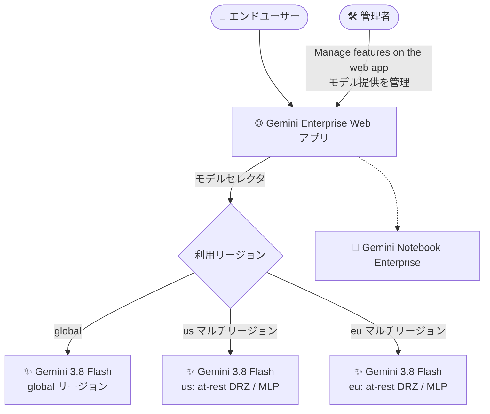

# Gemini Enterprise: Gemini 3.8 Flash が global / us / eu リージョンで GA

**リリース日**: 2026-09-02

**サービス**: Gemini Enterprise

**機能**: Gemini 3.8 Flash の一般提供開始 (global / us / eu リージョン)

**ステータス**: GA (一般提供)

📊 [このアップデートのインフォグラフィックを見る](https://takech9203.github.io/google-cloud-news-summary/20260902-gemini-enterprise-gemini-3-8-flash-ga.html)

## 概要

Gemini Enterprise において、Gemini 3.8 Flash が **global、us、eu の各リージョンで一般提供 (GA)** となりました。Gemini 3.8 Flash は Gemini 3 ファミリーの「ワークホース (主力)」モデルであり、ソフトウェアエンジニアリング、エージェンティックタスク、専門領域における多段階推論の各分野で Gemini 3.7 Flash から大幅な性能向上を実現し、より高コストなフロンティアモデルに迫る性能を発揮するとされています。

今回の GA により、Gemini Enterprise の Web アプリを利用する組織のユーザーが、本番環境で Gemini 3.8 Flash を利用できるようになりました。特に **us / eu マルチリージョンでの提供**が含まれる点が重要で、データレジデンシー (保存データの所在地保証) の要件を持つ組織でも最新モデルを採用しやすくなります。同日、Gemini Enterprise Agent Platform 側でも Gemini 3.8 Flash (モデル ID: `gemini-3.8-flash`) の GA が発表されており、本番用途での利用が正式にサポートされました。

対象ユーザーは、Gemini Enterprise を導入している企業の管理者 (モデル提供の管理) およびエンドユーザー (Web アプリでのモデル利用) です。管理者は「Manage features on the web app」の設定から、ユーザーが利用できるモデルを管理します。

**アップデート前の課題**

- Gemini Enterprise では従来、Gemini 3.5 Flash などの GA モデルや、Gemini 3.7 Flash / 3.6 Flash といった旧世代 Flash モデルが提供されており、最新世代の 3.8 Flash は利用できなかった
- エージェンティックタスクやコーディングなど複雑なタスクで、Flash クラスのモデルでは精度が不足する場合、より高コストな Pro クラスのモデル (Gemini 3.1 Pro は Limited Availability かつリージョン制約あり) に頼る必要があった

**アップデート後の改善**

- Gemini 3.8 Flash が GA となり、Gemini Enterprise で本番利用が可能になった
- global に加えて us / eu マルチリージョンでも提供されるため、データレジデンシー要件のある組織 (Gemini Enterprise Standard / Plus Edition) や Gemini Notebook Enterprise の利用者も最新モデルを選択できるようになった
- Terminal-bench 2.1 で 90.8% (3.7 Flash は 81.6%)、SWE-Bench Pro で 61.6% (同 60.4%) など、エージェント・コーディング系ベンチマークで前世代から性能が向上した (Agent Platform のモデルガイドより)

## アーキテクチャ図

Gemini 3.8 Flash が global / us / eu の 3 リージョンで GA となり、管理者が Web アプリの機能管理でモデル提供を制御し、ユーザーは所属組織のリージョン構成に応じてモデルを利用します。us / eu ではデータレジデンシー (at-rest DRZ) と ML 処理 (MLP) の所在地保証が提供されます。

## サービスアップデートの詳細

### 主要機能

1. **Gemini 3.8 Flash の GA 提供 (Gemini Enterprise)**
   - Gemini Enterprise の Web アプリで Gemini 3.8 Flash が一般提供となり、本番利用が可能に
   - global、us、eu の 3 リージョンで利用可能

2. **データレジデンシー対応 (us / eu マルチリージョン)**
   - us / eu マルチリージョンでの提供により、保存データのデータレジデンシー (at-rest DRZ) や ML 処理 (MLP) の所在地要件を持つ組織でも利用可能
   - Gemini Enterprise Standard / Plus Edition のデータレジデンシー、および Gemini Notebook Enterprise のロケーション対応に関連 (詳細は Data residency ドキュメントを参照)

3. **管理者によるモデル提供の管理**
   - 管理者は「Manage features on the web app」の Model availability 設定で、ユーザーが Web アプリで利用できる LLM モデルを管理
   - モデル選択機能を使うには「Enable model selector」トグルを有効化する必要がある
   - ドキュメントによると、Gemini Enterprise アプリで GA のモデルはトグルをオフにできない仕様

4. **Gemini Enterprise Agent Platform でも同日 GA**
   - モデル ID `gemini-3.8-flash` として GA となり、本番用途での利用が正式サポート
   - コンテキストウィンドウ 1,048,576 トークン、最大出力 65,536 トークン、入力はテキスト・画像・音声・動画に対応 (出力はテキスト)

## 技術仕様

### Gemini 3.8 Flash モデル仕様 (Agent Platform モデルページより)

| 項目 | 詳細 |
|------|------|
| モデル ID | `gemini-3.8-flash` |
| ローンチステージ | GA (リリース日: 2026 年 9 月 2 日) |
| 入力モダリティ | テキスト、画像、音声、動画 |
| 出力モダリティ | テキスト |
| コンテキストウィンドウ | 1,048,576 トークン |
| 最大出力トークン | 65,536 トークン |
| 提供リージョン | Global (`global`)、マルチリージョン (`us`、`eu`) |
| ML 処理 (MLP) | `us`、`eu` マルチリージョンをサポート |
| Thinking level | `LOW` / `MEDIUM` (デフォルト) / `HIGH` (`MINIMAL` は非対応) |
| セキュリティコントロール | データレジデンシー、CMEK、VPC-SC、AXT (オンライン予測 / バッチ推論 / コンテキストキャッシュ) |

### 前世代・Pro モデルとの比較 (Agent Platform ドキュメントより)

| | Gemini 3.8 Flash | Gemini 3.7 Flash | Gemini 3.1 Pro |
|---|---|---|---|
| ローンチステージ | GA | GA | Preview |
| 提供リージョン | Global、マルチリージョン | Global、マルチリージョン | Global |
| Thinking level デフォルト | MEDIUM | MEDIUM | HIGH |
| 主なフォーカス | エージェンティックワークフロー、コーディング、インタラクティブな動画理解 | 汎用エージェンティックワークフロー、多段階オーケストレーション、コーディング | 深い推論、高複雑度タスク |

### ベンチマーク比較 (3.8 Flash vs 3.7 Flash)

| ベンチマーク | 3.8 Flash | 3.7 Flash |
|------|------|------|
| Terminal-bench 2.1 | 90.8% | 81.6% |
| SWE-Bench Pro | 61.6% | 60.4% |
| SWE-Atlas | 51.9% | 48.0% |
| τ³-bench Banking | 38.1% | 30.9% |
| CharXiv (マルチモーダル) | 86.2% | 84.5% |
| Humanity's Last Exam (HLE) | 45.4% | 45.7% |

## 設定方法

### 前提条件

1. Gemini Enterprise が導入済みであること (Standard / Plus Edition などのライセンス)
2. モデル提供を管理するための管理者権限があること

### 手順

#### ステップ 1: Web アプリの機能管理画面を開く

管理者として Gemini Enterprise の管理画面から「Manage features on the web app」の設定に移動します。

#### ステップ 2: モデルセレクタとモデル提供を設定する

「Model availability」設定で、ユーザーが Web アプリで利用できるモデルを管理します。ユーザーにモデルを選択させるには「Enable model selector」トグルを有効にします。詳細な手順は [Manage features on the web app](https://docs.cloud.google.com/gemini/enterprise/docs/manage-web-app-features) を参照してください。

#### ステップ 3: (データレジデンシー要件がある場合) リージョンを確認する

us / eu マルチリージョンにデータを閉じる場合は、アプリ作成時に us または eu のロケーションを選択し、API 呼び出しでは `us-discoveryengine` / `eu-discoveryengine` エンドポイントを使用します。詳細は [Data residency for Gemini Enterprise](https://docs.cloud.google.com/gemini/enterprise/docs/locations) を参照してください。

## メリット

### ビジネス面

- **コンプライアンス対応と最新モデルの両立**: us / eu マルチリージョンでの GA により、データレジデンシー要件を持つ規制産業 (金融、公共など) の組織でも最新の 3.8 Flash を採用しやすくなる
- **本番利用の正式サポート**: GA となったことで、SLA を含む本番ワークロードでの利用が可能になり、社内展開の判断がしやすくなる

### 技術面

- **Flash クラスでの性能向上**: エージェンティックタスクやコーディングのベンチマークで前世代から向上し、フロンティアモデルに迫る性能を Flash のコスト帯で利用できる
- **Thinking level による効率制御**: `LOW` / `MEDIUM` / `HIGH` の effort 制御により、レイテンシ重視のタスクとタスク精度重視の処理を使い分けられる

## デメリット・制約事項

### 制限事項

- Agent Platform のモデルページによると、`thinking_level="MINIMAL"` は 3.8 Flash では利用できない (指定すると API バリデーションエラー)
- 3.8 Flash は性能を最大化するために、特に高い effort レベルでは 3.7 Flash よりも多くのトークンを消費する場合がある
- Gemini Live API とモデルチューニングは非対応 (Agent Platform モデルページより)

### 考慮すべき点

- コンピュート効率 (トークン消費) を最優先する場合は、低い thinking level の利用または Gemini 3.7 Flash の継続利用が推奨されている
- リージョンごとのデータレジデンシー / MLP 対応状況はモデル・機能ごとに異なるため、[Data residency ドキュメントの制限事項](https://docs.cloud.google.com/gemini/enterprise/docs/locations#limitations)を確認すること

## ユースケース

### ユースケース 1: EU データレジデンシー要件下での全社 AI アシスタント刷新

**シナリオ**: EU の規制要件により顧客データを eu マルチリージョンに保持する必要がある企業が、Gemini Enterprise の Web アプリで社員に最新モデルを提供したい。

**効果**: 3.8 Flash が eu マルチリージョンで GA となったため、at-rest DRZ / MLP の所在地保証を維持したまま、エージェンティックタスクや多段階推論で強化された最新モデルを全社員に展開できる。

### ユースケース 2: 社内エージェントの精度向上

**シナリオ**: Gemini Enterprise 上で社内ドキュメント検索やワークフロー自動化のエージェントを運用しており、複雑な多段階タスクの完遂率を高めたい。

**効果**: Terminal-bench や τ³-bench などエージェント系ベンチマークで前世代から向上した 3.8 Flash を利用することで、Pro クラスのモデルに頼らずにタスク完遂率の向上が期待できる。thinking level を MEDIUM に保てばトークン消費も抑制できる。

## 料金

Gemini Enterprise はエディション (Standard / Plus など) ベースのライセンス提供です。Web アプリでのモデル利用に関する追加料金の詳細は公式料金ページを確認してください。

Gemini Enterprise Agent Platform 経由で API として `gemini-3.8-flash` を利用する場合は、Standard PayGo / Flex PayGo / Priority PayGo の従量課金、Provisioned Throughput、Batch inference に対応しています。

- [Gemini Enterprise の料金](https://cloud.google.com/gemini/enterprise/pricing)
- [Gemini Enterprise Agent Platform の生成 AI 料金](https://cloud.google.com/gemini-enterprise-agent-platform/generative-ai/pricing)

## 利用可能リージョン

- **global**: 利用可能
- **us マルチリージョン**: 利用可能 (at-rest DRZ / MLP 対応)
- **eu マルチリージョン**: 利用可能 (at-rest DRZ / MLP 対応)

なお、Gemini Enterprise には in-country リージョン (ca、in、asia-northeast1、sg、europe-west2) も存在しますが (GA with allowlist)、今回の発表で 3.8 Flash の提供が明示されたのは global / us / eu です。リージョンごとの詳細な対応状況は [Data residency ドキュメント](https://docs.cloud.google.com/gemini/enterprise/docs/locations)を参照してください。

## 関連サービス・機能

- **Gemini Enterprise Agent Platform**: 同日に `gemini-3.8-flash` が GA。API 経由でのエージェント開発・本番利用が可能で、Provisioned Throughput、コンテキストキャッシュ、Grounding (Google Search / Google Maps)、Function calling などに対応
- **Gemini Notebook Enterprise**: Gemini Enterprise の Web アプリから利用できるノートブック機能。us / eu マルチリージョンおよび in-country リージョンでのロケーション対応があり、今回のデータレジデンシー関連ドキュメントの対象
- **Agent Designer / Agent Gallery**: Gemini Enterprise 上でカスタムエージェントを作成・共有する機能。基盤モデルの性能向上の恩恵を受ける
- **CMEK / VPC Service Controls / Access Transparency**: 3.8 Flash はオンライン予測・バッチ推論・コンテキストキャッシュでこれらのセキュリティコントロールに対応

## 参考リンク

- 📊 [インフォグラフィック](https://takech9203.github.io/google-cloud-news-summary/20260902-gemini-enterprise-gemini-3-8-flash-ga.html)
- [公式リリースノート (2026 年 9 月 2 日)](https://docs.cloud.google.com/release-notes#September_02_2026)
- [Manage features on the web app](https://docs.cloud.google.com/gemini/enterprise/docs/manage-web-app-features)
- [Data residency for Gemini Enterprise Standard and Plus Editions and Gemini Notebook Enterprise](https://docs.cloud.google.com/gemini/enterprise/docs/locations)
- [Gemini 3.8 Flash モデルページ (Agent Platform)](https://docs.cloud.google.com/gemini-enterprise-agent-platform/models/gemini/3-8-flash)
- [Gemini 3.8 Flash 開発者ガイド (Agent Platform)](https://docs.cloud.google.com/gemini-enterprise-agent-platform/models/guides/gemini-3-8-flash)
- [料金ページ (Gemini Enterprise Agent Platform)](https://cloud.google.com/gemini-enterprise-agent-platform/generative-ai/pricing)

## まとめ

Gemini 3.8 Flash が Gemini Enterprise の global / us / eu リージョンで GA となり、データレジデンシー要件を持つ組織を含めて最新の主力モデルを本番利用できるようになりました。管理者はまず「Manage features on the web app」でモデル提供設定を確認し、データレジデンシー要件がある場合は us / eu マルチリージョンでの対応状況と制限事項を確認した上で、社内展開を計画することを推奨します。

---

**タグ**: #GeminiEnterprise #Gemini38Flash #GA #DataResidency #生成AI #GeminiNotebookEnterprise
