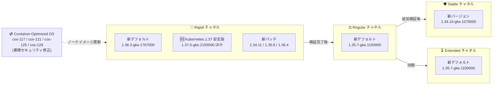

# Google Kubernetes Engine (GKE): バージョンアップデート 2026-R37

**リリース日**: 2026-09-02

**サービス**: Google Kubernetes Engine (GKE)

**機能**: クラスタバージョンの更新とセキュリティアップデート (2026-R37)

**ステータス**: Change + Security (Version Update / Security Update)

📊 [このアップデートのインフォグラフィックを見る](https://takech9203.github.io/google-cloud-news-summary/20260902-gke-2026-r37-version-updates.html)

## 概要

Google Kubernetes Engine (GKE) の全リリースチャネル (Rapid, Regular, Stable, Extended, No channel) において、クラスタバージョンが更新された。今回の 2026-R37 アップデートでは、Rapid チャネルのデフォルトバージョンが 1.36.3-gke.1767000 に、Regular / Extended / No channel のデフォルトバージョンが 1.35.7-gke.1150000 にそれぞれ更新された。特に注目すべき点として、Rapid チャネルに Kubernetes 1.37 の安定版パッチ (1.37.0-gke.2155000 / 1.37.0-gke.2941000) が初めて追加され、アルファクラスタ専用だった 1.37 系がすべてのクラスタで利用可能になった。あわせて 1.34.11 / 1.35.8 / 1.36.4 系の新パッチも登場している。

セキュリティアップデート (2026-R37) として、更新された Container-Optimized OS イメージを使用する新しい GKE バージョンもリリースされた。これらのイメージは前回の GKE リリース以降に公開されたすべての Container-Optimized OS のセキュリティ修正を累積的に含んでおり、cos-117 / cos-121 / cos-125 / cos-129 の 4 マイルストーンのイメージが更新対象となっている。このアップデートは、GKE クラスタを運用するすべてのプラットフォーム管理者およびインフラエンジニアに影響する。

**アップデート前の課題**

- 前回 (2026-R36) までのバージョンには、直近の Container-Optimized OS セキュリティ修正が含まれていなかった
- Kubernetes 1.37 系はアルファクラスタ向けのプレビュー版 (1.37.0-gke.2034000+preview など) のみの提供で、通常のクラスタでは利用できなかった
- Regular / Extended / No channel のデフォルトは旧パッチ (1.35.7-gke.1027000) のままであり、最新の修正が新規クラスタに標準適用されていなかった

**アップデート後の改善**

- Rapid チャネルで Kubernetes 1.37 の安定版パッチ (1.37.0-gke.2155000 / 1.37.0-gke.2941000) がすべてのクラスタで利用可能になった
- Rapid チャネルのデフォルトが 1.36.3-gke.1767000 に更新され、新規クラスタに 1.36 系の新パッチが標準適用されるようになった
- Regular / Extended / No channel のデフォルトが 1.35.7-gke.1027000 から 1.35.7-gke.1150000 に更新された
- 累積的なセキュリティ修正を含む Container-Optimized OS イメージ (cos-117 / cos-121 / cos-125 / cos-129) が新バージョンに適用され、ノード OS の脆弱性リスクが低減された

## アーキテクチャ図



GKE のリリースチャネルは、Rapid で導入されたバージョンが検証を経て Regular、Stable へと段階的に展開されるパイプラインとして機能する。今回は Rapid チャネルに Kubernetes 1.37 の安定版パッチが初登場し、Regular / Extended / No channel のデフォルトが 1.35.7-gke.1150000 に引き上げられ、新しい Container-Optimized OS イメージによるセキュリティ修正が各バージョンに組み込まれた。

## サービスアップデートの詳細

### チャネル別バージョン一覧

| チャネル | デフォルトバージョン | 新規追加バージョン | 非推奨バージョン (90 日以内に削除) |
|---------|---------------------|-------------------|-----------------|
| Rapid | 1.36.3-gke.1767000 (新デフォルト) | 1.34.11-gke.1044000, 1.35.8-gke.1225000, 1.36.4-gke.1082000, 1.37.0-gke.2155000, 1.37.0-gke.2941000 | 1.35.8-gke.1026000 (1.34.10-gke.1236000, 1.35.7-gke.1222000, 1.36.3-gke.1640000 は提供終了。アルファ版 1.37.0-gke.2034000+preview / 2048000+preview / 2074000+preview も提供終了) |
| Regular | 1.35.7-gke.1150000 (新デフォルト) | 1.34.10-gke.1236000, 1.35.7-gke.1222000, 1.36.3-gke.1640000 | 1.36.2-gke.2064000 (1.34.10-gke.1079000, 1.35.7-gke.1027000 は提供終了) |
| Stable | 変更なし | 1.34.10-gke.1079000 | 1.34.9-gke.1610001 |
| Extended | 1.35.7-gke.1150000 (新デフォルト) | 1.31.14-gke.2613000, 1.31.14-gke.2667000, 1.32.13-gke.2314000, 1.32.13-gke.2393000, 1.33.13-gke.1499000, 1.33.13-gke.1613000, 1.34.10-gke.1236000, 1.35.7-gke.1222000, 1.36.3-gke.1640000 | 1.31.14-gke.2543000, 1.31.14-gke.2630000, 1.32.13-gke.2231000, 1.32.13-gke.2337000, 1.33.13-gke.1269000, 1.33.13-gke.1547000, 1.36.2-gke.2064000 (1.34.10-gke.1079000, 1.35.7-gke.1027000 は提供終了) |
| No channel (非推奨) | 1.35.7-gke.1150000 (新デフォルト) | 1.34.11-gke.1044000, 1.35.8-gke.1225000, 1.36.4-gke.1082000 (ノード版はさらに 1.31.14-gke.2667000, 1.32.13-gke.2393000, 1.33.13-gke.1613000) | 1.34.9-gke.1610001, 1.35.6-gke.1710000, 1.35.8-gke.1026000, 1.36.2-gke.2064000 |

### 自動アップグレードターゲット

各チャネルで、対象マイナーバージョンのクラスタに新しい自動アップグレードターゲットが設定された。

**Rapid チャネル (マイナーバージョンアップグレード)**

| 現在のマイナーバージョン | アップグレード先 |
|------------------------|------------------|
| 1.33 | 1.34.10-gke.1328000 |
| 1.34 | 1.35.8-gke.1036000 |
| 1.35 | 1.36.3-gke.1767000 |

**Regular チャネル (マイナーバージョンアップグレード)**

| 現在のマイナーバージョン | アップグレード先 |
|------------------------|------------------|
| 1.33 | 1.34.10-gke.1106000 |
| 1.34 | 1.35.7-gke.1150000 |

**Stable / No channel (マイナーバージョンアップグレード)**

| 現在のマイナーバージョン | アップグレード先 |
|------------------------|------------------|
| 1.33 | 1.34.9-gke.1655001 |

**Extended チャネル (マイナーバージョンアップグレード)**

| 現在のマイナーバージョン | アップグレード先 |
|------------------------|------------------|
| 1.30 | 1.31.14-gke.2579000 |
| 1.31 | 1.32.13-gke.2268000 |

メンテナンス除外や非推奨 API の使用などマイナーアップグレードを妨げる要因がある場合は、同一マイナーバージョン内の新パッチへ自動アップグレードされる (例: Rapid チャネルの 1.36 系は 1.36.3-gke.1767000、1.37 系は 1.37.0-gke.2155000 へ。Regular チャネルの 1.35 系は 1.35.7-gke.1150000、1.36 系は 1.36.3-gke.1537000 へ。Extended チャネルは 1.31 系が 1.31.14-gke.2579000、1.32 系が 1.32.13-gke.2268000、1.33 系が 1.33.13-gke.1329000 へ。Stable / No channel の 1.34 系は 1.34.9-gke.1655001 へ)。

### セキュリティアップデート (2026-R37)

新しい GKE バージョンでは、更新された Container-Optimized OS イメージが使用される。これらのイメージは前回の GKE リリース以降のセキュリティ修正を累積的に含む。

| GKE バージョン | Container-Optimized OS バージョン |
|---------------|----------------------------------|
| 1.31.14-gke.2667000 | cos-117-18613-675-64 |
| 1.32.13-gke.2393000 | cos-121-18867-584-3 |
| 1.35.8-gke.1225000 | cos-125-19216-532-135 |
| 1.36.4-gke.1082000 | cos-129-19506-299-161 |
| 1.37.0-gke.2155000 | cos-129-19506-299-82 |

解決された個別の脆弱性は、各 Container-Optimized OS イメージのセキュリティリリースノートで確認できる。

### 主要な変更点

1. **Kubernetes 1.37 の安定版パッチが Rapid チャネルに初登場**
   - 1.37.0-gke.2155000 / 1.37.0-gke.2941000 がすべてのクラスタで利用可能になった
   - アルファクラスタ専用だったアルファ版 (1.37.0-gke.2034000+preview / 2048000+preview / 2074000+preview) は提供終了し、安定版パッチに置き換えられた

2. **Rapid チャネルのデフォルトが 1.36.3-gke.1767000 に更新、1.34.11 / 1.35.8 / 1.36.4 系の新パッチが登場**
   - 前回デフォルトの 1.36.3-gke.1640000 は Rapid では提供終了 (Regular / Extended では新規追加)
   - 新パッチ 1.34.11-gke.1044000 / 1.35.8-gke.1225000 / 1.36.4-gke.1082000 が追加され、1.35.8-gke.1026000 は非推奨化

3. **Regular / Extended / No channel のデフォルトが 1.35.7-gke.1150000 に更新**
   - 前回デフォルトの 1.35.7-gke.1027000 は Regular / Extended で提供終了
   - Regular / Extended で 1.36.2-gke.2064000 が非推奨化

4. **Stable チャネルに 1.34.10-gke.1079000 を追加、1.34.9-gke.1610001 が非推奨化**
   - 非推奨バージョンは 90 日後、またはサポート終了時のいずれか早い時点で削除される

5. **Container-Optimized OS のセキュリティ修正を累積適用**
   - cos-117 (M117) / cos-121 (M121) / cos-125 (M125) / cos-129 (M129) の 4 マイルストーンのイメージを更新
   - 1.31 / 1.32 / 1.35 / 1.36 / 1.37 系の新バージョンにそれぞれ適用

## 技術仕様

### バージョンロールアウトの注意点

- リリースノート公開時点でロールアウトは進行中であり、全ゾーンへの展開完了まで数日を要する場合がある
- 非推奨バージョンは 90 日後、またはサポート終了時のいずれか早い時点で削除される
- Rapid チャネルのバージョンは GKE SLA の対象外
- No channel (リリースチャネル未登録) 構成は非推奨であり、2027 年 6 月 14 日に削除予定

## 設定方法

### 前提条件

1. Google Cloud プロジェクトで GKE API が有効であること
2. `gcloud` CLI がインストール・認証済みであること
3. クラスタに対する適切な IAM 権限 (`container.admin` ロールなど) を保持していること

### 手順

#### ステップ 1: 現在のクラスタバージョンとチャネルを確認

```bash
gcloud container clusters list \
  --format="table(name,location,currentMasterVersion,releaseChannel.channel)"
```

#### ステップ 2: 利用可能なバージョンを確認

```bash
gcloud container get-server-config \
  --flatten="channels" \
  --filter="channels.channel=REGULAR" \
  --format="yaml(channels.channel,channels.defaultVersion,channels.validVersions)" \
  --location=asia-northeast1
```

#### ステップ 3: 手動アップグレード (必要な場合)

```bash
# コントロールプレーンのアップグレード
gcloud container clusters upgrade CLUSTER_NAME \
  --master \
  --cluster-version=1.35.7-gke.1150000 \
  --location=LOCATION

# ノードプールのアップグレード
gcloud container clusters upgrade CLUSTER_NAME \
  --node-pool=NODE_POOL_NAME \
  --cluster-version=1.35.7-gke.1150000 \
  --location=LOCATION
```

## メリット

### ビジネス面

- **セキュリティリスクの低減**: 累積的なセキュリティ修正を含む Container-Optimized OS イメージへの更新により、ノード OS の脆弱性露出時間を短縮
- **運用コストの削減**: 自動アップグレードにより、手動でのバージョン管理・パッチ適用作業が不要

### 技術面

- **Kubernetes 1.37 の早期利用**: Rapid チャネルで 1.37 の安定版パッチが利用可能になり、アルファクラスタを用意しなくても最新マイナーバージョンの検証を開始できる
- **最新パッチの標準適用**: Regular / Extended / No channel のデフォルトが 1.35.7-gke.1150000 に更新され、新規クラスタに標準適用
- **累積的なセキュリティ修正**: COS イメージは前回リリース以降の修正をすべて含むため、途中のパッチをスキップしても最新のセキュリティ状態に到達可能

## デメリット・制約事項

### 制限事項

- ロールアウトは段階的に行われるため、一部のゾーンでは新バージョンがまだ利用できない場合がある
- コントロールプレーンのマイナーバージョンのスキップアップグレードは不可 (1 バージョンずつ順次アップグレードが必要)
- Rapid チャネルの 1.37 系を含む最新バージョンは GKE SLA の対象外であり、既知の回避策がない問題を含む可能性がある
- Extended チャネルの拡張サポート期間中はセキュリティパッチのみ提供 (新機能追加なし)

### 考慮すべき点

- Stable チャネルで非推奨となった 1.34.9-gke.1610001 を使用中の場合、90 日以内に削除されるため移行計画を早期に策定すること
- Extended チャネルでは 1.31.14 / 1.32.13 / 1.33.13 系の旧パッチ 6 バージョンが一斉に非推奨化されており、対象クラスタは後継パッチへの移行が必要
- Rapid チャネルの 1.35 系クラスタは 1.36.3-gke.1767000 への自動アップグレード対象となるため、Kubernetes 1.36 の非推奨 API への対応状況を事前に確認すること
- Extended チャネルの 1.30 系クラスタは 1.31.14-gke.2579000、1.31 系クラスタは 1.32.13-gke.2268000 への自動アップグレード対象となる
- ノードのバージョンスキューポリシー (コントロールプレーンとノードの差は最大 2 マイナーバージョン) に注意

## ユースケース

### ユースケース 1: セキュリティ修正の迅速な適用

**シナリオ**: セキュリティポリシーにより、ノード OS の脆弱性修正を速やかに適用する必要があるプロダクションクラスタを運用している。

**実装例**:
```bash
# 該当ノードプールを COS 更新済みバージョンへ手動アップグレード
gcloud container clusters upgrade my-prod-cluster \
  --node-pool=default-pool \
  --cluster-version=1.35.8-gke.1225000 \
  --location=asia-northeast1
```

**効果**: cos-125-19216-532-135 の累積セキュリティ修正が適用されたノードイメージに更新され、脆弱性の露出時間を最小化できる。

### ユースケース 2: Kubernetes 1.37 の事前検証

**シナリオ**: 次期マイナーバージョン 1.37 で自社ワークロードの互換性を早期に確認したい。

**実装例**:
```bash
# Rapid チャネルで 1.37 安定版パッチを指定してテストクラスタを作成
gcloud container clusters create test-137-cluster \
  --release-channel=rapid \
  --cluster-version=1.37.0-gke.2155000 \
  --location=us-central1
```

**効果**: アルファクラスタを用意することなく 1.37 系の検証が可能になり、Regular チャネルへの展開前に非推奨 API や挙動変更の影響を確認して本番環境のアップグレード計画を前倒しで策定できる。

### ユースケース 3: 非推奨バージョンからの計画的移行

**シナリオ**: Stable チャネルで 1.34.9-gke.1610001 を使用しており、90 日以内の削除に備えて移行が必要。

**実装例**:
```bash
# Stable チャネルの後継パッチへアップグレード
gcloud container clusters upgrade my-cluster \
  --master \
  --cluster-version=1.34.10-gke.1079000 \
  --location=us-central1
```

**効果**: 削除期限前に計画的にアップグレードすることで、強制アップグレードによる予期しない業務影響を回避できる。

## 料金

GKE のバージョンアップデート自体には追加料金は発生しない。

| 項目 | 料金 |
|------|------|
| GKE クラスタ管理費 (Standard) | $0.10 / クラスタ / 時間 |
| GKE クラスタ管理費 (Autopilot) | 管理費無料 (Pod リソース課金) |
| Extended サポート追加料金 | 拡張サポート期間に入ったクラスタに追加費用が発生 |
| ノードのコンピューティング費用 | 通常の Compute Engine 料金 |

詳細は [GKE 料金ページ](https://cloud.google.com/kubernetes-engine/pricing) を参照。

## 利用可能リージョン

GKE バージョンアップデートは全リージョンで利用可能。ただし、新バージョンのロールアウトはゾーンごとに段階的に行われ、完了まで数日を要する場合がある。

```bash
gcloud container get-server-config --location=LOCATION
```

## 関連サービス・機能

- **Container-Optimized OS**: GKE ノードの OS イメージ。今回のセキュリティアップデートの中核であり、GKE バージョンと連動して更新される
- **Cloud Monitoring / Cloud Logging**: クラスタのアップグレード状態やイベントの監視・記録
- **GKE Security Posture**: クラスタのセキュリティ状態の継続的評価とバージョン推奨
- **GKE Rollout Sequencing**: 複数クラスタ間でのバージョンロールアウトの順序制御
- **メンテナンスウィンドウ / メンテナンス除外**: 自動アップグレードのタイミング制御に利用

## 参考リンク

- 📊 [このアップデートのインフォグラフィック](https://takech9203.github.io/google-cloud-news-summary/20260902-gke-2026-r37-version-updates.html)
- [公式リリースノート](https://docs.cloud.google.com/release-notes#September_02_2026)
- [GKE リリースノート](https://docs.cloud.google.com/kubernetes-engine/docs/release-notes)
- [GKE バージョニングとサポート](https://docs.cloud.google.com/kubernetes-engine/versioning)
- [リリースチャネルの概要](https://docs.cloud.google.com/kubernetes-engine/docs/concepts/release-channels)
- [クラスタアップグレードのベストプラクティス](https://docs.cloud.google.com/kubernetes-engine/docs/best-practices/upgrading-clusters)
- [Container-Optimized OS リリースノート (M129)](https://docs.cloud.google.com/container-optimized-os/docs/release-notes/m129)
- [料金ページ](https://cloud.google.com/kubernetes-engine/pricing)

## まとめ

GKE 2026-R37 アップデートにより、Rapid チャネルのデフォルトバージョンが 1.36.3-gke.1767000 に、Regular / Extended / No channel のデフォルトが 1.35.7-gke.1150000 に更新され、Rapid チャネルには Kubernetes 1.37 の安定版パッチ (1.37.0-gke.2155000 / 1.37.0-gke.2941000) が初めて追加された。あわせて累積的なセキュリティ修正を含む Container-Optimized OS イメージ (cos-117 / cos-121 / cos-125 / cos-129) が新バージョンに適用されている。クラスタ管理者は、Stable チャネルで非推奨となった 1.34.9-gke.1610001 や Extended チャネルで一斉に非推奨化された旧パッチからの移行計画を早期に策定し、メンテナンスウィンドウの設定を確認したうえで、セキュリティ修正済みバージョンへの計画的なアップグレードを推奨する。

---

**タグ**: #GKE #Kubernetes #VersionUpdate #SecurityUpdate #ReleaseChannel #ContainerOptimizedOS #2026-R37
