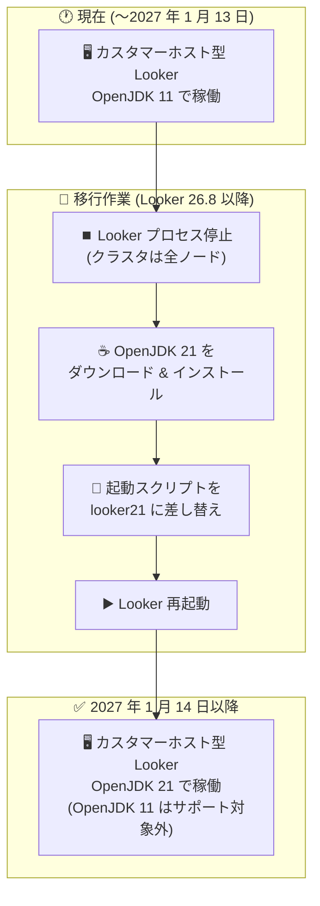

# Looker: OpenJDK 11 サポート終了 (2027 年 1 月 14 日) - カスタマーホスト型インスタンスは OpenJDK 21 への移行が必要

**リリース日**: 2026-09-02

**サービス**: Looker

**機能**: OpenJDK 11 の非推奨化と OpenJDK 21 への移行

**ステータス**: Deprecated (非推奨)

📊 [このアップデートのインフォグラフィックを見る](https://takech9203.github.io/google-cloud-news-summary/20260902-looker-openjdk-11-deprecation.html)

## 概要

Google Cloud は、Looker における OpenJDK 11 のサポートを **2027 年 1 月 14 日** に終了することを発表しました。カスタマーホスト型 (customer-hosted) の Looker インスタンスは、期限までに OpenJDK 21 へアップグレードする必要があります。

Looker 26.8 以降、Looker は Java OpenJDK バージョン 21 をサポートしています。Looker ホスト型 (Looker-hosted) のインスタンスはすでに OpenJDK 21 へのアップグレードが完了しているため、対応は不要です。一方、自社インフラで Looker を運用しているカスタマーホスト型インスタンスの管理者は、OpenJDK 21 のインストールと新しい起動スクリプトへの差し替えを自ら実施する必要があります。

OpenJDK 21 は LTS (長期サポート) リリースであり、Looker は OpenJDK をパフォーマンスとメモリ使用効率の改善のために採用しています。なお、Oracle JDK やその他のバージョンの Java / OpenJDK は現時点でサポートされていません。

**アップデート前の課題**

- カスタマーホスト型 Looker は OpenJDK 11 上で動作しており、より新しい Java ランタイムの性能改善やメモリ管理の改善を享受できなかった
- OpenJDK 11 と OpenJDK 21 の両方がサポート対象として並存しており、移行の明確な期限が示されていなかった

**アップデート後の改善**

- OpenJDK 11 のサポート終了日が **2027 年 1 月 14 日** と明確に設定され、移行計画を立てやすくなった
- Looker 26.8 以降で OpenJDK 21 (LTS) が正式にサポートされ、公式のアップグレード手順と新しい起動スクリプト (`looker21`) が提供されている
- Looker ホスト型インスタンスはすでに OpenJDK 21 へ移行済みで、ユーザー側の対応は不要

## アーキテクチャ図



カスタマーホスト型 Looker インスタンスの OpenJDK 11 から OpenJDK 21 への移行フローです。2027 年 1 月 14 日のサポート終了までに、プロセス停止、OpenJDK 21 のインストール、起動スクリプトの差し替え、再起動という手順で移行を完了する必要があります。

## サービスアップデートの詳細

### 主要ポイント

1. **OpenJDK 11 のサポート終了日の確定**
   - 2027 年 1 月 14 日をもって OpenJDK 11 はサポート対象外となる
   - 対象はカスタマーホスト型 (自社ホスティング) の Looker インスタンス

2. **OpenJDK 21 の正式サポート (Looker 26.8 以降)**
   - Looker 26.8 から OpenJDK 21 をサポート
   - Looker ホスト型インスタンスはすでに OpenJDK 21 へアップグレード済み
   - Oracle JDK およびその他のバージョンの Java / OpenJDK はサポート対象外

3. **新しい起動スクリプト (`looker21`) の提供**
   - OpenJDK 21 への移行には、Looker 公式 GitHub リポジトリ (looker-open-source/customer-scripts) で提供される新しい `looker21` 起動スクリプトへの差し替えが必要
   - スクリプトは `looker` という名前にリネームして配置する必要がある

4. **`java -jar` で直接起動する場合の追加設定**
   - 起動スクリプトを使わず `java -jar` コマンドで Looker を直接起動している場合は、以下の 3 つの JVM オプションの指定が必須:
     - `--add-opens=java.base/sun.nio.ch=ALL-UNNAMED`
     - `--add-opens=java.base/java.io=ALL-UNNAMED`
     - `--add-opens=java.base/java.nio=ALL-UNNAMED`

## 技術仕様

### サポート状況の比較

| 項目 | OpenJDK 11 | OpenJDK 21 |
|------|-----------|-----------|
| Looker でのサポート | 2027 年 1 月 14 日で終了 | Looker 26.8 以降でサポート |
| Looker ホスト型 | アップグレード済み (利用終了) | 適用済み |
| カスタマーホスト型 | 期限までに移行が必要 | 手動アップグレードが必要 |
| 起動スクリプト | 旧 `looker` スクリプト | 新 `looker21` スクリプト (要差し替え) |

### 注意事項

- Oracle JDK やその他の Java バージョンはサポート対象外
- Looker は、新しい Java アップデートがリリースされたら移行することを推奨している

## 設定方法

### 前提条件

1. カスタマーホスト型の Looker インスタンスを運用していること
2. Looker 26.8 以降を利用していること (OpenJDK 21 のサポートは Looker 26.8 から)

### 手順

#### ステップ 1: Looker プロセスの停止

```bash
sudo su - looker
cd /home/looker/looker
./looker stop
```

クラスタ構成の場合は、すべてのノードで Looker を停止します。

#### ステップ 2: OpenJDK 21 のダウンロードとインストール

[jdk.java.net](https://jdk.java.net/archive/) から OpenJDK 21 をダウンロードしてインストールします。

#### ステップ 3: 起動スクリプトの差し替え

```bash
# 旧起動スクリプトの削除
rm looker

# 新しい looker21 スクリプトを "looker" にリネームして配置
mv <download_directory>/looker21 looker
```

新しい `looker21` 起動スクリプトは Looker の公式 GitHub リポジトリ (looker-open-source/customer-scripts) からダウンロードします。正しく動作させるため、スクリプト名は必ず `looker` にする必要があります。クラスタ構成の場合は、全ノードでステップ 2〜3 を繰り返します。

#### ステップ 4: Looker の再起動

```bash
./looker start
```

クラスタ構成の場合は、すべてのノードで Looker を起動します。

## メリット

### ビジネス面

- **移行期限の明確化**: サポート終了日 (2027 年 1 月 14 日) が明示されたことで、メンテナンスウィンドウの確保や移行計画の策定がしやすくなる
- **サポート継続性の確保**: 期限までに移行することで、セキュリティパッチやサポートを継続して受けられる

### 技術面

- **LTS リリースへの移行**: OpenJDK 21 は LTS リリースであり、長期的に安定したランタイム基盤を確保できる
- **公式手順の提供**: アップグレード手順と専用起動スクリプトが公式に提供されており、移行作業が標準化されている

## デメリット・制約事項

### 制限事項

- 2027 年 1 月 14 日以降、OpenJDK 11 上での Looker 稼働はサポートされない
- Oracle JDK およびその他のバージョンの Java / OpenJDK はサポート対象外
- OpenJDK 21 のサポートは Looker 26.8 以降に限られる

### 考慮すべき点

- 移行には Looker プロセスの停止・再起動が伴うため、ダウンタイムを考慮したメンテナンス計画が必要
- クラスタ構成の場合、全ノードで OpenJDK のインストールと起動スクリプトの差し替えを行う必要がある
- `java -jar` で直接起動する運用の場合、3 つの `--add-opens` JVM オプションの追加を忘れるとエラーの原因になる
- 起動スクリプトの差し替え時、スクリプト名を `looker` にリネームしないと正しく動作しない

## ユースケース

### ユースケース 1: 単一ノードのカスタマーホスト型 Looker の移行

**シナリオ**: オンプレミスの VM 上で単一ノードの Looker を OpenJDK 11 で運用している。2027 年 1 月 14 日の期限までに OpenJDK 21 へ移行したい。

**実装例**:
```bash
sudo su - looker
cd /home/looker/looker
./looker stop
# OpenJDK 21 をインストール後
rm looker
mv <download_directory>/looker21 looker
./looker start
```

**効果**: 短時間のメンテナンスウィンドウで OpenJDK 21 への移行が完了し、サポート終了後もサポート対象の構成で運用を継続できる。

### ユースケース 2: クラスタ構成の Looker の計画的移行

**シナリオ**: 複数ノードのクラスタ構成で Looker を運用しており、全ノードの Java ランタイムを統一して移行する必要がある。

**効果**: 全ノードで Looker を停止した上で OpenJDK 21 と新起動スクリプトを展開することで、ノード間のランタイムバージョン不整合を避けつつ移行できる。

## 関連サービス・機能

- **Looker (Google Cloud core)**: Google Cloud が管理する Looker。ホスティングを Google 側が担うため、今回のような Java ランタイムの手動アップグレードは不要
- **Looker ホスト型 (Looker-hosted) インスタンス**: すでに OpenJDK 21 へアップグレード済みのため対応不要。今回の対応が必要なのはカスタマーホスト型のみ

## 参考リンク

- 📊 [インフォグラフィック](https://takech9203.github.io/google-cloud-news-summary/20260902-looker-openjdk-11-deprecation.html)
- [公式リリースノート](https://docs.cloud.google.com/release-notes#September_02_2026)
- [OpenJDK 21 へのアップグレード手順 (カスタマーホスト型インスタンス)](https://docs.cloud.google.com/looker/docs/upgrading-to-openjdk-21-customer-hosted-instance)
- [カスタマーホスト型 Looker のインストール手順](https://docs.cloud.google.com/looker/docs/customer-hosted-installation-steps)
- [looker21 起動スクリプト (GitHub)](https://github.com/looker-open-source/customer-scripts/blob/main/startup_scripts/looker21)

## まとめ

カスタマーホスト型 Looker インスタンスにおける OpenJDK 11 のサポートは 2027 年 1 月 14 日に終了します。該当インスタンスを運用している場合は、Looker 26.8 以降で OpenJDK 21 と新しい `looker21` 起動スクリプトへの移行を早めに計画・実施してください。`java -jar` で直接起動している場合は、3 つの `--add-opens` オプションの追加も忘れずに行いましょう。

---

**タグ**: Looker, OpenJDK, Java, Deprecated, 非推奨, カスタマーホスト, マイグレーション, BI
