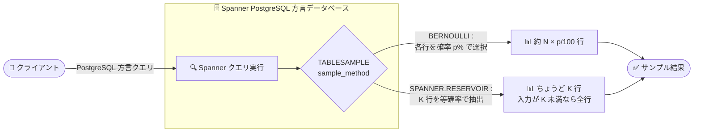

# Spanner: PostgreSQL 方言データベースで TABLESAMPLE 演算子をサポート

**リリース日**: 2026-09-02

**サービス**: Spanner

**機能**: PostgreSQL 方言データベースにおける TABLESAMPLE 演算子のサポート

**ステータス**: 一般提供 (GA)

📊 [このアップデートのインフォグラフィックを見る](https://takech9203.github.io/google-cloud-news-summary/20260902-spanner-postgresql-tablesample.html)

## 概要

Spanner の PostgreSQL 方言データベースで、`TABLESAMPLE` 演算子が利用できるようになりました。`TABLESAMPLE` 演算子は、テーブルからランダムなサンプルデータを抽出するための SQL 演算子で、大量のデータを持つテーブルに対して厳密な結果を必要としない分析やデータ探索を行う際に有効です。

サンプリング方式として、各行を指定した確率で独立に選択する `BERNOULLI` と、指定した行数ちょうどのサンプルを等確率で抽出する `SPANNER.RESERVOIR` の 2 種類が用意されています。これにより、GoogleSQL 方言で提供されてきたテーブルサンプリング機能と同等の機能が、PostgreSQL 方言でも SQL 標準に近い構文で利用可能になります。

対象ユーザーは、Spanner の PostgreSQL 方言データベースを利用しており、大規模テーブルに対するデータ品質チェック、統計的な傾向分析、機械学習用サンプルデータの抽出などを行うデータエンジニアやアプリケーション開発者です。

**アップデート前の課題**

- PostgreSQL 方言データベースでは `TABLESAMPLE` 演算子がサポートされておらず、ランダムサンプリングを SQL で直接表現できなかった
- 代替手段として、`spanner.farm_fingerprint` 関数で各行のハッシュ値を計算し、剰余で絞り込むといった回避策 (公式の方言差異ドキュメントに記載) を自前で実装する必要があった
- GoogleSQL 方言では `TABLESAMPLE` が利用できたため、方言間で機能差があり、GoogleSQL 方言からの移行や併用時にクエリの書き換えが必要だった

**アップデート後の改善**

- `TABLESAMPLE BERNOULLI (割合)` により、各行を指定確率で独立に選択する確率的サンプリングが SQL で直接記述できるようになった
- `TABLESAMPLE SPANNER.RESERVOIR (行数)` により、正確に K 行のサンプルを等確率で抽出できるようになった
- ハッシュ関数を使った回避策が不要になり、クエリがシンプルになった
- JOIN やサブクエリ内のベーステーブル・ビューへの適用、数値パラメータやリテラルのキャスト・暗黙変換にも対応した

## アーキテクチャ図



PostgreSQL 方言クエリの `TABLESAMPLE` 演算子で指定したサンプリング方式 (`BERNOULLI` または `SPANNER.RESERVOIR`) に応じて、Spanner がテーブルからランダムサンプルを抽出して返却する流れを示しています。

## サービスアップデートの詳細

### 主要機能

1. **BERNOULLI サンプリング**
   - `sample_size` で指定した確率 (0〜100) で各行を独立に選択する
   - 結果として約 `N * sample_size / 100` 行が返る (行数は確率的に変動)
   - 例: `SELECT MessageId FROM Messages TABLESAMPLE BERNOULLI (0.1);` (約 0.1% を抽出)

2. **SPANNER.RESERVOIR サンプリング**
   - サンプルサイズ K を行数で指定する (0 以上)
   - 入力が K 行より大きい場合、ちょうど K 行のサンプルを出力し、どの K 行の組み合わせも等確率で選ばれる
   - 入力が K 行より小さい場合は、入力全体をそのまま出力する
   - 例: `SELECT MessageId FROM Messages TABLESAMPLE SPANNER.RESERVOIR (100);`

3. **柔軟なサンプルサイズ指定**
   - サンプルサイズには数値リテラルまたは数値パラメータを指定可能
   - リテラルのキャスト (`CAST(45.56 AS BIGINT)`、`'50'::DOUBLE PRECISION`) や暗黙の型変換 (`BERNOULLI ('50')`) をサポート

4. **JOIN・サブクエリとの組み合わせ**
   - 複数テーブルにそれぞれ `TABLESAMPLE` を適用した JOIN が可能
   - サブクエリ内のベーステーブルやビューに対しても適用可能

## 技術仕様

### 構文

```sql
tablesample_operator:
{
  TABLESAMPLE sample_method (sample_size)
}

-- sample_method は次のいずれか:
--   BERNOULLI | SPANNER.RESERVOIR
-- sample_size は次のいずれか:
--   { numeric_literal | numeric_parameter }
```

### サンプリング方式の比較

| 項目 | BERNOULLI | SPANNER.RESERVOIR |
|------|-----------|-------------------|
| 指定方法 | 割合 (%) | 行数 |
| 値の範囲 | 0〜100 (両端含む) | 0 以上 |
| 結果の行数 | 約 N × sample_size/100 行 (変動あり) | ちょうど K 行 (入力が K 未満なら全行) |
| 特徴 | 各行を独立に確率選択 | どの K 行の組み合わせも等確率 |

### GoogleSQL 方言との構文差異

| 項目 | GoogleSQL 方言 | PostgreSQL 方言 |
|------|----------------|-----------------|
| 予約サンプリングの方式名 | `RESERVOIR` | `SPANNER.RESERVOIR` |
| 単位キーワード | `PERCENT` / `ROWS` を明示 | なし (方式ごとに単位が決まる) |
| サブクエリ由来の一時テーブルへの適用 | 可能 | 不可 |

## 設定方法

### 前提条件

1. Spanner の PostgreSQL 方言データベースを利用していること
2. 追加の設定や API の有効化は不要 (SQL クエリ構文としてそのまま利用可能)

### 使用例

#### 例 1: RESERVOIR サンプリングで 100 行を抽出

```sql
SELECT MessageId
FROM Messages TABLESAMPLE SPANNER.RESERVOIR (100);
```

#### 例 2: BERNOULLI サンプリングで約 0.1% を抽出

```sql
SELECT MessageId
FROM Messages TABLESAMPLE BERNOULLI (0.1);
```

#### 例 3: JOIN との組み合わせ

```sql
SELECT T.Subject, M.MessageId
FROM Threads AS T TABLESAMPLE SPANNER.RESERVOIR(10),
     Messages AS M TABLESAMPLE BERNOULLI(50)
WHERE T.ServerId='test' AND T.ThreadId = M.ThreadId;
```

#### 例 4: サブクエリ内のベーステーブルへの適用

```sql
SELECT Subject
FROM (SELECT MessageId, Subject
      FROM Messages TABLESAMPLE BERNOULLI(50) WHERE ServerId = 'test') Messages2
WHERE MessageId > 3;
```

## メリット

### ビジネス面

- **分析コストと時間の削減**: 大規模テーブル全体を処理せずにサンプルで傾向を把握できるため、データ探索や品質チェックの所要時間を短縮できる
- **移行のしやすさ向上**: GoogleSQL 方言との機能差が縮まり、方言間の移行・併用時のクエリ書き換え負担が軽減される

### 技術面

- **クエリの簡素化**: `spanner.farm_fingerprint` によるハッシュ計算などの回避策が不要になり、意図が明確な SQL を記述できる
- **2 種類のサンプリング特性を選択可能**: 「割合で近似的に抽出したい」場合は BERNOULLI、「正確に K 行欲しい」場合は SPANNER.RESERVOIR と、用途に応じて使い分けられる
- **パラメータ化対応**: サンプルサイズに数値パラメータを利用でき、アプリケーションから動的にサンプルサイズを制御できる

## デメリット・制約事項

### 制限事項

公式ドキュメントに記載されている `TABLESAMPLE` 演算子の制限事項は以下のとおりです。

- サンプルサイズリテラルのネストされたキャストはサポートされない
- サンプルサイズパラメータのキャストはサポートされない
- サブクエリから派生した一時テーブルに対するサンプリングはサポートされない (GoogleSQL 方言とは異なる点)

### 考慮すべき点

- サンプリング結果はランダムであるため、同じクエリでも実行のたびに結果が変わり得る
- BERNOULLI は行ごとの確率選択のため、返却行数は毎回変動する。正確な行数が必要な場合は SPANNER.RESERVOIR を使用する
- サンプル結果は近似的な分析向けであり、厳密な集計が必要な処理には全件クエリを使用する

## ユースケース

### ユースケース 1: 大規模テーブルのデータ品質チェック

**シナリオ**: 数億行規模のメッセージテーブルに対して、データ形式の妥当性や欠損の有無を定期的に確認したい。全件スキャンは時間がかかるため、代表的なサンプルで検査したい。

**実装例**:
```sql
SELECT MessageId, Subject
FROM Messages TABLESAMPLE SPANNER.RESERVOIR (1000);
```

**効果**: 正確に 1,000 行のランダムサンプルを取得でき、全件処理を行わずにデータ品質の傾向を把握できる。

### ユースケース 2: 機械学習・分析用のサンプルデータ抽出

**シナリオ**: 本番の PostgreSQL 方言データベースから、モデル学習や探索的データ分析 (EDA) 用に一部のデータだけを抽出したい。

**実装例**:
```sql
SELECT *
FROM Transactions TABLESAMPLE BERNOULLI (1);
```

**効果**: テーブル全体の約 1% を確率的に抽出でき、ハッシュ関数による自前のサンプリング実装が不要になる。

## 料金

このアップデートは SQL クエリ構文の追加であり、追加料金は発生しません。Spanner の通常のコンピュート容量・ストレージに基づく料金体系が適用されます。詳細は料金ページを参照してください。

- [Spanner の料金](https://cloud.google.com/spanner/pricing)

## 関連サービス・機能

- **Spanner GoogleSQL 方言**: `TABLESAMPLE` 演算子 (BERNOULLI / RESERVOIR、`PERCENT` / `ROWS` 指定) を以前からサポートしており、パイプ構文の `|> TABLESAMPLE` にも対応。今回のアップデートで PostgreSQL 方言との機能差が縮小
- **Spanner クエリ実行プラン (Random ID Assign 演算子)**: サンプリングクエリは内部的に Random ID Assign 演算子が各行に乱数を割り当て、Filter (Bernoulli) や Sort + LIMIT (Reservoir) と組み合わせて実行される
- **BigQuery のテーブルサンプリング**: BigQuery も `TABLESAMPLE SYSTEM` 句を提供しているが、データブロック単位のサンプリングであり、Spanner の行単位サンプリングとは動作が異なる

## 参考リンク

- 📊 [インフォグラフィック](https://takech9203.github.io/google-cloud-news-summary/20260902-spanner-postgresql-tablesample.html)
- [公式リリースノート](https://docs.cloud.google.com/release-notes#September_02_2026)
- [ドキュメント: TABLESAMPLE 演算子 (PostgreSQL 方言クエリ構文)](https://docs.cloud.google.com/spanner/docs/reference/postgresql/query-syntax#tablesample_operator)
- [ドキュメント: GoogleSQL 方言の TABLESAMPLE 演算子](https://docs.cloud.google.com/spanner/docs/reference/standard-sql/query-syntax#tablesample_operator)
- [料金ページ](https://cloud.google.com/spanner/pricing)

## まとめ

Spanner の PostgreSQL 方言データベースで `TABLESAMPLE` 演算子が利用可能になり、ハッシュ関数による回避策なしにランダムサンプリングを SQL で直接記述できるようになりました。大規模テーブルのデータ品質チェックや分析用サンプル抽出を行っている PostgreSQL 方言ユーザーは、BERNOULLI と SPANNER.RESERVOIR の特性 (割合指定か正確な行数か) を理解した上で、既存のサンプリング処理の置き換えを検討することを推奨します。

---

**タグ**: #Spanner #PostgreSQL #TABLESAMPLE #SQL #サンプリング #データ分析
