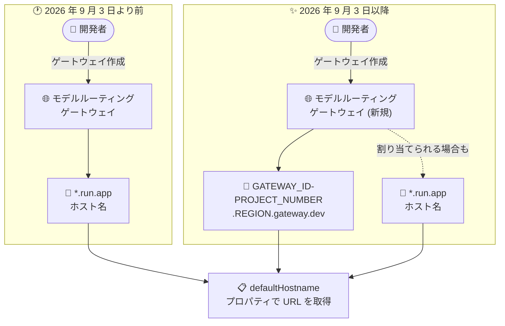

# API Gateway: モデルルーティングゲートウェイに gateway.dev デフォルトホスト名を導入

**リリース日**: 2026-09-03

**サービス**: API Gateway

**機能**: モデルルーティングゲートウェイの gateway.dev デフォルトホスト名

**ステータス**: Change (変更)

📊 [このアップデートのインフォグラフィックを見る](https://takech9203.github.io/google-cloud-news-summary/20260903-api-gateway-model-routing-gateway-dev-hostname.html)

## 概要

2026 年 9 月 3 日以降、API Gateway のモデルルーティング機能を使用して新規作成されるゲートウェイには、従来の `run.app` ではなく `gateway.dev` のデフォルトホスト名が割り当てられる場合があります。新しいホスト名は `https://GATEWAY_ID-PROJECT_NUMBER.REGION.gateway.dev` という形式で、例えば `https://my-gateway-123456789012.us-central1.gateway.dev` のようになります。

モデルルーティングは 2026 年 8 月に Public Preview として発表された機能で、OpenAI 互換のプロンプトリクエストを受け付け、ペイロード内のモデル名に基づいて Gemini Enterprise Agent Platform Model Garden 上の基盤モデル (Gemini、Anthropic Claude、OpenAI GPT など) にリクエストをルーティングする、マネージドなトラフィック管理レイヤーです。Public Preview 開始時点では、モデルルーティングゲートウェイには `*.run.app` 形式のホスト名が返されていました。

今回導入される形式は、既存の標準ゲートウェイで使用されている `https://GATEWAY_ID-HASH.REGION_CODE.gateway.dev` (例: `my-gateway-a12bcd345e67f89g0h.uc.gateway.dev`) とは異なる、**2 つ目の gateway.dev 形式**です。モデルルーティングを使用しない既存のゲートウェイは従来の形式を維持します。ゲートウェイの URL を取得する際は、ホスト名の形式を前提とせず、必ず `defaultHostname` プロパティを読み取ることが推奨されます。

**アップデート前の課題**

- Public Preview 開始時点のモデルルーティングゲートウェイには `*.run.app` 形式のホスト名が割り当てられており、標準ゲートウェイの `*.gateway.dev` とドメインが異なっていた
- ホスト名の形式がゲートウェイの種類によって異なるため、特定の形式を前提としたスクリプトや設定は互換性の問題を起こす可能性があった

**アップデート後の改善**

- 2026 年 9 月 3 日以降に作成されるモデルルーティングゲートウェイには、`https://GATEWAY_ID-PROJECT_NUMBER.REGION.gateway.dev` 形式の gateway.dev ホスト名が割り当てられる場合がある
- 新形式はゲートウェイ ID、プロジェクト番号、完全なリージョン名で構成されるため、URL からゲートウェイの所属を判別しやすい
- 既存のゲートウェイおよびモデルルーティングを使用しないゲートウェイは従来の形式を維持するため、既存環境への影響はない

## アーキテクチャ図



2026 年 9 月 3 日以降に作成されるモデルルーティングゲートウェイには、新しい gateway.dev 形式のホスト名が割り当てられる場合があります。ホスト名の形式にかかわらず、`defaultHostname` プロパティから URL を取得することが推奨されます。

## サービスアップデートの詳細

### 主要機能

1. **新しい gateway.dev ホスト名形式の導入**
   - 形式: `https://GATEWAY_ID-PROJECT_NUMBER.REGION.gateway.dev`
   - 例: `https://my-gateway-123456789012.us-central1.gateway.dev`
   - 2026 年 9 月 3 日以降にモデルルーティングを使用して作成されるゲートウェイに割り当てられる場合がある

2. **既存形式との共存**
   - 標準ゲートウェイの既存形式 `https://GATEWAY_ID-HASH.REGION_CODE.gateway.dev` (HASH はデプロイ時に生成される一意のハッシュ、REGION_CODE は短縮リージョンコード) はそのまま維持される
   - 今回の形式は 2 つ目の gateway.dev 形式であり、モデルルーティングを使用しないゲートウェイには影響しない

3. **defaultHostname プロパティによる URL 取得**
   - ゲートウェイの URL はホスト名形式を前提とせず、`defaultHostname` プロパティを読み取って取得する
   - ゲートウェイが `ACTIVE` 状態になってから取得する必要がある (作成中に報告される値は最終的な URL ではない)

## 技術仕様

### ホスト名形式の比較

| 項目 | 既存の gateway.dev 形式 | 新しい gateway.dev 形式 |
|------|------------------------|------------------------|
| 対象 | 標準ゲートウェイ | 2026-09-03 以降に作成されるモデルルーティングゲートウェイ |
| 形式 | `GATEWAY_ID-HASH.REGION_CODE.gateway.dev` | `GATEWAY_ID-PROJECT_NUMBER.REGION.gateway.dev` |
| 例 | `my-gateway-a12bcd345e67f89g0h.uc.gateway.dev` | `my-gateway-123456789012.us-central1.gateway.dev` |
| 識別子 | デプロイ時に生成される一意のハッシュ | プロジェクト番号 |
| リージョン表記 | 短縮コード (例: `uc`) | 完全なリージョン名 (例: `us-central1`) |

### モデルルーティング機能の前提 (参考)

| 項目 | 詳細 |
|------|------|
| ステータス | Public Preview (2026 年 8 月発表) |
| 対応リクエスト | OpenAI 互換の JSON ペイロード (`model` 属性でルーティング) |
| ルーティング先 | Agent Platform Model Garden の MaaS モデル (Gemini、Anthropic Claude、OpenAI GPT ファミリー) |
| 設定方法 | OpenAPI 3.x 仕様 + `x-google-api-management.ai.models.routing` / `x-google-model-router` 拡張 |
| 制約 | VPC Service Controls / Private Service Connect 非対応、モデルルーティングの有効化/無効化はゲートウェイの再作成が必要 |

## 設定方法

### ゲートウェイ URL の確認手順

ゲートウェイが `ACTIVE` 状態になった後、`defaultHostname` プロパティから URL を取得します。

```bash
gcloud api-gateway gateways describe GATEWAY_ID \
  --location=GATEWAY_LOCATION \
  --project=PROJECT_ID \
  --format='value(defaultHostname)'
```

取得したホスト名に `https://` を付与したものがゲートウェイの URL です。ホスト名が `run.app` か `gateway.dev` かにかかわらず、この方法で正しい URL を取得できます。

## メリット

### ビジネス面

- **既存環境への影響なし**: 既存のゲートウェイおよびモデルルーティングを使用しないゲートウェイは従来のホスト名を維持するため、移行作業は不要
- **API Gateway ドメインへの統一**: モデルルーティングゲートウェイが API Gateway 固有の gateway.dev ドメインを使用することで、サービスとしての一貫性が向上

### 技術面

- **判読性の高い URL**: プロジェクト番号と完全なリージョン名で構成されるため、URL からゲートウェイの所属プロジェクトとリージョンを判別しやすい
- **defaultHostname による抽象化**: ホスト名形式の違いは `defaultHostname` プロパティを介して吸収できる

## デメリット・制約事項

### 考慮すべき点

- 2026 年 9 月 3 日以降に作成されるモデルルーティングゲートウェイのホスト名は、`gateway.dev` になる場合と `run.app` になる場合がある (「might」と記載されており確定的ではない)
- `run.app` や特定の gateway.dev 形式をハードコードしているスクリプト、ファイアウォールルール、許可リストなどは、新形式のホスト名に対応できない可能性があるため見直しが必要
- ホスト名はゲートウェイが `ACTIVE` 状態になってから取得する必要がある (作成中の値は最終的な URL ではない)

## ユースケース

### ユースケース 1: CI/CD パイプラインでのゲートウェイ URL の動的取得

**シナリオ**: モデルルーティングゲートウェイをデプロイする CI/CD パイプラインで、デプロイ後にクライアント設定へゲートウェイ URL を反映する。

**実装例**:
```bash
# ゲートウェイが ACTIVE になるのを待ってから URL を取得
GATEWAY_URL="https://$(gcloud api-gateway gateways describe my-gateway \
  --location=us-central1 \
  --project=my-project \
  --format='value(defaultHostname)')"

echo "Gateway URL: ${GATEWAY_URL}"
```

**効果**: ホスト名形式 (`run.app` / `gateway.dev`) の違いに依存せず、常に正しいゲートウェイ URL を取得できる。

### ユースケース 2: 既存の URL 前提処理の点検

**シナリオ**: モデルルーティングゲートウェイの URL が `*.run.app` であることを前提に、クライアントの許可リストや監視設定を構成している。

**効果**: 新形式 `*.gateway.dev` を許可リストや監視設定に追加しておくことで、9 月 3 日以降に作成したゲートウェイでも接続エラーや検知漏れを防止できる。

## 料金

このアップデートはホスト名形式の変更であり、料金への影響に関する記載はありません。API Gateway の料金については公式料金ページを参照してください。

- [API Gateway 料金](https://cloud.google.com/api-gateway/pricing)

## 関連サービス・機能

- **Gemini Enterprise Agent Platform Model Garden**: モデルルーティングのルーティング先となる MaaS モデル (Gemini、Anthropic Claude、OpenAI GPT ファミリー) のホスト基盤
- **Cloud Run**: 従来のモデルルーティングゲートウェイのホスト名 (`*.run.app`) が属していたドメイン
- **Apigee**: API Gateway と同様の API 管理サービス。より高度な API 管理機能が必要な場合の選択肢

## 参考リンク

- 📊 [インフォグラフィック](https://takech9203.github.io/google-cloud-news-summary/20260903-api-gateway-model-routing-gateway-dev-hostname.html)
- [公式リリースノート](https://docs.cloud.google.com/release-notes#September_03_2026)
- [Deploying an API to a gateway](https://docs.cloud.google.com/api-gateway/docs/deploying-api)
- [Overview of model routing](https://docs.cloud.google.com/api-gateway/docs/model-routing-overview)
- [Configure model routing](https://docs.cloud.google.com/api-gateway/docs/model-routing-configure)
- [API Gateway 料金](https://cloud.google.com/api-gateway/pricing)

## まとめ

2026 年 9 月 3 日以降に作成されるモデルルーティングゲートウェイには、新しい `GATEWAY_ID-PROJECT_NUMBER.REGION.gateway.dev` 形式のホスト名が割り当てられる場合があります。既存ゲートウェイへの影響はありませんが、ホスト名形式をハードコードしている許可リストやスクリプトは新形式に対応できるよう見直し、ゲートウェイ URL の取得には常に `defaultHostname` プロパティを使用することを推奨します。

---

**タグ**: #APIGateway #ModelRouting #gatewaydev #ホスト名 #Change
