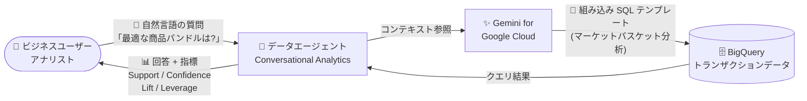

# BigQuery: Conversational Analytics がマーケットバスケット分析に対応 (GA)

**リリース日**: 2026-09-03

**サービス**: BigQuery

**機能**: Conversational Analytics のマーケットバスケット分析サポート

**ステータス**: GA (一般提供)

📊 [このアップデートのインフォグラフィックを見る](https://takech9203.github.io/google-cloud-news-summary/20260903-bigquery-conversational-analytics-market-basket-analysis.html)

## 概要

BigQuery の Conversational Analytics (会話型分析) が、マーケットバスケット分析 (アソシエーションルール学習とも呼ばれる) に関する質問をサポートするようになりました。この機能は一般提供 (GA) となっています。

マーケットバスケット分析は、1 回のトランザクションで一緒に購入されることが多い商品間の関係性を特定し、購買パターンを明らかにする分析手法です。今回のアップデートにより、ユーザーは自然言語で「2025 年のデータに基づいて、最適な商品バンドルの機会は何か?」といった質問をデータエージェントに投げかけるだけで、Conversational Analytics が組み込みの SQL テンプレートを使用して、Support (支持度)、Confidence (確信度)、Lift (リフト値)、Leverage (レバレッジ) の各指標を含む正確な回答を返します。

Conversational Analytics は Gemini for Google Cloud を基盤とし、BigQuery のデータに対して自然言語でチャット形式の分析を行える機能です。今回の対応により、小売・EC 事業のアナリストやビジネスユーザーが、複雑な SQL を書くことなく商品バンドリングやクロスセルの機会を発見できるようになります。

**アップデート前の課題**

- Conversational Analytics はマーケットバスケット分析に関する質問に対応しておらず、購買パターンの関連分析を会話形式で行うことができなかった
- 商品の同時購入パターンを分析するには、トランザクションデータに対する Support、Confidence、Lift などの指標を算出する SQL をユーザー自身が設計・記述する必要があった

**アップデート後の改善**

- 自然言語の質問だけでマーケットバスケット分析を実行できるようになり、SQL の知識がないビジネスユーザーでも商品バンドリングの機会を発見できるようになった
- 組み込みの SQL テンプレートにより、Leverage、Support、Confidence、Lift の各指標を含む精度の高い回答が自動的に返されるようになった

## アーキテクチャ図



ユーザーが自然言語で質問すると、Gemini を基盤とするデータエージェントが組み込みの SQL テンプレートを用いてマーケットバスケット分析のクエリを生成・実行し、アソシエーション指標を含む回答を返します。

## サービスアップデートの詳細

### 主要機能

1. **自然言語によるマーケットバスケット分析**
   - 「2025 年のデータに基づいて、最適な商品バンドリングの機会は何か? (What are the best product bundling opportunities based on data from 2025?)」のような質問を会話形式で実行可能
   - 例として `bigquery-public-data.iowa_liquor_sales.sales` テーブルをデータソースとした会話で利用できる

2. **組み込み SQL テンプレートによる高精度な回答**
   - Conversational Analytics が組み込みの SQL テンプレートを使用して、マーケットバスケット分析に最適化されたクエリを生成
   - 回答には Leverage、Support、Confidence、Lift の各アソシエーション指標が含まれる

3. **データエージェント / 直接会話の両方で利用可能**
   - コンテキストや指示 (Instructions)、検証済みクエリ (Verified Queries) を設定したデータエージェントとの会話で利用可能
   - テーブルやビューを直接指定したワンショットの会話 (Direct Conversation) でも質問できる

## 技術仕様

### マーケットバスケット分析の指標

| 指標 | 説明 |
|------|------|
| Support (支持度) | 全トランザクションのうち、対象の商品組み合わせが出現する割合 |
| Confidence (確信度) | 商品 A を購入したトランザクションのうち、商品 B も購入された割合 |
| Lift (リフト値) | 商品 A の購入が商品 B の購入確率をどの程度高めるかを示す指標 |
| Leverage (レバレッジ) | 商品 A と B の同時出現頻度と、独立と仮定した場合の期待頻度との差 |

※ 各指標の定義は一般的なアソシエーションルール学習の定義に基づきます。Conversational Analytics の回答にはこれら 4 指標が含まれます。

### Conversational Analytics の主なセキュリティ仕様

| 項目 | 詳細 |
|------|------|
| アクセス制御 | Conversational Analytics API の IAM ロールと権限で管理 |
| データアクセス範囲 | ユーザーがアクセス権限を持つデータ・リソースのみ |
| VPC Service Controls | 対応 (VPC-SC のセキュリティ制御を尊重) |
| 書き込み操作 | 不可 (DML クエリは実行不可、リモート関数も実行不可) |
| 会話履歴 | 本人のみに共有され、他のユーザーとは共有不可 |

### ロケーション

エージェントと会話リソースの保存および ML 処理のロケーションとして、以下の 3 つがサポートされています。

- US MREP (ナレッジソースがすべて US リージョンの場合のデフォルト)
- EU MREP (ナレッジソースがすべて EU リージョンの場合のデフォルト)
- Global (上記以外の場合のデフォルト)

## 設定方法

### 前提条件

1. BigQuery にトランザクションデータ (テーブル、ビューなど) が存在すること
2. データエージェントおよび会話に必要な IAM ロールが付与されていること (詳細は公式ドキュメントの「data agent required roles」「conversation required roles」を参照)

### 手順

#### ステップ 1: データソースとの会話を開始する

1. Google Cloud コンソールで BigQuery の **Agents** ページに移動する
2. **Conversations** タブで **New conversation** をクリックする
3. **Chat with your data** ペインの **Knowledge sources** タブで、分析対象のトランザクションテーブル (例: `bigquery-public-data.iowa_liquor_sales.sales`) を選択し、**Chat** をクリックする

#### ステップ 2: マーケットバスケット分析の質問を実行する

1. **Ask a question** フィールドに質問を入力する

```text
What are the best product bundling opportunities based on data from 2025?
```

2. モード (Fast / Thinking) を選択して送信すると、Conversational Analytics API が組み込み SQL テンプレートを使ってクエリを生成・実行し、Support・Confidence・Lift・Leverage を含む回答を返す
3. 回答の **How was this calculated?** を展開すると、生成されたクエリと結果を確認でき、クエリエディタで開くこともできる

## メリット

### ビジネス面

- **分析の民主化**: SQL を書けないマーチャンダイザーやマーケティング担当者でも、自然言語の質問だけで商品バンドリングやクロスセルの機会を発見できる
- **意思決定の高速化**: 従来はデータチームへの依頼が必要だったアソシエーション分析を、セルフサービスで即座に実行できる

### 技術面

- **組み込みテンプレートによる精度**: マーケットバスケット分析用の組み込み SQL テンプレートにより、LLM の自由生成のみに頼る場合と比べて正確な指標 (Support / Confidence / Lift / Leverage) を含む回答が得られる
- **GA による本番利用**: 一般提供 (GA) となったため、本番ワークロードでの利用に適したステータスとなった
- **コストの可視化**: エージェントが実行したジョブには `ca-bq-job`、`data-agent-id`、`conversation-id` のラベルが付与され、請求レポートのフィルタリングや監査、パフォーマンス分析に利用できる

## デメリット・制約事項

### 制限事項

- Conversational Analytics は書き込み操作や DML クエリ、リモート関数の実行はできない (読み取り専用の分析)
- エージェントは明示的に選択されたナレッジソースにのみアクセスできる
- 会話は 180 日間更新がない場合、自動的に削除される

### 考慮すべき点

- Gemini for Google Cloud は発展途上の技術であり、もっともらしいが事実と異なる出力を生成する可能性があるため、利用前に出力の検証が推奨される
- 会話で実行されるクエリには BigQuery のコンピューティング料金が発生するため、大規模なトランザクションテーブルに対する分析ではコストに注意が必要
- 直接会話 (Direct Conversation) はデータエージェントのコンテキストや指示を利用しないため精度が下がる場合があり、高い精度が求められる場合はデータエージェントの利用が推奨される

## ユースケース

### ユースケース 1: 小売・EC における商品バンドリングの発見

**シナリオ**: EC サイトの運営チームが、同時購入されやすい商品の組み合わせを特定し、バンドル販売やセット割引の企画に活用したい。

**実装例**:
```text
データソース: 売上トランザクションテーブル

質問例:
"What are the best product bundling opportunities based on data from 2025?"
(2025 年のデータに基づく最適な商品バンドリングの機会は?)
```

**効果**: SQL を書くことなく、Support・Confidence・Lift・Leverage の指標に裏付けられたバンドル候補を発見でき、クロスセル施策の立案を高速化できる。

### ユースケース 2: 検証済みクエリによる定型レポートの自動化

**シナリオ**: データサイエンティストが、マーケットバスケット分析を含む定期レポートをビジネスユーザー向けに提供したい。

**効果**: データエージェントに検証済みクエリ (Verified Queries) やコンテキスト・指示を設定しておくことで、ビジネスユーザーが一貫性のある高精度な分析結果をセルフサービスで取得できる。

## 料金

データエージェントの作成時や、データエージェント・データソースとの会話時に実行されるクエリに対して、BigQuery のコンピューティング料金 (Analysis pricing) が課金されます。エージェント自体の料金の詳細は、データエージェントの料金ページを参照してください。

- [BigQuery の料金 (Analysis pricing models)](https://docs.cloud.google.com/bigquery/pricing#analysis_pricing_models)
- [データエージェントの料金](https://cloud.google.com/products/data-agents/pricing)

なお、エージェントが実行したジョブには `ca-bq-job: true` などのラベルが付与されるため、[請求レポートをラベルでフィルタリング](https://docs.cloud.google.com/billing/docs/how-to/reports#filter-by-labels)してエージェント関連のコストを把握できます。

## 利用可能リージョン

Conversational Analytics は、エージェント・会話リソースの保存と ML 処理を管理するロケーションとして US MREP、EU MREP、Global の 3 つをサポートしています。詳細は[公式ドキュメント](https://docs.cloud.google.com/bigquery/docs/conversational-analytics)を参照してください。

## 関連サービス・機能

- **Gemini for Google Cloud**: Conversational Analytics の基盤となる生成 AI。自然言語の解釈と SQL 生成を担う
- **Conversational Analytics API**: データエージェントや会話を支える API。IAM によるアクセス制御を提供
- **BigQuery AI/ML 関数**: Conversational Analytics は `AI.FORECAST`、`AI.DETECT_ANOMALIES`、`AI.KEY_DRIVERS`、`AI.GENERATE` など多数の AI/ML 関数もサポートしており、マーケットバスケット分析と組み合わせた多角的な分析が可能
- **BigQuery INFORMATION_SCHEMA.JOBS**: エージェントが実行したジョブをラベル (`ca-bq-job` など) で集計・分析できる

## 参考リンク

- 📊 [インフォグラフィック](https://takech9203.github.io/google-cloud-news-summary/20260903-bigquery-conversational-analytics-market-basket-analysis.html)
- [公式リリースノート](https://docs.cloud.google.com/release-notes#September_03_2026)
- [Conversational analytics overview (Analytic task support)](https://docs.cloud.google.com/bigquery/docs/conversational-analytics#analytic_task_support)
- [Analyze data with conversations](https://docs.cloud.google.com/bigquery/docs/create-conversations)
- [Create data agents](https://docs.cloud.google.com/bigquery/docs/create-data-agents)
- [BigQuery の料金](https://docs.cloud.google.com/bigquery/pricing#analysis_pricing_models)

## まとめ

BigQuery の Conversational Analytics がマーケットバスケット分析に GA 対応したことで、SQL を書けないビジネスユーザーでも自然言語の質問だけで商品の同時購入パターンと Support・Confidence・Lift・Leverage の指標を得られるようになりました。小売・EC 系のトランザクションデータを BigQuery に保有している組織は、まず公開データセットや自社の売上テーブルとの直接会話で試し、精度が求められる本格運用ではコンテキストや検証済みクエリを設定したデータエージェントの構築を検討することを推奨します。

---

**タグ**: BigQuery, Conversational Analytics, マーケットバスケット分析, アソシエーションルール学習, Gemini, データエージェント, GA
