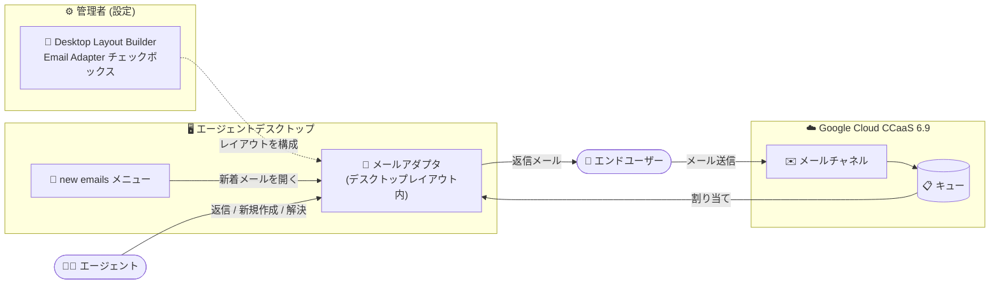

# Google Cloud Contact Center as a Service: CCaaS 6.9 リリース - エージェントデスクトップのメール対応と複数の不具合修正

**リリース日**: 2026-09-03

**サービス**: Google Cloud Contact Center as a Service (CCaaS) / Contact Center AI Platform (CCAI Platform)

**機能**: バージョン 6.9 リリース (エージェントデスクトップのメール対応、不具合修正)

**ステータス**: Announcement / Feature / Fixed

📊 [このアップデートのインフォグラフィックを見る](https://takech9203.github.io/google-cloud-news-summary/20260903-ccaas-6-9-agent-desktop-email.html)

## 概要

Google Cloud CCaaS のバージョン 6.9 がリリースされました。各インスタンスへの適用タイミングは、選択しているデプロイスケジュール (Rapid / Regular / Critical) に依存します。本リリースは、新機能の追加と 9 件の不具合修正を含む定期リリースです。

本リリースの目玉は、**エージェントデスクトップのメール対応**です。エージェントは、デスクトップレイアウト内のメールアダプタを使用してメールインタラクションを処理できるようになりました。管理者向けには、Desktop Layout Builder に新しい **Email Adapter チェックボックス**が追加され、エージェント向けには、エージェントデスクトップのメニューバーに新しい **new emails メニュー**が追加されています。これにより、音声・チャットに加えてメールも、カスタマイズ可能な単一のエージェントデスクトップ上で扱えるようになります。

また、Fixed として、新規アウトバウンドメールが送信できない問題、コールアダプタのディスポジションパネルの表示状態が不正になる問題、ボイスメールが History タブに重複表示される問題、営業時間終了時のボイスコールバックが翌日に繰り越されず取り消される問題、Salesforce のケースからのクリックトゥダイヤルが親アカウントの携帯電話番号を上書きする問題など、コンタクトセンター運用に直接影響する複数の不具合が修正されています。

**アップデート前の課題**

- エージェントデスクトップのデスクトップレイアウトではメールアダプタを配置できず、エージェントデスクトップ上でメールインタラクションを処理できなかった
- エージェントが新規アウトバウンドメールを送信できない不具合があった
- コールアダプタのディスポジションパネルが、状態更新の不整合により誤って非表示/表示になることがあった
- 直接受信したボイスメールがコールアダプタの History タブに複数回表示されていた
- 営業時間終了時にボイスコールバックが翌日に繰り越されず、取り消されていた
- Salesforce のケースからクリックトゥダイヤルを使用すると、親アカウントの携帯電話番号がダイヤルした番号で誤って上書きされていた

**アップデート後の改善**

- デスクトップレイアウトにメールアダプタを含められるようになり、エージェントは音声・チャット・メールを統一されたエージェントデスクトップで処理できるようになった
- 管理者は Desktop Layout Builder の Email Adapter チェックボックスで、メール対応レイアウトをノーコードで構成できるようになった
- エージェントデスクトップのメニューバーに new emails メニューが追加され、新着メールへ素早くアクセスできるようになった
- 上記のアウトバウンドメール送信、ディスポジションパネル、ボイスメール重複表示、コールバック繰り越し、Salesforce クリックトゥダイヤルの不具合を含む 9 件の問題が修正され、運用の安定性が向上した

## アーキテクチャ図

エンドユーザーからのメールはメールチャネルとキューを経由してエージェントに割り当てられ、エージェントはデスクトップレイアウトに配置されたメールアダプタでメールを処理します。管理者は Desktop Layout Builder の Email Adapter チェックボックスでレイアウトを構成します。

## サービスアップデートの詳細

### 主要機能

1. **CCaaS 6.9 リリース (Announcement)**
   - Google Cloud CCaaS バージョン 6.9 がリリースされた
   - 各インスタンスへの適用タイミングは、選択したデプロイスケジュール (Rapid / Regular / Critical) に依存する
   - Rapid は最速で適用、Regular は Rapid の少なくとも 2 日後、Critical はピーク営業時間外に Rapid の少なくとも 2 日後から適用される (本番環境には Critical が推奨)

2. **エージェントデスクトップのメール対応 (Feature)**
   - エージェントは、デスクトップレイアウト内のメールアダプタを使用してメールインタラクションを処理できるようになった
   - 管理者向け: 以下の 2 箇所に新しい **Email Adapter** チェックボックスが追加された
     - **Settings > Operation Management > Agent Desktop > Manage Desktop Layout Lists > Add desktop layout** の Desktop Layout Builder ダイアログ
     - 同パスの **Add desktop layout > Next** で表示される Desktop Layout Builder ページ
   - ユーザー体験の変更: エージェントデスクトップのメニューバーに新しい **new emails** メニューが追加された
   - コールアダプタ用レイアウトにメールアダプタを追加する構成と、メールアダプタ専用のレイアウトを作成する構成の両方が可能

3. **不具合修正 (Fixed)**
   - エージェントが新規アウトバウンドメールを送信できない問題を修正
   - コールアダプタのディスポジションパネルが、状態更新の不整合により誤って非表示または表示になる問題を修正
   - 直接受信したボイスメールがコールアダプタの History タブに複数回表示される問題を修正
   - 営業時間終了時にボイスコールバックが翌日に繰り越されず取り消される問題を修正
   - Salesforce のケースからのクリックトゥダイヤルで、親アカウントの携帯電話番号がダイヤルした番号で誤って上書きされる問題を修正
   - 通話終了時にインスタンスで大きな遅延や接続エラーが発生する問題を修正
   - 通話録音内で保留音が実際の会話と重なって録音される問題を修正
   - カスタム営業時間グループの削除が Audit Dashboard に表示されない問題を修正
   - Zendesk 連携で、音声通話終了時にアクティブなチケットタブから顧客プロファイルページへ誤って遷移する問題を修正

## 技術仕様

### メールアダプタの主な機能 (公式ドキュメントより)

| 項目 | 詳細 |
|------|------|
| 新規メール作成 | Compose から宛先 (To/Cc/Bcc)、件名、キューを指定して送信。送信前に閉じるとドラフト保存 |
| 返信 | Reply / Reply all で返信。書式設定バーによるフォーマット、件名の編集 (管理者設定による) に対応 |
| 添付ファイル | 最大 10 ファイル、合計 25 MB まで。画像の挿入も最大 10 枚、合計 25 MB まで |
| 署名 | キューにメール署名が構成されている場合、Insert signature ボタンで挿入可能 |
| 割り当て | メールセッションを他のエージェントやキューに割り当て可能 |
| セッション管理 | Active → Resolved → Closed の状態遷移。Closed フォルダに 60 日間保持 |
| 検索・並べ替え | セッション ID・件名・メールアドレス・名前で検索。日付での並べ替え・フィルタに対応 |

### デプロイスケジュール

| スケジュール | 適用タイミング | 推奨環境 |
|------|------|------|
| Rapid | 最速で適用 | 開発・テストなどの非本番環境 |
| Regular | Rapid 適用の少なくとも 2 日後 | - |
| Critical | ピーク営業時間外に、Rapid 適用の少なくとも 2 日後から (通常 1 週間以内) | 本番環境 |

セキュリティパッチは Regular / Critical でも遅延なく即時適用されます。リリースはおよそ 3 週間ごとに行われます。

## 設定方法

### 前提条件

1. CCAI Platform インスタンスが CCaaS 6.9 に更新されていること (デプロイスケジュールに依存)
2. 管理者がメールチャネルを構成済みであること
3. Agent Assist が必要なウィジェットを使う場合は Agent Assist をセットアップ済みであること

### 手順

#### ステップ 1: メールアダプタを含むデスクトップレイアウトを作成する

1. CCAI Platform ポータルで **Settings > Operation Management** をクリック
2. **Agent Desktop** ペインに移動し、**Desktop Layout** の **Manage Desktop Layout Lists** をクリック
3. **Add desktop layout** をクリックし、レイアウト名を入力
4. 次のいずれかを実行:
   - 通話用レイアウトにメールも含める場合: **Channel** で **Call Adapter** を選択して **Next** をクリックし、**Email Adapter** チェックボックスを選択
   - メール専用レイアウトの場合: **Channel** で **Email Adapter** を選択して **Next** をクリック
5. パネルの分割・サイズ調整を行い、ウィジェットをパネルにドラッグして配置
6. **Save** をクリック

#### ステップ 2: エージェントがメールを処理する

1. エージェントデスクトップのメニューバーで **new emails** メニューから新着メールにアクセス
2. メールアダプタで割り当て済みメールまたはキューのメールを開き、**Reply** / **Reply all** で返信、または **Compose** で新規メールを作成
3. 対応完了後、セッションを **Resolved** → **Closed** に遷移させる

## メリット

### ビジネス面

- **オムニチャネル対応の強化**: 音声・チャットに加えてメールも単一のエージェントデスクトップで扱えるため、チャネルごとに別ツールを使う必要がなく、応対品質と生産性が向上する
- **運用の安定性向上**: コールバックの翌日繰り越し、録音品質、Salesforce/Zendesk 連携などの不具合修正により、日々のコンタクトセンター運用の信頼性が高まる

### 技術面

- **ノーコードでのレイアウト構成**: Desktop Layout Builder のチェックボックス操作だけでメールアダプタを追加でき、開発作業が不要
- **柔軟なレイアウト設計**: メール専用レイアウトと、コールアダプタ + メールアダプタの複合レイアウトの両方を、チーム・キュー単位で使い分けられる
- **CRM 連携の正確性向上**: Salesforce クリックトゥダイヤルによる親アカウントの電話番号上書き問題が修正され、CRM データの整合性が保たれる

## デメリット・制約事項

### 制限事項

- バージョン 6.9 の適用タイミングはデプロイスケジュールに依存するため、Critical スケジュールのインスタンスでは利用開始までに最大 1 週間程度 (またはそれ以上) かかる場合がある
- メールアダプタの利用には、管理者による事前のメールチャネル構成が必要
- メールの添付ファイル・挿入画像はそれぞれ最大 10 件、合計 25 MB までの制限がある

### 考慮すべき点

- 新しい new emails メニューの追加はエージェントの UI 変更を伴うため、事前にエージェントへの周知・トレーニングを行うことが望ましい
- メール対応レイアウトの適用範囲 (グローバル / キュー / チーム) を設計し、意図したエージェントに正しいレイアウトが表示されるよう構成する必要がある

## ユースケース

### ユースケース 1: 音声とメールを兼務するブレンドエージェント

**シナリオ**: 通話量が少ない時間帯に、エージェントがメール対応も行うコンタクトセンター。従来はメール対応に別ツールが必要だった。

**実装例**: Call Adapter チャネルのデスクトップレイアウトを作成し、Email Adapter チェックボックスを有効化。ライブ文字起こしやナレッジアシストのウィジェットと並べて配置する。

**効果**: エージェントは 1 画面で通話とメールを処理でき、チャネル間の切り替えコストが削減される。

### ユースケース 2: メール専任チーム向けの専用レイアウト

**シナリオ**: 問い合わせメールを専任で処理するバックオフィスチームに、メール処理に最適化された画面を提供したい。

**効果**: Channel に Email Adapter を選択した専用レイアウトをチームレベルで割り当てることで、メール専任チームに不要な通話 UI を排除した効率的なワークスペースを提供できる。

## 料金

CCaaS 6.9 へのバージョンアップ自体に追加料金はありません。CCAI Platform インスタンスは月額課金で、インスタンスに割り当てられた課金モデル (同時接続エージェント数 / 登録エージェント数 / 利用分数) に基づいて課金されます。テレフォニー料金は従量課金です。

詳細は [CCAI Platform の課金モデル](https://docs.cloud.google.com/contact-center/ccai-platform/docs/get-started) を参照してください。

## 利用可能リージョン

CCAI Platform が利用可能な国と Google Cloud リージョンについては、[ロケーションのページ](https://docs.cloud.google.com/contact-center/ccai-platform/docs/localities) を参照してください。

## 関連サービス・機能

- **Agent Assist**: デスクトップレイアウトのウィジェット (ナレッジアシスト、ライブ文字起こしなど) で利用され、エージェントの応対を AI で支援する
- **Salesforce / Zendesk / HubSpot 連携**: CCAI Platform は CRM と連携して動作するよう設計されており、本リリースでは Salesforce クリックトゥダイヤルと Zendesk のタブ遷移に関する不具合が修正された
- **Customer Experience Agent Studio (会話型エージェント)**: 音声・チャットの仮想エージェント作成に利用され、人間のエージェントへのシームレスな引き継ぎを実現する

## 参考リンク

- 📊 [インフォグラフィック](https://takech9203.github.io/google-cloud-news-summary/20260903-ccaas-6-9-agent-desktop-email.html)
- [公式リリースノート](https://docs.cloud.google.com/release-notes#September_03_2026)
- [CCAI Platform リリースノート](https://docs.cloud.google.com/contact-center/ccai-platform/docs/release-notes)
- [デスクトップレイアウトの作成 (Create a desktop layout)](https://docs.cloud.google.com/contact-center/ccai-platform/docs/agent-desktop-create-desktop-layouts)
- [メールアダプタ (Email adapter)](https://docs.cloud.google.com/contact-center/ccai-platform/docs/email-adapter)
- [メールの処理 (Handle an email)](https://docs.cloud.google.com/contact-center/ccai-platform/docs/agent-desktop-use-agent-desktop#handle-an-email)
- [デプロイスケジュール](https://docs.cloud.google.com/contact-center/ccai-platform/docs/deployment-schedules)

## まとめ

CCaaS 6.9 では、エージェントデスクトップがメールに対応し、音声・チャット・メールを単一のカスタマイズ可能なワークスペースで処理できるようになりました。あわせて、アウトバウンドメール送信やコールバックの翌日繰り越し、CRM 連携などの実運用に影響する 9 件の不具合が修正されています。CCAI Platform を利用中の組織は、自インスタンスのデプロイスケジュールを確認のうえ、メール対応レイアウトの設計とエージェントへの UI 変更の周知を進めることを推奨します。

---

**タグ**: #GoogleCloud #CCaaS #CCAIPlatform #ContactCenter #AgentDesktop #Email #リリース #不具合修正
