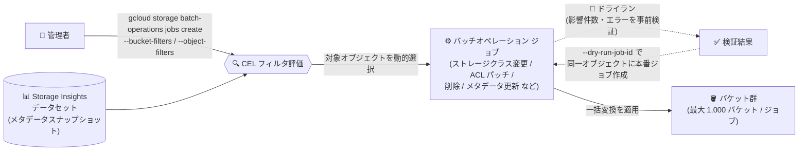

# Cloud Storage: Storage バッチオペレーションの CEL フィルタによるプロジェクト横断オブジェクト選択

**リリース日**: 2026-09-03

**サービス**: Cloud Storage

**機能**: Storage バッチオペレーション - CEL フィルタ・マルチバケット対応・ストレージクラス変更・ACL 一括更新・ドライラン強化

**ステータス**: Feature

📊 [このアップデートのインフォグラフィックを見る](https://takech9203.github.io/google-cloud-news-summary/20260903-cloud-storage-batch-operations-cel-filters.html)

## 概要

Cloud Storage の Storage バッチオペレーション (Storage batch operations) に、Common Expression Language (CEL) フィルタを使ったオブジェクトの動的選択をはじめとする大幅な機能強化が発表されました。Storage Insights データセットのメタデータフィールドに基づく CEL フィルタ (`--bucket-filters` / `--object-filters`) を指定するだけで、CSV マニフェストの手動作成や BigQuery からのエクスポートクエリなしに、プロジェクト全体からオブジェクトを動的に選択できるようになりました。

さらに、1 つのバッチジョブで最大 1,000 バケットのオブジェクトを対象にできるマルチバケット対応、ストレージクラスの一括変更、オブジェクト ACL の一括パッチ (権限の更新・削除)、複数バケットにまたがるジョブ構成を検証するドライランと、そのドライラン結果から直接ジョブを作成する機能が追加されました。

大規模なストレージ環境を運用する組織では、数千のバケットに数十億のオブジェクトが分散していることが珍しくありません。このアップデートは、そのような環境でのデータガバナンス、コスト最適化、セキュリティポスチャ管理をサーバーレスかつ宣言的に実行したい Solutions Architect やストレージ管理者にとって重要な機能強化です。

**アップデート前の課題**

- バッチオペレーションの対象オブジェクトを条件で絞り込むには、Storage Insights データセットを BigQuery でクエリし、結果を CSV にエクスポートし、マニフェストファイルとしてバケットにアップロードし直す手作業のパイプラインが必要だった
- メタデータ条件に基づくプロジェクト横断のオブジェクト選択を、ジョブ作成時に直接指定する手段がなかった
- ストレージクラスの一括変更や ACL の一括パッチをバッチオペレーションのジョブタイプとして実行できず、独自スクリプトの作成・保守が必要だった

**アップデート後の改善**

- CEL フィルタ (`--bucket-filters` / `--object-filters`) を指定するだけで、Storage Insights データセットのメタデータフィールドに基づいてオブジェクトを動的に選択できるようになり、手動の CSV マニフェスト作成や BigQuery エクスポートクエリが不要になった
- 単一のバッチジョブで最大 1,000 バケット (Storage Intelligence プランに登録されていれば任意のプロジェクトのバケット) を対象にできるようになった
- ストレージクラスの一括変更 (例: Standard → Archive) と、オブジェクト ACL の一括パッチ (`allUsers` などのエンティティに対する権限の更新・削除) がジョブタイプとしてサポートされた
- ドライランで複数バケットにまたがるジョブ構成 (影響オブジェクト数、潜在的エラーなど) を事前検証し、検証済みのドライランからそのまま本番ジョブを作成 (`--dry-run-job-id`) できるようになった

## アーキテクチャ図



Storage Insights データセットのメタデータに対して CEL フィルタを評価し、プロジェクト横断で対象オブジェクトを動的に選択してバッチジョブを実行するパイプラインです。ドライランで構成を検証してから、同じ検証済みオブジェクトセットに対して本番ジョブを作成できます。

## サービスアップデートの詳細

### 主要機能

1. **CEL フィルタによる動的オブジェクト選択**
   - Storage Insights データセットのメタデータフィールドに基づき、CEL 式でバケット (`--bucket-filters`) とオブジェクト (`--object-filters`) を絞り込み、ジョブ作成時に直接対象を選択できる
   - 例: `--object-filters="size >= 5000 && name.endsWith('.pdf')"` のように、BigQuery クエリ → CSV エクスポート → マニフェストアップロードの手順を完全に省略できる
   - フィルタ評価はデータセットのスナップショット時点でライブかつ最新のオブジェクト (`softDeleteTime` と `timeDeleted` が NULL) のみを対象とする

2. **マルチバケット対応 (最大 1,000 バケット / ジョブ)**
   - 単一のバッチジョブで、プロジェクト全体の最大 1,000 バケットにまたがるオブジェクトを処理できる
   - 各バケットが Storage Intelligence プランに登録されていれば、任意のプロジェクトのバケットを指定可能
   - マニフェスト (CSV) を使う場合も、行ごとに異なるバケットを参照するマルチバケットジョブが可能

3. **ストレージクラスの一括変更**
   - オブジェクトのストレージクラスを一括で変更し、コスト最適化を実現 (例: Standard → Archive)
   - ストレージクラス変更はオブジェクトデータの書き換え (rewrite、Class A オペレーション) を伴い、データの経過期間・ロケーション・ストレージクラスによって追加料金が発生する場合がある
   - オブジェクトバージョニングが有効なバケットでは、元のオブジェクトが非現行バージョンとして保持される

4. **オブジェクト ACL の一括パッチ**
   - オブジェクト ACL をパッチして、`allUsers` や `allAuthenticatedUsers` などのエンティティへの権限付与を追加・更新・削除できる
   - 誤って公開されたデータからの一括での公開読み取りアクセス削除など、セキュリティポスチャ管理を大規模に実行可能

5. **ドライランの強化とドライランからのジョブ作成**
   - ドライランで、複数バケットにまたがるジョブ構成を実際の変換なしにシミュレートし、影響を受けるオブジェクト数、潜在的なエラー、(プレフィックスフィルタ使用時は) 対象オブジェクトの合計サイズを事前に確認できる
   - `--dry-run-job-id` を指定することで、ドライランで検証したものと同一のオブジェクトセットに対して本番ジョブを直接作成できる

## 技術仕様

### CEL フィルタで使用できる主なフィールド

| レベル | 主なフィールド | 説明 |
|------|------|------|
| バケット | `name`, `location`, `autoclass.enabled`, `softDeletePolicy.retentionDurationSeconds`, `labels` | バケット名、ロケーション、Autoclass 有効状態、ソフト削除ポリシーなど |
| オブジェクト | `name`, `size`, `storageClass`, `contentType`, `timeCreated`, `updated`, `customTime`, `temporaryHold` | オブジェクト名、サイズ、ストレージクラス、作成・更新時刻など |
| オブジェクト (レコード型) | `contexts` (key/value), `metadata` (key/value), `securityInsights.publicAccessInsight` | オブジェクトコンテキスト、カスタムメタデータ、公開アクセス状態 (`readPublicAccess` が `PUBLIC` かなど) |

### サポートされる演算子・関数

| 演算子/関数 | CEL の使用例 | 説明 |
|------|------|------|
| `startsWith` / `endsWith` / `contains` | `name.endsWith('.pdf')` | 文字列の前方一致・後方一致・部分一致 |
| 比較演算子 | `size >= 5120`, `==`, `!=`, `<`, `<=`, `>`, `>=` | 数値・タイムスタンプ・文字列の比較 |
| `in` | `name in ['bucket-1', 'bucket-2']` | リスト内の値との一致 |
| `!` (論理 NOT) | `!contexts.exists(c, c.key == 'env')` | 条件の否定 |
| `timestamp()` | `timeCreated < timestamp("2025-01-01T00:00:00Z")` | RFC 3339 形式の日付文字列をタイムスタンプにキャスト |
| `exists` マクロ | `contexts.exists(c, c.key == 'env' && c.value == 'prod')` | 繰り返しレコード型フィールド内の条件一致 |

### 式のフォーマットルール

| 項目 | 内容 |
|------|------|
| 条件の結合 | 論理 AND (`&&`) のみサポート。論理 OR (`\|\|`) は非サポート |
| 引数の位置 | 対象メタデータフィールドは関数の左側に置く (例: `name.startsWith("live-")`) |
| フィルタ文字数 | バケットフィルタ・オブジェクトフィルタはそれぞれ最大 150 文字 |
| バケット上限 | フィルタが 1,000 バケットを超えてマッチするとジョブ作成が失敗する。`location == "us-central1"` や `name.startsWith("prod-")` などで絞り込む |

## 設定方法

### 前提条件

1. [Storage Intelligence](https://docs.cloud.google.com/storage/docs/storage-intelligence/overview) が構成されていること (Storage バッチオペレーションは Storage Intelligence サブスクリプション限定機能)
2. CEL フィルタを使用する場合、[Storage Insights データセット](https://docs.cloud.google.com/storage/docs/insights/datasets) のデータセット構成が作成済みであること
3. 対象バケットが Storage Intelligence プランに登録されていること

### 手順

#### ステップ 1: CEL フィルタ付きでドライランを作成

```bash
gcloud storage batch-operations jobs create my-dry-run-job \
  --insights-dataset-config=projects/PROJECT_ID/locations/LOCATION/datasetConfigs/DATASET_CONFIG_ID \
  --target-project=PROJECT_ID \
  --bucket-filters="location.startsWith('us')" \
  --object-filters="storageClass == 'STANDARD'" \
  --rewrite-object=storage-class=ARCHIVE \
  --dry-run
```

Storage Insights データセット構成を参照し、CEL フィルタで対象を動的に選択します。`--dry-run` により実際の変換は行わず、影響オブジェクト数や潜在的エラーを確認できます。

#### ステップ 2: 検証済みドライランから本番ジョブを作成

```bash
gcloud storage batch-operations jobs create my-job \
  --dry-run-job-id=DRY_RUN_JOB_ID \
  --rewrite-object=storage-class=ARCHIVE
```

`--dry-run-job-id` を指定すると、ドライランで検証したものと同一のオブジェクトセットに対してジョブが実行されます。この場合、`--bucket-filters` などその他のオブジェクト選択パラメータは指定できません (選択条件はドライランジョブから引き継がれます)。

#### ステップ 3: ジョブのログを確認 (任意)

```bash
gcloud logging read "resource.type=storagebatchoperations.googleapis.com/Job"
```

ジョブ作成時に `--log-actions=transform` と `--log-action-states=succeeded,failed` を指定しておくと、変換アクションの成功・失敗を Cloud Logging で追跡できます。

## メリット

### ビジネス面

- **運用工数の大幅削減**: BigQuery クエリ → CSV エクスポート → マニフェストアップロードという手動パイプラインが不要になり、独自スクリプトの開発・保守コストを削減できる
- **コスト最適化の自動化**: ストレージクラスの一括変更により、アクセス頻度の低いデータを Archive などのコールドストレージへ大規模に移行し、ストレージ費用を削減できる
- **セキュリティ・コンプライアンス対応の迅速化**: ACL の一括パッチにより、公開アクセスの削除などのセキュリティ対応を数十億オブジェクト規模で実行できる

### 技術面

- **宣言的なオブジェクト選択**: CEL 式でメタデータ条件を記述するだけで、プロジェクト横断 (最大 1,000 バケット) のオブジェクト選択が完結する
- **サーバーレス実行と自動リトライ**: インフラ管理不要で、失敗したオペレーションは自動リトライされる。複数ジョブの並行実行により、最大 10 億オブジェクトを 3 時間以内に処理するような時間制約のあるオペレーションにも対応
- **安全な事前検証**: ドライランで影響範囲 (オブジェクト数・エラー・サイズ) を確認してから、同一の検証済みオブジェクトセットに本番ジョブを実行できるため、大規模な誤設定を防止できる

## デメリット・制約事項

### 制限事項

- ジョブの最大ライフタイムは 14 日間 (14 日以内に完了しないジョブは自動キャンセル)
- 単一ジョブで指定できるオブジェクトプレフィックスは最大 1,000 個、バケットは最大 1,000 個
- バケットフィルタ・オブジェクトフィルタはそれぞれ最大 150 文字
- CEL フィルタの条件結合は論理 AND (`&&`) のみで、論理 OR (`||`) は使用できない
- 同一バケットで 10 を超える同時実行ジョブを実行すると、各ジョブのパフォーマンスが低下する
- データセットスナップショットが 2 日より古い場合、ジョブ作成は失敗する
- Requester Pays が有効なバケットではサポートされない

### 考慮すべき点

- Storage バッチオペレーションは Storage Intelligence の構成 (サブスクリプション) が前提となる (30 日間の無料トライアルあり)
- データセットフィルタでのオブジェクト選択は、選択したスナップショット時点でライブかつ最新のオブジェクトのみが対象 (ソフト削除済み・削除済みオブジェクトは含まれない)
- ストレージクラス変更はデータの rewrite (Class A オペレーション) を伴い、データの経過期間・ロケーションによって追加料金 (早期削除料金など) が発生し得る
- オブジェクト削除ジョブでは、ソフト削除を無効化しているバケットの場合、削除したオブジェクトは復元できない

## ユースケース

### ユースケース 1: プロジェクト横断でのコールドデータのアーカイブ化

**シナリオ**: 数百のバケットに分散した Standard ストレージクラスの大容量 PDF ファイルを、コスト削減のため Archive ストレージクラスへ一括移行したい。

**実装例**:
```bash
gcloud storage batch-operations jobs create archive-old-pdfs \
  --insights-dataset-config=projects/my-project/locations/us/datasetConfigs/my-dataset \
  --target-project=my-project \
  --bucket-filters="location.startsWith('us')" \
  --object-filters="size >= 5120 && name.endsWith('.pdf')" \
  --rewrite-object=storage-class=ARCHIVE \
  --dry-run
```

**効果**: BigQuery クエリや CSV マニフェストの作成なしに、条件に一致するオブジェクトをプロジェクト全体から動的に選択し、ドライランで影響範囲を確認したうえで安全にストレージクラスを移行できる。

### ユースケース 2: 公開アクセス権限の一括削除によるセキュリティ強化

**シナリオ**: 監査で `allUsers` への読み取り権限が付与されたオブジェクトが多数のバケットで発見された。プライベートであるべきデータから公開読み取りアクセスを一括で削除したい。

**効果**: ACL の一括パッチにより、`allUsers` / `allAuthenticatedUsers` への権限付与を数百万オブジェクト規模で削除できる。Storage Insights データセットの `securityInsights.publicAccessInsight.readPublicAccess == 'PUBLIC'` のようなフィールドをフィルタに使い、公開状態のオブジェクトだけを対象にできる。

### ユースケース 3: コンプライアンス対応のデータワイプアウト

**シナリオ**: データ保持規制に基づき、特定の日付より前に作成された一時ファイルをプロジェクト全体から削除する必要がある。

**効果**: `timeCreated < timestamp("2025-01-01T00:00:00Z")` のような CEL フィルタで対象を選択し、ドライランで削除対象件数を検証してから削除ジョブを実行することで、誤削除リスクを抑えつつワイプアウトポリシーを満たせる。

## 料金

Storage バッチオペレーションは Storage Intelligence サブスクリプション限定機能であり、Storage Intelligence の構成が必要です (組織・フォルダ・プロジェクトごとに 1 回、30 日間の無料トライアルを利用可能)。

- ジョブおよびドライランの料金は [Cloud Storage の料金](https://docs.cloud.google.com/storage/pricing) に基づき、実行されるオペレーション量に応じて課金される
- ドライランはオペレーション料金なしで構成を検証できるが、オブジェクトのリスティング費用が発生する場合がある
- ストレージクラス変更は rewrite (Class A オペレーション) を伴い、データの経過期間・ロケーション・ストレージクラスに応じて追加料金が発生する場合がある
- Storage Intelligence の料金詳細は [Storage Intelligence の料金ページ](https://docs.cloud.google.com/storage/pricing#storage-intelligence) を参照

## 利用可能リージョン

リージョンごとの提供状況は公式ドキュメントを参照してください。CEL フィルタでは `--target-locations` パラメータで対象の Cloud Storage ロケーション (例: `us`, `us-central1`, `us-east4`) を絞り込むことができます。

## 関連サービス・機能

- **Storage Insights データセット**: CEL フィルタの評価基盤。バケット・オブジェクトのメタデータとアクティビティデータのクエリ可能なインデックスを BigQuery リンクデータセットとして提供する
- **Storage Intelligence**: Storage バッチオペレーション、Storage Insights データセット、バケット再配置などを含むサブスクリプション。バッチオペレーションの利用に必須
- **BigQuery**: 従来はデータセットのクエリとマニフェスト作成に必要だったが、CEL フィルタにより直接選択が可能になった。詳細な分析用途では引き続き利用可能
- **Cloud Logging**: `--log-actions` / `--log-action-states` によるジョブの変換アクション (成功・失敗) の追跡に使用
- **オブジェクトライフサイクル管理**: 時間ベースの自動的なストレージクラス移行・削除を行う補完機能。バッチオペレーションはメタデータ条件に基づくオンデマンドの一括実行に適する

## 参考リンク

- 📊 [インフォグラフィック](https://takech9203.github.io/google-cloud-news-summary/20260903-cloud-storage-batch-operations-cel-filters.html)
- [公式リリースノート](https://docs.cloud.google.com/release-notes#September_03_2026)
- [Storage バッチオペレーションの概要](https://docs.cloud.google.com/storage/docs/batch-operations/overview)
- [バッチオペレーションジョブの作成と管理](https://docs.cloud.google.com/storage/docs/batch-operations/create-manage-batch-operation-jobs)
- [CEL フィルタリファレンス](https://docs.cloud.google.com/storage/docs/batch-operations/cel-filters-reference)
- [Storage Insights データセット](https://docs.cloud.google.com/storage/docs/insights/datasets)
- [gcloud storage batch-operations jobs create リファレンス](https://docs.cloud.google.com/sdk/gcloud/reference/storage/batch-operations/jobs/create)
- [料金ページ](https://docs.cloud.google.com/storage/pricing)

## まとめ

Storage バッチオペレーションの CEL フィルタ対応により、BigQuery クエリと CSV マニフェストを介した手動パイプラインなしで、プロジェクト横断 (最大 1,000 バケット) のオブジェクトを宣言的に選択・変換できるようになりました。ストレージクラスの一括変更と ACL の一括パッチの追加により、コスト最適化とセキュリティポスチャ管理の主要ユースケースがバッチオペレーションで完結します。大規模な Cloud Storage 環境を運用している場合は、Storage Intelligence の 30 日間トライアルを活用し、ドライランで影響範囲を検証しながら既存の運用スクリプトからの移行を検討することを推奨します。

---

**タグ**: #CloudStorage #StorageBatchOperations #CEL #StorageInsights #StorageIntelligence #コスト最適化 #セキュリティ #データガバナンス
