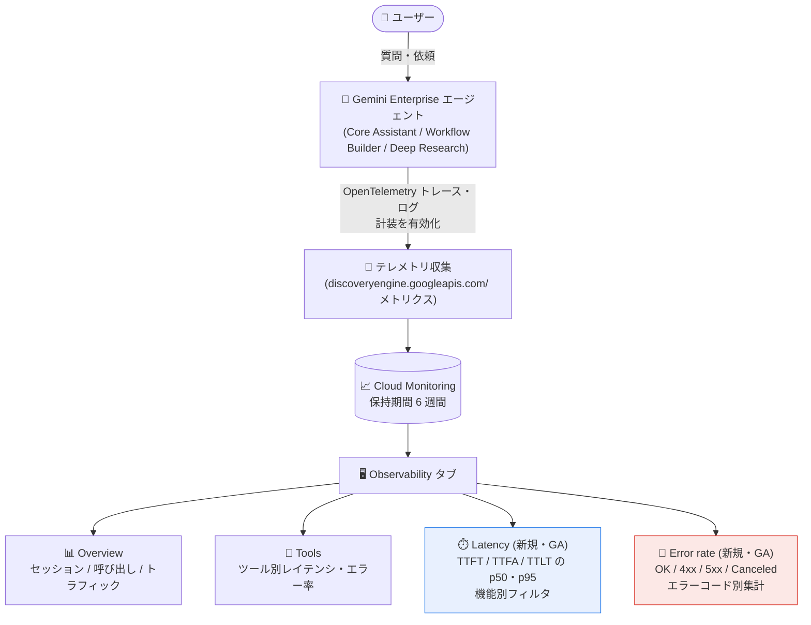

# Gemini Enterprise: エージェントのレイテンシ・エラー率ビュー (Observability タブ)

**リリース日**: 2026-09-03

**サービス**: Gemini Enterprise

**機能**: エージェント向けレイテンシ・エラー率ビュー (Latency and error rate views for agents)

**ステータス**: GA (一般提供)

📊 [このアップデートのインフォグラフィックを見る](https://takech9203.github.io/google-cloud-news-summary/20260903-gemini-enterprise-agent-observability-views.html)

## 概要

Gemini Enterprise のエージェント向け Observability タブに、**Latency (レイテンシ)** と **Error rate (エラー率)** の 2 つの新しいビューが追加され、一般提供 (GA) となりました。これにより、Observability タブは既存の Overview、Tools と合わせて 4 つのビュー (Overview / Tools / Latency / Error rate) でエージェントの運用テレメトリを提供するようになります。

Latency ビューでは、エージェントの応答時間を Time to First Token (TTFT)、Time to First Answer (TTFA)、Time to Last Token (TTLT) の 3 つの指標について、p50 (中央値) と p95 (95 パーセンタイル) で確認できます。TTFT はモデルの思考 (thinking) を含む最初のトークンまでの時間、TTFA は回答本文の最初のトークンまでの時間を計測する点が特徴です。さらに、Web 検索、メディア生成、パラメトリック (テキストのみ) といったエージェント機能 (feature) 別にレイテンシを比較できます。

Error rate ビューでは、リクエスト量とエラー率をレスポンスクラス (OK、クライアントエラー、サーバーエラー、キャンセル) 別にグルーピングして追跡し、関連するクライアント/サーバーエラーコードを表示します。エージェントを組織展開する管理者や、Workflow Builder / Deep Research エージェントを運用する開発者が、コンソール上でエージェントの健全性とパフォーマンスを直接把握できるようになります。

**アップデート前の課題**

- Observability タブでは Overview (セッション数、呼び出し回数など) と Tools (ツール別の利用状況) が中心で、応答レイテンシの内訳 (思考開始・回答開始・回答完了) をパーセンタイル別に分析する専用ビューがなかった
- Web 検索やメディア生成など、遅い機能が全体のレイテンシ統計を歪めても、機能別に切り分けて特定する手段がコンソール上になかった
- エラーの傾向を把握するには Metrics Explorer などでメトリクスを個別に照会する必要があり、レスポンスクラスやエラーコード別の集計をすぐに確認できなかった

**アップデート後の改善**

- TTFT / TTFA / TTLT の 3 指標を p50 / p95 のサマリーカードと時系列チャートで確認でき、「思考が始まるまで」「ユーザーが読む回答が流れ始めるまで」「回答が完了するまで」を分離して分析できるようになった
- Filter by feature により、Parametric、Media generation、Web search only、Uploaded file analysis、Connector、Canvas、Skill などの機能別にレイテンシを比較でき、遅いインタラクション種別を特定できるようになった
- リクエストの結果を OK (2xx)、Client errors (4xx)、Server errors (5xx)、Canceled のレスポンスクラス別に追跡し、`INVALID_ARGUMENT` や `INTERNAL` などの gRPC 正規エラーコード単位でスパイクの原因を特定できるようになった

## アーキテクチャ図



エージェントとのやり取りが OpenTelemetry ベースで計装され、Cloud Monitoring に蓄積されたメトリクスを Observability タブの 4 つのビューで可視化します。今回追加されたのは Latency と Error rate の 2 ビューです。

## サービスアップデートの詳細

### 主要機能

1. **Latency ビュー: 3 つのレイテンシ指標の p50 / p95 表示**
   - **Time to First Token (TTFT)**: リクエスト受信から最初のトークンをストリーミングするまでのレイテンシ。モデルの思考 (thinking) プロセスのトークンも含む
   - **Time to First Answer (TTFA)**: リクエスト受信から回答本文の最初のトークン (思考の一部ではない最初のトークン) までのレイテンシ。回答開始後にエージェントがツールを呼び出すと計測がリスタートするため、途中経過のナレーションではなく「ユーザーが読む回答」の開始時点を反映する
   - **Time to Last Token (TTLT)**: リクエスト受信から最後のトークン (レスポンス完了) までのレイテンシ
   - 各指標は選択した時間範囲の p50 / p95 サマリーカードと、トレンドを示す時系列チャートで表示される

2. **機能 (feature) 別のレイテンシフィルタと比較テーブル**
   - 「Filter by feature」でインタラクション種別ごとにレイテンシを絞り込み可能。遅い 1 つの機能が全体のレイテンシを歪めることを防げる
   - Features テレメトリテーブルでは、機能ごとに Share of traffic (トラフィック比率) と TTFT / TTFA / TTLT の p50・p95 を一覧比較できる
   - フィルタ可能な機能: Parametric (ツールなしのテキスト出力のみ、翻訳タスクなど)、Media generation (画像・動画生成)、Web search only、Uploaded file analysis (アップロードファイル分析)、Connector (社内・サードパーティコネクタへのクエリ)、Canvas、Skill、Other (複数機能にまたがる、または未分類のターン)

3. **Error rate ビュー: レスポンスクラス別のリクエスト解決状況**
   - **Request volume by response class**: レスポンスクラス別に積み上げた時系列のインバウンドリクエスト数
   - **Error rate by response class**: レスポンスクラス別の失敗リクエスト率の推移
   - **Client error codes (4xx) / Server error codes (5xx)**: `INVALID_ARGUMENT` や `INTERNAL` などの gRPC 正規レスポンスコード別の推移。どのエラーがスパイクの原因かを特定できる
   - **Totals**: 選択した時間範囲における各結果のリクエスト数と全体比率、およびクライアント/サーバーエラーコードをランキングする個別テーブル

## 技術仕様

### Observability タブの構成

| 項目 | 詳細 |
|------|------|
| 対象エージェント | Core Assistant エージェント、Workflow Builder エージェント、Deep Research エージェント |
| ビュー構成 | Overview / Tools / Latency (新規) / Error rate (新規) の 4 ビュー |
| レイテンシ指標 | TTFT、TTFA、TTLT (各 p50 / p95) |
| レスポンスクラス | OK (2xx)、Client errors (4xx)、Server errors (5xx)、Canceled |
| メトリクスの種類 | エージェントスコープメトリクス (Gemini Enterprise Agent リソースタイプ)、アプリスコープメトリクス (Gemini Enterprise Engine リソースタイプ) |
| メトリクスの保存先 | Cloud Monitoring (`discoveryengine.googleapis.com/` プレフィックス) |
| データ保持期間 | デフォルト 6 週間 (Cloud Monitoring の「その他の Google Cloud メトリクス」ティアに準拠) |

### 必要なロール・設定

| 要件 | 詳細 |
|------|------|
| ロール | Gemini Enterprise Admin ロール、または Google Cloud コンソールの Gemini Enterprise User ロール |
| Metrics Explorer 利用時 | Monitoring Viewer ロール (`roles/monitoring.viewer`) |
| 前提設定 | 「Enable instrumentation of OpenTelemetry traces and logs」設定の有効化 (エージェントスコープメトリクスに必須。アプリスコープメトリクスは設定なしでも収集される) |

## 設定方法

### 前提条件

1. Gemini Enterprise Admin ロールまたは Google Cloud コンソールの Gemini Enterprise User ロールを保有していること
2. 既存の Gemini Enterprise Web アプリがあること
3. OpenTelemetry トレース・ログの計装設定が有効であること (Core Assistant はアプリレベル設定、Workflow Builder / Deep Research エージェントは各エージェントの Configuration タブで有効化)

### 手順

#### ステップ 1: Observability 設定の有効化

Google Cloud コンソールで Gemini Enterprise ページに移動し、対象アプリを開きます。

- **Core Assistant エージェント**: [Configurations] → [Observability] タブで「Enable instrumentation of OpenTelemetry traces and logs」を有効化
- **その他のエージェント (Workflow Builder / Deep Research)**: [Agents] → 対象エージェント → [Configuration] タブで有効化

REST API で既存アプリに対して有効化する場合の例:

```bash
curl -X PATCH -H "Authorization: Bearer $(gcloud auth print-access-token)" \
  -H "Content-Type: application/json" \
  -H "X-Goog-User-Project: PROJECT_ID" \
  "https://ENDPOINT_LOCATION-discoveryengine.googleapis.com/v1alpha/projects/PROJECT_ID/locations/LOCATION/collections/default_collection/engines/APP_ID?updateMask=observabilityConfig" \
  -d '{
    "observabilityConfig": {
      "observabilityEnabled": true
    }
  }'
```

#### ステップ 2: Latency / Error rate ビューへのアクセス

1. Google Cloud コンソールで対象アプリに移動し、[Agents] をクリック
2. 確認したいエージェントを選択し、[Observability] タブをクリック
3. [Latency] ビューまたは [Error rate] ビューを選択

#### ステップ 3: 機能別レイテンシのフィルタリング

1. Observability タブの [Latency] ビューを開く
2. [Filter by feature] をクリック
3. 確認したい機能 (Web search only、Media generation など) を選択

サマリーカードと時系列チャートが、選択した機能のターンのみに絞り込まれます。全機能を一括比較するには Features テレメトリテーブルを使用します。

## メリット

### ビジネス面

- **ユーザー体験の定量把握**: TTFA により「ユーザーが実際に回答を読み始められるまでの時間」を計測でき、思考時間込みの TTFT と区別してエンドユーザー体感の品質を管理できる
- **組織展開時の信頼性向上**: エージェントを全社展開する際、エラー率とレイテンシの傾向をコンソールで直接監視でき、問題の早期発見と説明責任の遂行が容易になる
- **追加ツール不要**: 外部 APM やカスタムダッシュボードを構築しなくても、Gemini Enterprise のコンソール内で運用テレメトリを確認できる

### 技術面

- **p50 / p95 によるテール レイテンシ分析**: 平均値では見えない遅いリクエスト (p95) の傾向を把握し、パフォーマンス劣化の兆候を検知できる
- **機能別の切り分け**: メディア生成のような本質的に遅い機能を分離して分析でき、1 つの遅い機能が全体統計を歪めるのを防げる
- **エラーコードレベルの根本原因分析**: `INVALID_ARGUMENT` (クライアント側の問題) と `INTERNAL` (サーバー側の問題) を区別でき、エラースパイク発生時の切り分けが迅速になる
- **Cloud Monitoring との統合**: メトリクスは Cloud Monitoring に保存されるため、カスタムダッシュボードの作成やしきい値アラートの設定に発展させられる

## デメリット・制約事項

### 制限事項

- Observability タブは Core Assistant エージェント、Workflow Builder エージェント、Deep Research エージェントでのみ利用可能
- エージェントスコープメトリクスの収集には「Enable instrumentation of OpenTelemetry traces and logs」設定の有効化が必要 (有効化前のデータは収集されない)
- メトリクスの保持期間はデフォルト 6 週間 (Cloud Monitoring の保持ポリシーに準拠)。それより古いデータは自動削除される

### 考慮すべき点

- プロンプト入力・レスポンス出力のログ記録 (「Enable logging of prompt inputs and response outputs」) を併せて有効化する場合、PII を含む機密データがログに記録されるため、ログへのアクセスを認可された担当者に限定する必要がある
- 「Other」機能カテゴリには複数機能にまたがるターンや未分類のターンが含まれるため、機能別分析の際は解釈に注意が必要
- TTFA は回答開始後にツール呼び出しが発生すると計測がリスタートする仕様のため、ツールを多用するエージェントでは TTFA の解釈に留意する

## ユースケース

### ユースケース 1: 全社展開したアシスタントの応答性能の継続監視

**シナリオ**: Gemini Enterprise を全社導入した企業の管理者が、Core Assistant の応答が「遅くなった」というユーザーからの声を受け、実態を確認したい。

**実装例**:
1. アプリの Observability 設定で OpenTelemetry 計装を有効化
2. [Agents] → Core Assistant → [Observability] → [Latency] ビューを開く
3. TTFA の p95 の時系列チャートで劣化開始時期を特定
4. [Filter by feature] で Web search only / Media generation などを切り替え、劣化している機能を特定

**効果**: 体感の遅さを p95 TTFA という定量指標で裏付け、遅延の原因となっている機能種別を特定して改善アクション (利用ガイダンスやエスカレーション) につなげられる。

### ユースケース 2: Workflow Builder エージェントのエラースパイクの切り分け

**シナリオ**: 業務部門が作成した Workflow Builder エージェントで、特定の時間帯にエラーが多発しているとの報告があり、クライアント側とサーバー側のどちらに問題があるかを切り分けたい。

**効果**: Error rate ビューの「Error rate by response class」でスパイクが 4xx か 5xx かを即座に判別できる。`INVALID_ARGUMENT` が支配的であればリクエスト内容や設定の問題、`INTERNAL` が支配的であればサービス側の問題としてサポートへのエスカレーション判断ができる。エラーコードのランキングテーブルにより、最も影響の大きいエラーから優先的に対処できる。

### ユースケース 3: Cloud Monitoring アラートによるプロアクティブな運用

**シナリオ**: SRE チームが、エージェントのエラー率やレイテンシがしきい値を超えた際に自動通知を受けたい。

**効果**: メトリクスは `discoveryengine.googleapis.com/` プレフィックスで Cloud Monitoring に保存されるため、メトリクスしきい値アラートポリシーを作成し、ダッシュボードでの目視監視に頼らないプロアクティブな運用体制を構築できる。

## 料金

Observability の Latency / Error rate ビュー自体の追加料金に関する記載はリリースノートにはありません。メトリクスは Cloud Monitoring に保存され、Gemini Enterprise の利用にはエディション (Business / Standard / Plus / Pay-as-you-go / Frontline) に応じたサブスクリプションが必要です。

詳細は以下を参照してください。

- [Gemini Enterprise エディション比較](https://docs.cloud.google.com/gemini/enterprise/docs/editions)
- [Gemini Enterprise の料金](https://cloud.google.com/gemini-enterprise/pricing)

## 利用可能リージョン

リリースノートにリージョン固有の記載はありません。Gemini Enterprise アプリはマルチリージョン (`global` / `us` / `eu`) で構成されます。詳細は [Gemini Enterprise のロケーション](https://docs.cloud.google.com/gemini/enterprise/docs/locations) を参照してください。

## 関連サービス・機能

- **Cloud Monitoring**: メトリクスの保存先。Metrics Explorer での照会、カスタムダッシュボード作成、しきい値アラート設定が可能
- **Cloud Logging / Cloud Trace**: OpenTelemetry 計装を有効化すると、トレース、スパン、スパンログを Trace Explorer / Cloud Logging で確認できる
- **Workflow Builder (旧 Agent Designer)**: 同日に GA となったマルチステップワークフロー構築機能。作成したエージェントは本 Observability タブの監視対象
- **Deep Research エージェント**: Google 製の調査エージェント。Observability タブでの監視対象に含まれる
- **OpenTelemetry**: エージェントのテレメトリ計装の基盤。生成 AI 向けセマンティック規約に準拠

## 参考リンク

- 📊 [インフォグラフィック](https://takech9203.github.io/google-cloud-news-summary/20260903-gemini-enterprise-agent-observability-views.html)
- [公式リリースノート](https://docs.cloud.google.com/release-notes#September_03_2026)
- [ドキュメント: Access metrics](https://docs.cloud.google.com/gemini/enterprise/docs/access-metrics)
- [ドキュメント: Manage observability settings](https://docs.cloud.google.com/gemini/enterprise/docs/manage-observability-settings)
- [ドキュメント: Gemini Enterprise エディション](https://docs.cloud.google.com/gemini/enterprise/docs/editions)

## まとめ

Gemini Enterprise の Observability タブに Latency / Error rate ビューが GA で追加され、TTFT / TTFA / TTLT の p50・p95 分析、機能別レイテンシ比較、レスポンスクラス・エラーコード別のエラー分析がコンソール上で完結するようになりました。エージェントを本番運用している組織は、まず OpenTelemetry 計装設定を有効化してメトリクス収集を開始し、p95 TTFA とエラー率をベースラインとして把握した上で、Cloud Monitoring のアラートポリシーと組み合わせた継続的な監視体制の構築を推奨します。

---

**タグ**: #GeminiEnterprise #Observability #Latency #ErrorRate #CloudMonitoring #OpenTelemetry #AIAgent #GA
