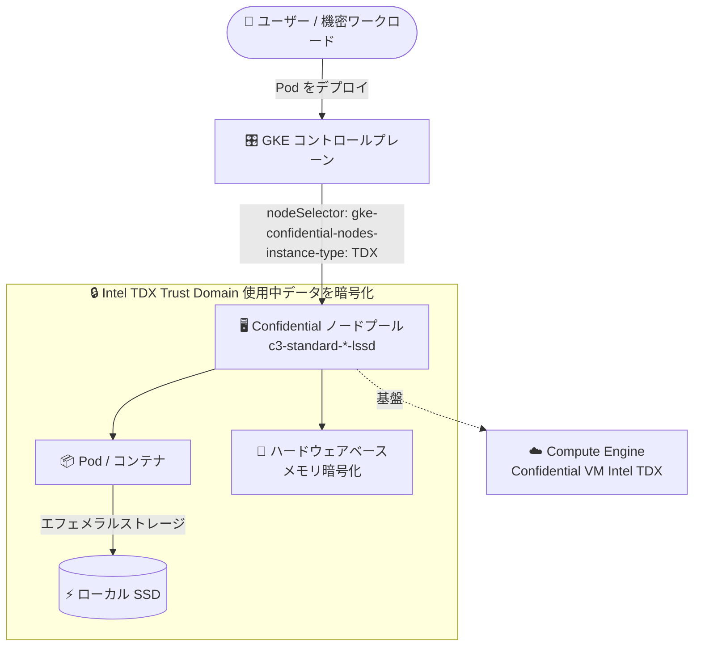

# Google Kubernetes Engine (GKE): c3-standard-*-lssd マシンタイプによる Confidential GKE Nodes (Intel TDX) が GA

**リリース日**: 2026-09-03

**サービス**: Google Kubernetes Engine (GKE)

**機能**: c3-standard-*-lssd マシンタイプを Intel TDX の Confidential GKE Nodes として使用する機能の一般提供 (GA)

**ステータス**: GA (一般提供)

📊 [このアップデートのインフォグラフィックを見る](https://takech9203.github.io/google-cloud-news-summary/20260903-gke-confidential-nodes-c3-lssd-intel-tdx-ga.html)

## 概要

GKE において、ローカル SSD を搭載した `c3-standard-*-lssd` マシンタイプを Intel TDX (Trust Domain Extensions) の Confidential GKE Nodes として使用する機能が一般提供 (GA) になりました。Confidential GKE Nodes は Compute Engine の Confidential VM を基盤とし、ハードウェアベースのメモリ暗号化によって「使用中のデータ (data in-use)」を保護します。Intel TDX は VM 内に隔離された Trust Domain (TD) を作成し、ハードウェア拡張機能でメモリの管理と暗号化を行う Confidential Computing 技術です。

今回の GA により、機密性の高いワークロードを TEE (Trusted Execution Environment) 内で実行しつつ、ローカル SSD による高速なエフェメラルストレージを利用できるようになりました。金融、医療、公共など、規制要件によりメモリ上のデータ保護が求められ、かつ高い I/O 性能を必要とするコンテナワークロードを運用する組織が主な対象です。

なお、Compute Engine 側の対応するアップデート (`c3-standard-*-lssd` での Confidential VM Intel TDX の GA) は 2026 年 9 月 2 日に発表されており、本レポートは GKE の観点にフォーカスしています。

**アップデート前の課題**

- Intel TDX の Confidential GKE Nodes は `c3-standard-*` (ローカル SSD なし) などのマシンタイプに限られており、ローカル SSD 搭載マシンタイプと組み合わせることができなかった
- そのため、機密コンピューティングの保護と、ローカル SSD による低レイテンシ・高スループットなエフェメラルストレージを両立するノード構成を GKE で選択できなかった
- I/O 集約型の機密ワークロードは、性能を犠牲にして Confidential Nodes を使うか、機密コンピューティングを諦めて lssd マシンタイプを使うかの二者択一だった

**アップデート後の改善**

- `c3-standard-*-lssd` マシンタイプを Intel TDX の Confidential GKE Nodes として GA サポートで利用可能になった
- メモリ暗号化 (TDX) とローカル SSD のエフェメラルストレージを組み合わせたノードプールを、本番ワークロード向けの SLA で構成できるようになった
- クラスタレベル・ノードプールレベル・ワークロードレベル (ComputeClass) のいずれの有効化方法でも Intel TDX を選択できる

## アーキテクチャ図



GKE の Confidential ノードプールに `c3-standard-*-lssd` マシンタイプを指定すると、Intel TDX の Trust Domain 内でメモリが暗号化された状態のまま、ローカル SSD をエフェメラルストレージとして利用する Pod を実行できます。

## サービスアップデートの詳細

### 主要機能

1. **Intel TDX + ローカル SSD 構成の GA サポート**
   - `c3-standard-*-lssd` マシンタイプ (Intel Sapphire Rapids) を Confidential GKE Nodes として使用可能
   - Intel TDX がハードウェア拡張機能により Trust Domain を作成し、メモリの管理と暗号化を実施
   - DRAM のオフライン解析や、メモリ内容のキャプチャ・改ざん・再配置などの物理アクセス攻撃への防御を強化

2. **柔軟な有効化レベル**
   - **クラスタレベル**: クラスタ作成時に `--confidential-node-type=tdx` を指定 (Autopilot / Standard、設定は取り消し不可)
   - **ノードプールレベル**: Standard クラスタでノードプール作成時に指定 (クラスタレベルで無効の場合のみ)
   - **ワークロードレベル**: ComputeClass で構成し、ワークロードから選択

3. **ワークロードのスケジューリング制御**
   - ノードラベル `cloud.google.com/gke-confidential-nodes-instance-type: "TDX"` を nodeSelector や nodeAffinity で指定し、TDX ノードのみで Pod を実行するよう宣言可能

## 技術仕様

### 対応構成

| 項目 | 詳細 |
|------|------|
| マシンタイプ | `c3-standard-*-lssd` (Intel Sapphire Rapids) |
| Confidential Computing 技術 | Intel TDX |
| ライブマイグレーション | 非サポート |
| 対応 OS イメージ (Compute Engine 側) | `cos-117-lts`、`cos-121-lts` |
| ローカル SSD の利用形態 (GKE) | ローカル SSD 上のエフェメラルストレージのみサポート |
| Windows ノード | 非サポート |

### GKE バージョン要件 (Intel TDX)

| クラスタ / ノード OS | 必要バージョン |
|------|------|
| Autopilot クラスタ | 1.35.2-gke.1485000 以降 |
| Standard クラスタ (Container-Optimized OS) | 1.32.2-gke.1297000 以降 |
| Standard クラスタ (Ubuntu) | 1.33.5-gke.1697000 以降、または 1.34.1-gke.2909000 以降 |
| ワークロードレベルの有効化 | 1.33.3-gke.1392000 以降 |

## 設定方法

### 前提条件

1. Google Kubernetes Engine API が有効化されていること
2. クラスタが Intel TDX に必要な GKE バージョン要件を満たしていること
3. ノードのロケーションが `c3-standard-*-lssd` × Intel TDX をサポートするゾーンであること

### 手順

#### ステップ 1: Confidential ノードプールの作成 (Standard クラスタ)

```bash
gcloud container node-pools create NODE_POOL_NAME \
  --location=LOCATION \
  --cluster=CLUSTER_NAME \
  --machine-type=c3-standard-8-lssd \
  --node-locations=ZONE1,ZONE2 \
  --confidential-node-type=tdx
```

`--confidential-node-type=tdx` を指定して、Intel TDX を使用する Confidential ノードプールを作成します。ゾーンはサポート対象ゾーンから選択します。

#### ステップ 2: ワークロードを TDX ノードに配置

```yaml
apiVersion: v1
kind: Pod
spec:
  nodeSelector:
    cloud.google.com/gke-confidential-nodes-instance-type: "TDX"
  containers:
  - name: confidential-app
    image: us-docker.pkg.dev/google-samples/containers/gke/hello-app:1.0
```

nodeSelector で `TDX` を指定することで、Pod が Intel TDX の Confidential ノードでのみ実行されるように宣言できます。

#### (参考) クラスタレベルで有効化する場合

```bash
gcloud container clusters create-auto CLUSTER_NAME \
  --location=CONTROL_PLANE_LOCATION \
  --confidential-node-type=tdx
```

Autopilot クラスタで TDX を有効化した場合、デフォルトのマシンシリーズは C3 になります。クラスタレベルの設定は取り消し不可のため注意してください。

## メリット

### ビジネス面

- **規制要件への対応**: メモリ上のデータ (使用中データ) の暗号化が GA サポートで利用できるため、金融・医療・公共などのコンプライアンス要件を満たしやすくなる
- **性能とセキュリティの両立**: これまで二者択一だった「機密コンピューティング」と「ローカル SSD の高速 I/O」を単一のノード構成で実現できる

### 技術面

- **ハードウェアベースの隔離**: 暗号鍵は専用ハードウェア内で生成・保持され、ハイパーバイザからアクセス不可。物理メモリへの攻撃 (DRAM 解析、メモリ内容の改ざん・再配置など) への防御を強化
- **アプリケーション変更不要**: クラスタまたはノードプールで有効化するだけで、ワークロードのマニフェストを変更せずに保護を適用可能 (クラスタレベル有効化時)
- **アテステーション**: VM の ID と状態を検証し、主要コンポーネントが改ざんされていないことを確認可能

## デメリット・制約事項

### 制限事項

- Intel TDX の Confidential VM はライブマイグレーションをサポートしない。ホストメンテナンス発生時はノードが NotReady 状態になり、メンテナンスが 5 分を超えると GKE は Pod を他ノードに再作成しようとする
- GKE の Confidential GKE Nodes では、ローカル SSD は「エフェメラルストレージ」としての利用のみサポート (ローカル SSD の一般的な利用は非サポート)
- ノード自動プロビジョニング (node auto-provisioning) はノードプールレベルでは AMD SEV / SEV-SNP のみ対応。TDX を使う場合はワークロードレベル (ComputeClass) で構成する
- Intel TDX の Confidential VM は予約 (reservations) をサポートしない
- ソールテナントノード、Windows ノードは非サポート
- Persistent Disk は NVMe インターフェースの Balanced Persistent Disk のみサポート

### 考慮すべき点

- メモリサイズに比例して VM のシャットダウンに時間がかかる。メモリ量が大きいノードでは起動時間も長くなる
- セキュリティ制約により CPUID 命令が返す CPU アーキテクチャ情報が制限され、CPUID 値に依存するワークロードの性能に影響する可能性がある
- 非 Confidential ノードと比較して、ネットワーク帯域幅の低下やレイテンシの増加が発生する場合がある
- クラスタレベルでの有効化は取り消せないため、要件を確認してから設定する

## 利用可能リージョン

`c3-standard-*-lssd` マシンタイプで Intel TDX がサポートされるゾーンは以下のとおりです。

| リージョン | ゾーン |
|-----------|--------|
| asia-southeast1 | a, b |
| europe-west4 | a, b |
| southamerica-east1 | a |
| us-central1 | a, b |
| us-east4 | b, c |
| us-east5 | b, c |
| us-west1 | b |

最新のサポート状況は [Supported configurations](https://docs.cloud.google.com/confidential-computing/confidential-vm/docs/supported-configurations#supported-zones) を参照してください。

## 関連サービス・機能

- **Compute Engine Confidential VM**: Confidential GKE Nodes の基盤。今回の GKE GA に対応する Compute Engine 側の GA (Confidential VM Intel TDX on c3-standard-*-lssd) は 2026 年 9 月 2 日に発表済み
- **ComputeClass (カスタムコンピュートクラス)**: ワークロードレベルで Confidential GKE Nodes (TDX を含む) を構成する仕組み
- **Confidential mode for Hyperdisk Balanced**: ストレージ側の機密モード。ただし AMD SEV の Confidential GKE Nodes のみ対応で、TDX ノードでは利用不可
- **アテステーション (Attestation)**: Confidential VM の ID と状態を検証し、コンポーネントの改ざんがないことを確認する機能

## 参考リンク

- 📊 [インフォグラフィック](https://takech9203.github.io/google-cloud-news-summary/20260903-gke-confidential-nodes-c3-lssd-intel-tdx-ga.html)
- [公式リリースノート](https://docs.cloud.google.com/release-notes#September_03_2026)
- [Encrypt workload data in-use with Confidential GKE Nodes](https://docs.cloud.google.com/kubernetes-engine/docs/how-to/confidential-gke-nodes)
- [Confidential VM overview](https://docs.cloud.google.com/confidential-computing/confidential-vm/docs/confidential-vm-overview)
- [Supported configurations (Machine types, CPUs, and zones)](https://docs.cloud.google.com/confidential-computing/confidential-vm/docs/supported-configurations)
- [Confidential VM の料金ページ](https://docs.cloud.google.com/confidential-computing/confidential-vm/pricing)

## まとめ

ローカル SSD 搭載の `c3-standard-*-lssd` マシンタイプが Intel TDX の Confidential GKE Nodes として GA になり、高速なエフェメラルストレージと使用中データの暗号化を両立するコンテナ基盤を本番環境で構築できるようになりました。機密性の高い I/O 集約型ワークロードを GKE で運用している場合は、GKE バージョン要件とサポートゾーンを確認のうえ、TDX ノードプールへの移行を検討してください。TDX はライブマイグレーション非対応のため、ホストメンテナンス時の中断対策 (PodDisruptionBudget や複数ゾーン構成) も併せて設計することを推奨します。

---

**タグ**: GKE, Confidential Computing, Intel TDX, Confidential VM, C3, ローカル SSD, セキュリティ, GA
