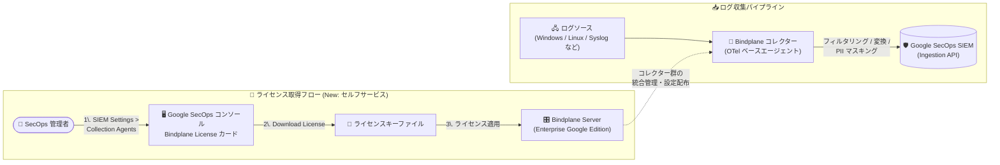

# Google SecOps (SIEM): Bindplane Enterprise ライセンスのセルフサービスダウンロード

**リリース日**: 2026-09-03

**サービス**: Google SecOps (Google Security Operations / SIEM)

**機能**: Self-service Bindplane Enterprise license download

**ステータス**: Preview (US および EU リージョンのテナント)

📊 [このアップデートのインフォグラフィックを見る](https://takech9203.github.io/google-cloud-news-summary/20260903-google-secops-bindplane-license-self-service.html)

## 概要

Google Security Operations (Google SecOps) において、**Bindplane Enterprise (Google Edition) のライセンスキーをプラットフォームコンソールから直接ダウンロードできるセルフサービス機能**が Preview として提供開始されました。本機能は、US および EU リージョンの Google SecOps テナントで利用可能です。

対象となるのは **Google SecOps Enterprise Plus** および **Google Unified Security (GUS)** の顧客です。これらの顧客は、Google SecOps コンソールの **[SIEM Settings] > [Collection Agents]** から、Bindplane Enterprise (Google Edition) のライセンスキーファイルを直接ダウンロードできるようになりました。

Bindplane は、あらゆるソースからログを収集・加工して Google SecOps に転送できるテレメトリパイプラインであり、OpenTelemetry (OTel) Collector ベースの Bindplane コレクター (エージェント) と、コレクター群を統合管理する Bindplane Server で構成されます。Bindplane Enterprise (Google Edition) は大規模デプロイメント向けに推奨されるエディションで、Enterprise Plus / GUS 顧客には追加費用なしで含まれています。

**アップデート前の課題**

- Bindplane Enterprise (Google Edition) のライセンスキーを入手するには、Google アカウントチームへの依頼が必要だった
- ライセンス入手に人手を介したやり取りが発生し、Bindplane Server のデプロイやライセンス適用の開始までにリードタイムがかかっていた

**アップデート後の改善**

- Enterprise Plus / GUS 顧客は、Google SecOps コンソールの [SIEM Settings] > [Collection Agents] にある Bindplane License カードから、ライセンスキーファイルをセルフサービスで即時ダウンロードできるようになった
- ダウンロードしたライセンスキーをそのまま Bindplane Server インストールに適用でき、大規模ログ収集基盤の構築をスピーディに開始できる
- なお、コンソールにセルフサービスダウンロードのオプションが表示されない場合は、従来どおり Google アカウントチームに依頼してライセンスキーをリクエストする

## アーキテクチャ図



管理者はコンソールからライセンスキーをセルフサービスで取得して Bindplane Server に適用し (上段)、Bindplane Server が管理するコレクター群が各種ログソースから Google SecOps SIEM へログを収集・転送します (下段)。

## サービスアップデートの詳細

### 主要機能

1. **ライセンスキーのセルフサービスダウンロード**
   - Google SecOps コンソールの [SIEM Settings] > [Collection Agents] に Bindplane License カードが追加された
   - [Download License] をクリックするだけでライセンスキーファイルを保存できる
   - 対象は Google SecOps Enterprise Plus および Google Unified Security (GUS) の顧客

2. **Bindplane Server へのライセンス適用**
   - ダウンロードしたライセンスキーを Bindplane Server のインストールに適用して Enterprise 機能を有効化する
   - 適用手順は Bindplane 公式ドキュメントの「Apply a Bindplane license」を参照

3. **Preview 提供 (US / EU リージョン)**
   - 現時点では US および EU リージョンの Google SecOps テナントを対象とした Preview 提供
   - セルフサービスダウンロードのオプションがコンソールに表示されない場合は、Google アカウントチームへライセンスキーをリクエストする

## 技術仕様

### Bindplane の Google Edition 比較

| 項目 | Bindplane (Google Edition) | Bindplane Enterprise (Google Edition) |
|------|---------------------------|--------------------------------------|
| 費用 | すべての Google SecOps 顧客に追加費用なしで提供 | Google SecOps Enterprise Plus 顧客に追加費用なしで提供 |
| ルーティング / 宛先 | Google のみ (Google SecOps、Cloud Logging、BigQuery、Cloud Storage) | Google に加え、SIEM 移行用に非 Google 宛先へのルーティングを 12 か月間サポート |
| フィルタリング | 正規表現による基本フィルタ | 高度なフィルタリングプロセッサ (条件・フィールド・重大度など)、データ削減、ログサンプリング、重複排除 |
| マスキング (Redaction) | なし | PII マスキング |
| 変換 (Transformation) | フィールド追加/移動/リネーム、データパース (KV、JSON、CSV、XML、タイムスタンプ、正規表現)、イベントブレーカー | 左記すべてに加え、フィールド削除、空値削除、Coalesce |
| プラットフォーム機能 | Gateway、コレクター、Bindplane Server (オンプレミス/クラウド)、全ソース対応、サイレントホストモニタリング、永続キュー、テレメトリエンリッチ、高可用性、RBAC、両方の SecOps Ingestion API サポート、認証情報の難読化、高度なフリート管理 | Bindplane (Google Edition) の全機能を含む |

### Bindplane の主要コンポーネント

| コンポーネント | 説明 |
|---------------|------|
| Bindplane コレクター | OpenTelemetry (OTel) Collector ベースのオープンソースエージェント。Windows イベントログや Syslog など様々なソースからログを収集し Google SecOps に送信。オンプレミス / クラウドの両方にインストール可能 |
| Bindplane Server | OTel コレクターのデプロイメントを統合管理するプラットフォーム。オンプレミスまたは Bindplane クラウドで稼働。利用は任意だが多くの Google SecOps 顧客が使用 |

## 設定方法

### 前提条件

1. Google SecOps Enterprise Plus または Google Unified Security (GUS) の契約があること
2. Google SecOps テナントが US または EU リージョンであること (Preview 対象)
3. ライセンスを適用する Bindplane Server がインストール済み、またはインストール予定であること

### 手順

#### ステップ 1: ライセンスキーのダウンロード

1. Google SecOps コンソールにサインインする
2. **[SIEM Settings] > [Collection Agents]** に移動する
3. **Bindplane License** カードで **[Download License]** をクリックし、ライセンスキーファイルを保存する

#### ステップ 2: Bindplane Server へのライセンス適用

ダウンロードしたライセンスキーを Bindplane Server のインストールに適用します。詳細な手順は Bindplane 公式ドキュメントの [Apply a Bindplane license](https://docs.bindplane.com/how-to-guides/infrastructure-and-operations/update-bindplane-license#bindplane-cloud) を参照してください。

参考: オンプレミスの Bindplane Server は以下のスクリプトでインストールできます。

```bash
curl -fsSlL https://downloads.bindplane.com/bindplane/latest/install-linux.sh -o install-linux.sh && \
  bash install-linux.sh --init && rm install-linux.sh
```

**注**: コンソールにセルフサービスダウンロードのオプションが表示されない場合は、Google アカウントチームに連絡してライセンスキーをリクエストしてください。

## メリット

### ビジネス面

- **リードタイム短縮**: アカウントチームとのやり取りを待たずにライセンスキーを即時入手でき、ログ収集基盤の構築・拡張を迅速に開始できる
- **追加費用なし**: Bindplane Enterprise (Google Edition) は Enterprise Plus / GUS 契約に含まれており、セルフサービス化により契約価値をすぐに活用できる

### 技術面

- **大規模デプロイメントの促進**: Enterprise エディションの高度なフィルタリング、データ削減、重複排除、PII マスキングなどを迅速に有効化できる
- **運用のセルフサービス化**: Ingestion 認証ファイルのダウンロードと同じ [Collection Agents] 画面に集約され、収集エージェント関連の設定を 1 か所で完結できる

## デメリット・制約事項

### 制限事項

- Preview 段階であり、現時点では US および EU リージョンの Google SecOps テナントのみが対象
- 対象顧客は Google SecOps Enterprise Plus および Google Unified Security (GUS) の顧客に限定される
- テナントの条件によってはコンソールにダウンロードオプションが表示されない場合があり、その際は Google アカウントチームへの依頼が必要

### 考慮すべき点

- ライセンスキーファイルは認証情報に準ずる機密情報として、安全に保管・管理する必要がある
- Bindplane Enterprise の非 Google 宛先へのルーティングは SIEM 移行用途で 12 か月間に限定されている
- Google SecOps の Ingestion API (legacy) は 2027 年 7 月 20 日に廃止予定のため、取り込みには Chronicle API への移行を計画する

## ユースケース

### ユースケース 1: 大規模環境での Bindplane Enterprise 導入の迅速化

**シナリオ**: Enterprise Plus 契約の企業が、数千台規模のサーバーからのログ収集基盤として Bindplane Server + コレクターのフリート管理を新規構築する。

**実装例**:
```text
1. SecOps コンソール > SIEM Settings > Collection Agents でライセンスキーをダウンロード
2. Bindplane Server (オンプレミス or クラウド) にライセンスを適用し Enterprise 機能を有効化
3. 高度なフィルタリング / データ削減 / 重複排除を設定してログ量を最適化
4. コレクターをグルーピングし、動的ログタイプ割り当てでフリートを一元管理
```

**効果**: アカウントチームへのライセンス依頼を待たずに構築を開始でき、Enterprise 機能によるログ量削減・PII マスキングを早期に適用できる。

### ユースケース 2: 他社 SIEM からの移行

**シナリオ**: GUS 顧客が既存のサードパーティ SIEM から Google SecOps に移行する際、移行期間中は両方の SIEM にログを並行送信したい。

**効果**: Bindplane Enterprise は非 Google 宛先へのルーティングを 12 か月間サポートしており、セルフサービスでライセンスを取得後すぐにデュアル送信構成を組み、段階的な移行を進められる。

## 料金

Bindplane Enterprise (Google Edition) のライセンス自体は、**Google SecOps Enterprise Plus および Google Unified Security (GUS) の契約に追加費用なしで含まれています**。また、Bindplane (Google Edition) はすべての Google SecOps 顧客に追加費用なしで提供されます。

Google SecOps 本体の料金はパッケージ (Standard / Enterprise / Enterprise Plus) に基づくサブスクリプションです。詳細は [Google Security Operations の料金ページ](https://cloud.google.com/security/products/security-operations#pricing) を参照してください。

## 利用可能リージョン

Preview 段階では、**US および EU リージョン**の Google Security Operations テナントで利用可能です。

## 関連サービス・機能

- **Bindplane Server / Bindplane コレクター (BDOT Collector)**: 本ライセンスの適用対象。OTel ベースのログ収集・管理基盤で、収集したログを Google SecOps に転送する
- **Google SecOps Ingestion API / Chronicle API**: コレクターがログを送信する取り込みエンドポイント。legacy Ingestion API は 2027 年 7 月 20 日廃止予定で、Chronicle API への移行が推奨される
- **Cloud Logging / BigQuery / Cloud Storage**: Bindplane から Google SecOps 経由でルーティング可能な Google 宛先
- **Google Unified Security (GUS)**: 本機能の対象契約の 1 つ。Google のセキュリティ製品群を統合したソリューション

## 参考リンク

- 📊 [インフォグラフィック](https://takech9203.github.io/google-cloud-news-summary/20260903-google-secops-bindplane-license-self-service.html)
- [公式リリースノート (2026-09-03)](https://docs.cloud.google.com/release-notes#September_03_2026)
- [Deploy the Bindplane agent for collection (Bindplane Enterprise (Google Edition) を含む)](https://docs.cloud.google.com/chronicle/docs/ingestion/use-bindplane-agent)
- [Apply a Bindplane license (Bindplane 公式ドキュメント)](https://docs.bindplane.com/how-to-guides/infrastructure-and-operations/update-bindplane-license#bindplane-cloud)
- [Google Security Operations 料金ページ](https://cloud.google.com/security/products/security-operations#pricing)

## まとめ

Google SecOps Enterprise Plus / GUS 顧客は、Bindplane Enterprise (Google Edition) のライセンスキーをコンソールからセルフサービスで即時取得できるようになり、大規模ログ収集基盤の構築や他社 SIEM からの移行をスピーディに開始できます。US / EU リージョンの対象顧客は、[SIEM Settings] > [Collection Agents] の Bindplane License カードを確認し、Enterprise 機能 (高度なフィルタリング、データ削減、PII マスキングなど) の活用を検討することをおすすめします。

---

**タグ**: Google SecOps, SIEM, Bindplane, ログ収集, セキュリティ, Preview, Enterprise Plus, Google Unified Security
