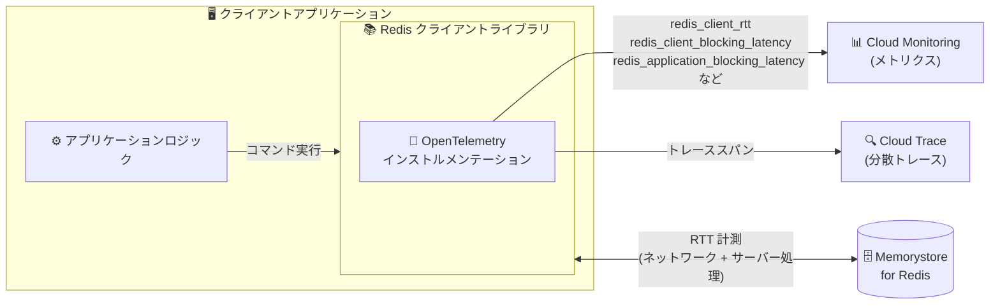

# Memorystore for Redis: クライアントサイドメトリクスが一般提供 (GA) に

**リリース日**: 2026-09-03

**サービス**: Memorystore for Redis

**機能**: クライアントサイドメトリクスによる高レイテンシのトラブルシューティング

**ステータス**: GA (一般提供)

📊 [このアップデートのインフォグラフィックを見る](https://takech9203.github.io/google-cloud-news-summary/20260903-memorystore-redis-client-side-metrics-ga.html)

## 概要

Memorystore for Redis で、クライアントサイドメトリクスを使用してアプリケーションが高レイテンシを経験する原因をトラブルシューティングする機能が一般提供 (GA) になりました。

Memorystore for Redis はこれまでも、スループット、CPU 使用率、メモリ使用量などのサーバーサイドメトリクスをリアルタイムで提供してきました。しかし、複雑な分散システムでは、サーバーサイドのデータだけではアプリケーションが高レイテンシを経験する理由を説明できないことがあります。クライアントサイドメトリクスは、アプリケーションがコマンドを開始してからレスポンスを処理し終えるまでのリクエスト・レスポンスサイクル全体を計測することで、レイテンシの発生源がアプリケーションロジック、ネットワーク経路、Redis サーバーのいずれにあるのかを正確に特定できるようにします。

計測は、アプリケーションの Redis クライアントライブラリ内で直接動作する OpenTelemetry インストルメンテーションによって行われ、収集したメトリクスとトレースを Cloud Monitoring および Cloud Trace にエクスポートして可視化できます。Redis を利用するアプリケーションのレイテンシ問題を調査する開発者や SRE にとって有用なアップデートです。

**アップデート前の課題**

- サーバーサイドメトリクス (CPU 使用率、メモリ使用量、スループットなど) だけでは、複雑な分散システムにおいてアプリケーションが高レイテンシを経験する原因を説明できないことがあった
- レイテンシの発生源がアプリケーションロジック、ネットワーク経路、Redis サーバーのどこにあるのかをサーバー側のデータからは切り分けられなかった
- 従来のトラブルシューティングでは、クライアントサイドのログを手動で確認し、リソース集約的なコマンドの実行時刻と CPU 使用率の高い時間帯を突き合わせるといった作業が必要だった

**アップデート後の改善**

- コマンド開始からレスポンス処理完了までのリクエスト・レスポンスサイクル全体を計測し、レイテンシの発生源 (アプリケーション / ネットワーク / サーバー) を正確に特定できるようになった
- 接続プールの待ち時間、ラウンドトリップタイム (RTT)、アプリケーション処理時間、リトライ回数、接続エラー数といったクライアント視点のデータポイントを取得できるようになった
- Cloud Monitoring へのメトリクスのエクスポートと Cloud Trace への分散トレースのエクスポートにより、ボトルネックの根本原因を可視化できるようになった
- GA となり、本番環境での利用が正式にサポートされた

## アーキテクチャ図



Redis クライアントライブラリ内で動作する OpenTelemetry インストルメンテーションが、接続プールの待ち時間・RTT・アプリケーション処理時間などを計測し、Cloud Monitoring と Cloud Trace にエクスポートすることで、レイテンシの発生源を切り分けられます。

## サービスアップデートの詳細

### 主要機能

1. **リクエスト・レスポンスサイクル全体のレイテンシ計測**
   - アプリケーションがコマンドを開始してからレスポンスを処理するまでの各データポイントでタイムスタンプを記録
   - レイテンシがアプリケーションロジック、ネットワーク経路、Redis サーバーのどこで発生しているかを正確に判別できる

2. **OpenTelemetry ベースのインストルメンテーション**
   - アプリケーションの Redis クライアントライブラリ内で直接動作する OpenTelemetry インストルメンテーションがメトリクスを収集
   - Go、Java、Node.js、Python でのクライアントサイドメトリクスの有効化手順が公式ドキュメントで提供されている

3. **Cloud Monitoring / Cloud Trace との統合**
   - メトリクスを Cloud Monitoring にエクスポートし、Metrics Explorer で可視化してボトルネックの根本原因を特定できる
   - 分散トレースを Cloud Trace にエクスポートし、Trace Explorer でレイテンシの発生源を診断・分離できる

### 収集されるメトリクス

| メトリクス | 内容 |
|------|------|
| `redis_client_blocking_latency` | プールチェックアウト: クライアントの接続プールで利用可能な接続を待機する時間 |
| `redis_client_rtt` | ラウンドトリップタイム (RTT): コマンドのネットワーク転送時間とサーバー実行時間 |
| `redis_application_blocking_latency` | アプリケーション処理: データ到着後にアプリケーションがパース・デシリアライズに費やす時間 |
| `redis_retry_count` | リトライ: クライアントの指数バックオフループがトリガーするコマンドリトライの回数 |
| `redis_connectivity_error_count` | 接続エラー: 接続失敗とタイムアウトの回数 |

## 設定方法

### 前提条件

1. クライアントアプリケーションがサービスアカウントを使用し、以下の IAM ロールが付与されていること
   - `roles/cloudtrace.agent` (Cloud Trace エージェント)
   - `roles/monitoring.metricWriter` (モニタリング指標の書き込み)
2. Memorystore for Redis インスタンスを作成したプロジェクトで Cloud Monitoring API が有効になっていること (メトリクスのエクスポートに必要)
3. 同プロジェクトで Cloud Trace API が有効になっていること (分散トレースの表示に必要)

### 手順

#### ステップ 1: API の有効化

Google Cloud コンソールの「API とサービス」ページで、Cloud Monitoring API と Cloud Trace API を有効化します。

#### ステップ 2: OpenTelemetry SDK とエクスポーターの導入

アプリケーションのコードに OpenTelemetry SDK、Cloud Monitoring エクスポーター、Cloud Trace エクスポーターを追加します。Go の場合の依存関係の例:

```bash
go get github.com/gomodule/redigo/redis@latest
go get go.opentelemetry.io/otel
go get go.opentelemetry.io/otel/sdk/trace
go get go.opentelemetry.io/otel/sdk/metric
go get github.com/GoogleCloudPlatform/opentelemetry-operations-go/exporter/trace
go get github.com/GoogleCloudPlatform/opentelemetry-operations-go/exporter/metric
```

Java の場合は `jedis`、`opentelemetry-api`、`opentelemetry-sdk`、`exporter-trace`、`exporter-metrics` を `pom.xml` に追加します。Node.js、Python のサンプルコードも公式ドキュメントに掲載されています。

#### ステップ 3: 計測コードの実装とメトリクスの確認

Redis コマンド実行の前後でタイムスタンプを記録し、`redis_client_rtt` などのヒストグラム / カウンターとして記録するコードを実装します。アプリケーションを 1 分以上実行して、エクスポーターがメトリクスをバッチ送信するのを待ってから、Metrics Explorer や Trace Explorer で確認します。

## メリット

### ビジネス面

- **障害調査時間の短縮**: レイテンシの発生源 (アプリケーション / ネットワーク / サーバー) を正確に切り分けられるため、原因特定までの時間を短縮できる
- **GA による本番利用の安心感**: 一般提供となったことで、本番環境のトラブルシューティングワークフローに正式に組み込める

### 技術面

- **エンドツーエンドの可視性**: サーバーサイドメトリクスだけでは見えなかった、接続プール待ちやアプリケーション側のデシリアライズ時間まで可視化できる
- **OpenTelemetry 標準への準拠**: オープンな観測可能性フレームワークである OpenTelemetry を利用するため、既存の OpenTelemetry ベースの計装と親和性が高い
- **メトリクスとトレースの両対応**: Cloud Monitoring でのメトリクス分析と Cloud Trace での分散トレース分析を組み合わせてボトルネックを診断できる

## デメリット・制約事項

### 考慮すべき点

- クライアントサイドメトリクスはアプリケーションコードへの計装 (OpenTelemetry SDK とエクスポーターの組み込み) が必要であり、サーバーサイドメトリクスのように自動では収集されない
- Cloud Monitoring へのメトリクスのエクスポートは Monitoring が取り込むバイト数に基づく従量課金、Cloud Trace へのトレースのエクスポートは取り込むトレーススパン数に基づく課金の対象となる
- サービスアカウントへの IAM ロール付与と API の有効化が事前に必要

## ユースケース

### ユースケース 1: 高レイテンシの原因切り分け

**シナリオ**: Redis を利用するアプリケーションで断続的にレイテンシが悪化するが、サーバーサイドの CPU 使用率やメモリ使用量には異常が見られない。

**実装例**: `redis_client_blocking_latency` (接続プール待ち)、`redis_client_rtt` (ネットワーク + サーバー処理)、`redis_application_blocking_latency` (アプリケーション処理) を Cloud Monitoring で比較する。

**効果**: 接続プールの枯渇、ネットワーク経路の問題、アプリケーションのデシリアライズ処理のいずれが原因かを定量的に特定でき、的確な対策 (プールサイズ調整、ネットワーク調査、コード最適化) を打てる。

### ユースケース 2: 接続の安定性モニタリング

**シナリオ**: フェイルオーバーやメンテナンス時にアプリケーションへの影響を把握したい。

**効果**: `redis_retry_count` と `redis_connectivity_error_count` を監視することで、接続失敗やタイムアウト、指数バックオフによるリトライの発生状況を可視化し、クライアント側の再接続ロジックの妥当性を評価できる。

## 料金

クライアントサイドメトリクス機能自体は Memorystore for Redis の追加料金なしで利用できますが、エクスポート先の観測可能性サービスの料金が適用されます。

- **メトリクス**: Monitoring API を使用した Cloud Monitoring へのエクスポートは、Monitoring が取り込むバイト数に基づくボリュームベースの課金対象
- **トレース**: Trace API を使用した Cloud Trace への分散トレースのエクスポートは、Trace が取り込むトレーススパン数に基づく課金対象
- **表示は無料**: Metrics Explorer でのクライアントサイドメトリクスの表示、Trace Explorer での分散トレースの表示に料金はかからない

詳細は [Google Cloud Observability の料金](https://cloud.google.com/stackdriver/pricing) を参照してください。

## 関連サービス・機能

- **Cloud Monitoring**: クライアントサイドメトリクスのエクスポート先。Metrics Explorer でメトリクスを可視化し、ボトルネックの根本原因を特定できる
- **Cloud Trace**: 分散トレースのエクスポート先。Trace Explorer でトレースを表示し、レイテンシの発生源を診断できる
- **OpenTelemetry**: クライアントサイドメトリクスの収集を担うオープンソースの観測可能性フレームワーク。Redis クライアントライブラリ内で直接動作する
- **Memorystore for Redis サーバーサイドメトリクス**: 従来から提供されている CPU 使用率 (`stats/cpu_utilization`) やコマンド実行数 (`commands/calls`) などのメトリクス。クライアントサイドメトリクスと組み合わせることで包括的なレイテンシ分析が可能

## 参考リンク

- 📊 [インフォグラフィック](https://takech9203.github.io/google-cloud-news-summary/20260903-memorystore-redis-client-side-metrics-ga.html)
- [公式リリースノート](https://docs.cloud.google.com/release-notes#September_03_2026)
- [About client-side metrics (公式ドキュメント)](https://docs.cloud.google.com/memorystore/docs/redis/about-client-side-metrics)
- [Use client-side metrics to troubleshoot high latency (公式ドキュメント)](https://docs.cloud.google.com/memorystore/docs/redis/use-client-side-metrics)
- [Google Cloud Observability の料金](https://cloud.google.com/stackdriver/pricing)

## まとめ

Memorystore for Redis のクライアントサイドメトリクスが GA となり、サーバーサイドメトリクスだけでは切り分けが難しかった高レイテンシの原因を、接続プール待ち・RTT・アプリケーション処理時間の観点から正確に特定できるようになりました。Redis を利用する本番アプリケーションでレイテンシ問題の調査に課題を感じている場合は、OpenTelemetry インストルメンテーションを組み込み、Cloud Monitoring / Cloud Trace と連携したトラブルシューティングワークフローの導入を検討することをおすすめします。

---

**タグ**: #Memorystore #Redis #ClientSideMetrics #OpenTelemetry #CloudMonitoring #CloudTrace #Observability #GA
