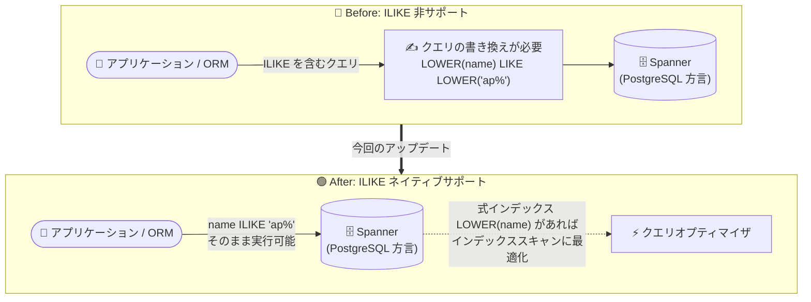

# Spanner: PostgreSQL 方言データベースで ILIKE / NOT ILIKE 演算子をサポート

**リリース日**: 2026-09-03

**サービス**: Spanner

**機能**: PostgreSQL 方言データベースにおける ILIKE (~~*) / NOT ILIKE (!~~*) 演算子および pg.ilike / pg.not_ilike 関数のサポート

**ステータス**: Feature (提供開始)

📊 [このアップデートのインフォグラフィックを見る](https://takech9203.github.io/google-cloud-news-summary/20260903-spanner-postgresql-ilike-operators.html)

## 概要

Spanner の PostgreSQL 方言データベースで、大文字小文字を区別しないパターンマッチング演算子 `ILIKE` (演算子表記: `~~*`) と `NOT ILIKE` (演算子表記: `!~~*`) がサポートされました。あわせて、同等の機能を提供する関数 `pg.ilike` および `pg.not_ilike` も利用可能になっています。

`ILIKE` は PostgreSQL で広く使われている標準的な演算子であり、`LIKE` のケースインセンシティブ (大文字小文字を区別しない) 版です。今回のサポートにより、オープンソース PostgreSQL からの移行や、既存の PostgreSQL 向けアプリケーション・ORM が生成するクエリとの互換性がさらに向上します。PostgreSQL 方言の Spanner を利用するアプリケーション開発者、および PostgreSQL からの移行を検討しているチームにとって有用なアップデートです。

さらに、公式ドキュメントによれば、`ILIKE` を使ったクエリは対象カラムに `LOWER(column)` や `UPPER(column)` などのケースフォールディング式インデックス (expression index) を作成することで最適化でき、クエリオプティマイザが `ILIKE` 演算子をフルテーブルスキャンではなくインデックススキャンに書き換えられます。2026 年 8 月 28 日に発表された式インデックス (expression index) のサポートと組み合わせることで、実用的なパフォーマンスでケースインセンシティブ検索を実装できます。

**アップデート前の課題**

- Spanner の PostgreSQL 方言では `ILIKE` / `NOT ILIKE` 演算子が利用できず、ケースインセンシティブなパターンマッチングには `LOWER(column) LIKE LOWER(pattern)` のような書き換えが必要だった
- オープンソース PostgreSQL 上で `ILIKE` を使用している既存アプリケーションや ORM 生成クエリを、Spanner 移行時に修正する必要があった
- `~~*` / `!~~*` といった PostgreSQL の演算子表記も使用できなかった

**アップデート後の改善**

- `ILIKE` / `NOT ILIKE` 演算子 (および `~~*` / `!~~*` 表記) をそのまま使用してケースインセンシティブなパターンマッチングを記述できるようになった
- 関数形式の `pg.ilike(string, pattern)` / `pg.not_ilike(string, pattern)` も利用可能になった
- ケースフォールディング式インデックス (`LOWER(column)` など) を作成すれば、オプティマイザが `ILIKE` クエリをインデックススキャンに書き換えて最適化できる

## アーキテクチャ図



従来はケースインセンシティブ検索のためにクエリを `LOWER()` + `LIKE` に書き換える必要がありましたが、今回のアップデートで `ILIKE` をそのまま実行でき、ケースフォールディング式インデックスによるインデックススキャン最適化も可能になりました。

## サービスアップデートの詳細

### 主要機能

1. **ILIKE / NOT ILIKE 演算子のサポート**
   - `string ILIKE pattern`: 文字列がパターンにマッチする場合に TRUE を返す。大文字小文字を区別しない (例: `'Apple' ILIKE 'ap%'` → true、`'Apple' ILIKE 'APpLe'` → true)
   - `string NOT ILIKE pattern`: 文字列がパターンにマッチしない場合に TRUE を返す。大文字小文字を区別しない (例: `'Apple' NOT ILIKE 'banana%'` → true)

2. **PostgreSQL 演算子表記 (~~* / !~~*) のサポート**
   - `string ~~* pattern`: `ILIKE` 演算子と等価 (例: `'Apple' ~~* 'ap%'` → true)
   - `string !~~* pattern`: `NOT ILIKE` 演算子と等価 (例: `'Apple' !~~* 'banana%'` → true)

3. **pg.ilike / pg.not_ilike 関数のサポート**
   - `pg.ilike(string text, pattern text)`: Boolean を返す。ケースインセンシティブ (例: `pg.ilike('Apple', 'aPp%')` → true)
   - `pg.not_ilike(string text, pattern text)`: Boolean を返す。文字列がパターンにマッチしない場合に true (例: `pg.not_ilike('Apple', 'aPp%')` → false)

4. **式インデックスによるクエリ最適化**
   - 対象カラムに `LOWER(column)` または `UPPER(column)` のケースフォールディング式インデックスを作成すると、クエリオプティマイザが `ILIKE` 演算子をフルテーブルスキャンではなくインデックススキャンに書き換え可能

## 技術仕様

### サポートされる演算子・関数

| 種類 | 構文 | 説明 |
|------|------|------|
| 演算子 | `string ILIKE pattern` | ケースインセンシティブなパターンマッチ |
| 演算子 | `string NOT ILIKE pattern` | ケースインセンシティブな否定パターンマッチ |
| 演算子 (記号表記) | `string ~~* pattern` | `ILIKE` と等価 |
| 演算子 (記号表記) | `string !~~* pattern` | `NOT ILIKE` と等価 |
| 関数 | `pg.ilike(string, pattern)` | Boolean を返す。ケースインセンシティブ |
| 関数 | `pg.not_ilike(string, pattern)` | Boolean を返す。ケースインセンシティブの否定 |

### ESCAPE 句

- `LIKE` / `NOT LIKE` / `ILIKE` / `NOT ILIKE` 演算子はオプションの `ESCAPE` 句をサポート (例: `string LIKE pattern ESCAPE escape_character`)
- エスケープ文字のデフォルトはバックスラッシュ (`\`)
- 明示的に指定する場合もバックスラッシュ (`\`) のみサポート

### 演算子の優先順位

PostgreSQL の演算子優先順位テーブルにおいて、`ILIKE` は `BETWEEN` / `LIKE` / `IN` と同じ優先順位 (範囲包含、文字列マッチング、集合メンバーシップ) に位置付けられ、比較演算子 (`<`, `>`, `=` など) より高い優先順位を持ちます。

## 設定方法

### 前提条件

1. PostgreSQL 方言で作成された Spanner データベースを使用していること

### 手順

#### ステップ 1: ILIKE 演算子を使用したクエリの実行

```sql
-- 大文字小文字を区別しない前方一致検索
SELECT * FROM products WHERE name ILIKE 'ap%';

-- 記号表記 (~~*) も同じ意味
SELECT * FROM products WHERE name ~~* 'ap%';

-- 関数形式
SELECT * FROM products WHERE pg.ilike(name, 'ap%');
```

追加の設定は不要で、PostgreSQL 方言データベースに対してそのままクエリを実行できます。

#### ステップ 2: (推奨) ケースフォールディング式インデックスによる最適化

```sql
-- LOWER() ベースの式インデックスを作成
CREATE INDEX products_by_lower_name ON products (LOWER(name));
```

対象カラムに `LOWER(column)` または `UPPER(column)` の式インデックスを作成しておくと、クエリオプティマイザが `ILIKE` クエリをインデックススキャンに書き換え、フルテーブルスキャンを回避できます。

## メリット

### ビジネス面

- **PostgreSQL からの移行コスト削減**: `ILIKE` を使用する既存アプリケーションや ORM 生成クエリを書き換えずに Spanner へ移行できるため、移行工数とリスクが低減する
- **開発生産性の向上**: ケースインセンシティブ検索を標準構文で簡潔に記述でき、独自の書き換えパターンの周知・レビューが不要になる

### 技術面

- **PostgreSQL 互換性の向上**: 演算子表記 (`~~*` / `!~~*`) まで含めてオープンソース PostgreSQL の構文と互換性が確保される
- **インデックスによる最適化**: ケースフォールディング式インデックスと組み合わせることで、オプティマイザがインデックススキャンへ書き換え、大規模テーブルでも実用的な検索性能を実現できる

## デメリット・制約事項

### 制限事項

- 本機能は PostgreSQL 方言データベース向けであり、GoogleSQL 方言データベースの構文とは異なる
- `ESCAPE` 句で指定できるエスケープ文字はバックスラッシュ (`\`) のみ

### 考慮すべき点

- 式インデックスを作成しない場合、`ILIKE` クエリはフルテーブルスキャンになる可能性があるため、大規模テーブルでは `LOWER(column)` / `UPPER(column)` の式インデックス作成を検討する
- 式インデックスはストレージと書き込みコストを追加するため、検索頻度とのバランスを考慮する

## ユースケース

### ユースケース 1: PostgreSQL からの移行アプリケーションの互換性確保

**シナリオ**: オープンソース PostgreSQL で稼働している SaaS アプリケーションを Spanner (PostgreSQL 方言) へ移行する。アプリケーションのユーザー検索機能では ORM が `ILIKE` を含むクエリを生成している。

**実装例**:
```sql
-- ORM が生成する既存クエリをそのまま実行可能
SELECT id, email FROM users WHERE email ILIKE '%@example.com';
```

**効果**: クエリの書き換えやアプリケーションコードの修正なしで移行でき、移行工数とデグレードのリスクを削減できる。

### ユースケース 2: 商品カタログのケースインセンシティブ検索

**シナリオ**: EC サイトの商品検索で、ユーザー入力の大文字小文字にかかわらず商品名を部分一致検索したい。商品テーブルは大規模なため、フルテーブルスキャンは避けたい。

**実装例**:
```sql
-- ケースフォールディング式インデックスを作成
CREATE INDEX products_by_lower_name ON products (LOWER(name));

-- ILIKE による検索 (オプティマイザがインデックススキャンに書き換え可能)
SELECT product_id, name, price FROM products WHERE name ILIKE 'pixel%';
```

**効果**: 標準的な構文でケースインセンシティブ検索を実装しつつ、式インデックスにより大規模テーブルでも高速な検索が可能になる。

## 料金

本アップデートは SQL 機能の追加であり、機能自体に固有の追加料金に関する記載はありません。通常の Spanner の料金体系 (コンピュート容量、ストレージ、ネットワーク) が適用されます。なお、最適化のために式インデックスを作成する場合は、インデックス分のストレージ料金が発生します。

詳細は [Spanner の料金ページ](https://cloud.google.com/spanner/pricing) を参照してください。

## 関連サービス・機能

- **Spanner 式インデックス (Expression Index)**: 2026 年 8 月 28 日に発表された、スカラー式に基づくセカンダリインデックス作成機能。`LOWER(column)` などのケースフォールディング式インデックスを作成することで、`ILIKE` クエリの最適化に直接活用できる
- **Spanner GoogleSQL 方言**: GoogleSQL 方言では正規表現関数など別の構文でケースインセンシティブ検索を実現する。本アップデートは PostgreSQL 方言固有の機能
- **Database Migration Service**: PostgreSQL から Spanner への移行を支援するサービス。`ILIKE` サポートにより移行後のクエリ互換性が向上する

## 参考リンク

- 📊 [インフォグラフィック](https://takech9203.github.io/google-cloud-news-summary/20260903-spanner-postgresql-ilike-operators.html)
- [公式リリースノート](https://docs.cloud.google.com/release-notes#September_03_2026)
- [パターンマッチング演算子のドキュメント](https://docs.cloud.google.com/spanner/docs/reference/postgresql/operators#pattern-matching-operators)
- [PostgreSQL 方言の関数ドキュメント](https://docs.cloud.google.com/spanner/docs/reference/postgresql/functions)
- [料金ページ](https://cloud.google.com/spanner/pricing)

## まとめ

Spanner の PostgreSQL 方言データベースで `ILIKE` / `NOT ILIKE` 演算子と `pg.ilike` / `pg.not_ilike` 関数がサポートされ、オープンソース PostgreSQL との構文互換性がさらに向上しました。PostgreSQL からの移行を検討しているチームは、クエリ書き換えの要否を再評価する価値があります。あわせて、大規模テーブルでの `ILIKE` 検索には `LOWER(column)` などのケースフォールディング式インデックスの作成を推奨します。

---

**タグ**: #Spanner #PostgreSQL #ILIKE #SQL #PatternMatching #Database
