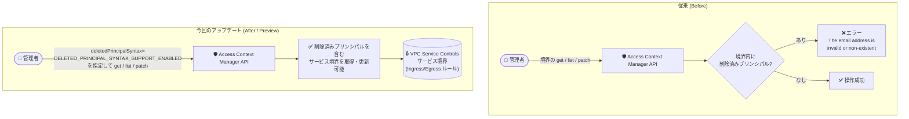

# VPC Service Controls: 削除済み IAM プリンシパルを含むサービス境界の取得・更新サポート (Preview)

**リリース日**: 2026-09-03

**サービス**: VPC Service Controls

**機能**: 削除済み IAM プリンシパルを含むサービス境界 (Service Perimeter) の取得・更新サポート

**ステータス**: Preview

📊 [このアップデートのインフォグラフィックを見る](https://takech9203.github.io/google-cloud-news-summary/20260903-vpc-service-controls-deleted-iam-principals.html)

## 概要

VPC Service Controls が、削除済みの IAM プリンシパル (ユーザー、グループ、サービスアカウント) を含むサービス境界の取得・更新をサポートしました (Preview)。この機能を有効にすると、境界の Ingress/Egress ルールに削除済みの ID が残っている場合でも、「The email address is invalid or non-existent」エラーを発生させることなく境界を管理できます。

これまで、サービス境界の Ingress/Egress ルールで参照しているユーザーやサービスアカウントが組織から削除されると、その境界の一覧取得や更新の操作自体がエラーで失敗し、運用上の大きな障害となっていました。今回のアップデートにより、Access Context Manager API のリクエストで `deletedPrincipalSyntax` パラメータ (REST) または `deleted_principal_syntax` フィールド (gRPC) を `DELETED_PRINCIPAL_SYNTAX_SUPPORT_ENABLED` に設定することで、削除済みプリンシパルを含む境界を通常どおり取得・更新できるようになります。

VPC Service Controls を用いてデータ漏洩対策の境界を運用している組織、特に人員の入れ替わりやサービスアカウントのライフサイクル管理が頻繁に発生する大規模環境の管理者にとって、境界メンテナンスの信頼性を高める重要な改善です。

**アップデート前の課題**

- 境界の Ingress/Egress ルールで参照しているプリンシパル (ユーザー、グループ、サービスアカウント) が削除されると、その境界の更新や一覧取得が「The email address is invalid or non-existent」エラーで失敗していた
- エラーを解消するには、削除済みプリンシパルをすべての境界から手動で除去するか、全境界をエクスポートして編集後に一括置換 (bulk replace) する回避策が必要だった
- 削除済みプリンシパルが 1 つ残っているだけで、無関係な設定変更 (サービスの追加など) までブロックされる可能性があった

**アップデート後の改善**

- Access Context Manager API の `get` / `list` / `patch` リクエストで `deletedPrincipalSyntax=DELETED_PRINCIPAL_SYNTAX_SUPPORT_ENABLED` を指定することで、削除済みプリンシパルを含む境界をエラーなしで取得・更新できるようになった
- 削除済みのユーザー、グループ、サービスアカウント ID が残った状態でも境界のメンテナンス作業を継続できるようになった
- 全境界のエクスポートと一括置換といった大がかりな回避策なしに、通常の API 操作で境界を管理できるようになった

## アーキテクチャ図



従来は境界内に削除済みプリンシパルが 1 つでも存在すると取得・更新操作がエラーになっていましたが、今回のアップデートで API リクエストにパラメータを指定するだけで境界を管理できるようになります。

## サービスアップデートの詳細

### 主要機能

1. **削除済みプリンシパル構文のサポート有効化**
   - Access Context Manager API のリクエストで `deletedPrincipalSyntax` パラメータ (REST) または `deleted_principal_syntax` フィールド (gRPC) を `DELETED_PRINCIPAL_SYNTAX_SUPPORT_ENABLED` に設定する
   - `servicePerimeters.get`、`servicePerimeters.list`、`servicePerimeters.patch` などのメソッドで利用可能

2. **対象となる削除済み ID**
   - 削除済みのユーザーアカウント、グループ、サービスアカウントの ID を含む境界を管理できる
   - IAM で `deleted:` プレフィックス構文をサポートするプリンシパルタイプが対象 (詳細は IAM の「許可ポリシーのプリンシパル ID」ドキュメントを参照)

3. **エラーの回避**
   - デフォルト (機能無効時) では、削除済みプリンシパルを含む境界の更新や一覧取得は「The email address is invalid or non-existent」エラーで失敗する
   - 本機能を有効にしたリクエストでは、このエラーを発生させずに境界を取得・更新できる

## 技術仕様

### 機能の概要

| 項目 | 詳細 |
|------|------|
| ステータス | Preview (Pre-GA Offerings Terms が適用) |
| 対象 API | Access Context Manager API (REST / gRPC) |
| REST パラメータ | `deletedPrincipalSyntax=DELETED_PRINCIPAL_SYNTAX_SUPPORT_ENABLED` |
| gRPC フィールド | `deleted_principal_syntax = DELETED_PRINCIPAL_SYNTAX_SUPPORT_ENABLED` |
| 対象メソッド | `servicePerimeters.get` / `servicePerimeters.list` / `servicePerimeters.patch` など |
| 対象プリンシパル | 削除済みのユーザー、グループ、サービスアカウント (IAM v1 API の `deleted:` 構文対応タイプ) |
| 非対応の操作手段 | Google Cloud コンソール、gcloud CLI (従来どおりエラーになる) |

### API リクエスト例

削除済みプリンシパルを含む境界を取得する curl コマンドの例 (公式ドキュメントより):

```bash
curl -X GET \
  -H "Authorization: Bearer $(gcloud auth print-access-token)" \
  "https://accesscontextmanager.googleapis.com/v1/accessPolicies/\
POLICY_NAME/servicePerimeters/PERIMETER_NAME?\
deletedPrincipalSyntax=DELETED_PRINCIPAL_SYNTAX_SUPPORT_ENABLED"
```

## 設定方法

### 前提条件

1. VPC Service Controls のサービス境界と Access Context Manager のアクセスポリシーが構成済みであること
2. Access Context Manager API を呼び出す権限を持つこと

### 手順

#### ステップ 1: 削除済みプリンシパルを含む境界を取得する

```bash
curl -X GET \
  -H "Authorization: Bearer $(gcloud auth print-access-token)" \
  "https://accesscontextmanager.googleapis.com/v1/accessPolicies/POLICY_NAME/servicePerimeters/PERIMETER_NAME?deletedPrincipalSyntax=DELETED_PRINCIPAL_SYNTAX_SUPPORT_ENABLED"
```

`deletedPrincipalSyntax` クエリパラメータを付与することで、削除済みプリンシパルを含む境界でもエラーなく取得できます。`list` メソッドでも同様に指定できます。

#### ステップ 2: 境界を更新する

`servicePerimeters.patch` メソッドでも同じパラメータを指定することで、削除済みプリンシパルを含む境界の更新が可能です。REST / gRPC の詳細なリクエスト形式は Access Context Manager API のリファレンスを参照してください。

## メリット

### ビジネス面

- **運用停止リスクの低減**: 退職者アカウントやサービスアカウントの削除が原因でセキュリティ境界の変更作業がブロックされる事態を回避でき、セキュリティ運用の継続性が向上する
- **メンテナンスコストの削減**: 全境界のエクスポート・編集・一括置換という手間のかかる回避策が不要になり、管理者の作業負荷が軽減される

### 技術面

- **API 操作の一貫性**: `get` / `list` / `patch` といった通常の API 操作がプリンシパルの削除状態に左右されずに機能する
- **段階的なクリーンアップが可能**: エラーで作業がブロックされないため、削除済み ID の棚卸しと除去を計画的に実施できる

## デメリット・制約事項

### 制限事項

- IAM v1 API を使用する削除済みプリンシパルのみをサポートし、IAM v2 / v3 API の削除済みプリンシパルはサポートされない
- アクセスレベル (Access Level) 内の削除済み IAM プリンシパルはサポートされない
- IAM で `deleted:` プレフィックス構文をサポートしないプリンシパルは、VPC Service Controls のサービス境界ルールでもサポートされない
- 1 つのアクセスポリシーで指定できる削除済み ID は最大 500 個

### 考慮すべき点

- Preview 段階の機能であり、Pre-GA Offerings Terms が適用される (「現状有姿」での提供、サポートが限定される可能性がある)
- Google Cloud コンソールや gcloud CLI からは、削除済みプリンシパルを含む境界を管理できない (従来どおり「The email address is invalid or non-existent」エラーになる)。Access Context Manager API (REST / gRPC) の利用が必須
- 削除済みプリンシパルを境界に残し続けるのではなく、最終的には棚卸しして除去することが望ましい

## ユースケース

### ユースケース 1: 退職者アカウント削除後の境界メンテナンス

**シナリオ**: 大規模組織で VPC Service Controls の Ingress ルールに個別ユーザーを指定して運用している。退職に伴いユーザーアカウントが削除された後、別の設定変更 (保護対象サービスの追加など) のために境界を更新しようとするとエラーで失敗する。

**実装例**:
```bash
# deletedPrincipalSyntax を指定して境界を取得し、現在の設定を確認
curl -X GET \
  -H "Authorization: Bearer $(gcloud auth print-access-token)" \
  "https://accesscontextmanager.googleapis.com/v1/accessPolicies/POLICY_NAME/servicePerimeters/PERIMETER_NAME?deletedPrincipalSyntax=DELETED_PRINCIPAL_SYNTAX_SUPPORT_ENABLED"
```

**効果**: 削除済みユーザーが残っていても境界の取得・更新がブロックされず、必要な設定変更を即座に実施できる。

### ユースケース 2: CI/CD 用サービスアカウント整理後の境界棚卸し

**シナリオ**: プロジェクト整理に伴い多数のサービスアカウントを削除した結果、複数の境界の Egress ルールに削除済みサービスアカウントが残ってしまった。従来は全境界のエクスポートと一括置換が必要だった。

**効果**: `list` / `patch` を通常の API 操作として実行できるため、境界ごとに削除済み ID を段階的に特定・除去でき、一括置換による設定ミスのリスクを避けられる。

## 関連サービス・機能

- **Access Context Manager**: サービス境界とアクセスポリシーを管理する基盤。本機能は Access Context Manager API のパラメータとして提供される
- **IAM (Identity and Access Management)**: 削除済みプリンシパルの `deleted:` プレフィックス構文は IAM の「許可ポリシーのプリンシパル ID」で定義されている。IAM v1 API の削除済みプリンシパルのみが対象
- **VPC Service Controls Ingress/Egress ルール**: 境界への出入りを制御するルール。ユーザー、グループ、サービスアカウントなどの ID を指定でき、本機能の対象となる

## 参考リンク

- 📊 [インフォグラフィック](https://takech9203.github.io/google-cloud-news-summary/20260903-vpc-service-controls-deleted-iam-principals.html)
- [公式リリースノート](https://docs.cloud.google.com/release-notes#September_03_2026)
- [Supported identities for ingress and egress rules - Deleted IAM principals](https://docs.cloud.google.com/vpc-service-controls/docs/supported-identities#deleted-principals)
- [トラブルシューティング: The email address is invalid or non-existent](https://docs.cloud.google.com/vpc-service-controls/docs/troubleshooting#invalid-email-address)
- [Access Context Manager REST API リファレンス](https://docs.cloud.google.com/access-context-manager/docs/reference/rest)
- [IAM: 許可ポリシーのプリンシパル ID](https://docs.cloud.google.com/iam/docs/principal-identifiers)

## まとめ

削除済み IAM プリンシパルが原因でサービス境界の管理操作がエラーになるという、VPC Service Controls 運用者にとって長年の悩みの種だった問題に対する公式なソリューションが Preview で提供されました。大規模環境で境界を運用しているチームは、Access Context Manager API の `deletedPrincipalSyntax` パラメータの利用を検討するとともに、これを機に境界内の削除済み ID の棚卸しを進めることを推奨します。なおコンソールと gcloud CLI は非対応のため、API 経由での操作が必要な点に注意してください。

---

**タグ**: #VPCServiceControls #AccessContextManager #IAM #セキュリティ #Preview
