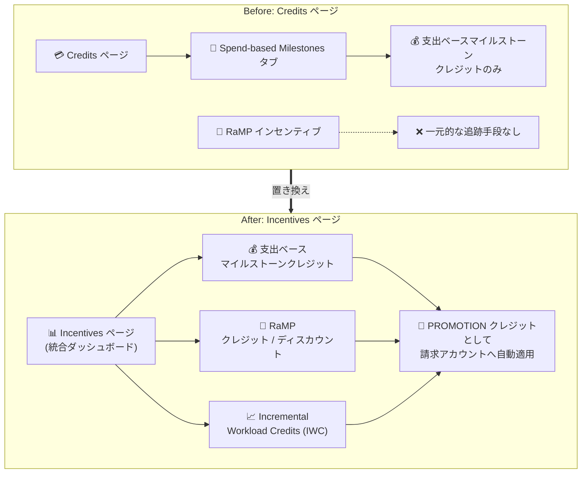

# Cloud Billing: Incentives ページの導入 (条件付きインセンティブの一元トラッキング)

**リリース日**: 2026-09-04

**サービス**: Cloud Billing

**機能**: Incentives ページ (条件付きインセンティブのトラッキング)

**ステータス**: Change (機能変更)

📊 [このアップデートのインフォグラフィックを見る](https://takech9203.github.io/google-cloud-news-summary/20260904-cloud-billing-incentives-page.html)

## 概要

Google Cloud コンソールの Cloud Billing に、条件付きインセンティブを一元的にトラッキングできる **Incentives ページ** が導入されました。カスタム料金契約 (custom pricing contract) を締結している組織は、Google Cloud で特定の金額を支出することでクレジットやディスカウントを獲得できる「条件付きインセンティブ」に加入している場合があります。新しい Incentives ページは、これらのインセンティブの進捗を追跡するための統合されたダッシュボードです。

Incentives ページは、従来 Credits ページ内にあった **Spend-based Milestones タブを置き換える** ものです。支出ベースのマイルストーンクレジットに加えて、**Rapid Migration & Modernization Program (RaMP)** のクレジット・ディスカウント、**Incremental Workload Credits (IWC)** といった複数のプログラムタイプを 1 つのページで確認できるようになり、契約特典の可視性と監査性 (auditability) が向上しました。

対象ユーザーは、カスタム料金契約を持つエンタープライズの請求管理者・FinOps 担当者です。獲得したインセンティブは PROMOTION タイプのクレジットとして請求アカウントに自動適用されます。

**アップデート前の課題**

- 従来の Credits ページ内の Spend-based Milestones タブでは、支出ベースのマイルストーンクレジットのみが対象で、RaMP のインセンティブは同じ画面で追跡できなかった
- 複数の条件付きインセンティブプログラムの状況 (条件、対象範囲、目標、進捗、発行済み報酬) を一元的に確認する手段がなく、契約特典の全体像の把握が難しかった
- マイルストーンの達成状況や履歴を横断的に確認しづらく、契約特典の監査性に課題があった

**アップデート後の改善**

- Incentives ページで、支出ベースのマイルストーンクレジット、RaMP インセンティブ、Incremental Workload Credits (IWC) を統合ビューで一元的にトラッキングできるようになった
- サマリースコアカードでアクティブなマイルストーン数や進捗などの集計指標を一目で把握できるようになった
- Program tracker テーブルとマイルストーンステータスパネルにより、各プログラムのマイルストーンの状態 (Active / Achieved / Upcoming / Missed) や履歴を詳細に確認できるようになった

## アーキテクチャ図



従来 Credits ページの Spend-based Milestones タブで支出ベースのマイルストーンのみを追跡していた構成が、新しい Incentives ページに置き換わり、RaMP や IWC を含むすべての条件付きインセンティブを統合ビューで追跡できるようになりました。

## サービスアップデートの詳細

### 主要機能

1. **サマリースコアカード (Summary scorecard)**
   - ページ上部に、アクティブなプログラムに関する主要な集計指標を表示
   - アクティブなマイルストーン数や進捗状況を一目で把握できる

2. **Program tracker テーブル**
   - プログラム名、マイルストーンインデックス、マイルストーン終了日、支出目標 (spend target)、進捗、報酬 (reward) を一覧表示
   - プログラムを選択すると、マイルストーンステータスパネルで詳細を確認できる

3. **マイルストーンステータスの視覚的インジケーター**
   - **Active**: マイルストーンが獲得対象として進行中
   - **Achieved**: 報酬獲得の条件を達成済み
   - **Upcoming**: マイルストーン期間が未開始
   - **Missed**: 条件を満たさないまま期間が終了
   - **X/Y achieved**: マルチティアプログラムの進捗 (例: 「1/2 achieved」は 2 つ中 1 つ達成)

4. **マイルストーン詳細と履歴の表示**
   - **Current milestone タブ**: 選択したプログラムの現在のマイルストーンの詳細を表示
   - **All milestones タブ**: プログラム内の全マイルストーンを一覧表示し、展開すると過去の達成状況と獲得済み報酬の履歴を確認できる

## 技術仕様

### 対象となるプログラムタイプ

| プログラムタイプ | 説明 |
|------|------|
| Conditional credits (条件付きクレジット) | 単一の条件を満たすと単一の報酬がアンロックされるプログラム |
| Incremental Workload Credits (IWC) | 支出を時系列で段階的に追跡するプログラム。通常は複数のマイルストーンを持つ |
| RaMP インセンティブ | タグ付けされ RaMP インセンティブの条件を満たす RaMP ワークロードのクレジット・ディスカウント |

### 支出ベースマイルストーンの例

| 例 | 内容 |
|------|------|
| 例 1 | 月間 BigQuery 支出が $100 のマイルストーンに到達後、支出 $1 ごとに 25% のクレジットを付与 |
| 例 2 | Compute Engine リソースに $200 支出するごとに $30 のクレジットを付与 |

### クレジットの適用と反映

| 項目 | 詳細 |
|------|------|
| クレジットタイプ | PROMOTION タイプのクレジットとしてレポート・BigQuery エクスポートに表示 |
| 適用方法 | 支払い方法として機能し、対象コストに自動適用 |
| 適用タイミング | RaMP または支出ベースマイルストーン達成後、通常 45 日以内に請求アカウントに適用 (月次マイルストーンは月末から通常 45 日以内のローリング適用) |
| 進捗データの更新頻度 | 日次で更新。ただし最新のコストデータに基づき最大 3 日の遅延が発生する可能性あり |
| Earn Scope | マイルストーン達成にカウントされる支出とアカウントの範囲 |
| Reward Scope | マイルストーン達成後にクレジットが適用される範囲 |

### 必要な権限

Incentives ページへのアクセスには、Cloud Billing アカウントに対して `billing.credits.list` 権限を含むロールが必要です。以下のいずれかの事前定義 IAM ロールで付与できます。

| ロール | ロール名 |
|------|------|
| Billing Account User | 請求先アカウント ユーザー |
| Billing Account Viewer | 請求先アカウント閲覧者 |
| Billing Account Administrator | 請求先アカウント管理者 |

## 設定方法

### 前提条件

1. RaMP インセンティブまたは支出ベースのマイルストーンクレジットを含むカスタム料金契約に加入していること
2. Cloud Billing アカウントに対して `billing.credits.list` 権限を含むロール (Billing Account User / Viewer / Administrator のいずれか) が付与されていること

### 手順

#### ステップ 1: Incentives ページへアクセス

1. Google Cloud コンソールで Cloud Billing アカウントに移動する
2. プロンプトで、Incentives ページを表示したい Cloud Billing アカウントを選択する (Billing の概要ページが開く)
3. Billing ナビゲーションメニューから **Incentives** をクリックする

#### ステップ 2: プログラムの詳細を確認

1. Program tracker テーブルでプログラムを選択し、マイルストーンステータスパネルで詳細を表示する
2. **Current milestone** タブで現在のマイルストーンの詳細を確認する
3. **All milestones** タブでプログラム内の全マイルストーンと履歴 (過去の達成状況・獲得済み報酬) を確認する

#### ステップ 3: 獲得クレジットの適用状況をコストテーブルで分析

コストテーブルレポートで、インセンティブクレジットが請求書のどのコストに適用されたかを確認できます。

1. Google Cloud コンソールでコストテーブルを開く
2. **Table configuration** の **Group by** メニューで **No grouping** を選択する
3. **Column display options** で **Credit type**、**Credit name**、**Credit ID** 列を有効にする
4. フィルタで **Invoice month** を選択し、**Savings** の **Other savings** セクションで **Promotional credits** のみを選択する
5. **Credit type** 列でソートすると、インセンティブクレジットが `PROMOTION` タイプとして SKU ごとに表示される

#### ステップ 4 (任意): BigQuery エクスポートでクレジットを分析

Cloud Billing の BigQuery エクスポートでは、クレジット名が `credits.full_name` 列に格納されます。

```sql
SELECT
  c.full_name AS CreditName,
  c.type AS CreditType,
  usage_start_time AS UsageStart,
  cost AS Cost
FROM
  `project_name.dataset_name.gcp_billing_export_resource_v1_XXXXXX_XXXXXX_XXXXXX`,
  UNNEST(credits) AS c
WHERE
  c.type = "PROMOTION";
```

PROMOTION タイプのクレジット (インセンティブプログラムのクレジット) が適用された利用明細を抽出できます。

## メリット

### ビジネス面

- **契約特典の可視性向上**: 支出ベースマイルストーン、RaMP、IWC を統合ビューで確認でき、カスタム契約に含まれるすべての条件付きインセンティブの全体像を単一の情報源 (single source of truth) として把握できる
- **監査性の向上**: マイルストーンごとの条件・対象範囲・目標・進捗・発行済み報酬と履歴を追跡でき、契約特典の達成状況を明確に説明できる
- **機会損失の防止**: Active / Upcoming / Missed といったステータス表示により、期限切れが近いマイルストーンを早期に把握し、達成に向けたアクションを取りやすくなる

### 技術面

- **統合されたトラッキング体験**: 従来タブ単位で分散していた情報が 1 つのページに集約され、サマリースコアカードと詳細テーブルの 2 階層で確認できる
- **既存の分析基盤との整合性**: 獲得クレジットは PROMOTION タイプとしてコストテーブルレポートや BigQuery エクスポートに反映されるため、既存の FinOps 分析フローにそのまま組み込める

## デメリット・制約事項

### 制限事項

- カスタム料金契約に基づく条件付きインセンティブ (支出ベースマイルストーン、RaMP、IWC) に加入しているユーザーのみが対象
- Incentives プログラムトラッカーはリアルタイム更新ではなく、支出の反映に最大 3 日の遅延が発生する可能性がある (コストレポートや BigQuery エクスポートの数値とラグが生じ得る)
- クレジットの請求アカウントへの適用はマイルストーン達成後、通常 45 日以内であり、即時反映ではない

### 考慮すべき点

- 従来の Credits ページの Spend-based Milestones タブは Incentives ページに置き換えられたため、既存の運用手順やドキュメントを新しいページに合わせて更新する必要がある
- アクセスには `billing.credits.list` 権限が必要なため、FinOps 担当者に適切な Cloud Billing IAM ロールが付与されているか確認が必要
- Earn Scope (達成カウント対象の支出範囲) と Reward Scope (クレジット適用先の範囲) は異なる概念であるため、進捗評価とクレジット消化計画では区別して扱う必要がある

## ユースケース

### ユースケース 1: FinOps チームによる契約インセンティブの定期モニタリング

**シナリオ**: カスタム料金契約で複数の支出ベースマイルストーンプログラムに加入しているエンタープライズの FinOps チームが、四半期ごとにインセンティブの達成状況をレビューし、経営層に報告する。

**効果**: Incentives ページのサマリースコアカードと Program tracker テーブルにより、全プログラムの進捗・達成状況・獲得報酬を 1 画面で確認でき、レビューと報告の工数を削減できる。Missed になる前に Active なマイルストーンの進捗を把握し、支出計画の調整判断に活用できる。

### ユースケース 2: RaMP を活用した移行プロジェクトのインセンティブ追跡

**シナリオ**: オンプレミスから Google Cloud への移行で RaMP (Rapid Migration & Modernization Program) に参加している企業が、タグ付けしたワークロードの消費実績とインセンティブの獲得状況を追跡する。

**効果**: 従来は一元的に追跡しづらかった RaMP のクレジット・ディスカウントを、支出ベースマイルストーンと同じ Incentives ページで確認できる。RaMP ワークロードタギングガイドに従ってワークロードをマッピングし、成果ベースのインセンティブの獲得状況を移行の進捗と併せて管理できる。

### ユースケース 3: 獲得クレジットの請求書照合

**シナリオ**: 経理担当者が、達成したマイルストーンのクレジットが特定の請求書のどのコストに適用されたかを照合する。

**実装例**:
```
コストテーブルレポートで以下を設定:
- Group by: No grouping
- 表示列: Credit type / Credit name / Credit ID
- フィルタ: Invoice month を指定、Savings で Promotional credits のみ選択
```

**効果**: PROMOTION タイプのクレジットが SKU ごとに表示され、Credit name 列で同一マイルストーン由来のクレジットを識別できるため、請求書とインセンティブの突合が容易になる。

## 料金

Incentives ページ自体は Google Cloud コンソールの Cloud Billing 機能であり、追加料金なしで利用できます。表示対象となる条件付きインセンティブ (支出ベースマイルストーンクレジット、RaMP クレジット・ディスカウント) の内容は、個別のカスタム料金契約に依存します。契約内容の詳細は Google Cloud セールスまたは Technical Account Manager への問い合わせが案内されています。

## 関連サービス・機能

- **Cloud Billing レポート / コストテーブル**: 獲得したインセンティブクレジットは PROMOTION タイプとして表示され、請求書単位でのクレジット適用状況の照合に利用できる
- **Cloud Billing データの BigQuery エクスポート**: `credits.full_name` / `credits.type` 列を使って、インセンティブクレジットの適用状況を SQL で詳細に分析できる
- **Migration Center (RaMP)**: RaMP インセンティブの獲得には、RaMP ワークロードタギングガイドに従ったワークロードのマッピング (タグ付け) が必要
- **Cloud Billing IAM**: Incentives ページへのアクセス制御は Cloud Billing の IAM ロール (`billing.credits.list` 権限) で管理する

## 参考リンク

- 📊 [インフォグラフィック](https://takech9203.github.io/google-cloud-news-summary/20260904-cloud-billing-incentives-page.html)
- [公式リリースノート](https://docs.cloud.google.com/release-notes#September_04_2026)
- [ドキュメント: Track your conditional incentives (Incentives program tracker)](https://docs.cloud.google.com/billing/docs/how-to/incentives-program-tracker)
- [RaMP tracking and incentive guide](https://docs.cloud.google.com/migration-center/docs/ramp-user-guide)
- [RaMP workload tagging guide](https://docs.cloud.google.com/migration-center/docs/ramp-workload-tagging)
- [Cloud Billing のアクセス制御の概要](https://docs.cloud.google.com/billing/docs/how-to/billing-access)
- [Cloud Billing データの BigQuery エクスポート](https://docs.cloud.google.com/billing/docs/how-to/export-data-bigquery)

## まとめ

Incentives ページの導入により、カスタム料金契約に含まれる支出ベースマイルストーン、RaMP、IWC といった条件付きインセンティブを単一の統合ダッシュボードで追跡できるようになりました。カスタム契約を持つ組織の FinOps 担当者は、Credits ページの Spend-based Milestones タブを参照していた既存の運用を新しい Incentives ページに移行し、必要な IAM ロール (`billing.credits.list` 権限) の付与状況を確認することを推奨します。進捗データには最大 3 日の遅延がある点に留意しつつ、マイルストーンの期限管理に活用してください。

---

**タグ**: Cloud Billing, Incentives, FinOps, 条件付きインセンティブ, RaMP, 支出ベースマイルストーン, クレジット, カスタム料金契約
