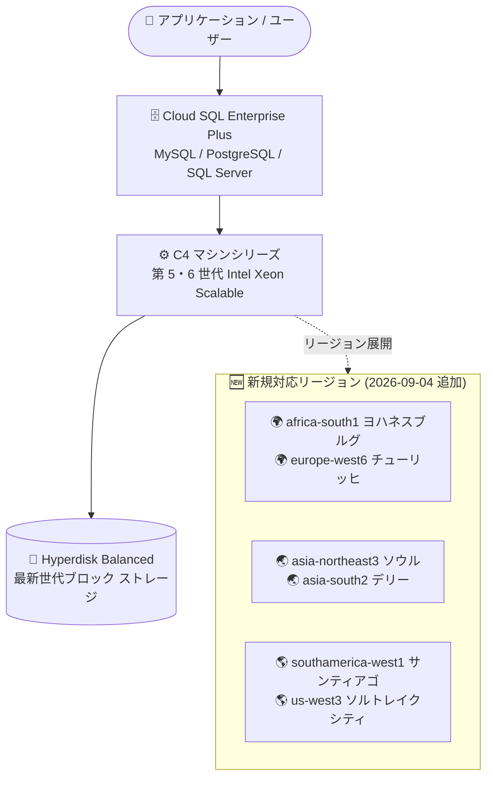

# Cloud SQL: C4 マシンシリーズが 6 つの新リージョンで利用可能に (MySQL / PostgreSQL / SQL Server)

**リリース日**: 2026-09-04

**サービス**: Cloud SQL for MySQL / Cloud SQL for PostgreSQL / Cloud SQL for SQL Server

**機能**: C4 マシンシリーズの提供リージョン拡大

**ステータス**: 一般提供 (Feature)

📊 [このアップデートのインフォグラフィックを見る](https://takech9203.github.io/google-cloud-news-summary/20260904-cloud-sql-c4-machine-series-new-regions.html)

## 概要

Cloud SQL の Enterprise Plus エディションで選択できる C4 マシンシリーズが、新たに 6 つのリージョン (africa-south1、asia-northeast3、asia-south2、europe-west6、southamerica-west1、us-west3) で利用可能になりました。本アップデートは MySQL、PostgreSQL、SQL Server の 3 エンジンすべてに共通する発表です。

C4 マシンシリーズは、第 5 世代 (コードネーム Emerald Rapids) および第 6 世代 (コードネーム Granite Rapids) の Intel Xeon Scalable プロセッサを搭載した x86 ベースのマシンシリーズで、一貫性のある予測可能な高パフォーマンスを提供します。ストレージには Google Cloud の最新世代ネットワーク ブロック ストレージである Hyperdisk Balanced を使用し、高負荷なデータベース ワークロードに適した価格性能バランスを実現します。

ソウル、デリー、チューリッヒなど、これまで C4 を選択できなかったリージョンのユーザーが、データ所在地の要件を維持したまま最新世代のマシンシリーズを採用できるようになった点が今回の価値です。

**アップデート前の課題**

- C4 マシンシリーズを利用できるリージョンが限られており、africa-south1 (ヨハネスブルグ)、asia-northeast3 (ソウル)、asia-south2 (デリー)、europe-west6 (チューリッヒ)、southamerica-west1 (サンティアゴ)、us-west3 (ソルトレイクシティ) の各リージョンでは選択できなかった
- これらのリージョンにデータを配置する必要があるワークロードでは、最新世代 Intel Xeon プロセッサと Hyperdisk Balanced ストレージの組み合わせによる性能メリットを享受できなかった
- 高性能なマシンシリーズを利用するには、データ所在地 (データレジデンシー) 要件とのトレードオフを迫られるケースがあった

**アップデート後の改善**

- 上記 6 リージョンで、MySQL / PostgreSQL / SQL Server の Enterprise Plus エディション インスタンスに C4 マシンシリーズを選択できるようになった
- アフリカ、アジア、ヨーロッパ、南米、北米にまたがる地理的カバレッジが拡大し、各地域のデータレジデンシー要件を満たしながら高性能インスタンスを構築できるようになった
- 第 5・第 6 世代 Intel Xeon Scalable プロセッサと Hyperdisk Balanced による価格性能バランスの高い構成を、より多くのリージョンで高負荷ワークロードに適用できるようになった

## アーキテクチャ図



C4 マシンシリーズを利用する Cloud SQL Enterprise Plus インスタンスの構成と、今回新たに対応した 6 リージョン (5 大陸にまたがる展開) を示しています。

## サービスアップデートの詳細

### 主要機能

1. **6 リージョンへの C4 マシンシリーズ展開**
   - africa-south1 (ヨハネスブルグ)、asia-northeast3 (ソウル)、asia-south2 (デリー)、europe-west6 (チューリッヒ)、southamerica-west1 (サンティアゴ)、us-west3 (ソルトレイクシティ) で利用可能に
   - MySQL / PostgreSQL / SQL Server の 3 エンジン共通で、Enterprise Plus エディション インスタンスが対象

2. **最新世代 Intel Xeon Scalable プロセッサ**
   - 第 5 世代 (Emerald Rapids) および第 6 世代 (Granite Rapids) の Intel Xeon Scalable プロセッサを搭載した x86 ベースのマシンシリーズ
   - 一貫性のある予測可能な高パフォーマンスを提供し、高負荷ワークロードに適した価格性能バランスを実現

3. **Hyperdisk Balanced ストレージ**
   - Google Cloud の最新世代ネットワーク ブロック ストレージである Hyperdisk Balanced を使用
   - N2 マシンシリーズが使用する Performance Persistent Disk (PD-SSD) とは異なる、新しいストレージ基盤

## 技術仕様

### C4 マシンタイプ (事前定義)

| マシンタイプ | vCPU | メモリ (GB) | オプションのデータキャッシュ (GB) |
|------|------|------|------|
| db-perf-optimized-C4-2 | 2 | 15 | 利用不可 |
| db-perf-optimized-C4-4 | 4 | 31 | 375 (MySQL) |
| db-perf-optimized-C4-8 | 8 | 62 | 375 (MySQL) |

### Enterprise Plus エディションのマシンシリーズ比較

| 項目 | C4 | C4A | N2 |
|------|------|------|------|
| アーキテクチャ | x86 (Intel Xeon 第 5・6 世代) | ARM (Google Axion) | x86 |
| ストレージ | Hyperdisk Balanced | Hyperdisk Balanced | PD-SSD |
| 最大構成 | 8 vCPU / 62 GB RAM | 72 vCPU / 576 GB RAM | 128 vCPU / 864 GB RAM |
| 特徴 | 高負荷ワークロード向けの価格性能最適化 | ARM ベースの価格性能最適化 | 幅広いワークロード向けのバランス型 |

## 設定方法

### 前提条件

1. Cloud SQL Enterprise Plus エディションを選択すること (Enterprise エディションでは C4 を選択不可)
2. 対応リージョン (今回追加の 6 リージョンを含む) にインスタンスを作成すること

### 手順

#### ステップ 1: C4 マシンシリーズを指定してインスタンスを作成

```bash
# 例: ソウル リージョンに C4 (4 vCPU / 31 GB) の PostgreSQL インスタンスを作成
gcloud sql instances create my-c4-instance \
    --database-version=POSTGRES_17 \
    --edition=ENTERPRISE_PLUS \
    --tier=db-perf-optimized-C4-4 \
    --region=asia-northeast3
```

`--tier` に `db-perf-optimized-C4-2` / `db-perf-optimized-C4-4` / `db-perf-optimized-C4-8` のいずれかを指定します。

#### ステップ 2: リージョンごとの対応状況を確認

各エンジンのリージョン別マシンシリーズ対応状況は、公式ドキュメントの「Regional availability」で確認できます (「参考リンク」参照)。

## メリット

### ビジネス面

- **データレジデンシー要件との両立**: 韓国、インド、スイス、南アフリカ、チリ、米国西部などの各地域にデータを保持する必要がある場合でも、最新世代の高性能マシンシリーズを選択可能
- **価格性能バランスの向上**: 高負荷ワークロードに適した価格性能バランスにより、コスト効率を維持しながら性能要件を満たせる

### 技術面

- **予測可能な高パフォーマンス**: 第 5・6 世代 Intel Xeon Scalable プロセッサにより、一貫性のある予測可能な性能を提供
- **最新ストレージ基盤**: Hyperdisk Balanced による最新世代のブロック ストレージを利用可能
- **3 エンジン共通の選択肢**: MySQL / PostgreSQL / SQL Server のいずれでも同じマシンシリーズ戦略を適用でき、マルチエンジン環境での標準化が容易

## デメリット・制約事項

### 制限事項

- C4 マシンシリーズは Cloud SQL Enterprise Plus エディションのみで利用可能 (Enterprise エディションでは選択不可)
- 事前定義マシンタイプは最大 8 vCPU / 62 GB RAM まで (N2 の最大 128 vCPU / 864 GB RAM、C4A の最大 72 vCPU / 576 GB RAM と比較して小規模構成のみ)
- 最小構成の db-perf-optimized-C4-2 ではデータキャッシュを利用できない

### 考慮すべき点

- 8 vCPU を超える大規模インスタンスが必要な場合は、N2 または C4A マシンシリーズの選択を検討する必要がある
- C4 の利用可能リージョンは限定されているため、マルチリージョン構成 (リードレプリカや DR 構成) を設計する際は各リージョンの対応状況を事前に確認する必要がある
- ストレージが Hyperdisk Balanced となるため、PD-SSD ベースの N2 からの移行時にはストレージ特性の違いを考慮する

## ユースケース

### ユースケース 1: 韓国・インド国内でのデータ保持要件がある高負荷 OLTP システム

**シナリオ**: 金融・公共系サービスなどで、データを asia-northeast3 (ソウル) や asia-south2 (デリー) に保持する必要があり、かつピーク時のトランザクション処理性能が求められる。

**実装例**:
```bash
gcloud sql instances create finance-db \
    --database-version=MYSQL_8_4 \
    --edition=ENTERPRISE_PLUS \
    --tier=db-perf-optimized-C4-8 \
    --region=asia-south2
```

**効果**: データ所在地要件を満たしながら、第 5・6 世代 Intel Xeon と Hyperdisk Balanced による予測可能な高パフォーマンスを実現できる。

### ユースケース 2: スイス (europe-west6) のコンプライアンス要件下での SQL Server 移行

**シナリオ**: スイス国内のデータ保持が求められるエンタープライズ システムを、オンプレミスの SQL Server から Cloud SQL for SQL Server へ移行する。

**効果**: これまで europe-west6 では選択できなかった C4 マシンシリーズが利用可能になり、コンプライアンス要件を維持しつつ最新世代のインフラ上へ移行できる。

## 料金

C4 マシンシリーズの料金は、Cloud SQL Enterprise Plus エディションの料金体系 (vCPU、メモリ、ストレージ、ネットワークの従量課金) に従い、リージョンごとに異なります。今回追加された 6 リージョンの具体的な単価は、公式の料金ページで確認してください。

- [Cloud SQL 料金ページ](https://cloud.google.com/sql/pricing)

## 利用可能リージョン

今回のアップデートで追加されたリージョン (MySQL / PostgreSQL / SQL Server 共通):

| リージョン | ロケーション |
|------|------|
| africa-south1 | ヨハネスブルグ |
| asia-northeast3 | ソウル |
| asia-south2 | デリー |
| europe-west6 | チューリッヒ |
| southamerica-west1 | サンティアゴ |
| us-west3 | ソルトレイクシティ |

最新のリージョン別対応状況は各エンジンの「Regional availability」ドキュメントを参照してください。

## 関連サービス・機能

- **Google Cloud Hyperdisk**: C4 マシンシリーズが使用する最新世代ネットワーク ブロック ストレージ (Hyperdisk Balanced)
- **Compute Engine C4 マシンシリーズ**: Cloud SQL の C4 の基盤となる、第 5・6 世代 Intel Xeon Scalable プロセッサ搭載の VM ファミリー
- **Cloud SQL Enterprise Plus エディション**: C4 を選択可能なエディション。99.99% の可用性 SLA、データキャッシュ、1 秒未満のメンテナンス ダウンタイムなどを提供
- **C4A マシンシリーズ**: ARM (Google Axion) ベースの代替選択肢。より大規模な構成 (最大 72 vCPU) に対応

## 参考リンク

- 📊 [インフォグラフィック](https://takech9203.github.io/google-cloud-news-summary/20260904-cloud-sql-c4-machine-series-new-regions.html)
- [公式リリースノート](https://docs.cloud.google.com/release-notes#September_04_2026)
- [マシンシリーズの概要 (MySQL)](https://docs.cloud.google.com/sql/docs/mysql/machine-series-overview)
- [マシンシリーズの概要 (PostgreSQL)](https://docs.cloud.google.com/sql/docs/postgres/machine-series-overview)
- [マシンシリーズの概要 (SQL Server)](https://docs.cloud.google.com/sql/docs/sqlserver/machine-series-overview)
- [リージョン別の利用可能状況 (MySQL)](https://docs.cloud.google.com/sql/docs/mysql/region-availability-overview)
- [リージョン別の利用可能状況 (PostgreSQL)](https://docs.cloud.google.com/sql/docs/postgres/region-availability-overview)
- [リージョン別の利用可能状況 (SQL Server)](https://docs.cloud.google.com/sql/docs/sqlserver/region-availability-overview)
- [料金ページ](https://cloud.google.com/sql/pricing)

## まとめ

C4 マシンシリーズの対応リージョンが 5 大陸にまたがる 6 リージョンへ拡大し、データレジデンシー要件のあるワークロードでも最新世代 Intel Xeon と Hyperdisk Balanced の性能メリットを享受できるようになりました。対象リージョンで Cloud SQL Enterprise Plus を運用中、または移行を計画中のチームは、高負荷ワークロードの新規インスタンスやレプリカ構成に C4 の採用を検討することを推奨します。ただし最大 8 vCPU という構成上限があるため、大規模インスタンスには N2 / C4A との比較検討が必要です。

---

**タグ**: Cloud SQL, MySQL, PostgreSQL, SQL Server, C4, マシンシリーズ, Enterprise Plus, リージョン拡大, Intel Xeon, Hyperdisk
