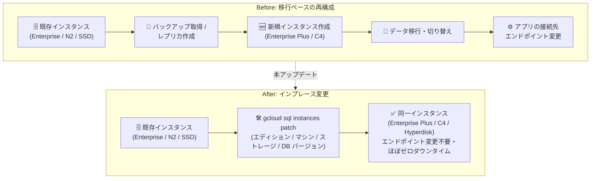

# Cloud SQL: インスタンス インフラストラクチャのインプレース アップグレード / ダウングレード対応

**リリース日**: 2026-09-04

**サービス**: Cloud SQL (MySQL / PostgreSQL / SQL Server)

**機能**: インプレース アップグレード / ダウングレード (エディション、マシンタイプ、ストレージタイプ、データベース バージョン)

**ステータス**: Feature

📊 [このアップデートのインフォグラフィックを見る](https://takech9203.github.io/google-cloud-news-summary/20260904-cloud-sql-in-place-upgrades.html)

## 概要

Cloud SQL が、インスタンスのインフラストラクチャに対するインプレース (in-place) でのアップグレードおよびダウングレードをサポートしました。本アップデートは Cloud SQL for MySQL、PostgreSQL、SQL Server の 3 エンジンすべてで同時に発表されており、以下の 4 つの構成要素をインスタンスを再作成することなくその場で変更できます。

- Cloud SQL インスタンスが使用する**エディション** (Enterprise ⇔ Enterprise Plus)
- **マシンタイプ** (N2、N4、C4、C4A、汎用専有コアなど)
- **ストレージタイプ** (SSD ⇔ Hyperdisk Balanced)
- **データベース バージョン**

公式ドキュメントでは、インプレース変更は「インスタンスを再構成する最も直接的でエラーが起こりにくい方法 (the most direct and least error-prone way)」と位置付けられています。特に Enterprise Plus エディションへのアップグレードは数分で完了し、ダウンタイムはほぼゼロ (near-zero downtime) で、アプリケーションが接続するエンドポイントの変更も不要です。既存の Cloud SQL インスタンスを運用しながら、より高性能な構成 (Enterprise Plus + C4/C4A + Hyperdisk Balanced) への段階的な移行を検討している運用チーム、DBA、Solutions Architect にとって重要なアップデートです。

**アップデート前の課題**

インスタンス構成の大幅な変更には、移行を伴う複雑な手順が必要になるケースがありました。

- エディションやマシンシリーズをまたぐ再構成では、新規インスタンスの作成とデータ移行 (バックアップ/リストアやレプリケーション) を組み合わせる必要があり、手順が多くエラーが混入しやすかった
- 移行方式ではアプリケーション側の接続先エンドポイント変更や切り替えタイミングの調整が必要だった
- ストレージタイプの異なるマシンシリーズ (例: SSD ベースの N2 から Hyperdisk Balanced ベースの C4) への変更が、単一の操作として完結しなかった

**アップデート後の改善**

- エディション、マシンタイプ、ストレージタイプ、データベース バージョンの 4 要素を、既存インスタンスに対するインプレース操作 (Console の Edit または `gcloud sql instances patch`) で変更できるようになった
- Enterprise Plus エディションへのアップグレードは数分で完了し、ダウンタイムはほぼゼロ。アップグレード / ダウングレードのどちらもエンドポイント変更が不要になった
- SSD から Hyperdisk Balanced へのストレージ移行がマシンシリーズ変更に伴って自動的に行われ、最小限のダウンタイムで完了するようになった

## アーキテクチャ図



従来はバックアップ/リストアや切り替えを伴う移行が必要だった構成変更が、1 回のインプレース操作で完結し、エンドポイント変更も不要になります。

## サービスアップデートの詳細

### 主要機能

1. **エディションのインプレース変更 (Enterprise ⇔ Enterprise Plus)**
   - Enterprise Plus へのアップグレードは数分で完了し、ダウンタイムはほぼゼロ
   - Enterprise へのダウングレード (切り戻し) も可能だが、こちらはより長いダウンタイムが発生する
   - いずれの場合もアプリケーションが接続するエンドポイントの変更は不要
   - MySQL では、アップグレード時にデータキャッシュがデフォルトで有効化される (`--no-enable-data-cache` で無効化可能)。PostgreSQL では `--enable-data-cache` フラグで任意に有効化できる

2. **マシンタイプのインプレース変更**
   - Enterprise → Enterprise Plus のアップグレード時は N2、C4A、C4 マシンシリーズから選択 (SQL Server は N2、メモリ最適化 N2、C4)
   - Enterprise Plus → Enterprise のダウングレード時は汎用専有コアまたは N4 マシンシリーズから選択
   - エディションを変えずにマシンタイプのみを変更することも可能。vCPU 数の変更やデータキャッシュの有効化/無効化も同時に指定できる

3. **ストレージタイプのインプレース変更 (SSD → Hyperdisk Balanced)**
   - 汎用または N2 マシンシリーズから N4、C4A、C4 へ変更すると、ストレージが SSD から Google Cloud Hyperdisk Balanced に移行される。この移行のダウンタイムは通常最小限
   - Hyperdisk Balanced ではストレージ容量、プロビジョンド IOPS、プロビジョンド スループットをカスタマイズ可能。デフォルト値と上限はマシンタイプとストレージ容量に基づいて設定される

4. **データベース バージョンのインプレース変更**
   - データベースのメジャー バージョンをインプレースでアップグレード可能 (各エンジンの「Upgrade the database major version in-place」に手順が記載)
   - アップグレード失敗時に備えて、アップグレード前の自動バックアップ (pre-upgrade backup) からリカバリ インスタンスを作成して切り戻す手順が用意されている

## 技術仕様

### エンジン別の前提条件

| エンジン | 前提条件 |
|------|------|
| MySQL | MySQL 8.0.31 以降で稼働していること (それより古い場合は先にバージョン アップグレードが必要) |
| PostgreSQL | PostgreSQL 12 以降で稼働していること |
| SQL Server | SQL Server Enterprise 2019 または 2022 で稼働していること。ネットワーク プロジェクトが 2021 年 8 月以降に作成されたか、新ネットワーク アーキテクチャへ完全アップグレード済みであること |

### エディション変更時のマシンシリーズ選択肢

| 変更方向 | 選択可能なマシンシリーズ |
|------|------|
| Enterprise → Enterprise Plus (MySQL / PostgreSQL) | N2、C4A、C4 |
| Enterprise → Enterprise Plus (SQL Server) | N2、メモリ最適化 N2、C4 |
| Enterprise Plus → Enterprise | 汎用専有コア、N4 (共有コアへのダウングレードは不可) |

## 設定方法

### 前提条件

1. 対象インスタンスが上記のエンジン別前提条件 (データベース バージョンなど) を満たしていること
2. マシンシリーズ変更に伴うストレージタイプの変更 (SSD → Hyperdisk Balanced) が発生するかどうかを事前に確認しておくこと

### 手順

#### ステップ 1: エディションをインプレースでアップグレード (gcloud)

```bash
gcloud sql instances patch INSTANCE_ID \
  --edition=enterprise-plus \
  --tier=MACHINE_TYPE \
  --project=PROJECT_ID
```

`MACHINE_TYPE` には Enterprise Plus 対応のマシンタイプ (例: `db-perf-optimized-N-2`、`db-c4a-highmem-2`) を指定します。PostgreSQL でデータキャッシュを有効にする場合は `--enable-data-cache` を追加します (MySQL ではデフォルトで有効)。

#### ステップ 2: Console から変更する場合

Google Cloud コンソールの Cloud SQL インスタンス一覧からインスタンスを開き、**Edit** をクリックします。「Choose a Cloud SQL edition」セクションで **Upgrade** (Enterprise の場合) または **Switch to Enterprise** (Enterprise Plus の場合) を選択し、新しいエディションでの構成 (マシンタイプ、データキャッシュなど) を指定します。インスタンス ID を入力して確定すると変更が開始されます。

## メリット

### ビジネス面

- **移行プロジェクトの簡素化**: 新規インスタンス作成とデータ移行を伴う再構成プロジェクトが、1 回のインプレース操作に置き換わり、計画・実行コストを削減できる
- **サービス影響の最小化**: Enterprise Plus へのアップグレードはほぼゼロダウンタイムで完了し、エンドポイント変更も不要なため、アプリケーション停止の調整が最小限で済む

### 技術面

- **エラーの削減**: 公式ドキュメントが「最も直接的でエラーが起こりにくい方法」と位置付ける通り、バックアップ/リストアや接続切り替えといった手作業のミスが入り込む余地が減る
- **高性能構成への移行パスの確立**: Enterprise Plus + C4/C4A マシン + Hyperdisk Balanced (IOPS/スループットのプロビジョニング可能) という高性能スタックへ、既存インスタンスから段階的に移行できる
- **可逆性**: アップグレードだけでなくダウングレードもサポートされるため、要件に合わなかった場合の切り戻し経路が用意されている

## デメリット・制約事項

### 制限事項

- Enterprise Plus から Enterprise へのダウングレードは、アップグレードに比べて長いダウンタイムが発生する
- Enterprise エディションの汎用共有コア (shared core) マシンシリーズへのダウングレードはできない
- HDD ストレージとの間の移行 (HDD への変更、HDD からの変更) はできない
- N4 / C4 / C4A から汎用専有コアや N2 へ戻す際の Hyperdisk Balanced → SSD のデータ移動は、大きなダウンタイムが発生する可能性がある

### 考慮すべき点

- エディションやマシンタイプの変更に伴いストレージタイプが変わる場合、ある程度のダウンタイムとストレージ コストの変化が発生し得る
- PITR 用トランザクション ログをディスクに保存している Enterprise エディション インスタンスを Enterprise Plus にアップグレードすると、ログの保存先がディスクから Cloud Storage に移動する (MySQL はバイナリログ、PostgreSQL は WAL)
- SQL Server で `max server memory (mb)` フラグを設定している場合、Enterprise Plus へのアップグレード後はフラグを削除して Cloud SQL による自動管理に任せることが推奨される
- クライアント側の接続設定 (接続プーリング、クエリ タイムアウトなど) は観測されるダウンタイムに影響するため、事前にアプリケーション構成でのテストが推奨される

## ユースケース

### ユースケース 1: Enterprise から Enterprise Plus への性能アップグレード

**シナリオ**: N2 マシンの Cloud SQL Enterprise エディション (PostgreSQL) で稼働する基幹システムの読み取り性能を強化したい。データキャッシュや近ゼロダウンタイム メンテナンスなど Enterprise Plus の機能も利用したいが、エンドポイント変更を伴う移行は避けたい。

**実装例**:
```bash
gcloud sql instances patch prod-db \
  --edition=enterprise-plus \
  --tier=db-perf-optimized-N-8 \
  --enable-data-cache \
  --project=my-project
```

**効果**: 数分・ほぼゼロダウンタイムで Enterprise Plus に移行でき、アプリケーションの接続設定変更が不要。データキャッシュにより読み取り性能の向上も期待できる。

### ユースケース 2: C4/C4A + Hyperdisk Balanced への段階的モダナイゼーション

**シナリオ**: SSD ベースの N2 インスタンスを、最新の C4A マシンシリーズと Hyperdisk Balanced ストレージに移行し、ワークロードに合わせて IOPS とスループットをプロビジョニングしたい。

**効果**: マシンタイプの変更に伴い、ストレージが SSD から Hyperdisk Balanced へ最小限のダウンタイムで自動移行される。移行後はストレージ容量・IOPS・スループットを個別にチューニングでき、インスタンス再作成やデータ移行作業は不要。

## 料金

インプレース アップグレード / ダウングレード機能自体に追加料金はありませんが、変更後の構成 (エディション、マシンタイプ、ストレージタイプ) に応じた料金が適用されます。特に以下に注意してください。

- Enterprise Plus エディションは Enterprise エディションと料金体系が異なる
- Hyperdisk Balanced への移行によりストレージ コストが変化する可能性がある (プロビジョンド IOPS / スループットの課金を含む)

詳細は [Cloud SQL の料金ページ](https://cloud.google.com/sql/pricing) を参照してください。

## 利用可能リージョン

リージョン固有の制限は Release Notes に記載されていません。エディション / マシンシリーズごとの利用可能リージョンは各エンジンの [マシンシリーズの概要](https://docs.cloud.google.com/sql/docs/mysql/machine-series-overview) を参照してください。

## 関連サービス・機能

- **Cloud SQL Enterprise Plus エディション**: 本機能の主要な移行先。データキャッシュ、近ゼロダウンタイム メンテナンス (計画メンテナンス時の接続断が通常 1 秒未満) などの性能・可用性強化を提供
- **Google Cloud Hyperdisk Balanced**: C4 / C4A / N4 マシンシリーズが使用するストレージ。容量・IOPS・スループットを個別にプロビジョニング可能
- **Cloud Storage**: Enterprise Plus へのアップグレード時に、PITR 用トランザクション ログの保存先がディスクから Cloud Storage へ移動する
- **Cloud Logging**: データベース バージョン アップグレードのエラーログの確認に使用 (`cloudsql.googleapis.com` のログを Logs Explorer で参照)

## 参考リンク

- 📊 [インフォグラフィック](https://takech9203.github.io/google-cloud-news-summary/20260904-cloud-sql-in-place-upgrades.html)
- [公式リリースノート](https://docs.cloud.google.com/release-notes#September_04_2026)
- [ドキュメント: Upgrade in place (MySQL)](https://docs.cloud.google.com/sql/docs/mysql/upgrade-in-place)
- [ドキュメント: Upgrade in place (PostgreSQL)](https://docs.cloud.google.com/sql/docs/postgres/upgrade-in-place)
- [ドキュメント: Upgrade in place (SQL Server)](https://docs.cloud.google.com/sql/docs/sqlserver/upgrade-in-place)
- [料金ページ](https://cloud.google.com/sql/pricing)

## まとめ

Cloud SQL のエディション、マシンタイプ、ストレージタイプ、データベース バージョンをインスタンス再作成なしで変更できるようになり、特に Enterprise Plus への移行がほぼゼロダウンタイム・エンドポイント変更不要で実現できるようになりました。Enterprise エディションや旧世代マシンシリーズで稼働中のインスタンスを持つチームは、前提条件 (データベース バージョン、ストレージ変更の影響、PITR ログの保存先移動) を確認のうえ、Enterprise Plus + C4/C4A + Hyperdisk Balanced への段階的なアップグレードを検討することを推奨します。

---

**タグ**: Cloud SQL, MySQL, PostgreSQL, SQL Server, In-place Upgrade, Enterprise Plus, Hyperdisk Balanced, Database
