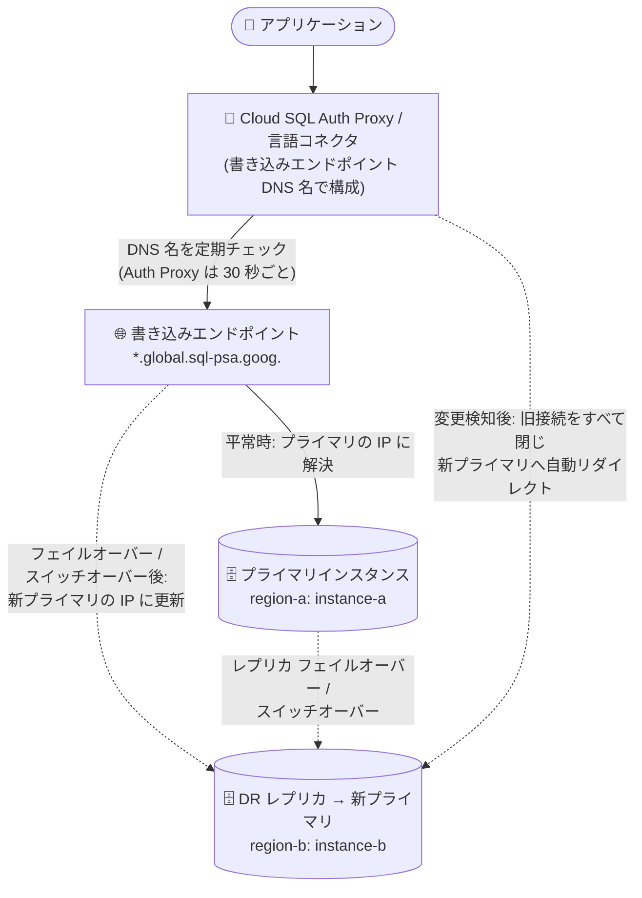

# Cloud SQL for SQL Server: 書き込みエンドポイントによる Auth Proxy / 言語コネクタ接続のサポート

**リリース日**: 2026-09-04

**サービス**: Cloud SQL for SQL Server

**機能**: 書き込みエンドポイント (Write Endpoint) を使用した Cloud SQL Auth Proxy / Cloud SQL 言語コネクタ接続

**ステータス**: GA (Feature)

📊 [このアップデートのインフォグラフィックを見る](https://takech9203.github.io/google-cloud-news-summary/20260904-cloud-sql-sql-server-write-endpoint-connectors.html)

## 概要

Cloud SQL for SQL Server で、書き込みエンドポイント (Write Endpoint) を持つインスタンスに対して、Cloud SQL Auth Proxy または Cloud SQL 言語コネクタ (Language Connectors) を使用して接続できるようになりました。書き込みエンドポイントは、現在のプライマリインスタンスの IP アドレスに自動的に解決されるグローバルな DNS 名で、`.global.sql-psa.goog.` というサフィックスを持ちます (例: `primary.103uufa2svq8u.2rb3qdj9tkf4d.global.sql-psa.goog.`)。

Auth Proxy や言語コネクタを書き込みエンドポイントの DNS 名で構成すると、コネクタが DNS 名の参照先の変化を定期的にチェックします。クロスリージョンレプリカのフェイルオーバーやスイッチオーバーが発生して DNS 名が新しいプライマリインスタンスを指すようになると、コネクタは旧インスタンスへのオープン中の接続をすべて閉じ、以降の接続を新しいプライマリインスタンスへ自動的にリダイレクトします。

このアップデートにより、リージョン障害からの復旧や DR (ディザスタリカバリ) 訓練を行う際に、Auth Proxy / 言語コネクタ経由で接続している SQL Server アプリケーションの接続文字列を変更する必要がなくなります。Cloud SQL Enterprise Plus エディションでクロスリージョンレプリカを利用する SQL Server ユーザー、特に DR 構成を運用するチームにとって重要な機能です。

**アップデート前の課題**

- Cloud SQL for SQL Server の書き込みエンドポイントは、`sqlcmd` などのクライアントから直接 SQL 接続文字列に指定する使い方が中心で、Cloud SQL Auth Proxy や言語コネクタは書き込みエンドポイントでの接続に対応していなかった
- Auth Proxy / 言語コネクタは通常インスタンス接続名 (`project:region:instance`) で特定のインスタンスに接続するため、レプリカのフェイルオーバーやスイッチオーバーで別のインスタンスがプライマリに昇格した場合、接続先の変更 (プロキシの再構成やアプリケーションの設定変更) が必要だった
- DR 訓練やリージョン障害復旧のたびに、アプリケーション側の接続設定変更という運用負荷とミスのリスクが存在した

**アップデート後の改善**

- Cloud SQL Auth Proxy / Cloud SQL 言語コネクタを書き込みエンドポイントの DNS 名で構成できるようになり、コネクタがスイッチオーバー / フェイルオーバーを定期的に検知するようになった
- DNS 名の参照先インスタンスが変わったことをコネクタが検知すると、旧インスタンスへのオープン接続を自動的に閉じ、以降の接続試行を新しいプライマリインスタンスへ自動リダイレクトする
- フェイルオーバー / スイッチオーバー時にアプリケーションの接続文字列やプロキシ設定を変更する必要がなくなり、DR 運用が簡素化された

## アーキテクチャ図



書き込みエンドポイント DNS 名で構成された Auth Proxy / 言語コネクタは DNS 名の参照先を定期的にチェックし、フェイルオーバーやスイッチオーバーで DNS レコードが新プライマリに更新されると、旧インスタンスへの接続を閉じて以降の接続を新プライマリへ自動的に振り向けます。

## サービスアップデートの詳細

### 主要機能

1. **書き込みエンドポイント DNS 名による Auth Proxy / 言語コネクタの構成**
   - Cloud SQL Auth Proxy の起動時に、インスタンス接続名の代わりに書き込みエンドポイント DNS 名を指定できる
   - Cloud SQL 言語コネクタ (Java、Python、Go などの Cloud SQL Connector) でも同様に書き込みエンドポイント DNS 名を指定可能

2. **フェイルオーバー / スイッチオーバーの自動検知と接続リダイレクト**
   - コネクタは書き込みエンドポイント DNS 名が別のインスタンスを参照するようになったかを定期的にチェックする (Cloud SQL Auth Proxy は 30 秒ごとに DNS 名の変更をポーリング)
   - 変更を検知すると、旧インスタンスへのオープン接続をすべて閉じ、以降の接続試行を新しいプライマリインスタンスへ振り向ける
   - 例: DNS レコードが `my-project:region:instance-a` から DR レプリカの `my-project:other-region:instance-b` に更新されると、アプリケーションは同じ DNS 名のまま新プライマリに接続される

3. **接続プールとの連携**
   - コネクタが旧インスタンスへの既存接続を強制的に閉じることで、アプリケーションの接続プールが新しい接続を確立し直すことを促す

## 技術仕様

### 書き込みエンドポイントの仕様

| 項目 | 詳細 |
|------|------|
| 形式 | グローバル DNS 名 (例: `primary.103uufa2svq8u.2rb3qdj9tkf4d.global.sql-psa.goog.`) |
| サフィックス | 常に `.global.sql-psa.goog.` で終わる (名前・形式は変更不可、Cloud SQL が管理) |
| 解決先 | 現在のプライマリインスタンスのプライベート IP アドレス (フェイルオーバー / スイッチオーバー時に自動更新) |
| 用途 | 書き込み (INSERT / UPDATE / DELETE / DDL) と読み取り (クエリ) の両方に使用可能 |
| DNS 変更のポーリング間隔 | Cloud SQL Auth Proxy は 30 秒ごと |
| 内部アーキテクチャ | サービスプロデューサー VPC のプライベート DNS ゾーン + 顧客 VPC のピアリング DNS ゾーン + DNS レコードで構成 |

### 書き込みエンドポイントの生成要件

| 要件 | 詳細 |
|------|------|
| エディション | Cloud SQL Enterprise Plus エディション |
| ネットワーク | プライベート IP + プライベートサービスアクセス (PSA) が有効 |
| ネットワークアーキテクチャ | 新ネットワークアーキテクチャ上のインスタンスであること |
| 必要な API | Compute Engine API と Cloud DNS API がプロジェクトで有効化されていること |

Enterprise Plus エディションのインスタンスで書き込みエンドポイントがまだない場合は、高度なディザスタリカバリ (Advanced DR) を有効にしたレプリカを作成すると、Cloud SQL が書き込みエンドポイントを自動生成します。

## 設定方法

### 前提条件

1. Cloud SQL Enterprise Plus エディションの SQL Server インスタンスであること
2. プライベート IP + プライベートサービスアクセス (PSA) が有効で、新ネットワークアーキテクチャ上にあること
3. プロジェクトで Compute Engine API と Cloud DNS API が有効化されていること

### 手順

#### ステップ 1: 書き込みエンドポイントを確認する

```bash
gcloud sql instances describe INSTANCE_NAME | grep writeEndpoint
```

`.global.sql-psa.goog.` サフィックスで終わる DNS 名が表示されます。

#### ステップ 2: (必要な場合) インスタンスのネットワーク構成を更新する

2025 年 8 月 8 日より前に作成されたインスタンスでは、Auth Proxy / 言語コネクタが書き込みエンドポイントを使用できるように、インスタンスごとに 1 回だけ以下の更新が必要になる場合があります。

```bash
gcloud alpha sql instances patch "PRIMARY_NAME" \
  --reconcile-psa-networking
```

#### ステップ 3: Auth Proxy を書き込みエンドポイントで起動する

インスタンス接続名の代わりに書き込みエンドポイント DNS 名を指定して Cloud SQL Auth Proxy を起動します。

```bash
cloud-sql-proxy --port PORT WRITE_ENDPOINT
```

その後、データベースクライアント (例: `sqlcmd`) を `127.0.0.1:PORT` に向けて接続します。フェイルオーバー / スイッチオーバー後も同じ設定のまま新プライマリへ接続されます。

## メリット

### ビジネス面

- **DR 運用の簡素化**: リージョン障害復旧や DR 訓練の際に、アプリケーションの接続設定変更が不要になり、復旧手順が短縮・簡素化される
- **人的ミスの削減**: フェイルオーバー時の手動での接続先切り替え作業がなくなり、設定変更ミスによる二次障害のリスクを低減できる

### 技術面

- **接続文字列の不変性**: アプリケーションは常に同じ書き込みエンドポイント DNS 名を使い続けられ、プライマリの所在 (リージョン / インスタンス) を意識する必要がない
- **自動接続クリーンアップ**: コネクタが旧プライマリへの接続を自動的に閉じるため、接続プールが確実に新プライマリへ再接続する
- **Auth Proxy / 言語コネクタの利点を維持**: IAM ベースの認証や TLS 暗号化など、Auth Proxy / コネクタの既存のセキュリティ上の利点をそのまま享受しつつ DR 対応が可能

## デメリット・制約事項

### 制限事項

- 書き込みエンドポイントは Cloud SQL Enterprise Plus エディションのみで利用可能 (Enterprise エディションのインスタンス作成では利用不可)
- パブリック IP のみのインスタンス、および Private Service Connect (PSC) のみのインスタンスでは書き込みエンドポイントを利用できない (プライベートサービスアクセス構成が必要)
- 2025 年 8 月 8 日より前に作成されたインスタンスでは、`--reconcile-psa-networking` によるネットワーク構成の更新が必要になる場合がある

### 考慮すべき点

- スイッチオーバー / フェイルオーバー時には、コネクタ / Auth Proxy がオープン中のデータベース接続をすべて強制終了する。実行中のクエリが失敗する可能性があるため、スイッチオーバーやフェイルオーバーを開始する前にアプリケーションオーナーへ通知することが推奨される
- Cloud SQL Auth Proxy の DNS 変更ポーリング間隔は 30 秒のため、切り替え検知までに最大でその程度のタイムラグが生じる
- ピアリング DNS ゾーンは作成後に変更・削除しないこと。変更すると DNS 名がデータベース接続に使用できなくなる

## ユースケース

### ユースケース 1: クロスリージョン DR 構成での自動接続切り替え

**シナリオ**: SQL Server を利用する基幹システムで、リージョン障害に備えて別リージョンに DR レプリカを配置している。フェイルオーバー時にアプリケーション側の設定変更なしで新プライマリへ接続を切り替えたい。

**実装例**:
```bash
# 書き込みエンドポイントを確認
gcloud sql instances describe my-sqlserver-primary | grep writeEndpoint

# Auth Proxy を書き込みエンドポイントで起動
cloud-sql-proxy --port 1433 primary.103uufa2svq8u.2rb3qdj9tkf4d.global.sql-psa.goog.
```

**効果**: フェイルオーバー時に Cloud SQL が DNS レコードを新プライマリに更新し、Auth Proxy が変更を検知して自動的に接続をリダイレクトするため、アプリケーションの設定変更やプロキシの再起動が不要になる。

### ユースケース 2: 定期的な DR 訓練 (スイッチオーバー) の運用負荷削減

**シナリオ**: コンプライアンス要件として定期的な DR 訓練 (計画的なスイッチオーバー) を実施しているが、訓練のたびに各アプリケーションチームが接続設定を変更する調整コストが大きい。

**効果**: 全アプリケーションが書き込みエンドポイント DNS 名で Auth Proxy / 言語コネクタを構成していれば、スイッチオーバーの実行だけで接続が自動的に新プライマリへ切り替わり、訓練にかかる調整・作業コストを大幅に削減できる。実行中の接続は強制終了されるため、事前通知のみ徹底すればよい。

## 料金

書き込みエンドポイント機能は Cloud SQL Enterprise Plus エディションで利用できます。Cloud SQL Auth Proxy および Cloud SQL 言語コネクタ自体に追加料金はありませんが、Enterprise Plus エディションおよびクロスリージョンレプリカの料金が適用されます。詳細は [Cloud SQL の料金ページ](https://cloud.google.com/sql/pricing) を参照してください。

## 関連サービス・機能

- **Cloud SQL Auth Proxy**: IAM ベースの認可と TLS 暗号化を提供する接続プロキシ。今回のアップデートで SQL Server の書き込みエンドポイント DNS 名による起動に対応
- **Cloud SQL 言語コネクタ**: Java / Python / Go などのアプリケーションから Auth Proxy と同等のセキュアな接続を実現するライブラリ群。同様に書き込みエンドポイントに対応
- **Cloud SQL 高度なディザスタリカバリ (Advanced DR)**: クロスリージョンレプリカのスイッチオーバー / レプリカフェイルオーバーを提供する Enterprise Plus の機能。書き込みエンドポイントはこの DR 構成と組み合わせて使用する
- **Cloud DNS**: 書き込みエンドポイントの実体はプライベート DNS ゾーンとピアリング DNS ゾーンで実現されており、Cloud DNS API の有効化が前提条件
- **プライベートサービスアクセス (PSA)**: 書き込みエンドポイントは PSA 構成のプライベート IP インスタンスでのみ利用可能

## 参考リンク

- 📊 [インフォグラフィック](https://takech9203.github.io/google-cloud-news-summary/20260904-cloud-sql-sql-server-write-endpoint-connectors.html)
- [公式リリースノート](https://docs.cloud.google.com/release-notes#September_04_2026)
- [ドキュメント: Connect to an instance using a write endpoint (SQL Server)](https://docs.cloud.google.com/sql/docs/sqlserver/connect-to-instance-using-write-endpoint)
- [ドキュメント: Cloud SQL Auth Proxy (SQL Server)](https://docs.cloud.google.com/sql/docs/sqlserver/sql-proxy)
- [料金ページ](https://cloud.google.com/sql/pricing)

## まとめ

Cloud SQL for SQL Server の書き込みエンドポイントが Cloud SQL Auth Proxy / 言語コネクタに対応したことで、クロスリージョン DR 構成におけるフェイルオーバー / スイッチオーバー時の接続切り替えが完全に自動化されました。Enterprise Plus エディションで DR 構成を運用している、または検討している SQL Server ユーザーは、Auth Proxy / 言語コネクタの接続設定を書き込みエンドポイント DNS 名へ移行することを推奨します。2025 年 8 月 8 日以前に作成したインスタンスでは `--reconcile-psa-networking` によるネットワーク構成の更新が必要な場合がある点に注意してください。

---

**タグ**: Cloud SQL, SQL Server, 書き込みエンドポイント, Cloud SQL Auth Proxy, 言語コネクタ, ディザスタリカバリ, フェイルオーバー, スイッチオーバー, Enterprise Plus
