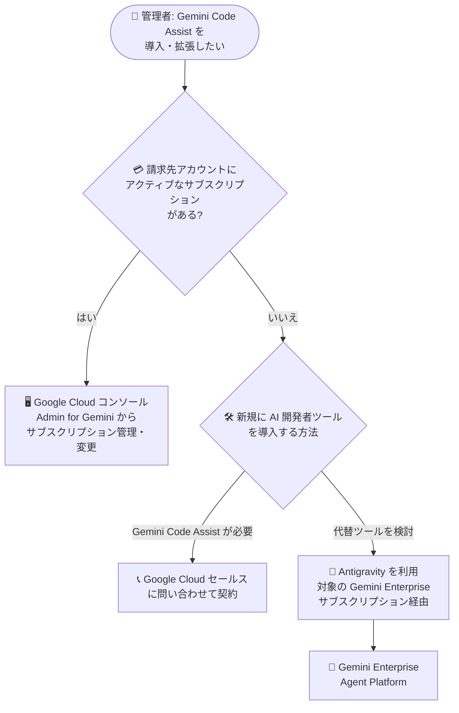

# Gemini: Gemini Code Assist サブスクリプションのコンソール購入条件変更

**リリース日**: 2026-09-04

**サービス**: Gemini (Gemini Code Assist)

**機能**: 新規サブスクリプション購入経路の変更

**ステータス**: 発表 (Announcement)

📊 [このアップデートのインフォグラフィックを見る](https://takech9203.github.io/google-cloud-news-summary/20260904-gemini-code-assist-subscription-purchase-change.html)

## 概要

Google Cloud は、Gemini Code Assist の新規サブスクリプション購入に関する重要な変更を発表しました。**アクティブな Gemini Code Assist サブスクリプションを持たない請求先アカウントでは、Google Cloud コンソールから新規サブスクリプションを購入できなくなります。** 現在アクティブなサブスクリプションを持っている請求先アカウントは影響を受けず、引き続きコンソールからサブスクリプションを管理・変更できます。

アクティブなサブスクリプションを持たない請求先アカウントが新規に Gemini Code Assist サブスクリプションを取得するには、Google Cloud セールスへの問い合わせが必要になります。また、代替の AI 開発者ツールとして、対象の Gemini Enterprise サブスクリプションおよび Gemini Enterprise Agent Platform を通じて利用可能な **Antigravity** が案内されています。

この変更は、2026 年 6 月 18 日に Gemini Code Assist for individuals 向けの IDE 拡張機能と Gemini CLI がリクエストの提供を停止し、Antigravity への移行が案内された流れに続くものです。Google は AI 開発者ツールを Antigravity を中心としたマルチエージェントプラットフォームへ統合する方針を進めており、今回の発表は組織向け (Standard / Enterprise) の新規購入経路にも変化が及んだことを示しています。ライセンス調達や AI 開発ツールの導入計画に関わる管理者・購買担当者は、影響範囲を正確に把握しておく必要があります。

**アップデート前の課題 (変更前の状態)**

変更前は、以下の方法でセルフサービス購入が可能でした。

- `consumerprocurement.orders.place` IAM 権限を持つユーザーが、Google Cloud コンソールの「Admin for Gemini」ページから「Get Gemini Code Assist」を選択し、任意の請求先アカウントで新規サブスクリプションを購入できた
- Standard / Enterprise エディションの選択、ライセンス数、契約期間 (月次 / 年次) をコンソール上で設定し、セールスを介さずに即時契約できた

**アップデート後の変更**

- アクティブな Gemini Code Assist サブスクリプションを持たない請求先アカウントは、コンソール経由での新規サブスクリプション購入ができなくなった
- 新規にサブスクリプションを取得するには、Google Cloud セールスへの問い合わせが必要になった
- アクティブなサブスクリプションを持つ請求先アカウントは影響を受けない
- 代替の AI 開発者ツールとして、対象の Gemini Enterprise サブスクリプションおよび Gemini Enterprise Agent Platform で利用できる Antigravity が案内された

## アーキテクチャ図

今回の変更後にサブスクリプションを取得・管理する際の判断フローです。アクティブなサブスクリプションの有無によって、コンソールでの継続管理、セールス経由での新規契約、Antigravity への移行という 3 つの経路に分かれます。

## サービスアップデートの詳細

### 主要変更点

1. **コンソールからの新規購入の停止 (未契約アカウント)**
   - アクティブな Gemini Code Assist サブスクリプションを持たない請求先アカウントは、Google Cloud コンソールから新規サブスクリプションを購入できない
   - 従来は「Admin for Gemini」ページからエディション選択・ライセンス数設定・契約期間設定を行い、セルフサービスで購入できていた

2. **既存契約アカウントへの影響なし**
   - 現在アクティブなサブスクリプションを持つ請求先アカウントは影響を受けない
   - ライセンス数の追加・削減などのサブスクリプション変更は、引き続きコンソールまたは Google アカウント担当者・認定リセラー経由で可能

3. **新規契約はセールス経由に一本化**
   - アクティブなサブスクリプションを持たない請求先アカウントが新規契約する場合は、Google Cloud セールスへの問い合わせが必要

4. **代替ツールとして Antigravity を案内**
   - 対象の Gemini Enterprise サブスクリプション (Standard、Plus、Standard Emerging Market、Pay-as-you-go の各エディション) を通じて Antigravity が利用可能
   - Gemini Enterprise Agent Platform 経由でも利用可能
   - Antigravity には Antigravity 2.0、Antigravity CLI、Antigravity for IDEs、Android Studio 連携が含まれる

## 技術仕様

### 変更内容の整理

| 項目 | 変更前 | 変更後 |
|------|--------|--------|
| 新規購入 (未契約の請求先アカウント) | コンソールからセルフサービス購入可能 | コンソール購入不可。Google Cloud セールスへの問い合わせが必要 |
| 既存サブスクリプションの管理・変更 | コンソールで可能 | 変更なし (引き続き可能) |
| 購入に必要な IAM 権限 (従来のコンソール購入) | `consumerprocurement.orders.place` (`roles/billing.admin` または `roles/consumerprocurement.orderAdmin` に含まれる) | 既存契約アカウントの管理では引き続き同権限を使用 |
| 代替の AI 開発者ツール | - | Antigravity (対象の Gemini Enterprise サブスクリプション / Gemini Enterprise Agent Platform 経由) |

### 代替ツール Antigravity の利用要件 (Gemini Enterprise 経由)

公式ドキュメントによると、Gemini Enterprise の AI developer tools (Antigravity を含む) の利用には以下が必要です。

| 要件 | 詳細 |
|------|------|
| 対応エディション | Gemini Enterprise Standard、Plus、Standard Emerging Market、Pay-as-you-go |
| 請求先アカウント | 請求書発行 (invoiced) タイプの Cloud Billing アカウント |
| 必要な API | Gemini Enterprise API (`discoveryengine.googleapis.com`)、Business AI Code API (`businessaicode.googleapis.com`) |
| 必要な IAM ロール | 設定: Gemini Enterprise Admin (`roles/discoveryengine.agentspaceAdmin`)、利用: Gemini Enterprise User (`roles/discoveryengine.agentspaceUser`) |

## 影響と対応方法

### 影響を受けるかどうかの確認

1. Google Cloud コンソールの「Admin for Gemini」ページで、請求先アカウントに紐づくアクティブな Gemini Code Assist サブスクリプションの有無を確認する
2. アクティブなサブスクリプションがある場合: 影響なし。従来どおりコンソールでライセンス管理・サブスクリプション変更が可能
3. アクティブなサブスクリプションがない場合: コンソールからの新規購入は不可

### 対応の選択肢

#### 選択肢 1: Google Cloud セールス経由で Gemini Code Assist を契約

新規に Gemini Code Assist サブスクリプションが必要な場合は、[Google Cloud セールスへの問い合わせ](https://cloud.google.com/contact/)を通じて契約します。

#### 選択肢 2: Antigravity への移行を検討

対象の Gemini Enterprise サブスクリプションを保有している (または導入を検討している) 場合は、AI developer tools として Antigravity (Antigravity 2.0、Antigravity CLI、Antigravity for IDEs、Android Studio 連携) を利用できます。Gemini Enterprise Agent Platform 経由での利用も可能です。

## メリット

### ビジネス面

- **既存契約者への影響なし**: アクティブなサブスクリプションを持つ組織は、運用を変更する必要がない
- **セールス経由の契約による柔軟性**: 既存の Google Cloud 契約と合わせた条件交渉や、組織の規模に応じた提案を受けられる可能性がある
- **Antigravity という統合された選択肢**: エージェント型 AI 開発環境 (Antigravity 2.0、CLI、IDE 拡張、Android Studio) を Gemini Enterprise サブスクリプションでまとめて利用できる

### 技術面

- **ツール統合の方向性が明確化**: Google の AI 開発者ツールが Antigravity を中心としたマルチエージェントプラットフォームに統合される流れが明確になり、長期的なツール選定の判断材料になる

## デメリット・制約事項

### 制限事項

- アクティブなサブスクリプションを持たない請求先アカウントは、コンソールからのセルフサービス購入ができなくなる
- 新規契約にはセールスへの問い合わせが必要となり、従来の即時購入と比べて調達のリードタイムが長くなる可能性がある
- Gemini Enterprise の AI developer tools (Antigravity) は請求書発行 (invoiced) タイプの Cloud Billing アカウントが必要であり、セルフサービス (オンライン) アカウントでは利用できない
- Gemini Enterprise 経由の Antigravity は一部のコンプライアンス認証 (FedRAMP、ISO 27001、SOC 1/2/3 など) に未対応 (公式ドキュメント記載の既知の制限)

### 考慮すべき点

- 既存サブスクリプションの解約・失効後は、同じ請求先アカウントでもコンソールから再購入できなくなる可能性があるため、契約の更新管理を慎重に行う
- 新規に AI コーディング支援ツールを導入する組織は、Gemini Code Assist (セールス経由) と Antigravity (Gemini Enterprise 経由) のどちらが要件に合うかを比較検討する必要がある
- 2026 年 6 月 18 日に個人向け (Gemini Code Assist for individuals、Google AI Pro / Ultra ティア) の IDE 拡張と Gemini CLI が提供を停止しており、Antigravity への統合が段階的に進んでいる点を中長期のツール戦略に織り込む

## ユースケース

### ユースケース 1: 既存の Gemini Code Assist 契約組織のライセンス拡張

**シナリオ**: すでにアクティブな Gemini Code Assist Standard サブスクリプションを持つ組織が、開発者の増員に伴いライセンスを追加したい。

**対応**: 影響なし。従来どおり Google Cloud コンソールの「Admin for Gemini」からサブスクリプションを変更し、ライセンス数を追加できる。

**効果**: 運用変更が不要で、既存のライセンス管理フロー (自動割り当て / 手動割り当て) をそのまま継続できる。

### ユースケース 2: 新規に AI コーディング支援を導入する組織

**シナリオ**: Gemini Code Assist を未契約の組織が、開発チーム向けに AI コーディング支援ツールを新規導入したい。

**対応**: (1) Gemini Code Assist が必要な場合は Google Cloud セールスに問い合わせて契約する。(2) エージェント型開発環境も含めて検討する場合は、対象の Gemini Enterprise サブスクリプションを通じた Antigravity の利用を検討する。

**効果**: 組織の要件 (コンプライアンス、請求形態、必要なツール群) に応じて最適な調達経路を選択できる。

## 料金

今回の発表は購入経路の変更であり、料金体系自体の変更は Release Notes に記載されていません。最新の料金は以下の公式ページを参照してください。

- [Gemini Code Assist 料金ページ](https://cloud.google.com/products/gemini/pricing)

参考: コンソール購入時の従来仕様では、Enterprise エディションは最低 10 ライセンスからの購入、年次契約では月次請求ベースの割引が適用されていました。

## 関連サービス・機能

- **Antigravity**: エージェント型 AI 開発環境。Antigravity 2.0、Antigravity CLI、Antigravity for IDEs、Android Studio 連携を含み、今回の発表で Gemini Code Assist の代替として案内されている
- **Gemini Enterprise**: Standard、Plus、Standard Emerging Market、Pay-as-you-go の各エディションで AI developer tools (Antigravity) を提供。利用には請求書発行タイプの Cloud Billing アカウントが必要
- **Gemini Enterprise Agent Platform**: Antigravity を利用できるもう 1 つの経路として Release Notes で案内されている
- **Cloud Billing**: サブスクリプション購入可否の判定単位が請求先アカウントであるため、請求先アカウントの構成・契約状態の管理が重要になる

## 参考リンク

- 📊 [インフォグラフィック](https://takech9203.github.io/google-cloud-news-summary/20260904-gemini-code-assist-subscription-purchase-change.html)
- [公式リリースノート](https://docs.cloud.google.com/release-notes#September_04_2026)
- [Gemini Code Assist の設定 (公式ドキュメント)](https://docs.cloud.google.com/gemini/docs/codeassist/set-up-gemini)
- [Gemini Code Assist ライセンス管理 (公式ドキュメント)](https://docs.cloud.google.com/gemini/docs/codeassist/manage-licenses)
- [Gemini Enterprise AI developer tools 概要 (公式ドキュメント)](https://docs.cloud.google.com/gemini/enterprise/docs/ai-developer-tools-overview)
- [Gemini Code Assist for individuals の非推奨化](https://developers.google.com/gemini-code-assist/docs/deprecations/code-assist-individuals)
- [料金ページ](https://cloud.google.com/products/gemini/pricing)
- [Google Cloud セールスへの問い合わせ](https://cloud.google.com/contact/)

## まとめ

Gemini Code Assist の新規サブスクリプションは、アクティブな契約を持たない請求先アカウントではコンソールから購入できなくなり、セールス経由での契約に一本化されました。既存契約者への影響はありませんが、契約の失効管理には注意が必要です。新規導入を検討している組織は、セールス経由での Gemini Code Assist 契約に加え、Gemini Enterprise サブスクリプションを通じた Antigravity の利用も含めて、AI 開発者ツールの調達戦略を見直すことを推奨します。

---

**タグ**: #Gemini #GeminiCodeAssist #Antigravity #GeminiEnterprise #ライセンス #サブスクリプション #Announcement
