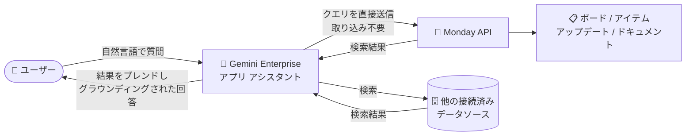

# Gemini Enterprise: Monday フェデレーテッド データストアが GA

**リリース日**: 2026-09-04

**サービス**: Gemini Enterprise

**機能**: Monday フェデレーテッド データストア (データ フェデレーションによる Monday データソース接続)

**ステータス**: GA (一般提供)

📊 [このアップデートのインフォグラフィックを見る](https://takech9203.github.io/google-cloud-news-summary/20260904-gemini-enterprise-monday-federated-data-store.html)

## 概要

Gemini Enterprise において、データ フェデレーションを使用した Monday (monday.com) データソースの接続が一般提供 (GA) になりました。Gemini Enterprise アプリのアシスタントから、Monday のボード (boards)、アイテム (items)、アップデート (updates)、ドキュメント (docs) を横断的に検索し、そのコンテンツに基づいた (グラウンディングされた) 回答を取得できます。

このアップデートの最大の特徴は「データ フェデレーション」方式である点です。データ フェデレーションでは、検索クエリを Monday API に直接送信して情報を取得するため、Monday のデータを Gemini Enterprise のインデックスに取り込む (インジェスト) 必要がありません。データのコピーが作成されないため、ストレージ消費や取り込み時間を気にせず、常に最新の Monday データに対して検索を実行できます。

Monday をプロジェクト管理・ワークマネジメント基盤として利用しつつ、Gemini Enterprise を全社の AI アシスタント基盤として展開している組織にとって、社内ナレッジ検索の対象範囲を大きく広げるアップデートです。

**アップデート前の課題**

- Monday のデータを Gemini Enterprise の検索対象にするための、データ フェデレーションによる接続が GA として提供されていなかった
- サードパーティ データソースをインデックスに取り込む (インジェスト) 方式では、データのコピーに伴うストレージ消費と取り込み時間が発生し、インデックスの鮮度もsync のスケジュールに依存していた
- Monday 上のプロジェクト情報を確認するには、Gemini Enterprise とは別に Monday の UI で検索する必要があった

**アップデート後の改善**

- Monday データソースとのデータ フェデレーション接続が GA となり、本番環境で利用できるようになった
- データを取り込むことなく、Monday のボード、アイテム、アップデート、ドキュメントを Gemini Enterprise アシスタントから横断検索できるようになった
- 検索クエリは Monday API に直接送信されるため、常に Monday 側の最新データに基づいた回答が得られるようになった
- 他の接続済みデータソースの検索結果とブレンドされ、統合的な検索結果として表示されるようになった

## アーキテクチャ図

データ フェデレーションでは、ユーザーのクエリが Monday API に直接送信され、データを Gemini Enterprise のインデックスにコピーすることなく、Monday の最新コンテンツと他のデータソースの結果をブレンドした回答が返されます。

## サービスアップデートの詳細

### 主要機能

1. **データ フェデレーションによる Monday 接続 (GA)**
   - Monday データソースを Gemini Enterprise にデータ フェデレーション方式で接続する機能が一般提供に
   - データを Gemini Enterprise のインデックスにコピーしないため、ストレージ消費や取り込み時間が不要
   - クエリ実行時に Monday API へ直接検索リクエストを送信し、最新データに基づく結果を取得

2. **Monday エンティティの横断検索**
   - ボード (boards)、アイテム (items)、アップデート (updates)、ドキュメント (docs) を検索対象として選択可能
   - 検索結果は他の接続済みデータソースの結果とブレンドされ、統合された検索体験を提供
   - Monday のコンテンツにグラウンディングされた回答を Gemini Enterprise アシスタントが生成

3. **Monday アクションのサポート**
   - Monday コネクタを有効にすると、自然言語コマンドで Monday に対する操作を実行可能
   - サポートされるアクションの例: アイテムのカラム値変更、ボード作成、カラム作成、ダッシュボード作成、グループ作成、アイテム作成、ワークスペース作成 (このほか読み取り専用アクションも利用可能)

4. **エンタープライズ向けの構成オプション**
   - 静的 IP エグレスの有効化に対応 (Monday 側でのアクセス許可リスト運用に対応)
   - us / eu マルチリージョン選択時は、Google 管理の暗号鍵に加え、顧客管理の暗号鍵 (CMEK / Cloud KMS) を選択可能

## 技術仕様

### データ フェデレーションとデータ インジェストの比較

| 項目 | データ フェデレーション (今回 GA) | データ インジェスト (インデックス化) |
|------|------|------|
| データの保存 | コピーしない (Monday 側に保持) | Gemini Enterprise のインデックスにコピー |
| データの鮮度 | クエリ時に Monday API から直接取得 | 同期スケジュールに依存 |
| ストレージ消費 | 不要 | インデックス分のストレージを消費 |
| 検索品質 | インデックス化されないため低くなる可能性あり | インデックス化により向上する可能性あり |

### クエリ実行とデータの取り扱い

| 項目 | 詳細 |
|------|------|
| クエリ実行 | ユーザーのクエリ文字列は Monday API (サードパーティの検索バックエンド) に直接送信される |
| クエリの書き換え | 精度向上のため、LLM がクエリを書き換えてから Monday に送信する場合がある。書き換えにセッションのクエリ履歴の情報が含まれる可能性がある |
| 複数フェデレーション ソース | 複数のフェデレーテッド検索データソースが有効な場合、クエリがすべてのソースに送信される可能性がある |
| サードパーティ側の取り扱い | Monday に送信されたデータは Monday の利用規約・プライバシー ポリシーに従って扱われ、クエリがユーザーの ID と関連付けられる可能性がある |

### 認証に必要な OAuth スコープ (抜粋)

Monday 側で OAuth アプリを作成し、以下のようなスコープを設定します (フェデレーテッド検索とアクションに必要な主なスコープ)。

| スコープ | 用途 |
|------|------|
| `account:read` | アカウント詳細とユーザー情報の閲覧 |
| `boards:read` / `boards:write` | ボード構造・アイテムデータの閲覧、ボード等の作成・変更 |
| `docs:read` / `docs:write` | Monday Workdocs の読み取り、作成・編集 |
| `updates:read` / `updates:write` | アップデート (投稿)・返信・アクティビティ ログの読み取り、作成・変更 |
| `assets:read` | アイテムやアップデートに添付されたファイルの閲覧・ダウンロード |
| `users:read` / `teams:read` / `workspaces:read` ほか | ユーザー・チーム・ワークスペース情報の閲覧など |

## 設定方法

### 前提条件

1. データストアを作成するユーザーに Discovery Engine 編集者ロール (`roles/discoveryengine.editor`) を付与しておく
2. Monday 側で OAuth アプリを作成し、Client ID と Client secret を取得しておく
3. Monday OAuth アプリのリダイレクト URL に `https://vertexaisearch.cloud.google.com/oauth-redirect` を設定し、必要なスコープを付与しておく

### 手順

#### ステップ 1: Monday 側で OAuth アプリを構成する

1. Monday.com アカウントにサインインし、プロファイル アイコンから **Developers** を選択
2. **My apps** ページで **Create app** をクリックし、アプリ名と slug を入力して作成
3. 作成したアプリの **Client ID** と **Client secret** をコピーして安全に保管
4. **Build > OAuth & permissions** でリダイレクト URL (`https://vertexaisearch.cloud.google.com/oauth-redirect`) と必要なスコープを設定して保存

#### ステップ 2: Gemini Enterprise で Monday データストアを作成する

1. Google Cloud コンソールで **Gemini Enterprise** ページに移動し、プロジェクトを選択
2. ナビゲーション メニューの **Data stores** から **Create data store** をクリック
3. ソースとして **Monday** を検索して選択
4. 認証設定に OAuth の **Client ID** と **Client secret** を入力
5. **Entities to search** で検索対象のエンティティを選択
6. 必要に応じて **Actions** セクションで有効化する Monday アクションを選択 (後から追加も可能)
7. 必要に応じて **Advanced options** で静的 IP アドレスを有効化
8. マルチリージョンとコネクタ名を設定 (us / eu の場合は暗号化設定として Google 管理鍵または Cloud KMS 鍵を選択)
9. 課金セクションで **General pricing** または **Configurable pricing** を選択し、**Create** をクリック

#### ステップ 3: アプリに接続して認可する

1. データストアのステータスが **Creating** から **Active** に変わったことを確認
2. 作成したデータストアを既存のアプリに接続するか、新規アプリを作成して接続
3. クエリを実行する前に、Gemini Enterprise から Monday へのアクセスをユーザーが認可 (OAuth 認可) する

## メリット

### ビジネス面

- **ナレッジ検索の一元化**: Monday 上のプロジェクト情報・タスク・ドキュメントを、他の社内データソースと合わせて Gemini Enterprise の単一インターフェースから検索でき、情報探索の時間を削減できる
- **GA による本番利用**: 一般提供となったことで、本番環境のエンタープライズ ワークロードで安心して採用できる

### 技術面

- **取り込み不要のアーキテクチャ**: データ フェデレーションによりインデックスへのデータコピーが不要で、ストレージ消費と取り込み時間を削減できる
- **データの鮮度**: クエリ実行時に Monday API から直接取得するため、常に最新の Monday データに基づいた回答が得られる
- **エンタープライズ要件への対応**: 静的 IP エグレスや CMEK (us / eu リージョン) など、セキュリティ・コンプライアンス要件に対応した構成が可能

## デメリット・制約事項

### 制限事項

- データ フェデレーションではデータがインデックス化されないため、インジェスト (インデックス化) 方式と比較して検索品質が低くなる可能性がある
- クエリ文字列はサードパーティ (Monday API) に送信され、Monday 側でユーザー ID と関連付けられる可能性がある。送信後のデータは Monday の利用規約・プライバシー ポリシーに従って扱われる
- 精度向上のための LLM によるクエリ書き換えにより、セッションのクエリ履歴の一部が Monday API への送信クエリに含まれる可能性がある

### 考慮すべき点

- 複数のフェデレーテッド検索データソースを有効にしている場合、クエリがそれらすべてに送信され得るため、データガバナンス上の影響を事前に評価する
- Monday OAuth アプリに `boards:write` や `docs:write` などの書き込みスコープも設定するため、アクションを有効化する範囲は組織のポリシーに合わせて検討する
- クエリ実行前にユーザーごとの Monday 認可 (OAuth) が必要となる運用フローを周知する

## ユースケース

### ユースケース 1: プロジェクト状況の横断検索

**シナリオ**: プロジェクト管理を Monday で行っている組織で、メンバーが「プロジェクト X の直近のアップデートと未完了タスクを教えて」と Gemini Enterprise アシスタントに質問する。

**効果**: Monday の UI に切り替えることなく、ボードやアイテム、アップデートの内容にグラウンディングされた回答を取得でき、状況把握が迅速になる。データは取り込まれていないため、回答は常に Monday 側の最新情報を反映する。

### ユースケース 2: 自然言語による Monday 操作 (アクション)

**シナリオ**: アシスタントとの対話の中で判明した TODO を、そのまま「Monday のボード Y に新しいアイテムとして追加して」と依頼する。

**効果**: Monday アクション (アイテム作成、ボード作成など) を有効化しておくことで、検索だけでなく作業の実行までを Gemini Enterprise の単一インターフェースで完結できる。

## 料金

Gemini Enterprise はエディション (Standard / Plus / Pay-as-you-go など) ごとのライセンス サブスクリプション モデルで提供されます。Monday データストア作成時には、課金セクションで General pricing または Configurable pricing を選択します。データ フェデレーションではデータをインデックスに取り込まないため、インデックス ストレージの消費は発生しません。

詳細は以下を参照してください。

- [Gemini Enterprise のライセンス](https://docs.cloud.google.com/gemini/enterprise/docs/licenses)

## 利用可能リージョン

データストア (データコネクタ) 作成時にマルチリージョン (global / us / eu) を選択できます。us または eu を選択した場合は暗号化設定 (Google 管理鍵または Cloud KMS 鍵) の構成が必要です。詳細は公式ドキュメントを参照してください。

## 関連サービス・機能

- **Gemini Enterprise コネクタ / データストア**: Monday 以外にも SharePoint、OneDrive、Outlook、Gmail、Google カレンダーなど多数のデータソースに対応。データ フェデレーションとデータ インジェストの 2 方式があり、コネクタによって選択可能
- **Cloud KMS (CMEK)**: us / eu マルチリージョン選択時に顧客管理の暗号鍵を利用可能
- **サードパーティ データストアのアラート**: Monday データストアに対して定義済みタスクのアラートを構成可能
- **Integration Connectors (Monday コネクタ)**: Application Integration から Monday エンティティに対する CRUD 操作を行う別サービス。ワークフロー自動化の用途で補完的に利用可能

## 参考リンク

- 📊 [インフォグラフィック](https://takech9203.github.io/google-cloud-news-summary/20260904-gemini-enterprise-monday-federated-data-store.html)
- [公式リリースノート](https://docs.cloud.google.com/release-notes#September_04_2026)
- [Set up a Monday data store](https://docs.cloud.google.com/gemini/enterprise/docs/connectors/monday/set-up-data-store)
- [Monday configuration (OAuth アプリの設定)](https://docs.cloud.google.com/gemini/enterprise/docs/connectors/monday/monday-configuration)
- [Monday コネクタの概要 (アクションとスコープ)](https://docs.cloud.google.com/gemini/enterprise/docs/connectors/monday)
- [コネクタとデータストアの概要](https://docs.cloud.google.com/gemini/enterprise/docs/connectors/introduction-to-connectors-and-data-stores)
- [Gemini Enterprise のライセンス](https://docs.cloud.google.com/gemini/enterprise/docs/licenses)

## まとめ

Monday フェデレーテッド データストアの GA により、Monday のボード・アイテム・アップデート・ドキュメントを、データを取り込むことなく Gemini Enterprise アシスタントから横断検索できるようになりました。Monday を利用中で Gemini Enterprise を展開している組織は、OAuth アプリの構成とデータストア作成だけで社内ナレッジ検索の範囲を拡張できるため、まずは検索対象エンティティと有効化するアクションの範囲をガバナンス要件と合わせて検討したうえで導入を進めることを推奨します。

---

**タグ**: #GeminiEnterprise #Monday #DataFederation #FederatedSearch #Connector #GA #EnterpriseSearch
