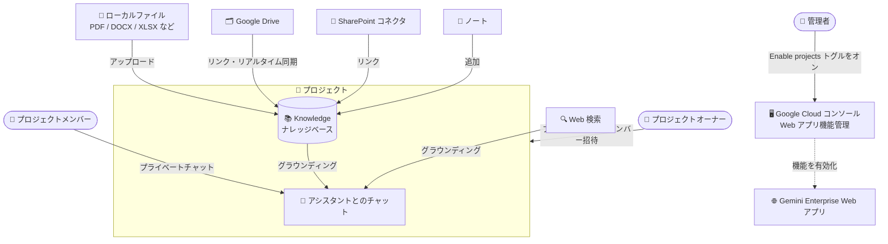

# Gemini Enterprise: プロジェクトの作成と管理が GA

**リリース日**: 2026-09-04

**サービス**: Gemini Enterprise

**機能**: プロジェクトの作成と管理 (Create and manage projects)

**ステータス**: GA (一般提供)

📊 [このアップデートのインフォグラフィックを見る](https://takech9203.github.io/google-cloud-news-summary/20260904-gemini-enterprise-projects-ga.html)

## 概要

Gemini Enterprise の Web アプリで「プロジェクト」を作成・管理する機能が一般提供 (GA) になりました。プロジェクトは、自分の業務専用のナレッジベースを構築したり、チームと共同作業したりするための専用ワークスペースです。プロジェクト内にファイルをアップロードし、アシスタントとプライベートにチャットすることで、プロジェクトのファイルと Web 検索にグラウンディングされた回答を得られます。

プロジェクトのナレッジベースには、ローカルファイル (PDF、DOCX、PPTX、XLSX、CSV、HTML、TXT) のアップロードに加えて、Google Drive のファイル、テキストノート、管理者が有効化している場合は Microsoft SharePoint などの外部データコネクタのファイルを追加できます。プロジェクト内のチャット応答は、プロジェクトの Knowledge ファイルと Web 検索にグラウンディングされ、明示的に追加しない限り他のエンタープライズデータソースからは分離されます。

この機能を利用するには、Gemini Enterprise 管理者が Google Cloud コンソールの Web アプリ機能管理設定で「Enable projects」トグルをオンにする必要があります。対象ユーザーは、特定のテーマや案件に関するドキュメントを 1 か所に集約して AI アシスタントを活用したい Gemini Enterprise の一般ユーザー、およびチームでナレッジを共有したい組織です。

**アップデート前の課題**

- 特定の業務やテーマに関するファイル群を継続的なコンテキストとして保持する専用ワークスペースがなく、会話ごとにファイルを扱う必要があった
- チームメンバーとナレッジベース (ファイルやノート) を共有しながら、各自のチャットはプライベートに保つという使い分けができなかった
- アシスタントの回答コンテキストを特定のドキュメント群に限定して分離する仕組みがなかった

**アップデート後の改善**

- プロジェクト単位で専用のナレッジベースを構築し、そのファイルと Web 検索にグラウンディングされた回答を継続的に得られるようになった
- プロジェクトにメンバーを招待してナレッジベースを共有しつつ、各メンバーのチャットはプライベートに保たれるようになった
- Knowledge タブがプロジェクト内会話のコンテキスト境界となり、明示的に追加しない限り他のエンタープライズデータソースから分離されるようになった
- Google Drive や外部コネクタからリンクしたドキュメントは、コンテンツや共有権限の変更がリアルタイムでプロジェクトに同期されるようになった

## アーキテクチャ図

管理者が「Enable projects」トグルを有効化すると、ユーザーは Web アプリでプロジェクトを作成できます。ローカルファイル、Google Drive、SharePoint、ノートをナレッジベースに追加すると、アシスタントはそれらのドキュメントと Web 検索にグラウンディングされた回答をプライベートチャットで返します。

## サービスアップデートの詳細

### 主要機能

1. **プロジェクトの作成とナレッジベースの構築**
   - Web アプリのナビゲーションメニューから「Projects」を選択し、名前と説明を入力してプロジェクトを作成
   - Knowledge タブから、ローカルファイルのアップロード、Google Drive のファイル・フォルダのリンク、SharePoint ドキュメントのリンク、テキストノートの追加が可能
   - 対応ファイル形式: PDF、Microsoft Word (DOCX)、Microsoft PowerPoint (PPTX)、Microsoft Excel (XLSX)、CSV、HTML、プレーンテキスト (TXT)

2. **グラウンディングされたプライベートチャット**
   - プロジェクト内のチャットは、プロジェクトの Knowledge ファイルと Web 検索にグラウンディングされた回答を返す
   - チャットはプライベートで、本人のみ閲覧可能。他のプロジェクトメンバーは閲覧・参加できない
   - 同一プロジェクト内で複数のチャットを作成可能

3. **チームコラボレーション**
   - Team タブからメールアドレスでユーザーを招待 (招待されたメンバーはデフォルトで Editor 権限)
   - Team / Knowledge / New chat の各タブから招待可能。「Suggested people」からの素早い追加にも対応
   - メンバーの招待・削除、プロジェクトの削除はプロジェクトオーナーのみが実行可能

4. **リアルタイム同期と権限認識**
   - Google Drive や外部コネクタからリンクしたドキュメントは、コンテンツと共有権限の変更がリアルタイムで同期される
   - Knowledge タブでは、各メンバーは自分がアクセス権を持つファイルのみ表示され、回答生成にもアクセス可能なファイルのみが使用される

## 技術仕様

### プロジェクトのナレッジソース

| ソース | 詳細 |
|------|------|
| ローカルファイル | PDF、DOCX、PPTX、XLSX、CSV、HTML、TXT をアップロード |
| Google Drive | Google ドキュメント、スライド、PDF などを直接リンク |
| ノート | テキストを直接貼り付け・入力 |
| 外部データコネクタ | Microsoft SharePoint など (管理者による有効化が必要) |

### 権限モデル

| 操作 | 実行可能なロール |
|------|------|
| プロジェクトの作成 | 各ユーザー (機能有効化後) |
| メンバーの招待 | プロジェクトオーナーのみ |
| メンバーの削除 | プロジェクトオーナーのみ |
| プロジェクトの削除 | プロジェクトオーナーのみ |
| 招待されたメンバーの権限 | デフォルトで Editor |

## 設定方法

### 前提条件

1. Gemini Enterprise 管理者が、Google Cloud コンソールの Web アプリ機能管理設定で「Enable projects」トグルをオンにしていること
2. SharePoint のファイルをリンクする場合は、管理者が Google Cloud コンソールで SharePoint コネクタのデータストアを構成していること

### 手順

#### ステップ 1: 管理者による機能の有効化

Google Cloud コンソールの Gemini Enterprise の Web アプリ機能管理設定で、「Enable projects」トグルをオンにします。有効化すると、ユーザーは Web アプリでコラボレーティブなプロジェクトを作成・利用できるようになります。

#### ステップ 2: プロジェクトの作成

1. Gemini Enterprise Web アプリにサインイン
2. ナビゲーションメニューで「Projects」をクリック
3. 「New project」(初回の場合は「Get started」) をクリック
4. プロジェクト名を入力して進み、Welcome タブで説明を入力して「Done」をクリック

#### ステップ 3: ナレッジの追加とチャット

1. プロジェクトの Knowledge タブでアップロードアイコンをクリックし、ローカルファイル・Google Drive・SharePoint・ノートのいずれかの方法でコンテンツを追加
2. New chat タブで質問やプロンプトを入力すると、プロジェクトのナレッジと Web 検索にグラウンディングされた回答が得られる

## メリット

### ビジネス面

- **チームナレッジの集約**: 案件やテーマごとにドキュメントを 1 か所に集約し、チーム全体で共有できる。招待はメールアドレスだけで完結する
- **プライバシーとコラボレーションの両立**: ナレッジベースは共有しつつ、各メンバーのチャットはプライベートに保たれるため、安心して質問・検討ができる

### 技術面

- **コンテキストの分離**: Knowledge タブがコンテキスト境界となり、明示的に追加しない限り他のエンタープライズデータソースから分離されるため、回答の根拠が明確になる
- **権限認識型のグラウンディング**: メンバーはアクセス権を持つファイルのみ閲覧でき、回答生成にもアクセス可能なファイルのみが使用される
- **リアルタイム同期**: リンクされたドキュメントのコンテンツ・共有権限の変更が自動的にプロジェクトへ同期される

## デメリット・制約事項

### 制限事項

- 1 つのプロジェクトのナレッジベースに含められるのは、ファイルとリンクドキュメントを合わせて最大 50 件
- Google Drive や外部コネクタのファイルをリンクしても元の共有権限は変更されない。他のメンバーが利用するには、ソースアプリケーション (Google Drive や SharePoint) 側で閲覧以上の権限を共有する必要がある
- ローカルにアップロードしたファイルは、リンクされたファイルと異なり、すべてのプロジェクトメンバーが閲覧・ダウンロード・削除できる

### 考慮すべき点

- 機能の利用には管理者による「Enable projects」トグルの有効化が必要 (デフォルトでは利用者に公開されない)
- メンバーの招待・削除、プロジェクトの削除はオーナーのみ可能であり、招待されたメンバーは Editor 権限を持つため、機密ファイルのアップロード運用ルールを事前に決めておくとよい

## ユースケース

### ユースケース 1: 案件専用ナレッジベースによる提案準備

**シナリオ**: 営業チームが特定顧客向けの提案準備のため、RFP、過去の提案書、製品資料 (PDF、DOCX、PPTX) をプロジェクトにアップロードし、メンバーを招待する。

**効果**: 各メンバーは案件ドキュメントにグラウンディングされた回答をプライベートチャットで得られ、資料の横断確認や論点整理を効率化できる。リンクした Google Drive 資料は更新が自動同期される。

### ユースケース 2: SharePoint 資産を活用した部門ナレッジ共有

**シナリオ**: 管理者が SharePoint コネクタを構成済みの組織で、部門の規程やマニュアルが SharePoint に蓄積されている。部門プロジェクトを作成し、該当ドキュメントをリンクする。

**効果**: 既存の SharePoint 権限を維持したまま、各メンバーは自分がアクセスできるドキュメントに基づく回答を得られる。権限のないファイルは表示されず、回答生成にも使用されない。

## 料金

プロジェクト機能自体の追加料金は Release Notes に記載されていません。Gemini Enterprise はエディション (Business / Standard / Plus / Pay-as-you-go / Frontline) ごとのサブスクリプションで提供され、ストレージとデータインデックス登録のクォータはエディションにより異なります (例: Business 25 GiB、Standard 30 GiB、Plus 75 GiB、ユーザー間でプール)。Pay-as-you-go エディションではストレージ + データインデックス登録が $5/GiB/月です。

詳細は以下を参照してください。

- [Gemini Enterprise のエディション比較](https://docs.cloud.google.com/gemini/enterprise/docs/editions)
- [クォータと超過料金](https://docs.cloud.google.com/gemini/enterprise/docs/quotas-and-overages)

## 利用可能リージョン

公式ドキュメントにプロジェクト機能固有のリージョン情報は記載されていません。詳細は [Gemini Enterprise ドキュメント](https://docs.cloud.google.com/gemini/enterprise/docs/projects) を参照してください。

## 関連サービス・機能

- **Web アプリ機能管理 (Manage web app features)**: 「Enable projects」を含む Web アプリの各機能 (Canvas、Agent Gallery、画像生成など) のオン/オフを管理者が制御する設定
- **サードパーティデータコネクタ (SharePoint など)**: 管理者がコネクタのデータストアを構成すると、外部ソースのファイルをプロジェクトのナレッジにリンク可能
- **Google Drive 連携**: Google ドキュメント、スライド、PDF などを直接リンクし、コンテンツ・権限の変更をリアルタイム同期

## 参考リンク

- 📊 [インフォグラフィック](https://takech9203.github.io/google-cloud-news-summary/20260904-gemini-enterprise-projects-ga.html)
- [公式リリースノート](https://docs.cloud.google.com/release-notes#September_04_2026)
- [Create and manage projects (ドキュメント)](https://docs.cloud.google.com/gemini/enterprise/docs/projects)
- [Manage web app features (ドキュメント)](https://docs.cloud.google.com/gemini/enterprise/docs/manage-web-app-features)
- [Gemini Enterprise エディション比較](https://docs.cloud.google.com/gemini/enterprise/docs/editions)

## まとめ

Gemini Enterprise のプロジェクト機能が GA となり、ファイルベースの専用ナレッジベースとプライベートチャットを組み合わせたチームコラボレーションが正式に利用可能になりました。利用には管理者による「Enable projects」トグルの有効化が必要なため、まず管理者側で機能を有効化し、最大 50 ファイルの制限やローカルアップロードファイルの共有範囲を踏まえた運用ルールを整備した上で展開することを推奨します。

---

**タグ**: Gemini Enterprise, Projects, ナレッジベース, グラウンディング, コラボレーション, GA
