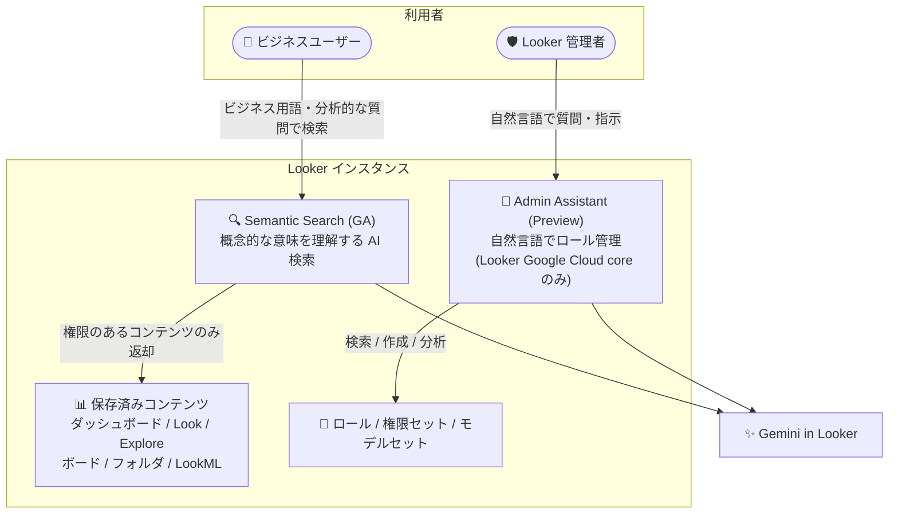

# Looker: 26.16 リリース - Semantic Search GA / Admin Assistant Preview

**リリース日**: 2026-09-04

**サービス**: Looker

**機能**: Looker 26.16 リリーススケジュール、Semantic Search の一般提供 (GA)、Admin Assistant のプレビュー提供、約 24 件の修正

**ステータス**: Announcement (リリーススケジュール) / GA (Semantic Search) / Preview (Admin Assistant)

📊 [このアップデートのインフォグラフィックを見る](https://takech9203.github.io/google-cloud-news-summary/20260904-looker-26-16-semantic-search-admin-assistant.html)

## 概要

Looker 26.16 のリリーススケジュールが発表されました。Looker (original) インスタンスへのデプロイは 2026 年 9 月 8 日 (火) に開始され、2026 年 9 月 20 日 (日) までに最終デプロイとダウンロード提供が完了する予定です。

本リリースでは 2 つの新機能が含まれます。1 つ目は **Semantic Search の一般提供 (GA)** です。Gemini in Looker を活用した AI 検索機能で、キーワード一致を超えて検索クエリの概念的な意味を理解し、「顧客獲得コストの合計」のようなビジネス用語や分析的な質問で保存済みコンテンツ (ダッシュボード、Look、Explore、ボード、フォルダ、LookML ファイルなど) を検索できます。2 つ目は **Admin Assistant のプレビュー提供**です。自然言語で Looker のロール、権限セット、モデルセットを検索・作成・分析できる、Looker (Google Cloud core) インスタンス向けの管理支援機能です。

また、約 24 件の修正が含まれており、特にセルフサービスモデルの DB 接続アクセス制限 (セキュリティ強化)、BigQuery High Throughput API のデフォルト無効化 (接続エラー防止)、Workforce Identity の埋め込み iframe ログイン修正など、エンタープライズ環境での運用に影響する重要な修正が多く含まれます。

**アップデート前の課題**

- コンテンツ検索はキーワード一致ベースが中心で、ビジネス用語や分析的な質問による概念的な検索を行う機能 (Semantic Search) は GA ではなく、本番利用の判断がしづらかった
- Looker のロール・権限セット・モデルセットの管理は Admin パネルでの手動操作が必要で、既存構成の調査や新規ロール作成に管理者の作業負荷がかかっていた
- セルフサービスモデルが割り当てられたユーザー DB 接続以外にもアクセスできる可能性があり、意図しないインスタンス全体の DB 接続アクセスのリスクがあった
- BigQuery High Throughput API がデフォルト有効であったため、`bigquery.readsessions.create` 権限がない環境で接続エラーが発生していた
- Workforce Identity を使った埋め込み iframe でのログインが、フレーム制限や認証ポップアップの早期クローズにより失敗することがあった

**アップデート後の改善**

- Semantic Search が GA となり、AI による概念的な意味理解に基づくコンテンツ検索を本番環境で利用できるようになった
- Admin Assistant (Preview) により、自然言語でロール・権限セット・モデルセットの検索、作成、ベストプラクティスに基づく分析が可能になった
- セルフサービスモデルが割り当てられたユーザー DB 接続のみに制限され、意図しない DB 接続アクセスが防止された
- BigQuery High Throughput API がデフォルト無効となり、権限がない環境での接続エラーが防止された (JDK 11 環境向けの必須 JVM フラグも追加)
- Workforce Identity の埋め込み iframe ログイン、埋め込みダッシュボードのフィルタオーバーフローや PDF/PNG エクスポート時のクリッピングなど、埋め込み分析に関する複数の問題が修正された

## アーキテクチャ図



Semantic Search と Admin Assistant はいずれも Gemini in Looker を基盤とし、前者はビジネスユーザーの概念的なコンテンツ検索を、後者は管理者の自然言語によるロール管理を支援します。

## サービスアップデートの詳細

### 主要機能

1. **Looker 26.16 リリーススケジュール (Announcement)**
   - デプロイ開始予定: 2026 年 9 月 8 日 (火)
   - 最終デプロイおよびダウンロード提供予定: 2026 年 9 月 20 日 (日)
   - 対象: Looker (original) インスタンス

2. **Semantic Search の一般提供 (GA)**
   - キーワード一致を超えて、検索クエリの概念的な意味を理解する AI 検索機能
   - 「total customer acquisition cost (顧客獲得コストの合計)」のようなビジネス用語や分析的な質問で検索可能
   - 検索対象: ボード、ダッシュボード、Explore、フォルダ、Look、LookML ダッシュボード、LookML ファイル・プロジェクト (閲覧権限のあるものに限る)
   - Gemini in Looker が有効な場合、エージェントや会話も検索結果に含まれる
   - コンテンツのタイトル・説明、ダッシュボード内の可視化タイトル・ノート、Look や Explore 内のディメンション・メジャーも検索対象
   - 検索結果はクエリとの関連性に加え、コンテンツの人気度、閲覧・お気に入り頻度、認定 (Certified) 状況などに基づきランク付け
   - Looker 管理パネルの Platform セクションにある Gemini in Looker ページで Semantic Search オプションを有効化して使用

3. **Admin Assistant のプレビュー提供 (Preview)**
   - 自然言語で Looker のロール管理を支援する機能
   - **既存構成の調査**: ロールを名前・権限セット・モデルセットで検索、権限セットを名前や含まれる権限で検索、モデルセットを名前や含まれるモデルで検索、利用可能な全権限・全 LookML モデルの一覧表示
   - **新規構成の作成**: 権限セットとモデルセットを組み合わせた新規ロールの作成、指定した権限リストによる権限セットの作成、指定したモデルリストによるモデルセットの作成
   - **インサイトとベストプラクティス**: 既存構成の分析、ロール構造や権限管理のベストプラクティスに関するガイダンス
   - Admin パネルの Roles ページ、New/Edit Role ページ、New/Edit Permission Set ページ、New/Edit Model Set ページから利用可能

### 主な修正 (約 24 件から抜粋)

| 分類 | 修正内容 |
|------|---------|
| セキュリティ | セルフサービスモデルを割り当てられたユーザー DB 接続のみに制限し、意図しないインスタンス全体の DB 接続アクセスを防止 |
| 接続 | BigQuery High Throughput API をデフォルト無効化 (`bigquery.readsessions.create` 権限がない環境での接続エラーを防止)。JDK 11 環境向けの必須 JVM フラグを追加 |
| 認証 | Workforce Identity による埋め込み iframe 内ログインが、フレーム制限や認証ポップアップの早期クローズで失敗する問題を修正 |
| 認証 | Looker (Google Cloud core) で `auth_requires_role` と厳格な Group Role Mapping 有効時に IAM 管理者が認証失敗する問題を修正 |
| 埋め込み | フィルタ多数の埋め込みダッシュボードでの水平方向オーバーフロー、フィルタの折り返し不可、PDF/PNG エクスポート時のタイルのクリッピングを修正 |
| 埋め込み | フィルタコンテキスト付き埋め込みダッシュボードからのスタンドアロンタイルエクスポートが画面外レンダリングやクリッピングされる問題を修正 |
| テーマ | インスタンスデフォルトのカスタムテーマがビュー専用モードやダッシュボードナビゲーション中に適用されない問題を修正 |
| 可視化 | Explore でヒストグラム可視化への切り替えが失敗・リバートする問題を修正 (ピボットされたヒストグラムのスタック解決も改善) |
| AI 機能 | ユーザー定義ダッシュボードの複製時に、関連する Looker データエージェントの指示・構成・ソースを複製先でも保持するよう修正 |

## 技術仕様

### Semantic Search (Enhanced Search)

| 項目 | 詳細 |
|------|------|
| 有効化 | 管理パネル > Platform > Gemini in Looker ページの Semantic Search オプション |
| 検索対象コンテンツ | ボード、ダッシュボード、Explore、フォルダ、Look、LookML ダッシュボード、LookML ファイル・プロジェクト |
| 検索対象フィールド | コンテンツのタイトル・説明、可視化タイトル・ノート、ディメンション・メジャー |
| アクセス制御 | 閲覧権限のあるコンテンツのみ検索結果に表示 |
| 完全一致検索 | 検索語をダブルクォートで囲む (例: `"Sales Funnel Dashboard"`) |
| 絞り込みフィルタ | Type、Folder、Creator、Created Date、Last Modified Date、Certified |

### Admin Assistant

| 項目 | 詳細 |
|------|------|
| 対象インスタンス | Looker (Google Cloud core) のみ (Looker (original) では利用不可)。プライベート接続専用構成では利用不可 |
| 前提設定 | Google Cloud コンソールで Gemini in Looker を有効化、Trusted Tester features オプションを有効化、管理パネルの Gemini in Looker ページで Admin Assistant を有効化 |
| 必要ロール | Looker Admin ロール |
| レスポンス上限 | 最大 100 レコード (初期表示は 25 件、追加読み込みで最大 100 件まで) |
| 会話の制限 | パネルに表示されるのは直近 6 会話。6 回のやり取りごとに会話スレッドを要約してコンテキストを保存 |
| クエリサイズ | ユーザークエリは最大 1,000 語 |
| 推奨言語 | 最良の結果を得るには米国英語でのプロンプト記述を推奨 |

## 設定方法

### 前提条件

1. **Semantic Search**: Looker 管理者権限で管理パネルにアクセスできること
2. **Admin Assistant**: Looker (Google Cloud core) インスタンス (プライベート接続専用でない) であること、Gemini in Looker が有効であること、Looker Admin ロールが割り当てられていること

### 手順

#### ステップ 1: Semantic Search の有効化

管理パネルの **Platform** セクション > **Gemini in Looker** ページで **Semantic Search** オプションを有効化します。有効化後、アプリケーションヘッダーの検索ボックスから AI 検索が利用できます。

#### ステップ 2: Admin Assistant の有効化 (Looker (Google Cloud core))

1. Google Cloud コンソールで対象の Looker (Google Cloud core) インスタンスの Gemini in Looker を有効化
2. **Trusted Tester features** オプションを有効化
3. 管理パネルの **Gemini in Looker** ページで **Admin Assistant** を有効化
4. 管理パネルの **Users** セクション > **Roles** ページで Admin Assistant ボタンをクリックしてパネルを開き、「Ask a question」フィールドに質問や指示を入力

## メリット

### ビジネス面

- **コンテンツ発見性の向上**: ビジネス用語や分析的な質問での検索により、正確なダッシュボード名を知らないユーザーでも必要なコンテンツに素早く到達でき、セルフサービス分析が促進される
- **管理作業の効率化**: Admin Assistant により、ロール・権限の調査や作成にかかる管理者の作業時間を削減できる
- **GA による本番採用の判断**: Semantic Search が GA となったことで、SLA やサポートの観点から本番環境での採用判断がしやすくなった

### 技術面

- **セキュリティ強化**: セルフサービスモデルの DB 接続制限により、最小権限の原則に沿ったデータアクセス制御が強化された
- **接続の安定性向上**: BigQuery High Throughput API のデフォルト無効化により、権限構成が最小限の環境でも接続エラーが発生しなくなった
- **埋め込み分析の信頼性向上**: Workforce Identity の iframe ログイン修正や、埋め込みダッシュボードのエクスポート関連修正により、顧客向け埋め込み分析の品質が向上した

## デメリット・制約事項

### 制限事項

- Admin Assistant は Preview 段階であり、限定的なサポートで「現状のまま」提供される (Pre-GA Offerings Terms が適用)
- Admin Assistant は Looker (Google Cloud core) インスタンス専用で、Looker (original) やプライベート接続専用構成では利用できない
- Admin Assistant のクエリ結果は最大 100 レコード、ユーザークエリは最大 1,000 語に制限される
- Semantic Search の利用には管理パネルでの有効化が必要 (デフォルトでは利用者に表示されない場合がある)

### 考慮すべき点

- Admin Assistant の提案 (ロール・権限セット・モデルセットの作成/編集) は、適用前に必ず内容を検証する必要がある。生成 AI の出力はもっともらしく見えても事実と異なる場合がある
- Admin Assistant のプロンプトは米国英語での記述が推奨されており、日本語での利用は結果の品質に影響する可能性がある
- BigQuery High Throughput API を利用していた環境では、26.16 適用後にデフォルト無効となるため、高スループットが必要な場合は設定の再確認が必要
- セルフサービスモデルの DB 接続制限により、これまで意図せずインスタンス全体の接続に依存していたモデルがある場合は動作確認が必要
- Gemini in Looker の Preview 機能は一般に規制対象ワークロードや機密データでの利用は推奨されないため、コンプライアンス要件がある場合は事前に確認が必要

## ユースケース

### ユースケース 1: ビジネスユーザーによる概念的なコンテンツ検索

**シナリオ**: マーケティング担当者が「顧客獲得コスト」に関する分析を探したいが、該当ダッシュボードの正確な名前を知らない。

**実装例**:
```
検索ボックスに入力: total customer acquisition cost
→ キーワードが完全一致しなくても、概念的に関連するダッシュボード・Look・Explore が
  関連度・人気度・認定状況に基づきランク付けされて表示される
```

**効果**: コンテンツの正確な名前を知らなくても必要な分析に到達でき、データチームへの問い合わせや重複コンテンツの作成を削減できる。

### ユースケース 2: 自然言語によるロール監査と新規ロール作成

**シナリオ**: Looker 管理者が新しい部署向けのロールを作成する際、既存の権限セット構成を調査した上で適切なロールを設計したい。

**実装例**:
```
Admin Assistant への質問例:
- 「explore 権限を含む権限セットを一覧表示して」
- 「Sales モデルを含むモデルセットを検索して」
- 「Marketing 向けに、閲覧専用の権限セットと Marketing モデルセットを
  組み合わせた新しいロールを作成して」
→ Admin Assistant がロール名や既存セットの利用有無を確認しながら作成を支援
```

**効果**: 権限構成の調査からロール作成までを対話的に実行でき、権限管理のベストプラクティスに関するガイダンスも得られる。管理作業の時間短縮と設定ミスの削減が期待できる。

## 料金

Looker のライセンス体系 (Platform 料金 + ユーザーライセンス) の範囲で提供されます。Semantic Search および Admin Assistant に固有の追加料金は Release Notes には記載されていません。最新の料金情報は公式料金ページを参照してください。

- [Looker 料金ページ](https://cloud.google.com/looker/pricing)

## 利用可能リージョン

- Looker 26.16 は Looker (original) インスタンスに対し、2026 年 9 月 8 日〜9 月 20 日の期間で順次ロールアウトされます
- Admin Assistant は Looker (Google Cloud core) インスタンスのみで利用可能です (プライベート接続専用構成を除く)

## 関連サービス・機能

- **Gemini in Looker**: Semantic Search と Admin Assistant の両方の基盤となる生成 AI アシスタント機能群。Conversational Analytics、Visualization Assistant、LookML Assistant なども含む
- **Looker (Google Cloud core)**: Google Cloud コンソールから管理する Looker のマネージドインスタンス。Admin Assistant はこちら専用
- **BigQuery**: Looker の主要データソースの 1 つ。26.16 では High Throughput API (Storage Read API ベース) のデフォルト設定が変更された
- **Workforce Identity Federation**: 外部 ID プロバイダとの連携機能。埋め込み iframe でのログイン問題が修正された

## 参考リンク

- 📊 [インフォグラフィック](https://takech9203.github.io/google-cloud-news-summary/20260904-looker-26-16-semantic-search-admin-assistant.html)
- [公式リリースノート](https://docs.cloud.google.com/release-notes#September_04_2026)
- [Looker の検索機能 (Enhanced Search / Semantic Search)](https://docs.cloud.google.com/looker/docs/finding-content)
- [Admin Assistant によるロール管理](https://docs.cloud.google.com/looker/docs/gemini-admin-asst)
- [Gemini in Looker の概要](https://docs.cloud.google.com/looker/docs/gemini-overview-looker)
- [料金ページ](https://cloud.google.com/looker/pricing)

## まとめ

Looker 26.16 は、Semantic Search の GA と Admin Assistant の Preview という 2 つの AI 機能に加え、セキュリティ・認証・埋め込み分析に関する約 24 件の修正を含む重要なリリースです。Looker (original) 利用者は 9 月 8 日からのロールアウトに備え、特に BigQuery High Throughput API のデフォルト無効化とセルフサービスモデルの DB 接続制限が自社環境に与える影響を事前に確認することを推奨します。Looker (Google Cloud core) 管理者は、Admin Assistant を検証環境で試用し、ロール管理業務の効率化効果を評価するとよいでしょう。

---

**タグ**: Looker, Gemini in Looker, Semantic Search, Admin Assistant, BigQuery, Workforce Identity, GA, Preview, リリースノート
