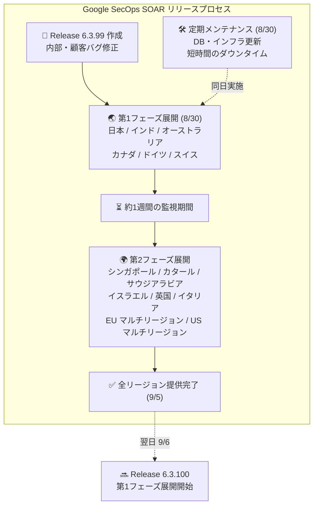

# Google SecOps SOAR: Release 6.3.99 全リージョン提供開始

**リリース日**: 2026-09-05

**サービス**: Google SecOps SOAR (Security Orchestration, Automation, and Response)

**機能**: メンテナンスリリース 6.3.99

**ステータス**: 全リージョン提供開始

📊 [このアップデートのインフォグラフィックを見る](https://takech9203.github.io/google-cloud-news-summary/20260905-google-secops-soar-release-6-3-99.html)

## 概要

Google SecOps SOAR (Security Orchestration, Automation, and Response) の Release 6.3.99 が 2026 年 9 月 5 日に全リージョンで利用可能となった。本リリースは 2026 年 8 月 30 日に第 1 フェーズのリージョンへの展開が開始され、約 1 週間の監視期間を経て全リージョンへの展開が完了したものである。

Release 6.3.99 は内部バグ修正および顧客報告のバグ修正を含むメンテナンスリリースであり、新機能の追加は含まれていない。プラットフォームの安定性と信頼性を維持するための定期的なメンテナンスサイクルの一環であり、Google SecOps SOAR を利用する全てのセキュリティチームに影響する。なお、第 1 フェーズ展開日と同日の 2026 年 8 月 30 日 (日) には、標準メンテナンスウィンドウ内で SOAR データベースおよびインフラストラクチャのメンテナンスも実施されており、短時間のダウンタイムが発生した (顧客側の対応は不要)。

Google SecOps SOAR のリリースは段階的なリージョン展開プロセスに従い、まず第 1 フェーズのリージョン (日本、インド、オーストラリア、カナダ、ドイツ、スイス) に展開された後、約 1 週間後に第 2 フェーズのリージョン (シンガポール、カタール、サウジアラビア、イスラエル、英国、イタリア、EU マルチリージョン、US マルチリージョン) に展開される。翌 9 月 6 日には次期リリース 6.3.100 の第 1 フェーズ展開が既に開始されている。

## アーキテクチャ図

Google SecOps SOAR のリリースは 2 段階のリージョン展開プロセスに従い、第 1 フェーズのリージョンで問題がないことを確認した後、第 2 フェーズのリージョンに展開される。リリースは通常日曜日に実施される。

## サービスアップデートの詳細

### Release 6.3.99 の内容

- **ステータス**: 全リージョンで利用可能 (2026-09-05)
- **内容**: 内部バグ修正および顧客報告のバグ修正
- **新機能**: なし (メンテナンスリリース)
- **展開状況**: 2026 年 8 月 30 日に第 1 フェーズのリージョンへ展開開始、2026 年 9 月 5 日に全リージョンへの展開が完了

### 同時期に実施されたメンテナンス

2026 年 8 月 27 日のアナウンスの通り、8 月 30 日 (日) の標準メンテナンスウィンドウ内で SOAR データベースおよびインフラストラクチャの定期メンテナンスが実施された。メンテナンス中は短時間のダウンタイムが発生したが、顧客側での対応は不要であった。

### リリースの連続性

直近のリリース履歴を見ると、Google SecOps SOAR は概ね週次〜隔週でメンテナンスリリースを行っている。

| リリース | 第1フェーズ展開 | 全リージョン展開 |
|---------|----------------|----------------|
| 6.3.97 | 2026-08-09 | 2026-08-15 |
| 6.3.98 | 2026-08-16 | 2026-08-29 |
| 6.3.99 | 2026-08-30 | 2026-09-05 |
| 6.3.100 | 2026-09-06 | (約 1 週間後を予定) |

なお、次期リリース 6.3.100 では、リアルタイムのケース・アラート更新に反応して Playbook を自動起動する「Reaction triggers」(Preview) や、ケース単位で Playbook を実行できる「Case playbooks」(Preview) といった新機能が予定されている。

### Google SecOps SOAR プラットフォームの主要機能

Google SecOps SOAR は以下の主要機能を提供するセキュリティ自動化プラットフォームである。

1. **データ取り込みの統一**
   - ネットワークデバイス、エンドポイントエージェント、脅威インテリジェンスフィードなど、多様なセキュリティソースからデータを収集
   - コネクタおよび Webhook を使用したアラートの取り込み

2. **レスポンスワークフローの自動化**
   - Playbook エンジンによる複雑なレスポンスアクションの自動実行
   - Playbook Conditions / Multi-Choice Questions で最大 20 分岐をサポート
   - Gemini を活用した Playbook 作成機能 (GA)

3. **統合と拡張**
   - SIEM、脆弱性スキャナー、その他のセキュリティツールとの統合
   - マーケットプレイス統合 (Response Integrations) によるサードパーティ製品との連携
   - カスタムインテグレーションの IDE での開発

## 利用可能リージョン

Google SecOps SOAR のリリースは以下の 2 段階で展開される。リリースは通常日曜日に実施され、第 2 フェーズは第 1 フェーズの約 1 週間後にアップグレードされる。

### 第 1 フェーズ (先行展開)

- 日本
- インド
- オーストラリア
- カナダ
- ドイツ
- スイス

### 第 2 フェーズ (後続展開)

- シンガポール
- カタール
- サウジアラビア
- イスラエル
- 英国 (ロンドン)
- イタリア
- EU (マルチリージョン)
- US (マルチリージョン)

自身のインスタンスがどのリージョンに割り当てられているか不明な場合は、Google SecOps の担当者に問い合わせが必要である。

## デメリット・制約事項

### 段階的展開に伴う留意点

- 第 1 フェーズと第 2 フェーズの間で約 1 週間のバージョン差が生じるため、複数リージョンにまたがる運用を行っている場合はバージョンの不一致に注意が必要
- メンテナンスリリースのため、具体的なバグ修正内容の詳細は公開されていない。個別の修正内容については Google SecOps の担当者に確認が必要
- 翌 9 月 6 日には次期リリース 6.3.100 の第 1 フェーズ展開が開始されており、第 1 フェーズのリージョンでは 6.3.99 の稼働期間が短い点に留意

## 関連サービス・機能

- **Google SecOps SIEM**: SOAR と統合された SIEM (Security Information and Event Management) コンポーネント。SOAR プラットフォームのリリースとは別のリリースノート・展開サイクルで管理される
- **Google SecOps Response Integrations**: サードパーティ製品との連携を提供するマーケットプレイス統合機能。SOAR プラットフォームのリリースとは別のリリースサイクルで更新される
- **SOAR の Google Cloud 移行 (Stage 2)**: SOAR プラットフォームの Google Cloud への移行が進行中であり、Stage 2 の期限は 2026 年 11 月 30 日まで延長されている。移行完了後は Google Cloud IAM による権限管理 (GA) が利用可能

## 参考リンク

- 📊 [インフォグラフィック](https://takech9203.github.io/google-cloud-news-summary/20260905-google-secops-soar-release-6-3-99.html)
- [Google Cloud Release Notes](https://docs.cloud.google.com/release-notes#September_05_2026)
- [Google SecOps SOAR リリースノート (August 30, 2026)](https://docs.cloud.google.com/chronicle/docs/soar/release-notes#August_30_2026)
- [Google SecOps リリース展開計画](https://docs.cloud.google.com/chronicle/docs/soar/overview-and-introduction/soar-gradual-release)
- [Google SecOps SOAR 概要ドキュメント](https://docs.cloud.google.com/chronicle/docs/soar/overview-and-introduction/soar-overview)
- [SOAR 移行ガイド](https://docs.cloud.google.com/chronicle/docs/soar/admin-tasks/advanced/migrate-to-gcp)
- [Google SecOps ステータスダッシュボード](https://status.cloud.google.com/security/)

## まとめ

Google SecOps SOAR の Release 6.3.99 は、プラットフォームの安定性向上を目的とした定期的なメンテナンスリリースであり、2026 年 9 月 5 日に全リージョンへの展開が完了した。新機能の追加は含まれていないが、内部および顧客報告のバグ修正が含まれており、セキュリティオーケストレーション・自動化・レスポンス基盤の信頼性維持に寄与する。特別な対応は不要だが、展開後にプラットフォームの動作 (Playbook の実行、コネクタの動作、ケース管理など) に問題がないことを確認することを推奨する。また、翌日から展開が始まった次期リリース 6.3.100 では Reaction triggers や Case playbooks などの新機能 (Preview) が予定されているため、あわせて注視したい。

---

**タグ**: Google SecOps, SOAR, Security, Chronicle, メンテナンスリリース, バグ修正, 段階的展開, セキュリティオーケストレーション
