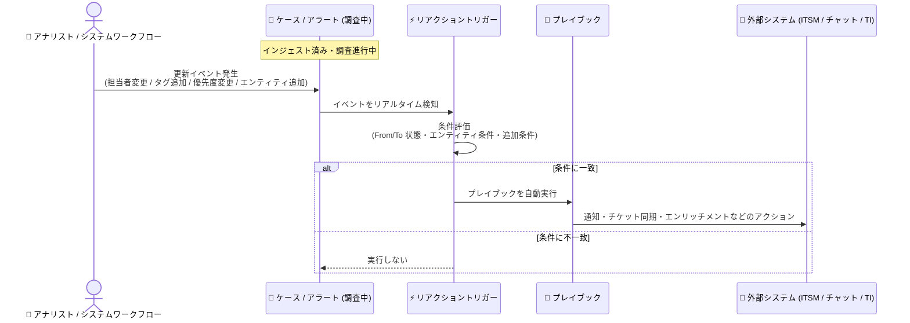

# Google SecOps: リアクショントリガー (Reaction Triggers) によるプレイブックの自動実行 (Preview)

**リリース日**: 2026-09-06

**サービス**: Google SecOps / Google SecOps SOAR

**機能**: リアクショントリガー (Reaction Triggers)

**ステータス**: Preview

📊 [このアップデートのインフォグラフィックを見る](https://takech9203.github.io/google-cloud-news-summary/20260906-google-secops-reaction-triggers.html)

## 概要

Google SecOps がプレイブックの新しいトリガー方式である「リアクショントリガー (Reaction Triggers)」を Preview として発表しました。リアクショントリガーはインジェスト後 (post-ingestion) トリガーとして機能し、調査中のケースやアラートに対するリアルタイムの更新イベント (ケース担当者の変更、ケースタグの追加、アラート優先度の変更、新規エンティティの追加など) に反応してプレイブックを自動的に起動できます。

従来の標準トリガー (インジェストトリガー) はアラートやケースがシステムに取り込まれた瞬間にのみ実行されるのに対し、リアクショントリガーはアクティブな調査の進行中に発生する状態変化やイベントに基づいてプレイブックを自動化します。イベントベースのロジックを導入することで、アラートの状態が変化した際にアナリストが手動でプレイブックをアタッチする必要がなくなります。

対象ユーザーは、Google SecOps SOAR でインシデント対応を自動化している SOC チームやセキュリティエンジニアです。エスカレーション通知、追加エンティティの自動エンリッチメント、外部 ITSM との同期といった、調査ライフサイクル中盤の運用ワークフローの自動化に有効です。

**アップデート前の課題**

- プレイブックの自動アタッチはインジェストトリガー (取り込み時の条件) に限定されており、アラートやケースがシステムに入った時点でのみプレイブックが起動していた
- 調査中にアラートの優先度や担当者、タグなどの状態が変化した場合、対応するプレイブックを手動でアタッチする必要があった
- 初回インジェスト後に調査へ追加されたエンティティに対して、エンリッチメントなどの処理を自動的に実行する仕組みがなかった

**アップデート後の改善**

- ケースやアラートのリアルタイムな更新イベント (担当者変更、タグ追加、優先度変更、エンティティ追加など) をトリガーとしてプレイブックを自動起動できるようになった
- アラート状態の変化時に手動でプレイブックをアタッチする作業が不要になった
- 「変更前 (From)」「変更後 (To)」の状態や追加条件を細かく指定でき、不要なプレイブック実行を抑制しながらイベント駆動の自動化を構成できるようになった

## アーキテクチャ図



インジェスト後の調査中に発生したケース・アラートの更新イベントをリアクショントリガーが検知し、設定された条件に一致した場合にプレイブックを自動実行するフローです。

## サービスアップデートの詳細

### 主要機能

1. **インジェスト後のイベント駆動トリガー**
   - リアクショントリガーはプレイブックの初期セットアップ時に設定するインジェスト後トリガーとして動作する
   - 標準トリガーが取り込み時に即時実行されるのに対し、リアクショントリガーはアクティブな調査中のリアルタイムな変更や特定イベントに基づいてプレイブックを自動化する

2. **スコープに応じたトリガーの動的フィルタリング**
   - プレイブック作成時に選択するスコープ (Alert / Case) に応じて、利用可能なリアクショントリガーが動的に絞り込まれる
   - Alert スコープではアラートレベルのイベントトリガー、Case スコープではケースレベルのトリガーが表示される

3. **柔軟な条件設定**
   - 優先度や担当者などの変更トリガーでは「変更前 (From)」「変更後 (To)」の状態を指定でき、`ANY` や OR 条件による複数の状態組み合わせも設定可能
   - Entity Added トリガーでは、エンティティのプロパティに対して AND / OR の論理演算子を用いた複数条件のフィルタリングが可能 (例: `Entity.Identifier contains @google.com AND Entity.Type is USERUNIQNAME`)
   - 「追加条件 (Define additional conditions)」セクションで、トリガー自体とは直接関係しない条件 (例: ケース優先度が High の場合のみ実行) を定義し、不要な実行を削減できる

## 技術仕様

### 利用可能なリアクショントリガー

| スコープ | トリガー | 発火条件 |
|------|------|------|
| Case | Case Assignee Changed | ケースの担当者 (アナリスト / SOC ロール) が変更されたとき |
| Case | Case Custom Field Changed | ケースレベルのカスタムフィールドやケースコンテキスト値が更新されたとき |
| Case | Case Priority Changed | ケース全体の重大度・優先度レベルが更新されたとき |
| Case | Case Stage Changed | 調査ライフサイクルのフェーズが遷移したとき (例: Triage → Containment) |
| Case | Case Tag Added | ケースにタグが追加されたとき (任意のタグ / 特定タグ値のフィルタリングが可能) |
| Case | Case Comment was Added | ケースに新しいコメントが投稿されたとき (コメント本文や添付ファイル名の条件指定が可能) |
| Alert | Entity Added | 初回インジェスト後にアクティブなアラートへ新しいエンティティがアタッチされたとき |
| Alert | Alert Priority Changed | アナリストまたはシステムワークフローがアラートの優先度を変更したとき |
| Alert | Alert Custom Field Changed | アラートレベルのカスタムフィールドやコンテキスト値が更新されたとき |

### カスタムフィールド変更トリガーのトグル動作

| トグル状態 | 動作 |
|------|------|
| Off (無効) | その状態の値をチェックしない (任意の値に一致し、変更前後の値に関係なく発火) |
| On (有効) | 特定の値をチェックする (フィールドを空のままにすると空文字列の検索を意味し、空だったフィールドが更新されたときの発火などを表現できる) |

## 設定方法

### 前提条件

1. Google SecOps SOAR のプレイブック機能が利用可能であること
2. 本機能は Preview のため、環境に表示されない場合は [プレビュー機能の管理](https://docs.cloud.google.com/chronicle/docs/secops/preview-features-manage) を確認するか、システム管理者に問い合わせる
3. Case Stage Changed を使う場合、調査ステージは管理者が SOAR 設定で構成しておく必要がある

### 手順

#### ステップ 1: プレイブックの作成とスコープ選択

1. **Add New Playbook or Block** をクリックして新しいプレイブックを作成する
2. **Create New** ダイアログでプレイブックの **Scope** を選択する
   - **Alert**: アラートレベルのイベントトリガーを設定する場合
   - **Case**: ケースレベルのトリガーを設定する場合
3. **Create** をクリックする

#### ステップ 2: リアクショントリガーの配置

1. **Step Selection** パネルで **Triggers** を選択する
2. **Reaction** タブを選択し、選択したスコープで利用可能なイベントベーストリガーを表示する
3. 対象のトリガーをプレイブックデザイナーのトリガーターゲットエリアにドラッグする

#### ステップ 3: トリガー条件の設定

1. トリガーをダブルクリックしてサイドドロワーを開く (Conditions タブのパラメータは選択したトリガーに合わせて自動的に更新される)
2. トリガーの種類に応じて条件を設定する
   - **Entity Added**: 「任意のエンティティ」または「特定のエンティティ」を選択し、エンティティプロパティと論理演算子 (AND / OR) で条件を定義
   - **Priority Changed 系**: 「Priority changed from」「Priority changed to」の状態を設定 (特定の優先度または `ANY`、OR による複数組み合わせが可能)
   - **Custom Field Changed 系**: 対象フィールドを選択し、From / To の状態とトグルを設定
   - **Case Assignee Changed / Case Stage Changed / Case Tag Added**: 変更前後の担当者・ステージやタグを設定
3. 必要に応じて **Define additional conditions (optional)** セクションで追加条件を定義し、不要な実行を抑制する

## メリット

### ビジネス面

- **対応時間の短縮**: 優先度が Critical に上がった瞬間に通知やエスカレーションが自動実行されるため、重大インシデントへの初動が早くなる
- **運用負荷の削減**: 状態変化のたびに手動でプレイブックをアタッチする作業が不要になり、アナリストは調査そのものに集中できる
- **外部システムとの整合性維持**: 担当者変更などのイベントを外部 ITSM プラットフォームへ自動同期でき、チケット情報の乖離を防げる

### 技術面

- **イベント駆動の自動化**: インジェスト時点だけでなく、調査ライフサイクル全体にわたってプレイブックの自動化ポイントを設けられる
- **細粒度の条件制御**: From/To 状態、エンティティプロパティ条件、追加条件を組み合わせて、発火条件を精密に制御できる
- **スコープベースの設計**: Alert / Case のスコープに応じたトリガーセットにより、適切なレベルで自動化を設計できる

## デメリット・制約事項

### 制限事項

- Preview 機能であり、Google Security Operations Service Specific Terms の Pre-GA Offerings Terms が適用される。サポートが限定される可能性があり、他の Pre-GA バージョンとの互換性が保証されない場合がある
- 環境によっては機能が表示されない場合があり、プレビュー機能の管理設定または管理者への確認が必要
- Entity Added トリガーの条件は、エンティティタイプの厳密な技術構文 (例: `USERUNIQNAME`、`DestinationURL`) を大文字小文字を区別して評価する
- Entity Added トリガーは、初回アラートインジェスト時に作成されたエンティティにはアタッチされない (インジェスト後に追加されたエンティティのみが対象)

### 考慮すべき点

- 条件を緩く設定すると意図しないプレイブック実行が増える可能性があるため、追加条件 (additional conditions) の活用による絞り込みが推奨される
- Case Stage Changed トリガーで利用できる調査ステージは、管理者が SOAR 設定で事前に構成したものに依存する

## ユースケース

### ユースケース 1: 新規発見エンティティの自動エンリッチメント (Alert スコープ)

**シナリオ**: 調査の進行中に、初回インジェスト後の新しいエンティティがアクティブな調査にアタッチされる。調査に関連するすべてのエンティティを、追加のタイミングにかかわらず自動的にエンリッチしたい。

**実装例**:
```
トリガー: Entity Added
条件例: Entity.Identifier contains @google.com AND Entity.Type is USERUNIQNAME
アクション: エンリッチメントプレイブックを実行し、レピュテーションデータを取得
```

**効果**: Entity Added トリガーが新規エンティティを検知し、エンリッチメントプレイブックを自動実行することで、即座にレピュテーション情報が提供される。

### ユースケース 2: インシデントの動的エスカレーションと通知 (Alert スコープ)

**シナリオ**: アラートの優先度が Medium から Critical に変更された際に、シニアステークホルダーへ自動的に通知したい。

**効果**: Alert Priority Changed トリガーがワークフローを実行し、ケース担当者への自動メール送信とインシデント対応 Slack チャネルへの通知が行われる。

### ユースケース 3: クロスプラットフォームのチケット同期 (Case スコープ)

**シナリオ**: セキュリティケースが一般キューから専門の SOC ロールやユーザーに再割り当てされた際に、外部 ITSM プラットフォームとの厳密な整合性を維持したい。

**効果**: Case Assignee Changed トリガーが発火し、対応する外部チケッティングシステムのオーナーフィールドを自動更新するとともに、新しい担当者へ運用サマリーを送信する。

## 料金

本機能固有の追加料金は Release Notes およびドキュメントに記載されていません。Google SecOps の料金体系については公式の料金ページを参照してください。

- [Google Security Operations の料金](https://cloud.google.com/security/products/security-operations)

## 関連サービス・機能

- **インジェストトリガー (Manage playbook triggers)**: 新しいアラートやケースがシステムに入った時点でプレイブックを自動アタッチする従来のトリガー。リアクショントリガーはこれを補完し、インジェスト後のイベントに対応する
- **Google SecOps SOAR プレイブック**: 事前定義された条件で起動する自動化プロセス。今回のアップデートで起動条件の選択肢が調査ライフサイクル全体に拡張された
- **Gemini によるプレイブック作成**: プレイブックの作成・編集に Gemini を活用可能。リアクショントリガーを含むプレイブック構築の起点となる
- **外部 ITSM / チャットツール連携**: リアクショントリガーと組み合わせることで、担当者変更や優先度変更を外部チケッティングシステムや Slack などへリアルタイムに反映できる

## 参考リンク

- 📊 [インフォグラフィック](https://takech9203.github.io/google-cloud-news-summary/20260906-google-secops-reaction-triggers.html)
- [公式リリースノート](https://docs.cloud.google.com/release-notes#September_06_2026)
- [Use reaction triggers in playbooks (ドキュメント)](https://docs.cloud.google.com/chronicle/docs/soar/respond/working-with-playbooks/using-reaction-triggers-in-playbooks)
- [Manage playbook triggers (インジェストトリガー)](https://docs.cloud.google.com/chronicle/docs/soar/respond/working-with-playbooks/using-triggers-in-playbooks)
- [プレビュー機能の管理](https://docs.cloud.google.com/chronicle/docs/secops/preview-features-manage)

## まとめ

リアクショントリガーの登場により、Google SecOps のプレイブック自動化はインジェスト時点の一度きりのトリガーから、調査ライフサイクル全体をカバーするイベント駆動型の自動化へと進化しました。SOC チームは、優先度変更時のエスカレーション、新規エンティティの自動エンリッチメント、ITSM とのチケット同期といった中間フェーズの手作業を削減できます。Preview 機能のため、まずは検証環境で Reaction タブのトリガーと条件設定を試し、既存のインジェストトリガーベースのプレイブックとの役割分担を設計することを推奨します。

---

**タグ**: Google SecOps, Google SecOps SOAR, Reaction Triggers, プレイブック, SOAR, インシデント対応, 自動化, Preview
