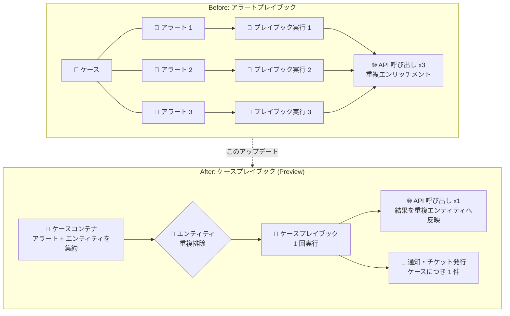

# Google SecOps SOAR: ケースプレイブック (Case playbooks)

**リリース日**: 2026-09-06

**サービス**: Google SecOps SOAR

**機能**: ケースプレイブック (Case playbooks)

**ステータス**: Preview (プレビュー)

📊 [このアップデートのインフォグラフィックを見る](https://takech9203.github.io/google-cloud-news-summary/20260906-google-secops-soar-case-playbooks.html)

## 概要

Google SecOps SOAR が「ケースプレイブック (Case playbooks)」をプレビューとしてサポートしました。従来のプレイブックが個々のアラートを対象に実行されていたのに対し、ケースプレイブックはケースコンテナ全体を対象にプレイブックの実行や手動アクションの実行が可能です。これにより、調査中の対応タスクを集約し、冗長なオペレーションを削減できます。

1 つのケースには類似した複数のアラートがグループ化されることが多く、アラート単位でプレイブックを実行すると非効率が発生していました。例えば、同じユーザーのパスワードリセットが複数回実行されたり、同一の IP アドレスのエンリッチメントが 10 個のアラートそれぞれで実行されてサードパーティ API のクレジットを浪費する、といった問題です。ケースプレイブックはケース全体を対象とすることで、Slack への通知やチケット発行などのアクションをケースにつき 1 回に集約できます。

本機能は SOC (Security Operations Center) のアナリストや、SecOps SOAR で自動化ワークフローを構築する自動化エンジニアが対象です。同日に発表された「リアクショントリガー (Reaction triggers)」と組み合わせることで、ケース担当者の変更や優先度変更など、調査中のケースのライフサイクル変化を起点とした自動化も実現できます。

**アップデート前の課題**

- プレイブックは個々のアラート単位でしか実行できず、同一ケース内の類似アラートに対して同じアクション (パスワードリセット、エンティティのエンリッチメントなど) が重複して実行されていた
- 同一エンティティ (IP アドレス、ホスト名など) が複数のアラートに含まれる場合、サードパーティ API へのリクエストが重複し、API クレジットを浪費していた
- 外部システムへのチケット発行やチーム通知などのケース単位のオペレーションでも、アラートごとに個別の実行が発生していた

**アップデート後の改善**

- ケースコンテナ全体を対象にプレイブックを実行でき、ケース内のすべてのアラートとエンティティにアクセスして 1 回のアクションで処理できるようになった
- エンティティの重複排除 (Deduplicate entities) がデフォルトで有効になり、ユニークなエンティティのみをサードパーティツールに送信し、結果をケース内の重複エンティティへ自動的にコピーすることで API クレジットを節約できるようになった
- ケースの優先度変更や担当者変更などのライフサイクルイベントを起点とするリアクショントリガーにより、調査中のケース更新に応じた自動化が可能になった
- 手動アクションもケースレベルで 1 回だけ実行できるようになった (プレイブックをアタッチせずにケースインターフェースから実行可能)

## アーキテクチャ図



従来はケース内のアラートごとにプレイブックが実行され、同一エンティティへのアクションが重複していましたが、ケースプレイブックではケースコンテナ全体のエンティティを重複排除して 1 回の実行に集約し、結果を重複エンティティへ自動反映します。

## サービスアップデートの詳細

### 主要機能

1. **ケーススコープのプレイブック実行**
   - プレイブック作成時にスコープとして「Case」を選択可能 (デフォルトは「Alert」)
   - ケースに関連付けられたすべてのアラートとエンティティにアクセスし、ケース単位の操作タスクを自動化できる
   - ケースプレイブックの実行時に処理・データ抽出の対象となるのは、ケース内で「Open」ステータスのアラートのみ

2. **エンティティのスコーピングと重複排除**
   - ケース内の全アラートのエンティティを単一のリストに自動集約
   - 各アクションに「Deduplicate entities」トグルを搭載 (デフォルト有効)。識別子とタイプでユニークなエンティティのみを外部ツールへ送信し、結果をケース内の一致する重複エンティティへ自動コピー
   - エンティティループ内でも「Deduplicate loop entities」トグル (デフォルト有効) と「Lock scope to iteration」設定で挙動を制御可能

3. **ケースレベルの手動アクション**
   - Content Hub の標準アクションはすべてケースに対して直接実行可能
   - ケースインターフェースの手動アクションアイコンから、Case レベルか Alert レベルかを選択して実行
   - アラート単位の手動アクションが個別実行されるのに対し、ケース手動アクションはケースコンテキスト全体に対して 1 回だけ実行される

4. **ケースレベルのトリガー**
   - インジェスショントリガー: All (すべての新規ケース) / Custom Trigger (フィールド評価) / Tag Name (特定タグ付きケース)
   - リアクショントリガー: ケース担当者の変更、ケースカスタムフィールドの変更、ケース優先度の変更、ケースステージの変更、ケースタグの追加、ケースコメントの追加を起点に自動実行

5. **プレイブックブロックの共用**
   - プレイブックブロックはスコープ非依存で、一度作成すればアラートプレイブックとケースプレイブックの両方で利用可能
   - ケースプレイブック内に配置したブロックにも「Deduplicate entities」トグルが付与される (デフォルト有効)

## 技術仕様

### アタッチ・実行の上限

| 項目 | 詳細 |
|------|------|
| ケースへのプレイブックアタッチ上限 | ケースコンテナあたり最大 30 個 |
| インジェスション時の自動アタッチ | ケースあたり 1 個のケースプレイブックのみ |
| アラートへのアタッチ上限 | 通常 10 個。リアクショントリガーまたはケースプレイブック機能が有効な顧客は最大 30 個 |
| 再実行 (Rerun) 上限 | 同一プレイブックにつき最大 10 回。リアクショントリガーまたはケースプレイブック機能が有効な顧客は最大 30 回 |
| 実行優先度 | 1 (最高) 〜 3 (最低)。デフォルトは 2 |
| 処理対象アラート | ケース内で「Open」ステータスのアラートのみ |

### ケースプレイブック完全サポートに必要な統合の最低バージョン

古いバージョンの統合を使用している場合、一部のケースプレイブック機能が期待どおりに動作しない可能性があります。

| 統合 | 最低バージョン |
|------|----------------|
| AlienVaultAppliance | 28 |
| ConnectWise | 23 |
| EmailUtilities | 50 |
| Enrichment | 35 |
| FileUtilities | 25 |
| GoogleChronicle | 84 |
| Jira | 58 |
| MISP | 40 |
| ServiceDeskPlus | 10 |
| ServiceDeskPlusV3 | 10 |
| ServiceNow | 67 |
| Siemplify | 108 |
| TemplateEngine | 23 |
| Tools | 81 |

## 設定方法

### 前提条件

1. Google SecOps SOAR を利用していること (本機能は Release 6.3.100 で段階的にロールアウト中)
2. プレビュー機能が環境で有効になっていること (表示されない場合は「Manage preview features」を確認するか、システム管理者に問い合わせ)
3. ケースプレイブックを完全にサポートするため、対象の統合を最低必要バージョンへ更新していること

### 手順

#### ステップ 1: ケーススコープのプレイブックを作成

1. プレイブックの新規作成時に、スコープのオプションから「Case」を選択する (デフォルトは「Alert」)
2. スコープを「Case」にすると、プレイブックビルダーがケースレベル操作向けのインジェスショントリガーとリアクショントリガーを表示する

#### ステップ 2: トリガーを設定

- インジェスショントリガー (All / Custom Trigger / Tag Name) で新規ケース作成時のアタッチ条件を設定する
- または、リアクショントリガー (担当者変更、優先度変更、ステージ変更、タグ追加、コメント追加など) で調査中のライフサイクルイベントを起点に設定する

#### ステップ 3: 手動アクションをケースレベルで実行する場合

1. ケースを開き、ツールバーの手動アクションアイコンをクリック
2. 「Case」レベルか「Alert」レベルかを選択
3. 実行するアクションを選び、必要なパラメータを設定
4. 「Execute」をクリック

**注意**: 組み込み統合はデフォルトでケースレベルのワークフローを完全サポートしますが、カスタムアクションやカスタム Python スクリプトを使用する場合は、コードがアラート配列全体をループ処理し、ケースレベルでエンティティ詳細を欠落させないようにする必要があります。

## メリット

### ビジネス面

- **API クレジットの節約**: エンティティ重複排除により、同一エンティティへのサードパーティ API 呼び出しが 1 回に集約され、VirusTotal などの外部サービスの利用コストを削減できる
- **SOC の運用効率向上**: チケット発行や通知がケースにつき 1 件に集約され、外部システムの重複チケットや通知ノイズが減り、アナリストの調査に集中できる

### 技術面

- **冗長な実行の排除**: パスワードリセットや同一 IP のエンリッチメントなど、アラートごとに重複していたアクションがケース単位の 1 回実行になる
- **ライフサイクル駆動の自動化**: リアクショントリガーにより、インジェスション時だけでなく調査中のケース更新 (優先度変更、担当者変更など) を起点にワークフローを起動できる
- **既存資産の再利用**: プレイブックブロックはスコープ非依存のため、既存のブロックをケースプレイブックでもそのまま利用できる

## デメリット・制約事項

### 制限事項

- プレビュー機能であり、Google Security Operations Service Specific Terms の Pre-GA Offerings Terms が適用される (サポートが限定される場合や、他の Pre-GA バージョンと互換性がない変更が入る可能性がある)
- すべての顧客・リージョンで利用できるわけではない (Release 6.3.100 は第 1 フェーズのリージョンへ段階的ロールアウト中)
- プレイブック名はプラットフォーム全体で一意である必要があり、ケースプレイブックとアラートプレイブックで同名は使用できない
- ケースプレイブックの実行は、Legacy Monitoring ダッシュボードおよび SOAR Data Exports (Managed BigQuery / Bring Your Own BigQuery (BYOBQ)) の対象外
- ケースプレイブックは「Open」ステータスのアラートのみを処理・データ抽出の対象とする

### 考慮すべき点

- カスタムアクション・カスタム Python スクリプトは、アラート配列全体をループ処理するようコードを修正しないと、ケースレベルでエンティティ詳細が欠落する可能性がある
- ケースプレイブックの安定動作には、Jira、ServiceNow、Siemplify、Tools などの統合を最低必要バージョンへ更新する必要がある
- 重複エンティティのアラート固有プロパティを個別に処理したい場合は、「Deduplicate entities」トグルを無効化する設計判断が必要

## ユースケース

### ユースケース 1: ケース作成時の ITSM チケット自動発行

**シナリオ**: 新しいケースが作成された瞬間に、外部の IT サービス管理 (ITSM) システムへトラッキングチケットを自動作成したい。従来はアラートごとにチケットが乱立するおそれがあった。

**実装例**:
```
1. スコープ「Case」でプレイブックを作成
2. インジェスショントリガー「All」(または Tag Name で対象を絞る) を設定
3. ServiceNow / Jira などの統合でチケット作成アクションを配置
4. ケース作成と同時にケースにつき 1 件のチケットが発行される
```

**効果**: ケース単位で 1 件のトラッキングチケットに集約され、外部システムの重複チケットが解消される。

### ユースケース 2: 調査中のケース全エンティティの一括再エンリッチメント

**シナリオ**: 調査の途中で、複数のアラートから収集されたすべてのエンティティに対してエンリッチメントブロックを再実行したい。従来はアラートごとにループ実行が必要だった。

**効果**: ケースレベルで 1 回実行するだけで、重複排除されたユニークなエンティティのみが外部ツールに送信され、結果はケース内の一致する重複エンティティへ自動反映される。API クレジットと実行時間を削減できる。

### ユースケース 3: リアクショントリガーによる担当者変更時の通知

**シナリオ**: ケースの担当者が変更されたときに、Slack 通知の送信や新しいタスクの割り当てを自動化したい。

**効果**: 「Case Assignee Changed」リアクショントリガーにより、調査中のオーナーシップ変更を起点にワークフローが自動起動し、引き継ぎの抜け漏れを防止できる。

## 料金

ケースプレイブックは Google SecOps SOAR の機能として提供され、この機能固有の追加料金は Release Notes およびドキュメントには記載されていません。Google SecOps の料金体系はライセンスパッケージに基づきます。詳細は料金ページを参照してください。

- [Google Security Operations の料金](https://cloud.google.com/security/products/security-operations)

## 利用可能リージョン

本機能はすべての顧客・リージョンで利用できるわけではありません。Release 6.3.100 は第 1 フェーズのリージョンから段階的にロールアウトされています。詳細は [SOAR gradual release](https://docs.cloud.google.com/chronicle/docs/soar/overview-and-introduction/soar-gradual-release) を参照してください。

## 関連サービス・機能

- **リアクショントリガー (Reaction triggers)**: 同日にプレビュー発表された機能。ケースやアラートのリアルタイム更新 (担当者変更、タグ変更、優先度変更、エンティティ追加など) を起点にプレイブックを自動起動する。ケースプレイブックと組み合わせて利用する
- **アラートプレイブック**: 従来からの個別アラートを対象とするプレイブック。ケースプレイブックと併用可能で、プレイブックブロックは両スコープで共用できる
- **Content Hub**: サードパーティ統合、ユースケース、Power Ups を提供。標準アクションはすべてケースレベルでの実行をサポート
- **SOAR Data Exports (BigQuery)**: SOAR データのエクスポート機能。現時点でケースプレイブックの実行はエクスポート対象外である点に注意

## 参考リンク

- 📊 [インフォグラフィック](https://takech9203.github.io/google-cloud-news-summary/20260906-google-secops-soar-case-playbooks.html)
- [公式リリースノート](https://docs.cloud.google.com/release-notes#September_06_2026)
- [Google SecOps SOAR リリースノート](https://docs.cloud.google.com/chronicle/docs/soar/release-notes)
- [ドキュメント: Case playbooks overview](https://docs.cloud.google.com/chronicle/docs/soar/respond/working-with-playbooks/case-playbooks)
- [ドキュメント: Attach playbooks to alerts or cases](https://docs.cloud.google.com/chronicle/docs/soar/respond/working-with-playbooks/attach-playbooks-to-alerts-cases)
- [ドキュメント: Use reaction triggers in playbooks](https://docs.cloud.google.com/chronicle/docs/soar/respond/working-with-playbooks/using-reaction-triggers-in-playbooks)
- [料金ページ](https://cloud.google.com/security/products/security-operations)

## まとめ

ケースプレイブックは、SecOps SOAR の自動化をアラート単位からケース単位へ引き上げ、重複アクションの排除とサードパーティ API クレジットの節約を実現する重要なアップデートです。SOC で同一ケース内の類似アラートに対する冗長なプレイブック実行に課題を感じているチームは、プレビュー機能を有効化し、対象統合を最低必要バージョンへ更新した上で、チケット発行やエンリッチメントのケーススコープ化を検証することを推奨します。

---

**タグ**: Google SecOps, SOAR, Case Playbooks, セキュリティ運用, 自動化, プレイブック, Preview
