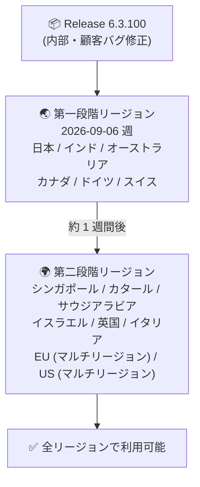

# Google SecOps SOAR: Release 6.3.100 の第一段階リージョンへのロールアウト開始

**リリース日**: 2026-09-06

**サービス**: Google SecOps SOAR

**機能**: Release 6.3.100 (バグ修正リリース)

**ステータス**: Announcement

📊 [このアップデートのインフォグラフィックを見る](https://takech9203.github.io/google-cloud-news-summary/20260906-google-secops-soar-release-6-3-100.html)

## 概要

Google SecOps SOAR の Release 6.3.100 が、段階的リリース計画 (Gradual Release) に基づく第一段階のリージョンへのロールアウトを開始しました。本リリースは、内部バグ修正および顧客報告に基づくバグ修正 (internal and customer bug fixes) を含むメンテナンスリリースであり、新機能の追加は含まれていません。

Google SecOps SOAR のリリースは通常、日曜日に実施される 2 段階のロールアウトで展開されます。第一段階のリージョンへの展開後、約 1 週間後に第二段階のリージョンが更新されます。直近の例では、Release 6.3.99 が 2026 年 8 月 30 日に第一段階リージョンへ展開され、9 月 5 日に全リージョンで利用可能になっています。

この方式は、Google SecOps SOAR をスタンドアロンプラットフォームとして利用している顧客と、Google SecOps 内の SOAR コンポーネントとして利用している顧客の両方に適用されます。

## アーキテクチャ図

Google SecOps SOAR の 2 段階ロールアウトの流れ。第一段階リージョンへの展開から約 1 週間後に第二段階リージョンが更新されます。

## サービスアップデートの詳細

### 主要内容

1. **内部および顧客バグ修正**
   - Release 6.3.100 は内部バグ修正と顧客報告に基づくバグ修正を含むメンテナンスリリース
   - 新機能の追加は本アナウンスには含まれない
   - 顧客側での対応作業は不要

2. **段階的ロールアウト (Gradual Release)**
   - リリースは通常、日曜日に 2 段階で展開される
   - 第二段階リージョンは第一段階リージョンの約 1 週間後に更新される
   - 自身のリージョンが不明な場合は Google SecOps 担当者に確認する

## 利用可能リージョン

公式ドキュメント ([Release plan for Google SecOps](https://docs.cloud.google.com/chronicle/docs/soar/overview-and-introduction/soar-gradual-release)) に記載のリージョン区分は以下の通りです。

| 段階 | リージョン |
|------|-----------|
| 第一段階 (今回ロールアウト開始) | 日本、インド、オーストラリア、カナダ、ドイツ、スイス |
| 第二段階 (約 1 週間後) | シンガポール、カタール、サウジアラビア、イスラエル、英国 (ロンドン)、イタリア、EU (マルチリージョン)、US (マルチリージョン) |

## 関連サービス・機能

- **Google SecOps (Google Security Operations)**: SOAR は Google SecOps プラットフォームの一部として提供され、本リリース計画はスタンドアロン SOAR と SecOps 内 SOAR コンポーネントの両方に適用される
- **Google Cloud Status Dashboard**: Google SecOps SOAR のステータスは [ステータスダッシュボード](https://status.cloud.google.com/security/) で確認可能

## 参考リンク

- 📊 [インフォグラフィック](https://takech9203.github.io/google-cloud-news-summary/20260906-google-secops-soar-release-6-3-100.html)
- [公式リリースノート](https://docs.cloud.google.com/release-notes#September_06_2026)
- [Google SecOps SOAR リリースノート](https://docs.cloud.google.com/chronicle/docs/soar/release-notes)
- [Release plan for Google SecOps (段階的リリース計画)](https://docs.cloud.google.com/chronicle/docs/soar/overview-and-introduction/soar-gradual-release)

## まとめ

Release 6.3.100 はバグ修正のみのメンテナンスリリースであり、顧客側での対応は不要です。第一段階リージョン (日本を含む) から順次展開され、約 1 週間後に全リージョンで利用可能になる見込みです。自身の環境のリージョン区分が不明な場合は Google SecOps 担当者への確認を推奨します。

---

**タグ**: #GoogleSecOps #SOAR #セキュリティ #リリース #バグ修正
