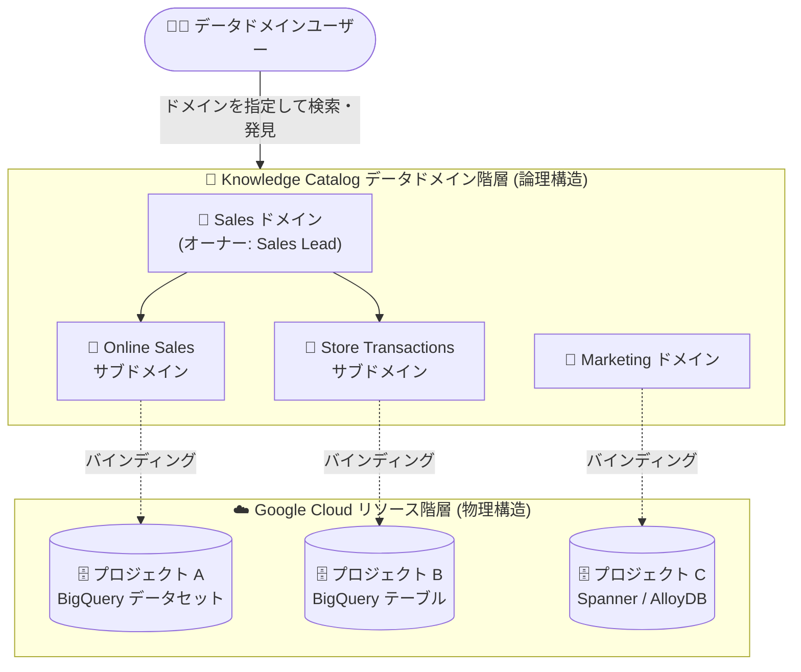

# Knowledge Catalog (Dataplex): データドメイン (Preview)

**リリース日**: 2026-09-07

**サービス**: Knowledge Catalog (旧 Dataplex Universal Catalog)

**機能**: データドメイン (Data domains)

**ステータス**: Preview

📊 [このアップデートのインフォグラフィックを見る](https://takech9203.github.io/google-cloud-news-summary/20260907-knowledge-catalog-data-domains.html)

## 概要

Knowledge Catalog (旧 Dataplex Universal Catalog) に、エンタープライズ内のデータリソースを論理的に整理・管理・発見・キュレーションするための「データドメイン (Data domains)」機能が Preview として追加された。データドメインは、Google Cloud のフォルダ・プロジェクトというリソース階層から独立した、ビジネス構造と所有権を反映した論理的なデータ組織階層を定義できる機能である。

データドメインは、データメッシュアーキテクチャにおける「ドメイン」の概念を Knowledge Catalog 上でネイティブに表現するもので、分散したドメインチームの所有権の論理単位として機能し、既存の「データプロダクト」機能を補完する。ドメイン単位で検索範囲を絞り込むことで、大規模なデータ資産の中から関連リソースを高速かつ的確に発見できるようになる。

対象ユーザーは、複数プロジェクトにデータ資産が分散している大規模組織のデータガバナンス管理者、ドメインデータオーナー、データアナリストである。

**アップデート前の課題**

- 論理的に類似したデータ資産 (例: 営業関連のテーブルやデータセット) が複数の Google Cloud プロジェクトに分散しており、発見と一貫したガバナンスが困難だった
- データの論理的な組織化が Google Cloud のフォルダ・プロジェクトというリソース階層に縛られており、ビジネス構造 (部門・ドメイン) に沿った整理ができなかった
- Dataplex でデータメッシュを構築する場合、レイク・ゾーン・アセットという Cloud Storage 中心のエンティティでドメインを表現する必要があった

**アップデート後の改善**

- リソース階層から切り離された、ビジネスプロセスに沿った論理的なデータドメイン階層 (最大 5 階層のネスト) を定義できるようになった
- 複数プロジェクトに分散した BigQuery データセット・テーブル、Spanner データベースなどをドメインに紐付け (バインディング)、ドメイン単位で発見・キュレーションできるようになった
- 使用ガイダンス、ガバナンス標準、説明、所有者情報などの共通コンテキストをドメインレベルで一元的に定義できるようになった
- 検索範囲を特定のドメイン (例: Marketing ドメイン) に絞り込み、より高速で関連性の高いデータ発見が可能になった

## アーキテクチャ図



データドメインはフォルダ・プロジェクトの物理的なリソース階層から独立した論理階層を形成し、複数プロジェクトに分散するデータ資産をバインディングによってドメインに紐付ける。ユーザーはドメインを起点に検索範囲を絞り込んでデータを発見できる。

## サービスアップデートの詳細

### 主要機能

1. **ビジネス構造に沿った論理的なドメイン階層**
   - フォルダ・プロジェクトのリソース階層から独立 (デカップリング) した論理階層を定義できる
   - 組織構造に合わせたトップレベルドメイン (例: Sales、Supply Chain、Marketing) と、その配下のサブドメイン (例: Sales 配下の Online Sales、Store Transactions) を構成できる

2. **分散ドメインチームの所有権の論理単位**
   - データメッシュにおける分散型のドメインチームの所有単位として機能し、データプロダクト機能を補完する
   - ドメインごとにオーナー (連絡先) を指定し、ドメインレベルのガバナンスを委任できる

3. **大規模なディスカバリー制御と共通コンテキスト**
   - 誰がリソースとそのメタデータを発見できるかを、ドメイン単位で一元的に制御できる
   - 使用ガイダンス、ガバナンス標準、説明、所有者情報などの共通コンテキストをドメインに付与できる

4. **ドメインスコープの検索**
   - 検索結果を特定のドメインに絞り込める (例: Marketing ドメイン内のみを検索)
   - 大規模なデータ資産の中から、より高速で関連性の高い発見が可能

5. **ドメイン認可 (Domain authorization) によるバインディング**
   - リソースオーナーが、対象リソースまたはプロジェクトに対してデータドメインの IAM プリンシパルへ権限を付与することで、リソースとドメイン間のバインディングを作成できる
   - 認可時のロールタイプは Reader / Writer / Admin の 3 種類 (Writer はリソースのメタデータ編集権限の管理、Admin はリソースの任意の権限の管理をドメインに許可)

## 技術仕様

### サポートされるアセット

データドメインには以下のアセットをバインドできる。

| カテゴリ | アセット |
|------|------|
| プロジェクト | Google Cloud プロジェクト |
| カタログ | データプロダクト |
| BigQuery | データセット、テーブル、BigLake テーブル |
| データ変換 | Dataform リポジトリ |
| メタストア | Dataproc Metastore データベース / テーブル |
| データベース | Spanner データベース、AlloyDB for PostgreSQL インスタンス |
| AI | Gemini Enterprise Agent Platform データセット |

### 制限値 (Preview 時点)

| 項目 | 詳細 |
|------|------|
| ドメイン / サブドメインの最大ネスト深度 | 5 階層 |
| 単一ドメイン直下のサブドメイン数 | 最大 50 |
| プロジェクト内のリージョンあたりドメイン数 | 最大 1,000 |

### IAM ロール

| ロール | 用途 |
|------|------|
| `roles/dataplex.dataDomainAdmin` | データドメイン、バインディング、IAM ポリシーの完全な管理 |
| `roles/dataplex.dataDomainEntryReader` | ドメイン内リソースの発見とメタデータの閲覧 |

なお、「ドメイン認可 (対象リソースに対してドメインの IAM プリンシパルへ権限を付与しバインディングを可能にすること)」と「ドメインユーザー権限 (ユーザーがドメイン自体を閲覧・編集・管理するための権限付与)」は区別される。また、ドメインプリンシパルの IAM ロールをリソースから取り消しても、バインディングが明示的に削除されるまでリソースはドメインから自動的に外れない点に注意が必要である。

## 設定方法

### 前提条件

1. Dataplex API を有効化する
2. プロジェクトに対して Dataplex Data Domain Admin (`roles/dataplex.dataDomainAdmin`) ロールの付与を受ける

### 手順

#### ステップ 1: データドメインの作成 (REST API)

```bash
cat > request.json << 'EOF'
{
  "display_name": "Finance Domain",
  "description": "Domain for finance datasets and reports.",
  "contacts": {
    "identities": [
      {
        "contact_name": "Alice Wonderland",
        "contact_role": "owner",
        "contact_id": "alice@example.com"
      }
    ]
  }
}
EOF

curl -X POST \
  -H "Authorization: Bearer $(gcloud auth print-access-token)" \
  -H "Content-Type: application/json; charset=utf-8" \
  -d @request.json \
  "https://dataplex.googleapis.com/v1/projects/PROJECT_ID/locations/LOCATION_ID/dataDomains?data_domain_id=DATA_DOMAIN_ID"
```

`projects.locations.dataDomains.create` メソッドでドメインを作成する。Google Cloud コンソールの「Data domains」ページからも、表示名・ドメイン ID・説明・オーナー・ラベルを指定して作成できる。

#### ステップ 2: サブドメインの作成

```bash
cat > request.json << 'EOF'
{
  "display_name": "Finance Subdomain",
  "description": "A subdomain within the Finance domain.",
  "contacts": {
    "identities": [
      {
        "contact_name": "Alice Wonderland",
        "contact_role": "owner",
        "contact_id": "alice@example.com"
      }
    ]
  },
  "parent_data_domain": "projects/PROJECT_ID/locations/LOCATION_ID/dataDomains/PARENT_DATA_DOMAIN_ID"
}
EOF

curl -X POST \
  -H "Authorization: Bearer $(gcloud auth print-access-token)" \
  -H "Content-Type: application/json; charset=utf-8" \
  -d @request.json \
  "https://dataplex.googleapis.com/v1/projects/PROJECT_ID/locations/LOCATION_ID/dataDomains?data_domain_id=SUBDOMAIN_ID"
```

リクエストボディの `parent_data_domain` に親ドメインを指定することで、階層を拡張するサブドメインを作成できる。

#### ステップ 3: リソースのドメインへのバインディング

リソースオーナーが対象リソース (プロジェクトや BigQuery データセットなど) に対してデータドメインの IAM プリンシパルへロール (Reader / Writer / Admin のいずれかのロールタイプ) を付与し、バインディングを作成する。バインディング作成後、`roles/dataplex.dataDomainEntryReader` を持つドメインユーザーがドメイン内でリソースを検索し、メタデータを閲覧できる。

## メリット

### ビジネス面

- **ビジネス構造に沿ったデータ整理**: プロジェクト構成の制約を受けず、部門・事業ドメイン単位でデータ資産を整理でき、データメッシュの組織モデルをそのままカタログに反映できる
- **分散オーナーシップの実現**: ドメインごとにオーナーを割り当ててガバナンスを委任でき、中央集権的なボトルネックを回避しつつ統制を維持できる
- **データ発見の効率化**: ドメインスコープの検索により、利用者が無関係な全社データをかき分けることなく、信頼できる関連データを迅速に発見できる

### 技術面

- **リソース階層からのデカップリング**: 既存のプロジェクト・フォルダ構成を変更することなく、論理的なデータ組織を後付けで定義できる
- **多様なアセットへの対応**: BigQuery、Spanner、AlloyDB、Dataform、Dataproc Metastore など幅広いアセットタイプを単一のドメインに集約できる
- **データプロダクトとの補完関係**: ドメインは「ビジネス構造に基づく組織化」、データプロダクトは「特定ユースケース向けのキュレーション済みバンドル」として、組み合わせて利用できる

## デメリット・制約事項

### 制限事項

- Preview 段階の機能であり、Pre-GA Offerings Terms が適用される (「現状有姿」での提供、サポートが限定される可能性がある)
- ドメイン / サブドメインのネストは最大 5 階層、単一ドメイン直下のサブドメインは最大 50、プロジェクト内のリージョンあたりドメイン数は最大 1,000 という制限がある
- ドメイン ID は作成後に変更できない

### 考慮すべき点

- ドメイン認可はバインディング作成時にのみ検証される。ドメインプリンシパルの IAM ロールをリソースから取り消しても、バインディングを明示的に削除するまでドメインユーザーはリソースを発見・メタデータ閲覧し続けられるため、リソースをドメインから外す際はバインディングの削除が必要
- ドメイン認可のロールタイプ (Reader / Writer / Admin) は、ドメインにリソースへどの程度の長期的なアクセスを許可するかを考慮して選択する必要がある
- データドメイン作成・検索が利用可能になるまで数分かかる場合がある

## ユースケース

### ユースケース 1: グローバル小売企業におけるドメイン別データ組織化

**シナリオ**: 営業、サプライチェーン、マーケティングなどの部門ごとにデータ資産が複数の Google Cloud プロジェクトに分散しており、発見と一貫したガバナンスが困難になっている。

**実装例**:
- データドメイン管理者が組織構造に合わせて `Sales`、`Supply Chain`、`Marketing` のトップレベルドメインを作成し、`Sales` 配下に `Online Sales`、`Store Transactions` のサブドメインを構成
- 各ドメインにオーナー (例: Sales ドメインに Sales Lead) を割り当て
- Sales ドメインオーナーが、複数プロジェクトに分散するデータセット・テーブル・データプロダクトを Sales ドメインにバインドし、データ保持基準やコストセンターなどのドメインレベルのアスペクトを定義

**効果**: プロジェクト構成を変更することなく、ビジネス構造に沿ったデータ組織とドメイン単位のガバナンス委任が実現する。

### ユースケース 2: ドメインスコープ検索によるデータ発見

**シナリオ**: マーケティングキャンペーンに向けて営業データを探しているアナリストが、全社の膨大なデータ資産の中から関連リソースを見つけたい。

**効果**: ドメイン階層を探索して Sales ドメインを特定し、検索範囲をドメインに絞り込むことで、無関係なデータを除外して関連リソースを迅速に発見できる。リソースのメタデータ、スキーマ、使用ガイダンスを確認して利用適合性を評価できる。

## 料金

データドメイン機能固有の料金情報は Release Notes およびドキュメントでは確認できなかった。Knowledge Catalog (Dataplex) の料金体系については公式の料金ページを参照。

- [Knowledge Catalog (Dataplex) 料金ページ](https://cloud.google.com/dataplex/pricing)

## 利用可能リージョン

データドメインはリージョン (例: `us-central1`) を指定して作成する。利用可能なリージョンの一覧は公式ドキュメントを参照。

- [Knowledge Catalog のロケーション](https://docs.cloud.google.com/dataplex/docs/locations)

## 関連サービス・機能

- **データプロダクト (Knowledge Catalog)**: 特定のビジネスユースケースを解決するためにアセットをキュレーションしてパッケージ化する機能。データドメインは「ビジネス構造に基づく組織化」を担い、両者は補完的な構成要素として機能する
- **BigQuery**: データドメインにバインドできる主要アセット (データセット、テーブル、BigLake テーブル)。Knowledge Catalog が BigQuery データにビジネスコンテキストを付与する
- **Spanner / AlloyDB for PostgreSQL**: データベースインスタンス・データベースをドメインにバインドし、分析データ以外のオペレーショナルデータもドメイン管理の対象にできる
- **Dataform / Dataproc Metastore**: データ変換リポジトリやメタストアのデータベース・テーブルもドメインにバインド可能
- **IAM**: ドメイン認可とドメインユーザー権限の 2 つの観点で、IAM ロールによるアクセス制御を行う

## 参考リンク

- 📊 [インフォグラフィック](https://takech9203.github.io/google-cloud-news-summary/20260907-knowledge-catalog-data-domains.html)
- [公式リリースノート](https://docs.cloud.google.com/release-notes#September_07_2026)
- [データドメインの概要 (About data domains)](https://docs.cloud.google.com/dataplex/docs/data-domains-overview)
- [データドメインの作成](https://docs.cloud.google.com/dataplex/docs/data-domains-create)
- [データドメインへのリソースの追加](https://docs.cloud.google.com/dataplex/docs/data-domains-resources)
- [データプロダクトの概要](https://docs.cloud.google.com/dataplex/docs/data-products-overview)
- [料金ページ](https://cloud.google.com/dataplex/pricing)

## まとめ

データドメインは、Google Cloud のリソース階層に縛られずビジネス構造に沿ってデータ資産を組織化できる、データメッシュ実践の中核となる機能である。複数プロジェクトにデータが分散している組織は、Preview 段階のうちにドメイン階層の設計 (ドメイン境界、オーナーシップ、サブドメイン構成) を検討し、データプロダクト機能と組み合わせた分散型データガバナンスの評価を始めることを推奨する。

---

**タグ**: #KnowledgeCatalog #Dataplex #DataDomains #DataMesh #DataGovernance #BigQuery #Preview
