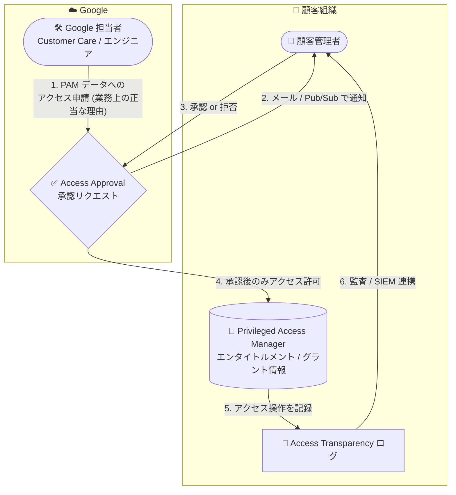

# Access Approval / Access Transparency: Privileged Access Manager 対応が一般提供 (GA)

**リリース日**: 2026-09-07

**サービス**: Access Approval / Access Transparency

**機能**: Privileged Access Manager のサポートが一般提供 (GA)

**ステータス**: GA (一般提供)

📊 [このアップデートのインフォグラフィックを見る](https://takech9203.github.io/google-cloud-news-summary/20260907-privileged-access-manager-ga.html)

## 概要

2026 年 9 月 7 日、Access Approval および Access Transparency の両サービスにおいて、Privileged Access Manager (PAM) のサポートが一般提供 (GA) となりました。公式ドキュメントの「Supported services」ページにおいて、Privileged Access Manager が GA ステージのサポート対象サービスとして掲載されています。

Access Transparency は、Google の担当者 (Cloud Customer Care やエンジニアリングチーム) がサポート対応やサービス可用性の維持のために顧客データ (Customer Data) にアクセスした際、その操作をログとして記録するサービスです。Access Approval はさらに一歩進んで、Google 担当者が顧客データにアクセスする前に、顧客管理者による明示的な承認を必須にする仕組みを提供します。今回の GA により、PAM に保存されたデータ (エンタイトルメントやグラントに関する情報など) への Google 担当者によるアクセスが、Access Transparency ログによる記録と Access Approval による事前承認の対象として、本番環境での利用に適した GA サポートレベルで扱えるようになりました。

PAM 自体は、ジャストインタイム (JIT) の一時的な権限昇格を管理する IAM のサービスであり、緊急アクセスや本番環境への時限アクセスなど、組織内の特権アクセス管理の中核を担います。特権アクセスの管理データそのものが機密性の高い情報であるため、金融・公共など規制要件の厳しい業界の組織にとって、PAM が Access Transparency / Access Approval の GA サポート対象となったことは、コンプライアンスと監査体制の観点で重要なアップデートです。

**アップデート前の課題**

- Privileged Access Manager が Access Transparency / Access Approval の GA サポート対象として明記されておらず、Google 担当者による PAM データへのアクセスの可視化・承認制御を GA 品質で担保できなかった
- 規制業界の組織では、GA ステージのサポートを前提としたコンプライアンス要件により、PAM のデータを厳格な管理対象に含めることが難しかった
- Access Approval には「GA ステージのサービスのみ登録する」という設定オプションがあり、この設定を採用している組織では GA 前のサービスは自動登録の対象外だった

**アップデート後の改善**

- Google 担当者が PAM のデータにアクセスする際の操作が Access Transparency ログに GA サポートとして記録されるようになった
- Access Approval を有効化している組織では、Google 担当者による PAM データへのアクセスに顧客の明示的な事前承認を GA サポートとして必須化できるようになった
- Access Approval の「GA サービスのみ自動登録」設定を採用している組織でも、PAM が自動的に保護対象に含まれるようになった

## アーキテクチャ図



Google 担当者が Privileged Access Manager のデータにアクセスする際のフローです。Access Approval による顧客の事前承認を経てはじめてアクセスが許可され、実際のアクセス操作は Access Transparency ログに記録されて顧客側で監査できます。

## サービスアップデートの詳細

### 主要機能

1. **Access Transparency による PAM アクセスの記録 (GA)**
   - Google 担当者が PAM のデータにアクセスした際、影響を受けたリソースと操作、操作時刻、アクセス理由、アクセス者の情報 (物理的な所在地、所属組織、職種など) がログに記録される
   - Access Transparency ログは Cloud Audit Logs と類似しているが、Cloud Audit Logs が組織メンバーの操作を記録するのに対し、Access Transparency ログは Google 担当者の操作を記録する。両者を組み合わせることで、顧客側の操作と Google の管理アクセスの双方を監査できる
   - サポート対象サービス一覧で PAM の Launch stage が「GA」、Notes が「None」(制限事項なし) と明記されている

2. **Access Approval による PAM アクセスの事前承認 (GA)**
   - Google 担当者が PAM の顧客データにアクセスする前に、正当な業務上の理由を添えた承認リクエストの提出と、顧客管理者による明示的な承認が必須になる
   - 承認リクエストは暗号鍵で署名され、その完全性が検証される。署名鍵は Google 管理の鍵 (デフォルト) のほか、Cloud KMS / Cloud EKM による顧客管理の鍵も利用可能
   - 承認済みのアクセスリクエストはいつでも取り消し (revoke) が可能で、承認・却下・取り消し・期限切れの履歴も参照できる

3. **サービス登録オプションとの連動**
   - Access Approval では「サポート対象の全サービスを自動登録」「GA ステージのサービスのみ自動登録」「個別に選択」の 3 つの登録オプションがある
   - 今回の GA により、「GA サービスのみ」の設定を採用している組織でも PAM が自動的に登録対象となる

## 技術仕様

### Access Transparency / Access Approval と PAM の関係

| 項目 | 詳細 |
|------|------|
| Access Transparency での PAM サポート | GA (制限事項の記載なし) |
| Access Approval での PAM サポート | GA (制限事項の記載なし) |
| Access Transparency の位置づけ | すべての Google Cloud 組織におけるデフォルトのセキュリティコントロール |
| Access Approval の前提条件 | 組織で Access Transparency が有効化されていること |
| Access Approval の有効化スコープ | プロジェクト、フォルダ、組織 |
| 承認リクエストの通知方法 | 事前設定したメールまたは Pub/Sub メッセージ |
| 承認リクエストの署名鍵 | Google 管理の鍵 (デフォルト) / Cloud KMS / Cloud EKM による顧客管理の鍵 |
| PAM 側の監査ログ | PAM のイベント (エンタイトルメント作成、グラントの申請・承認など) は Cloud Audit Logs に記録 |

### Privileged Access Manager の概要 (参考)

| 項目 | 詳細 |
|------|------|
| 機能 | ジャストインタイムの一時的な権限昇格 (エンタイトルメントとグラントによる時限付きロール付与) |
| 対応リソース | プロジェクト、フォルダ、組織 (IAM Conditions によるスコープ制限が可能) |
| 対応ロール | 事前定義ロール、カスタムロール、基本ロール (Admin / Writer / Reader) |
| 対応 ID | Cloud Identity、Workforce / Workload Identity Federation、エージェント ID |
| API サービス名 | `privilegedaccessmanager.googleapis.com` |

## 設定方法

### 前提条件

1. Google Cloud 組織に所属するプロジェクトであること (Access Transparency は組織単位で有効化)
2. Access Approval を利用する場合は、事前に組織で Access Transparency が有効化されていること
3. 確認には IAM ロール Access Approval Viewer (`roles/accessapproval.viewer`) または Access Transparency Admin (`roles/axt.admin`) が必要

### 手順

#### ステップ 1: Access Transparency の有効化状態を確認する

Google Cloud コンソールで **[セキュリティ] > [Access Approval]** に移動し、[ホーム] タブで Access Transparency が有効になっていることを確認します。または **[IAM] > [設定]** ページで組織の Access Transparency の有効化状態を確認できます。Access Transparency はすべての Google Cloud 組織におけるデフォルトのセキュリティコントロールです。

#### ステップ 2: Access Approval を有効化しサービス登録を確認する

Google Cloud コンソールの Access Approval 設定から、プロジェクト・フォルダ・組織単位で Access Approval を有効化します。サービスの登録オプション (全サービス自動登録 / GA サービスのみ / 個別選択) を選択し、Privileged Access Manager が保護対象に含まれていることを確認します。承認リクエストの通知先 (メールまたは Pub/Sub) も設定します。

#### ステップ 3: 承認リクエストの運用フローを確認する

Google 担当者から PAM データへのアクセスリクエストが届いた場合、通知の情報をもとに Google Cloud コンソールまたは Access Approval API で承認・却下します。承認済みのアクセスは Access Transparency ログに記録されるため、Cloud Logging や SIEM (Google Security Operations など) で監査できます。

## メリット

### ビジネス面

- **コンプライアンス対応の強化**: 特権アクセス管理という機密性の高い領域のデータについて、Google 担当者のアクセスの記録・承認制御を GA 品質で証明でき、法規制・監査要件への対応が容易になる
- **データ主権とガバナンスの向上**: 顧客データへのアクセス可否を顧客自身が最終決定できる範囲に PAM が加わり、クラウド事業者への信頼を検証可能な形で担保できる

### 技術面

- **監査ログの一元化**: PAM 自体の Cloud Audit Logs (組織メンバーの操作) と Access Transparency ログ (Google 担当者の操作) を組み合わせ、特権アクセス基盤に対する双方向の監査証跡を確保できる
- **SIEM 連携**: Access Transparency ログを Google Security Operations などの SIEM に取り込み、Security Command Center の検出結果と合わせてセキュリティ運用に活用できる

## デメリット・制約事項

### 制限事項

- Access Transparency / Access Approval は Google Cloud 組織に所属するリソースでのみ利用可能
- Access Approval には除外事項があり、時間的に切迫した障害対応などでは顧客の操作なしに自動承認される場合がある (自動承認されたリクエストもログに記録される)

### 考慮すべき点

- Access Approval を有効にすると、Customer Care が顧客の承認を待つ時間の分だけサポート対応時間が長くなる。高い可用性や迅速なサポート対応が必要なプロジェクト・サービスでの有効化は慎重に検討する
- 承認リクエストの通知 (メール / Pub/Sub) を見逃さない運用体制の整備が必要

## ユースケース

### ユースケース 1: 規制業界における特権アクセス基盤の監査証跡確保

**シナリオ**: 金融機関が PAM を利用して本番環境への時限付き特権アクセスを管理している。監査要件として、特権アクセス管理データそのものへのクラウド事業者のアクセスも記録・統制する必要がある。

**実装例**:
```
1. 組織で Access Transparency の有効化を確認
2. Access Approval を組織レベルで有効化し、「GA サービスのみ自動登録」を選択
   (PAM が GA になったため自動的に保護対象に含まれる)
3. Access Transparency ログを SIEM (Google Security Operations) に取り込み、
   PAM の Cloud Audit Logs と合わせて監査レポートを作成
```

**効果**: 組織メンバーによる特権アクセスの利用状況 (Cloud Audit Logs) と、Google 担当者による PAM データへのアクセス (Access Transparency ログ) の双方を網羅した監査証跡を、GA サポートを前提に確保できる。

### ユースケース 2: Google 担当者アクセスの明示的統制

**シナリオ**: 公共系の組織が、サポート対応時を含め Google 担当者による顧客データアクセスをすべて事前承認制にしたい。PAM のエンタイトルメント・グラント情報も対象に含めたい。

**効果**: Access Approval により、PAM データへの Google 担当者のアクセスに顧客管理者の明示的な承認が必須となり、承認・却下・取り消しの履歴も含めて統制状況を証明できる。CMEK 署名と Key Access Justifications を組み合わせれば、さらに強い統制も可能。

## 料金

今回のアップデートに伴う料金情報は、以下の公式料金ページを参照してください。

- [Access Transparency の料金](https://cloud.google.com/assured-workloads/access-transparency/pricing)
- [Access Approval の料金](https://docs.cloud.google.com/assured-workloads/access-approval/pricing)

## 関連サービス・機能

- **Privileged Access Manager (IAM)**: 今回のサポート対象。ジャストインタイムの一時的な権限昇格を管理するサービスで、エンタイトルメント・グラントにより時限付きのロール付与を実現する
- **Cloud Audit Logs**: 組織メンバーの操作を記録する監査ログ。Access Transparency ログ (Google 担当者の操作) と組み合わせることで双方向の監査が可能
- **Key Access Justifications**: CMEK で署名された承認を利用する顧客向けに、鍵アクセスリクエストの可視性と制御を提供
- **Assured Workloads**: 規制プログラム (FedRAMP、ITAR、EU Sovereign Controls など) に対応したコンプライアンス境界を提供。Access Approval と組み合わせて利用される
- **Google Security Operations (SIEM)**: Access Transparency ログを取り込み、コンプライアンス・監査目的の分析に活用できる

## 参考リンク

- 📊 [インフォグラフィック](https://takech9203.github.io/google-cloud-news-summary/20260907-privileged-access-manager-ga.html)
- [公式リリースノート](https://docs.cloud.google.com/release-notes#September_07_2026)
- [Access Transparency のサポート対象サービス](https://docs.cloud.google.com/assured-workloads/access-transparency/docs/supported-services)
- [Access Approval のサポート対象サービス](https://docs.cloud.google.com/assured-workloads/access-approval/docs/supported-services)
- [Access Transparency の概要](https://docs.cloud.google.com/assured-workloads/access-transparency/docs/overview)
- [Access Approval の概要](https://docs.cloud.google.com/assured-workloads/access-approval/docs/overview)
- [Privileged Access Manager の概要](https://docs.cloud.google.com/iam/docs/pam-overview)
- [Access Transparency の料金ページ](https://cloud.google.com/assured-workloads/access-transparency/pricing)

## まとめ

Access Approval と Access Transparency における Privileged Access Manager サポートの GA により、特権アクセス管理データへの Google 担当者のアクセスを、記録 (Access Transparency) と事前承認 (Access Approval) の両面から GA 品質で統制できるようになりました。規制要件の厳しい組織や PAM を本番運用している組織は、Access Approval のサービス登録設定を確認し、PAM が保護対象に含まれていることを検証することを推奨します。

---

**タグ**: #AccessApproval #AccessTransparency #PrivilegedAccessManager #IAM #Security #Compliance #GA
