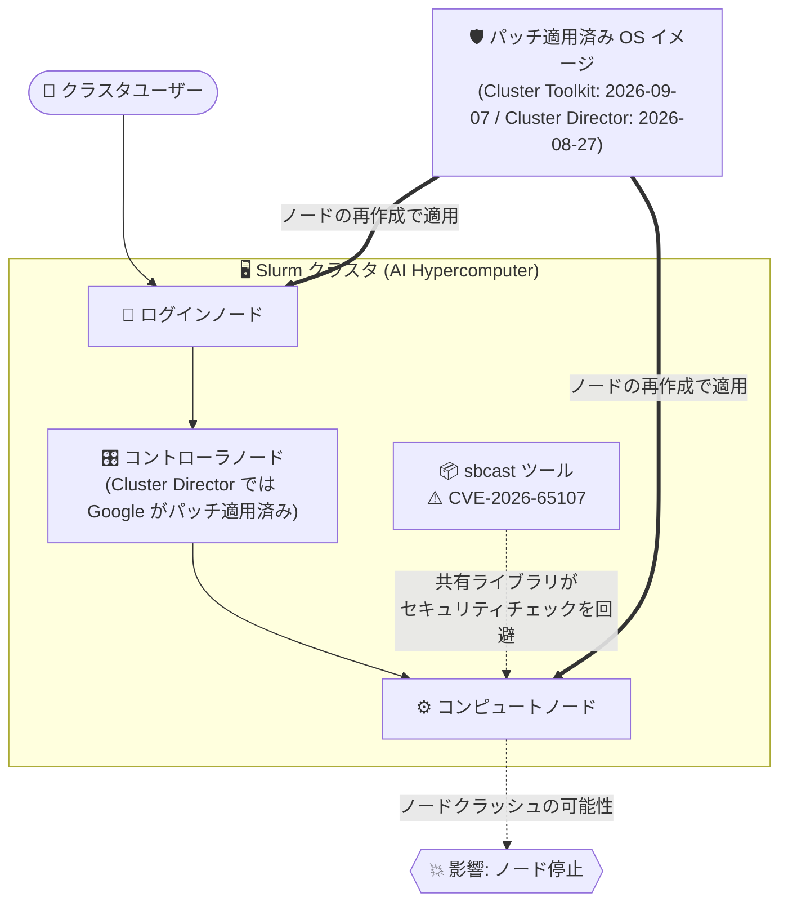

# AI Hypercomputer / Cluster Toolkit / Cluster Director: Slurm sbcast の脆弱性 (CVE-2026-65107) への対応

**リリース日**: 2026-09-07

**サービス**: AI Hypercomputer, Cluster Toolkit, Cluster Director

**機能**: Slurm sbcast ツールの脆弱性 (CVE-2026-65107) の修正 (セキュリティブリテン GCP-2026-060)

**ステータス**: Security (重要度: High)

📊 [このアップデートのインフォグラフィックを見る](https://takech9203.github.io/google-cloud-news-summary/20260907-slurm-cve-2026-65107.html)

## 概要

Google は、Slurm クラスタに影響するセキュリティ脆弱性 **CVE-2026-65107** への対応を発表しました。この脆弱性は Slurm の **sbcast ツール** (ジョブに割り当てられたノードへファイルを配布するツール) に存在し、共有ライブラリファイルがセキュリティチェックを回避 (bypass) できてしまい、クラスタ内のノードをクラッシュさせる可能性があります。重要度は **High** と評価されています。

この対応はセキュリティブリテン **GCP-2026-060** として、Slurm クラスタの作成に使用した Google Cloud プロダクトごとに個別に公開されています。**Cluster Director** ユーザー向けには 2026-09-04 に、**Cluster Toolkit** ユーザー向けには 2026-09-07 に公開されました。Google はパッチ適用済みの OS イメージを提供済みですが、**既存のノードに自動では適用されない** ため、ユーザー自身によるノードの再作成 (または OS イメージファミリーの変更) が必要です。

AI Hypercomputer 上で Slurm ベースの HPC / ML トレーニングクラスタを運用しているすべてのユーザーが対象です。特に、パッチ提供日以降にノードを再作成していないクラスタは脆弱な状態のままであるため、早急な対応が推奨されます。

**アップデート前の課題**

このアップデート以前は、以下のリスクが存在していました。

- Slurm の sbcast ツールに脆弱性 (CVE-2026-65107) があり、共有ライブラリファイルがセキュリティチェックを回避できた
- この脆弱性を悪用されると、クラスタ内のノードがクラッシュする可能性があった
- Cluster Toolkit / Cluster Director が提供する OS イメージにはパッチが含まれていなかった

**アップデート後の改善**

- **Cluster Toolkit**: サポート対象の OS イメージに CVE-2026-65107 のパッチが適用された (2026-09-07)
- **Cluster Director**: デフォルトの OS イメージファミリー (NVIDIA ドライバ バージョン 580) が 2026-08-27 に更新され、脆弱性が解消された
- **Cluster Director のコントローラノードは Google 管理のため、Google 側で既にパッチ適用済み** (ユーザー対応不要)

## アーキテクチャ図



Slurm クラスタ内の sbcast ツールの脆弱性がコンピュートノードのクラッシュを引き起こす可能性があり、パッチ適用済み OS イメージでノードを再作成することで緩和されることを示しています。Cluster Director のコントローラノードは Google 管理のため対応不要です。

## サービスアップデートの詳細

### 脆弱性の内容

1. **CVE-2026-65107 (Slurm sbcast)**
   - Slurm の sbcast ツールに存在するセキュリティ上の欠陥
   - 共有ライブラリファイルがセキュリティチェックを回避 (bypass) できる
   - クラスタ内のノードをクラッシュさせる可能性がある
   - 重要度: **High**

2. **影響を受ける環境**
   - **Cluster Toolkit** で作成した Slurm クラスタ: 2026-09-07 以降にノードが再作成されていない場合、そのノードは脆弱
   - **Cluster Director** で作成した Slurm クラスタ:
     - デフォルト OS イメージファミリー (NVIDIA ドライバ 580) 使用時: 2026-08-27 以降にコンピュートノード / ログインノードが再作成されていない場合は脆弱
     - 非デフォルト OS イメージファミリー (NVIDIA ドライバ 570) 使用時: **このパッチは提供されない** ため、デフォルトのイメージファミリーへの移行が必要

3. **Google 側の対応**
   - Cluster Toolkit がサポートする OS イメージに必要なパッチを適用 (2026-09-07)
   - Cluster Director のデフォルト OS イメージファミリー (NVIDIA ドライバ 580) を 2026-08-27 に更新
   - Cluster Director のコントローラノードは Google が管理しているため、Google 側でパッチ適用済み

## 技術仕様

### セキュリティブリテン GCP-2026-060 の概要

| 項目 | Cluster Toolkit | Cluster Director |
|------|-----------------|------------------|
| ブリテン ID | GCP-2026-060 | GCP-2026-060 |
| 公開日 | 2026-09-07 | 2026-09-04 |
| 対象 CVE | CVE-2026-65107 | CVE-2026-65107 |
| 重要度 | High | High |
| パッチ提供日 | 2026-09-07 (サポート対象 OS イメージ) | 2026-08-27 (デフォルト OS イメージファミリーのみ) |
| コントローラノードの対応 | ユーザーによる対応が必要 | 不要 (Google 管理・適用済み) |

### Cluster Director の OS イメージファミリーとパッチ提供状況

Cluster Director の Slurm 用 OS イメージは Ubuntu LTS ベースで、Slurm 25.05、NVIDIA ドライバ、CUDA などが事前構成されています。今回のパッチはデフォルトのイメージファミリー (NVIDIA ドライバ 580) にのみ提供されます。

| OS イメージファミリー | パッチ提供 | 必要な対応 |
|----------------------|-----------|-----------|
| デフォルト (NVIDIA ドライバ 580 / CUDA 13) | あり (2026-08-27 更新) | 2026-08-27 以降に再作成していないノードを再作成 |
| 非デフォルト (NVIDIA ドライバ 570 / CUDA 12) | **なし** | デフォルトのイメージファミリーへ更新 |

## 設定方法 (緩和手順)

### 前提条件

1. Slurm クラスタの作成に使用したプロダクト (Cluster Toolkit または Cluster Director) を確認していること
2. Cluster Director の場合、コンピュートノード / ログインノードが使用している OS イメージファミリーを確認していること

### Cluster Toolkit で作成したクラスタの場合

2026-09-07 以降にノードを再作成していない場合、以下のいずれかの方法で最新の OS イメージに更新します。

#### 方法 1: 静的ノードの電源オフ (パワーダウン)

Slurm コントローラに SSH 接続し、対象ノードをパワーダウンします。ノードはドレインされ、実行中のジョブ完了後に VM が削除されます。新しいジョブの投入時に、Slurm がパッチ適用済みの OS イメージでノードを再作成します。

```bash
# Slurm コントローラ上で実行 (実行中ジョブの完了を待ってから電源オフ)
sudo -i -u slurm scontrol update NodeName=NODES_TO_UPDATE State=POWER_DOWN_ASAP Reason="image-update"
```

**注意**: 静的ノードのパワーダウンはバッキング VM の削除に相当するため、ローカル SSD を含むノードローカルのデータはすべて失われます。

#### 方法 2: 実行中クラスタの再構成

クラスタのデプロイメントブループリントでイメージファミリーを更新し、クラスタを再デプロイします。

```bash
# ブループリントを更新後、再デプロイ
./gcluster deploy DEPLOYMENT_FOLDER_NAME
```

### Cluster Director で作成したクラスタの場合

コンピュートノードとログインノードが使用する OS イメージファミリーを確認し、以下のいずれかを実施します。

#### デフォルト OS イメージファミリー (NVIDIA ドライバ 580) の場合

2026-08-27 以降にノードを再作成していない場合、ノードを再作成してパッチを適用します。方法は次のいずれかです。

- ノードの削除と再作成
- ノードの再作成を伴うクラスタプロパティの変更

```bash
# ログインノードに接続後、scontrol でノードを削除 (Slurm が再作成)
scontrol update nodename=NODE_NAMES state=power_down_asap
```

静的ノードは削除後に Slurm が自動的に再作成を開始します。動的ノードは `idle~` 状態になり、ジョブ投入時に再作成されます。

#### 非デフォルト OS イメージファミリー (NVIDIA ドライバ 570) の場合

このイメージファミリーにはパッチが提供されないため、ノードをデフォルトの OS イメージファミリーに更新します。

**注意**: Cluster Director のコントローラノードは Google が管理しており、パッチ適用済みのため対応は不要です。

## メリット

### ビジネス面

- **クラスタ可用性の保護**: ノードクラッシュによるトレーニングジョブ / HPC ワークロードの中断リスクを排除できる
- **コンプライアンス対応**: High 重要度の CVE への対応状況を明確化でき、セキュリティ監査に対応しやすい

### 技術面

- **パッチ適用済みイメージの提供**: ユーザーが自前で Slurm にパッチを当てる必要がなく、ノード再作成のみで適用できる
- **コントローラノードの自動保護 (Cluster Director)**: Google 管理のコントローラノードは対応不要で、運用負荷が軽減される
- **ダウンタイムを抑えた適用**: `POWER_DOWN_ASAP` により実行中ジョブを完了させてから段階的にノードを更新できる

## デメリット・制約事項

### 制限事項

- パッチは既存ノードに自動適用されず、**ノードの再作成が必須**
- Cluster Director の非デフォルト OS イメージファミリー (NVIDIA ドライバ 570) には **パッチが提供されない** (デフォルトファミリーへの移行が必要)
- 静的ノードのパワーダウンは VM の削除を伴うため、ローカル SSD などノードローカルのデータは失われる

### 考慮すべき点

- ノード再作成のタイミングを実行中の長時間ジョブと調整する必要がある
- 大規模クラスタでは、少数のノードで更新をテストしてから全体に展開することが推奨される (Cluster Toolkit ドキュメントの推奨)
- Cluster Director のイメージファミリーにはライフサイクル (サポート約 12 か月) があり、非推奨のファミリーはセキュリティパッチを受け取れないため、デフォルト / サポート対象ファミリーの利用を維持すべき

## ユースケース

### ユースケース 1: Cluster Toolkit で運用中の HPC クラスタへの段階的パッチ適用

**シナリオ**: Cluster Toolkit でデプロイした Slurm クラスタで長時間の HPC ジョブが実行中。ジョブを中断せずに CVE-2026-65107 のパッチを適用したい。

**実装例**:
```bash
# 1. 少数のノードでテスト (compute-static-0, compute-static-1 のみ)
sudo -i -u slurm scontrol update NodeName=compute-static-[0-1] State=POWER_DOWN_ASAP Reason="image-update"

# 2. 更新済みノードにラベルを付けて追跡
sudo -i -u slurm scontrol update nodename=compute-static-[0-1] AvailableFeatures=image=patched

# 3. 問題なければ残りのノードにも展開
```

**効果**: 実行中のジョブを完了させながら段階的にパッチ適用済みイメージへ移行でき、クラスタ全体の停止を回避できる。

### ユースケース 2: Cluster Director で NVIDIA ドライバ 570 イメージを使用中のクラスタの移行

**シナリオ**: Cluster Director で作成した ML トレーニングクラスタが非デフォルトの OS イメージファミリー (NVIDIA ドライバ 570 / CUDA 12) を使用しており、今回のパッチが提供されない。

**効果**: デフォルトの OS イメージファミリー (NVIDIA ドライバ 580 / CUDA 13) へ更新することで CVE-2026-65107 が解消され、以降のセキュリティパッチも継続的に受け取れるようになる。

## 関連サービス・機能

- **AI Hypercomputer**: Cluster Toolkit / Cluster Director を含む、AI ワークロード向けのスーパーコンピューティングアーキテクチャ。今回のリリースノートは AI Hypercomputer / Cluster Toolkit のリリースノートとして公開
- **Cluster Director**: Google 管理のコントローラノードを持つマネージドな Slurm クラスタ管理サービス。デフォルト OS イメージファミリーが自動的にパッチ対象となる
- **Compute Engine**: Slurm クラスタのノードを構成する VM 基盤。ノード再作成時に最新のイメージファミリーからイメージを取得
- **Slurm (SchedMD)**: クラスタのジョブスケジューラ。sbcast はジョブに割り当てられたノードへファイルを配布する Slurm 標準ツール

## 参考リンク

- 📊 [インフォグラフィック](https://takech9203.github.io/google-cloud-news-summary/20260907-slurm-cve-2026-65107.html)
- [公式リリースノート (2026-09-07)](https://docs.cloud.google.com/release-notes#September_07_2026)
- [セキュリティブリテン: Cluster Director (GCP-2026-060)](https://docs.cloud.google.com/cluster-director/docs/security-bulletins#gcp-2026-060)
- [セキュリティブリテン: Cluster Toolkit (GCP-2026-060)](https://docs.cloud.google.com/cluster-toolkit/docs/security-bulletins#gcp-2026-060)
- [Cluster Toolkit: 静的コンピュートノードの管理](https://docs.cloud.google.com/cluster-toolkit/docs/slurm/manage-static-nodes)
- [Cluster Toolkit: 実行中クラスタの再構成](https://docs.cloud.google.com/cluster-toolkit/docs/slurm/reconfigure-cluster)
- [Cluster Director: OS イメージ](https://docs.cloud.google.com/cluster-director/docs/os-images)
- [Cluster Director: イメージファミリーのリリースノート](https://docs.cloud.google.com/cluster-director/docs/image-family-release-notes)

## まとめ

Slurm の sbcast ツールに存在する High 重要度の脆弱性 CVE-2026-65107 は、ノードクラッシュを引き起こす可能性があるため、AI Hypercomputer 上で Slurm クラスタを運用しているすべてのユーザーは早急な対応が必要です。パッチは既存ノードに自動適用されないため、Cluster Toolkit ユーザーは 2026-09-07 以降、Cluster Director (デフォルトイメージ) ユーザーは 2026-08-27 以降にノードを再作成していない場合、ただちにノードの再作成を実施してください。Cluster Director で NVIDIA ドライバ 570 の非デフォルトイメージを使用している場合はパッチが提供されないため、デフォルトのイメージファミリーへの移行を計画してください。

---

**タグ**: #AIHypercomputer #ClusterToolkit #ClusterDirector #Slurm #Security #CVE #HPC
