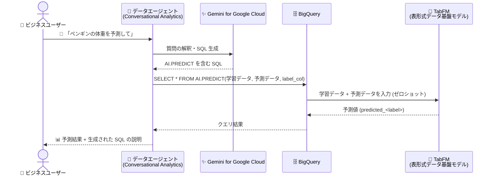

# BigQuery: Conversational Analytics が AI.PREDICT による予測モデリングの質問に対応 (Preview)

**リリース日**: 2026-09-08

**サービス**: BigQuery

**機能**: Conversational Analytics の AI.PREDICT (予測モデリング) サポート

**ステータス**: Preview (プレビュー)

📊 [このアップデートのインフォグラフィックを見る](https://takech9203.github.io/google-cloud-news-summary/20260908-bigquery-conversational-analytics-ai-predict.html)

## 概要

BigQuery の Conversational Analytics (会話型分析) が、`AI.PREDICT` 関数を使用した予測モデリング (Predictive Modeling) に関する質問をサポートするようになりました。この機能は Preview として提供されています。

`AI.PREDICT` は、表形式データ (tabular data) 向けの事前学習済み基盤モデル **TabFM** を使用して、構造化データに対する回帰 (Regression) と分類 (Classification) を実行する BigQuery の関数です。ユーザーが独自のモデルを作成・トレーニングする必要がなく、学習データと予測対象データを指定するだけでゼロショットの予測が実行できます。今回のアップデートにより、この予測機能が Conversational Analytics の会話からも利用可能になり、たとえば「ペンギンの体重を予測して (Predict the body mass of penguins)」のような自然言語の質問に対して、データエージェントが `AI.PREDICT` を使った SQL を生成し、予測結果を返せるようになりました。

Conversational Analytics は Gemini for Google Cloud を基盤とし、BigQuery のデータに対して自然言語でチャット形式の分析を行える機能です。今回の対応により、SQL や機械学習の専門知識を持たないビジネスユーザーでも、会話を通じて回帰・分類による予測分析を実行できるようになります。

**アップデート前の課題**

- Conversational Analytics は `AI.FORECAST` (時系列予測) や `AI.DETECT_ANOMALIES` (異常検知) などの AI/ML 関数には対応していたが、表形式データに対する回帰・分類 (予測モデリング) の質問には対応していなかった
- 表形式データの回帰・分類を行うには、ユーザー自身が `AI.PREDICT` の SQL を記述するか、BigQuery ML でモデルの作成・トレーニング・管理を行う必要があった

**アップデート後の改善**

- 「〇〇を予測して」のような自然言語の質問だけで、データエージェントが `AI.PREDICT` を使った予測モデリングの SQL を生成・実行できるようになった
- 事前学習済み基盤モデル TabFM によるゼロショット予測のため、モデルのトレーニングや管理が不要のまま、会話形式で回帰・分類の結果を得られるようになった
- 検証済みクエリ (Verified Queries) に `AI.PREDICT` を含めることで、予測を含む定型レポートをエージェント経由で提供できるようになった

## アーキテクチャ図



ユーザーが自然言語で予測に関する質問をすると、Gemini を基盤とするデータエージェントが `AI.PREDICT` を含む SQL を生成し、事前学習済みの TabFM モデルがゼロショットで回帰・分類を実行して結果を返します。

## サービスアップデートの詳細

### 主要機能

1. **自然言語による予測モデリング**
   - 「Predict the body mass of penguins (ペンギンの体重を予測して)」のような質問を会話形式で実行可能
   - 公式ドキュメントでは `bigquery-public-data.ml_datasets.penguins` テーブルを使ったワンショットプロンプトの例が示されている
   - データエージェントとの会話、データソースとの直接会話、検証済みクエリのいずれでも `AI.PREDICT` を利用できる

2. **AI.PREDICT 関数 (TabFM ベースのゼロショット予測)**
   - 表形式データ向けの事前学習済み基盤モデル TabFM を使用して回帰・分類を実行
   - モデルの作成・トレーニング・管理が不要 (学習データと予測データをクエリで渡すだけ)
   - ラベル列が数値型 (`INT64`、`FLOAT64`、`NUMERIC`、`BIGNUMERIC`) なら回帰、`BOOL` または `STRING` なら分類を自動的に実行

3. **豊富な AI/ML 関数サポートの一角**
   - Conversational Analytics は `AI.FORECAST`、`AI.DETECT_ANOMALIES`、`AI.KEY_DRIVERS`、`AI.GENERATE`、`AI.CLASSIFY`、`ML.CORRELATION` など多数の AI/ML 関数をサポートしており、今回 `AI.PREDICT` が加わった
   - 予測モデリングと相関分析・キードライバー分析などを同じ会話の中で組み合わせられる

## 技術仕様

### AI.PREDICT 関数の構文

```sql
AI.PREDICT(
  { TABLE TRAINING_TABLE | (TRAINING_QUERY) },
  { TABLE PREDICTION_TABLE | (PREDICTION_QUERY) }
  [, label_col => 'LABEL_COL' ]
)
```

| 引数 | 説明 |
|------|------|
| TRAINING_TABLE / TRAINING_QUERY | 学習データを含むテーブルまたはクエリ。`label` 列 (または `label_col` で指定した列) が必要で、それ以外の列はすべて特徴量列として扱われる |
| PREDICTION_TABLE / PREDICTION_QUERY | 予測対象データを含むテーブルまたはクエリ。学習データのすべての特徴量列を含む必要がある |
| label_col | 学習データ内のラベル列名を指定する STRING 値 (デフォルト: `'label'`) |

- 特徴量列・ラベル列は `STRING`、`BOOL`、`INT64`、`FLOAT64`、`NUMERIC`、`BIGNUMERIC` のいずれかの型である必要があります

### 出力

| タスク | ラベル列の型 | 出力列 |
|--------|-------------|--------|
| 回帰 | `INT64` / `FLOAT64` / `NUMERIC` / `BIGNUMERIC` | `predicted_<ラベル列名>` (予測された数値) |
| 分類 | `BOOL` / `STRING` | `predicted_<ラベル列名>` (予測ラベル) と `predicted_<ラベル列名>_probs` (`ARRAY<STRUCT<label STRING, prob FLOAT64>>` 形式で各ラベルの確率) |

### Conversational Analytics の主なセキュリティ仕様

| 項目 | 詳細 |
|------|------|
| アクセス制御 | Conversational Analytics API の IAM ロールと権限で管理 |
| データアクセス範囲 | ユーザーがアクセス権限を持つデータ・リソースのみ |
| VPC Service Controls | 対応 (VPC-SC のセキュリティ制御を尊重) |
| 書き込み操作 | 不可 (DML クエリ・リモート関数は実行不可) |
| 生成 AI クエリの権限 | エンドユーザー認証情報で生成 AI クエリを実行するための権限が必要 |

## 設定方法

### 前提条件

1. 学習データと予測対象データ (テーブル、ビューなど) が BigQuery に存在すること
2. データエージェントおよび会話に必要な IAM ロールが付与されていること
3. 生成 AI クエリを実行するための権限 (エンドユーザー認証情報での実行権限) を持っていること

### 手順

#### ステップ 1: データソースとの会話を開始する

1. Google Cloud コンソールで BigQuery の **Agents** ページに移動する
2. **Conversations** タブで **New conversation** をクリックする
3. **Knowledge sources** タブで分析対象のテーブル (例: `bigquery-public-data.ml_datasets.penguins`) を選択し、**Chat** をクリックする

#### ステップ 2: 予測モデリングの質問を実行する

```text
Predict the body mass of penguins
```

質問を送信すると、Conversational Analytics が `AI.PREDICT` を使用した SQL を生成・実行し、予測結果を返します。回答の説明を展開すると、生成されたクエリを確認できます。

#### 参考: AI.PREDICT を直接 SQL で使う場合

```sql
WITH prepared_data AS (
  SELECT *, RAND() <= 0.8 AS training
  FROM `bigquery-public-data.ml_datasets.penguins`
  WHERE body_mass_g > 0
)
SELECT * FROM AI.PREDICT(
  -- 学習データ
  (SELECT * EXCEPT(training) FROM prepared_data WHERE training),
  -- 予測データ
  (SELECT * EXCEPT(training) FROM prepared_data WHERE NOT training),
  label_col => 'body_mass_g');
```

このクエリは、ペンギンのデータの 8 割を学習データとして、残り 2 割の体重 (`body_mass_g`) を回帰で予測します。予測精度は `ML.METRICS` 関数で評価できます。

## メリット

### ビジネス面

- **予測分析の民主化**: SQL や機械学習の知識がないビジネスユーザーでも、自然言語の質問だけで回帰・分類による予測結果を得られる
- **分析リードタイムの短縮**: 従来はモデル構築を含めてデータサイエンスチームへの依頼が必要だった予測分析を、会話でセルフサービス実行できる

### 技術面

- **モデル管理が不要**: 事前学習済み基盤モデル TabFM によるゼロショット予測のため、モデルの作成・トレーニング・デプロイ・再学習といった MLOps の負担がない
- **精度評価との組み合わせ**: `AI.PREDICT` の結果は `ML.METRICS` 関数で回帰・分類の評価指標を算出でき、予測品質を定量的に確認できる
- **検証済みクエリでの再利用**: データエージェントの検証済みクエリに `AI.PREDICT` を組み込むことで、予測を含む定型分析を一貫した品質で提供できる

## デメリット・制約事項

### 制限事項

- **Preview ステータス**: Pre-GA Offerings Terms が適用され、サポートが限定される場合がある (Preview 期間中のサポート窓口は bqml-feedback@google.com)
- **特徴量列は最大 20 列**: それ以上必要な場合は bqml-feedback@google.com への連絡が必要
- **分類のカテゴリは最大 10 種類**
- 特徴量・ラベル列の型は `STRING` / `BOOL` / `INT64` / `FLOAT64` / `NUMERIC` / `BIGNUMERIC` に限定される

### 考慮すべき点

- **料金体系の変更予定**: BigQuery の TabFM は 2026 年 10 月 30 日以降トークンベースの課金に移行し、モデルが消費した TabFM トークンとクエリの残り部分のスロットまたは処理バイト数に対して課金される予定
- Gemini for Google Cloud は発展途上の技術であり、もっともらしいが事実と異なる出力を生成する可能性があるため、出力の検証が推奨される
- 直接会話 (Direct Conversation) はデータエージェントのコンテキストや指示を利用しないため精度が下がる場合があり、高い精度が求められる場合はデータエージェントの利用が推奨される

## ユースケース

### ユースケース 1: 会話による数値予測 (回帰)

**シナリオ**: アナリストが、過去の実績データをもとに数値項目 (例: 生物データの体重、既存レコードから欠損値の推定など) を予測したい。

**実装例**:
```text
データソース: bigquery-public-data.ml_datasets.penguins

質問例:
"Predict the body mass of penguins"
(ペンギンの体重を予測して)
```

**効果**: モデルを作成・トレーニングすることなく、会話だけで回帰予測の結果を取得できる。生成された SQL を確認することで、分析の透明性も確保できる。

### ユースケース 2: 検証済みクエリによる予測付き定型レポート

**シナリオ**: データサイエンティストが、`AI.PREDICT` による分類 (例: 属性の予測とその確率) を含む定期レポートをビジネスユーザー向けに提供したい。

**効果**: データエージェントの検証済みクエリに `AI.PREDICT` を組み込むことで、ビジネスユーザーが一貫性のある予測結果 (予測ラベルと各ラベルの確率を含む) をセルフサービスで取得できる。

## 料金

Preview 期間中、BigQuery での TabFM (`AI.PREDICT`) の利用は以下のように課金されます。

| 利用形態 | 課金方法 |
|----------|----------|
| Enterprise / Enterprise Plus エディション | スロットで課金 |
| オンデマンド料金 | 処理バイト数に基づいて課金 |

**注意**: 2026 年 10 月 30 日以降、BigQuery の TabFM はトークンベースの料金に移行します。移行後は、クエリ内でモデルが消費した TabFM トークンと、クエリの残り部分の BigQuery スロットまたは処理バイト数に対して課金されます。

また、Conversational Analytics の会話で実行されるクエリには BigQuery のコンピューティング料金 (Analysis pricing) が適用されます。

- [BigQuery の料金 (Analysis pricing models)](https://docs.cloud.google.com/bigquery/pricing#analysis_pricing_models)
- [データエージェントの料金](https://cloud.google.com/products/data-agents/pricing)

## 利用可能リージョン

Conversational Analytics は、エージェント・会話リソースの保存と ML 処理を管理するロケーションとして US MREP、EU MREP、Global の 3 つをサポートしています。詳細は[公式ドキュメント](https://docs.cloud.google.com/bigquery/docs/conversational-analytics)を参照してください。

## 関連サービス・機能

- **Gemini for Google Cloud**: Conversational Analytics の基盤となる生成 AI。自然言語の解釈と SQL 生成を担う
- **TabFM**: `AI.PREDICT` の基盤となる、表形式データ向けのゼロショット基盤モデル (Google Research が開発)
- **BigQuery AI/ML 関数**: Conversational Analytics は `AI.FORECAST` (時系列予測)、`AI.DETECT_ANOMALIES` (異常検知)、`AI.KEY_DRIVERS`、`AI.CLASSIFY`、`ML.CORRELATION` など多数の関数もサポートしており、予測モデリングと組み合わせた多角的な分析が可能
- **ML.METRICS 関数**: `AI.PREDICT` の予測結果に対して回帰・分類の評価指標を算出できる
- **AI.EVALUATE 関数**: TabFM モデルのパフォーマンス評価に利用できる

## 参考リンク

- 📊 [インフォグラフィック](https://takech9203.github.io/google-cloud-news-summary/20260908-bigquery-conversational-analytics-ai-predict.html)
- [公式リリースノート](https://docs.cloud.google.com/release-notes#September_08_2026)
- [The AI.PREDICT function](https://docs.cloud.google.com/bigquery/docs/reference/standard-sql/bigqueryml-syntax-ai-predict)
- [Conversational analytics overview (BigQuery AI and ML support)](https://docs.cloud.google.com/bigquery/docs/conversational-analytics)
- [Analyze data with conversations](https://docs.cloud.google.com/bigquery/docs/create-conversations)
- [BigQuery の料金](https://docs.cloud.google.com/bigquery/pricing#analysis_pricing_models)

## まとめ

BigQuery の Conversational Analytics が `AI.PREDICT` による予測モデリングの質問に Preview 対応したことで、モデルの作成・トレーニングなしに、自然言語の会話だけで回帰・分類の予測分析を実行できるようになりました。9 月 3 日に GA となったマーケットバスケット分析対応に続き、会話型分析でカバーできる分析タスクが着実に拡大しています。まずは公開データセット (`bigquery-public-data.ml_datasets.penguins` など) との会話で予測の挙動を確認し、本格利用では特徴量 20 列・分類 10 カテゴリの制限と 2026 年 10 月 30 日以降のトークンベース課金への移行を踏まえて検討することを推奨します。

---

**タグ**: BigQuery, Conversational Analytics, AI.PREDICT, TabFM, 予測モデリング, 回帰, 分類, Gemini, データエージェント, Preview
