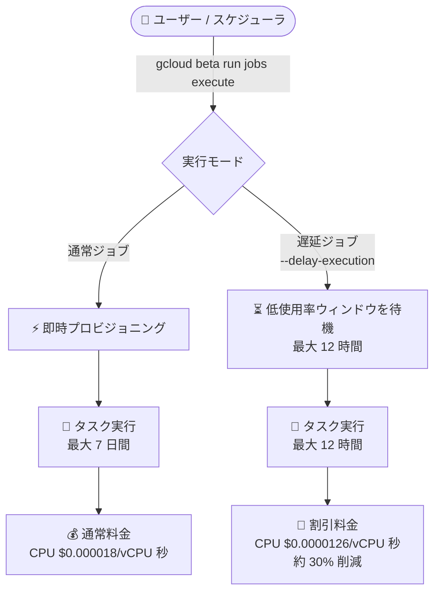

# Cloud Run: ジョブの遅延実行 (Delayed Jobs) (Preview)

**リリース日**: 2026-09-08

**サービス**: Cloud Run

**機能**: ジョブの遅延実行 (Delayed Jobs)

**ステータス**: Preview

📊 [このアップデートのインフォグラフィックを見る](https://takech9203.github.io/google-cloud-news-summary/20260908-cloud-run-delayed-jobs.html)

## 概要

Cloud Run jobs に、ジョブの実行開始を最大 12 時間遅延させることで割引料金を利用できる「遅延実行 (Delayed Jobs)」機能が Preview として追加されました。急ぎではないタスクの実行を遅延させることに同意する代わりに、Google Cloud 側の利用率が低い時間帯 (低使用率ウィンドウ) にジョブがプロビジョニングされ、通常のジョブ料金よりも低い料金 (us-central1 の場合、vCPU・メモリともに通常料金の 30% 引) が適用されます。

すべての Cloud Run ジョブは「通常ジョブ (regular job)」または「遅延ジョブ (delayed job)」のいずれかとして作成されますが、実行のたびに設定をオーバーライドできるため、通常ジョブを遅延ジョブとして実行したり、その逆も可能です。バッチ処理、データ変換、レポート生成など、即時性を必要としないワークロードのコストを最適化したいユーザーに適した機能です。

**アップデート前の課題**

- Cloud Run jobs には単一の料金体系しかなく、実行タイミングの柔軟性と引き換えにコストを削減する手段がなかった
- 夜間バッチなど即時実行が不要なタスクでも、即時実行のジョブと同じ料金が適用されていた
- 実行タイミングの最適化 (オフピーク実行) はユーザーが Cloud Scheduler などで自前で設計する必要があり、それでも料金面のメリットはなかった

**アップデート後の改善**

- `--delay-execution` フラグまたは YAML の `delayExecution` 属性を指定するだけで、割引料金が適用される遅延ジョブとして実行できるようになった
- 実行開始タイミングの最適化 (低使用率ウィンドウでのプロビジョニング) を Cloud Run 側が自動で行うようになった
- ジョブ単位のデフォルト設定に加えて、実行単位で通常/遅延を切り替えられる柔軟性が提供された
- 遅延ジョブ専用の無料枠 (月間 342,857 vCPU 秒、642,857 GiB 秒) が利用できるようになった

## アーキテクチャ図



通常ジョブは即時にプロビジョニングされるのに対し、遅延ジョブは最大 12 時間の範囲でシステムが最適化したウィンドウでプロビジョニングされ、割引料金が適用されます。

## サービスアップデートの詳細

### 主要機能

1. **遅延実行による割引料金の適用**
   - 急ぎではないタスクの実行開始を最大 12 時間遅延させることに同意する代わりに、割引料金でジョブを実行できる
   - ジョブは Google Cloud 側の低使用率ウィンドウでプロビジョニングされる
   - us-central1 では vCPU・メモリともに通常のジョブ料金から 30% 引きの料金が適用される

2. **24 時間以内の完了保証となる時間設計**
   - 遅延ジョブ実行のプロビジョニングは最大 12 時間、全タスクの合計実行時間は最大 12 時間
   - この組み合わせにより、遅延実行は必ず 24 時間以内に完了する
   - 最大時間の上限に達した実行はシステムによってキャンセルされる

3. **ジョブ単位・実行単位の柔軟な切り替え**
   - ジョブ作成時に遅延ジョブとして定義できる (`--delay-execution`)
   - 通常ジョブを 1 回だけ遅延ジョブとして実行する、またはその逆のオーバーライドが実行単位で可能
   - `--no-delay-execution` フラグで遅延実行を無効化し、通常ジョブに戻すこともできる

4. **`--execute-now` との組み合わせ**
   - 遅延ジョブを `--execute-now` フラグ付きで作成すると、作成時に実行がトリガーされ、以降 12 時間以内のどこかの時点でジョブが実行される

## 技術仕様

### 通常ジョブと遅延ジョブの比較

| 項目 | 通常ジョブ (On-Demand) | 遅延ジョブ (Delayed Execution) |
|------|------------------------|-------------------------------|
| 実行開始タイミング | 即時 (ASAP) | システムが最適化したウィンドウ内 (最大 12 時間遅延) |
| 料金 | 標準ジョブ料金 | 割引料金 |
| タスクタイムアウト上限 | 最大 168 時間 (7 日間) | 最大 12 時間 |
| 上限到達時の動作 | タスクは強制終了 | 最大遅延到達時に実行が自動キャンセル |
| 主なユースケース | アドホックなデータ処理、手動トリガー、イベント駆動パイプライン | コスト重視の非緊急バッチ処理 |

### 設定属性

| 設定方法 | 指定内容 |
|----------|----------|
| gcloud (beta) | `--delay-execution` / `--no-delay-execution` フラグ |
| YAML (v1 API) | `spec.delayExecution: "true"` |
| Google Cloud コンソール | ジョブ作成/編集フォームの「Delay execution」を選択 |

## 設定方法

### 前提条件

1. 以下の IAM ロールが付与されていること
   - Cloud Run デベロッパー (`roles/run.developer`): 対象の Cloud Run ジョブ
   - サービス アカウント ユーザー (`roles/iam.serviceAccountUser`): サービス アイデンティティ
   - Artifact Registry 読み取り (`roles/artifactregistry.reader`): コンテナ イメージのリポジトリ
2. Preview 機能のため、gcloud は `beta` コンポーネントを使用すること

### 手順

#### ステップ 1: 遅延ジョブを作成する

```bash
gcloud beta run jobs create JOB_NAME \
  --image IMAGE_URL \
  --delay-execution \
  --region=REGION
```

`--delay-execution` フラグを指定して作成したジョブは、以降の実行時にフラグを指定しなくても遅延ジョブとして実行されます。

#### ステップ 2: ジョブを実行する

```bash
# 遅延ジョブとして作成済みの場合はそのまま実行
gcloud beta run jobs execute JOB_NAME --region=REGION

# 通常ジョブを 1 回だけ遅延ジョブとして実行する場合
gcloud beta run jobs execute JOB_NAME \
  --async \
  --delay-execution \
  --region=REGION
```

#### ステップ 3 (任意): YAML で遅延実行を設定する

```yaml
apiVersion: run.googleapis.com/v1
kind: Job
metadata:
  name: JOB_NAME
spec:
  delayExecution: "true"
```

#### ステップ 4 (任意): 遅延実行を無効化して通常ジョブに戻す

```bash
gcloud beta run jobs update JOB_NAME \
  --image IMAGE_URL \
  --no-delay-execution \
  --region=REGION
```

## メリット

### ビジネス面

- **コスト削減**: us-central1 では vCPU・メモリの単価が通常ジョブ比で 30% 低く、非緊急バッチのコンピューティング コストを直接削減できる
- **専用無料枠**: 遅延ジョブには月間 342,857 vCPU 秒、642,857 GiB 秒の無料枠があり、小規模なバッチであれば無料枠内で収まる可能性がある

### 技術面

- **設定が簡単**: フラグまたは YAML 属性を 1 つ追加するだけで有効化でき、アプリケーション コードの変更は不要
- **柔軟なオーバーライド**: ジョブのデフォルト設定と実行単位の設定を独立して制御でき、同じジョブを状況に応じて即時/遅延で使い分けられる
- **完了時間の予測可能性**: プロビジョニング最大 12 時間 + 実行最大 12 時間という設計により、遅延実行でも 24 時間以内の完了が保証される

## デメリット・制約事項

### 制限事項

- Preview 段階のため、Pre-GA Offerings Terms が適用され、サポートが限定される場合がある
- 遅延ジョブのタスクタイムアウト上限は 12 時間 (通常ジョブの 7 日間より短い)
- 実行が最大時間の上限に達すると、システムによって実行がキャンセルされる
- 遅延ジョブの料金は動的であり、30 日ごとに最大 1 回変更される可能性がある
- gcloud での操作には `beta` コンポーネントが必要

### 考慮すべき点

- 実行開始タイミングはシステム側が決定するため、SLA が厳しいタスクや即時性が必要なタスクには不向き
- 12 時間を超える長時間タスクは遅延ジョブに移行できないため、事前にタスクの実行時間を確認する必要がある
- 遅延中に自動キャンセルされるケースを考慮し、再実行やチェックポイントの仕組みを設計しておくことが望ましい

## ユースケース

### ユースケース 1: 夜間バッチ処理のコスト最適化

**シナリオ**: 日次のデータ集計やレポート生成など、翌朝までに完了していればよいバッチ処理を Cloud Run jobs で実行している。

**実装例**:
```bash
gcloud beta run jobs create nightly-report \
  --image us-docker.pkg.dev/PROJECT/repo/report-batch:latest \
  --delay-execution \
  --task-timeout=2h \
  --region=asia-northeast1
```

**効果**: 実行開始が最大 12 時間遅延しても業務影響がないため、コンピューティング料金を約 30% 削減しつつ、24 時間以内の完了が保証される。

### ユースケース 2: 通常ジョブの一時的な遅延実行

**シナリオ**: 普段は即時実行しているデータ変換ジョブについて、緊急性の低い再処理 (バックフィル) を大量に実行したい。

**実装例**:
```bash
gcloud beta run jobs execute data-transform \
  --async \
  --delay-execution \
  --region=asia-northeast1
```

**効果**: ジョブ定義を変更せずに、緊急性の低い実行だけを割引料金で処理できる。通常の即時実行フローには影響しない。

## 料金

遅延ジョブには通常の Cloud Run jobs 料金とは別の割引料金体系と専用の無料枠が適用されます。料金は動的であり、30 日ごとに最大 1 回変更される可能性があります。

**無料枠 (us-central1 料金ベース)**:
- CPU: 月間最初の 342,857 vCPU 秒が無料
- メモリ: 月間最初の 642,857 GiB 秒が無料

### 料金比較 (us-central1、デフォルト料金)

| リソース | 通常ジョブ | 遅延ジョブ | 割引率 |
|----------|-----------|-----------|--------|
| CPU (vCPU 秒あたり) | $0.000018 | $0.0000126 | 30% |
| メモリ (GiB 秒あたり) | $0.000002 | $0.0000014 | 30% |

### 料金例

4 vCPU / 16 GiB のタスクを月間合計 100 時間 (360,000 秒) 実行した場合の概算 (無料枠適用前):

| 使用量 | 通常ジョブ (概算) | 遅延ジョブ (概算) |
|--------|------------------|------------------|
| CPU: 1,440,000 vCPU 秒 | 約 $25.92 | 約 $18.14 |
| メモリ: 5,760,000 GiB 秒 | 約 $11.52 | 約 $8.06 |
| **合計** | **約 $37.44** | **約 $26.21** |

## 利用可能リージョン

遅延ジョブの料金は東京 (asia-northeast1)、大阪 (asia-northeast2) を含む多数のリージョンで提供されています。対応リージョンの全リストと各リージョンの料金は [Cloud Run 料金ページ](https://cloud.google.com/run/pricing#delayed-jobs) を参照してください。

## 関連サービス・機能

- **Cloud Scheduler**: ジョブの定期実行トリガーとして利用可能。遅延ジョブと組み合わせることで、定期バッチをコスト最適化して実行できる
- **Workflows**: ワークフローの一部として Cloud Run jobs を起動する場合の連携先
- **Compute Flexible CUD**: 遅延ジョブにも Compute Flexible 確約利用割引 (1 年/3 年) を適用でき、さらに料金を削減できる
- **Cloud Run worker pools**: 継続的なバックグラウンド処理向けの選択肢。単発・非緊急のバッチには遅延ジョブ、常時稼働の処理にはワーカープールと使い分けられる

## 参考リンク

- 📊 [インフォグラフィック](https://takech9203.github.io/google-cloud-news-summary/20260908-cloud-run-delayed-jobs.html)
- [公式リリースノート](https://docs.cloud.google.com/release-notes#September_08_2026)
- [ドキュメント: Delay execution of a job](https://docs.cloud.google.com/run/docs/delayed-jobs)
- [ドキュメント: Execute jobs](https://docs.cloud.google.com/run/docs/execute/jobs)
- [料金ページ (Delayed Jobs)](https://cloud.google.com/run/pricing#delayed-jobs)
- [gcloud リファレンス: gcloud beta run jobs execute](https://docs.cloud.google.com/sdk/gcloud/reference/beta/run/jobs/execute)

## まとめ

Cloud Run jobs の遅延実行は、フラグを 1 つ追加するだけで非緊急バッチのコンピューティング コストを約 30% 削減できる、費用対効果の高いアップデートです。夜間バッチやバックフィルなど、最大 12 時間の実行遅延を許容できるワークロードを洗い出し、遅延ジョブへの移行を検討することをおすすめします。Preview 段階のため、本番適用前にタスクタイムアウト 12 時間の制約と自動キャンセル時の再実行設計を確認してください。

---

**タグ**: Cloud Run, Jobs, Delayed Jobs, バッチ処理, コスト最適化, Preview, サーバーレス
