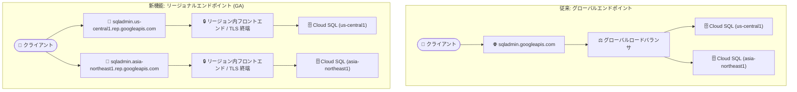

# Cloud SQL: Admin API リージョナルエンドポイント (REP) が GA

**リリース日**: 2026-09-08

**サービス**: Cloud SQL for MySQL / Cloud SQL for PostgreSQL / Cloud SQL for SQL Server

**機能**: Cloud SQL Admin API のリージョナルエンドポイント (Regional Endpoints / REP)

**ステータス**: GA (一般提供)

📊 [このアップデートのインフォグラフィックを見る](https://takech9203.github.io/google-cloud-news-summary/20260908-cloud-sql-regional-endpoints-ga.html)

## 概要

Cloud SQL Admin API のリージョナルエンドポイント (Regional Endpoints、REP) が、Cloud SQL for MySQL、PostgreSQL、SQL Server の 3 エディションすべてで一般提供 (GA) になりました。従来の単一のグローバルエンドポイント (`sqladmin.googleapis.com`) に加えて、`sqladmin.{region}.rep.googleapis.com` (例: `sqladmin.asia-northeast1.rep.googleapis.com`) というリージョン固有の URL で Cloud SQL インスタンスの管理操作 (作成・更新・削除など) を実行できます。

リージョナルエンドポイントは、各リージョン内に閉じたフロントエンドおよびロードバランシングインフラストラクチャを提供します。API トラフィックがリージョン内に留まるためデータレジデンシー (データ所在地) が強化され、TLS 終端と証明書管理も各リージョン内で行われます。また、リージョンごとに分離されたコントロールプレーンにより、あるリージョンの障害が他のリージョンに波及しない強力なリージョン分離が実現されます。

このアップデートは、ITAR や Assured Workloads Regions といった厳格なデータレジデンシー・データ主権要件を満たす必要がある規制業種 (政府機関、防衛、金融、医療など) のユーザーにとって特に重要です。認証方式 (Bearer トークンなど)、API パス、リクエストボディ、API バージョンはグローバルエンドポイントと完全に同一のため、ベース URL を置き換えるだけで移行できます。

**アップデート前の課題**

- Cloud SQL Admin API へのリクエストは単一のグローバルエンドポイント (`sqladmin.googleapis.com`) 経由でグローバルロードバランサを通過してから対象リージョンに到達するため、API トラフィック (転送中データ) のリージョン内完結を保証できなかった
- グローバルなフロントエンド基盤に依存するため、リージョン外のコンポーネント障害が管理オペレーションに影響し得た
- ITAR などフロントエンドレベルでの厳格なデータレジデンシーを求めるコンプライアンス要件に対して、Admin API の経路を制御する手段がなかった

**アップデート後の改善**

- `sqladmin.{region}.rep.googleapis.com` 形式のリージョン固有 URL により、API 呼び出しが対象リージョンのフロントエンドインフラで直接処理され、転送中データがリージョン内に留まる
- リージョンごとに分離されたコントロールプレーンにより、あるリージョンの障害が他リージョンの Admin API 操作に影響しない
- TLS 終端と証明書管理が各リージョン内で完結する
- ITAR や Assured Workloads Regions などの厳格なデータレジデンシー・データ主権基準への対応が可能になった

## アーキテクチャ図



従来はすべての Admin API リクエストがグローバルロードバランサを経由していましたが、リージョナルエンドポイントでは各リージョンのフロントエンドが直接リクエストを処理し、トラフィックとTLS 終端がリージョン内に閉じます。

## サービスアップデートの詳細

### 主要機能

1. **リージョン固有の Admin API エンドポイント**
   - `sqladmin.{region}.rep.googleapis.com` 形式の URL で Cloud SQL Admin API を呼び出し可能
   - MySQL、PostgreSQL、SQL Server の 3 エディションすべてで利用可能
   - 認証方式、API パス、リクエストボディ、API バージョンはグローバルエンドポイントと同一で、ベース URL の置き換えのみで利用できる

2. **データレジデンシーの強化 (転送中データ)**
   - API リクエストが対象リージョンのフロントエンドインフラで処理され、トラフィックがリージョン内に留まる
   - TLS 終端と証明書管理が各リージョン内で実施される
   - ITAR や Assured Workloads Regions などの厳格なコンプライアンス基準への対応を支援

3. **リージョン分離による信頼性向上**
   - リージョンごとに分離されたコントロールプレーンを提供
   - あるリージョンの障害が他リージョンの Admin API 操作に影響しない
   - 厳格なリージョン境界の強制: エンドポイントのリージョンとリクエスト対象リソースのリージョンが一致しない場合、リクエストは 4xx エラーで拒否される

## 技術仕様

### エンドポイントの比較

| 項目 | グローバルエンドポイント | リージョナルエンドポイント |
|------|------------------------|--------------------------|
| URL 形式 | `sqladmin.googleapis.com` | `sqladmin.{region}.rep.googleapis.com` |
| ルーティング | グローバルロードバランサ経由 | リージョン内フロントエンドで直接処理 |
| ユースケース | 複数リージョンにまたがるリソースの一元管理 | フロントエンドレベルでの厳格なデータレジデンシー |
| `Instance.List` の挙動 | 全リージョンのインスタンスを返す | そのリージョン内のインスタンスのみ返す |
| リージョン不一致のリクエスト | 対象リージョンにルーティング | 4xx エラーで拒否 |

### グローバルエンドポイントとの挙動差異

| 動作 | 詳細 |
|------|------|
| 厳格なリージョンマッチング | `INSERT` / `UPDATE` / `PATCH` / `DELETE` / `GET` の対象リソースのリージョンがエンドポイントのリージョンと一致しない場合、4xx エラー |
| `Instance.List` | リージョナルエンドポイントはそのリージョン内のインスタンスのみをリストする |
| バックアップ | バックアップはクロスリージョン復元を保証するためグローバルリソースとして扱われる。バックアップの作成・復元にはグローバルエンドポイントの利用が推奨 |
| `BackupRuns` | 各インスタンスのリージョンのリージョナルエンドポイントから提供される |

## 設定方法

### 前提条件

1. Cloud SQL Admin API が有効化されていること
2. 対象インスタンスがリージョナルエンドポイントのサポート対象リージョンに存在すること

### 手順

#### ステップ 1: curl / HTTP クライアントでリージョナルエンドポイントを利用

グローバルのベース URL をリージョン固有の URL に置き換えるだけで利用できます。

```bash
# グローバルエンドポイント (従来)
curl -H "Authorization: Bearer $(gcloud auth print-access-token)" \
  https://sqladmin.googleapis.com/v1/projects/{project}/instances

# リージョナルエンドポイント (us-central1 の例)
curl -H "Authorization: Bearer $(gcloud auth print-access-token)" \
  https://sqladmin.us-central1.rep.googleapis.com/v1/projects/{project}/instances
```

#### ステップ 2: gcloud CLI / Terraform で手動オーバーライドを設定

gcloud CLI と Terraform には組み込みサポートがないため、設定オーバーライドで明示的にリージョナル URL を指定します。

```bash
# gcloud CLI のエンドポイントオーバーライド
gcloud config set api_endpoint_overrides/sql \
  https://sqladmin.us-central1.rep.googleapis.com/

# Terraform のカスタムエンドポイント
export GOOGLE_SQL_CUSTOM_ENDPOINT="https://sqladmin.us-central1.rep.googleapis.com/sql"
```

#### ステップ 3: (任意) 組織ポリシーでグローバルエンドポイントの使用を制限

リージョナルエンドポイントの利用を強制するには、組織ポリシー制約 `constraints/gcp.restrictEndpointUsage` でグローバル API エンドポイントへのリクエストをブロックできます。

## メリット

### ビジネス面

- **コンプライアンス対応**: ITAR や Assured Workloads Regions などの厳格なデータレジデンシー・データ主権基準を満たすことができ、規制業種での Cloud SQL 採用の障壁が下がる
- **GA による本番利用**: Preview から GA に昇格したことで、SLA を伴う本番ワークロードでの利用が可能になった

### 技術面

- **転送中データのリージョン内完結**: API トラフィックと TLS 終端がリージョン内に留まり、フロントエンドレベルのデータローカリティを実現
- **障害分離**: リージョンごとに分離されたコントロールプレーンにより、他リージョンの障害の影響を受けずに管理オペレーションを継続できる
- **移行の容易さ**: 認証・API パス・リクエストボディ・API バージョンが変わらないため、ベース URL の置き換えのみで移行できる

## デメリット・制約事項

### 制限事項

- **パブリックネットワーク接続のみ**: リージョナルエンドポイントへのアクセスはパブリックネットワーク接続に限定され、VPC ネットワークやプライベート接続からは接続できない
- **マルチリージョンエンドポイント非対応**: `sqladmin.us.rep.googleapis.com` のような複数リージョンを含むエンドポイントはサポートされない
- **バックエンドのグローバル依存**: フロントエンドはリージョン化されているが、API とメタデータの一部のバックエンド依存関係は引き続きグローバルコンポーネントに依存する場合がある
- **ツールサポートの制限**: gcloud CLI と Terraform は手動の設定オーバーライドが必要。Google Cloud コンソールと Config Connector はリージョナルエンドポイントをサポートしない
- **Cloud SQL リモート MCP サーバー非対応**: リモート MCP サーバーへのアクセスにはグローバルエンドポイント (`https://sqladmin.googleapis.com/mcp`) を使用する必要がある

### 考慮すべき点

- **バックアップ操作はグローバルエンドポイント推奨**: バックアップはクロスリージョン復元を保証するためグローバルリソースとして扱われる。リージョナルエンドポイントでもバックアップ作成は可能だが、複雑さを避けるためバックアップの作成・復元にはグローバルエンドポイントの継続利用が推奨される
- **厳格なリージョンマッチング**: エンドポイントとリクエスト対象リソースのリージョンが一致しないと 4xx エラーになるため、マルチリージョン構成では自動化スクリプトの修正が必要
- **`Instance.List` の挙動変化**: リージョナルエンドポイントではそのリージョン内のインスタンスしか返らないため、全リージョンの棚卸しにはグローバルエンドポイントまたはリージョンごとの呼び出しが必要

## ユースケース

### ユースケース 1: ITAR / データ主権要件下での Cloud SQL 運用

**シナリオ**: 政府・防衛関連のワークロードで、Assured Workloads の ITAR コントロールパッケージを利用しており、API トラフィックを含むすべての転送中データを米国リージョン内に留める必要がある。

**実装例**:
```bash
# us-east4 のリージョナルエンドポイント経由でインスタンスを管理
curl -H "Authorization: Bearer $(gcloud auth print-access-token)" \
  https://sqladmin.us-east4.rep.googleapis.com/v1/projects/{project}/instances

# 組織ポリシーでグローバルエンドポイントの使用をブロックし、REP 利用を強制
# constraints/gcp.restrictEndpointUsage を設定
```

**効果**: Admin API のフロントエンド処理と TLS 終端がリージョン内で完結し、厳格なデータレジデンシー要件を満たしながら Cloud SQL を管理できる。

### ユースケース 2: リージョン障害時の管理オペレーション継続

**シナリオ**: 複数リージョンに Cloud SQL インスタンスを展開しており、特定リージョンのグローバルフロントエンド障害時にも他リージョンのインスタンス管理 (フェイルオーバー操作など) を継続したい。

**効果**: リージョンごとに分離されたコントロールプレーンにより、障害リージョンの影響を受けずに健全なリージョンの Admin API 操作を実行できる。

## 利用可能リージョン

リージョナルエンドポイントは 44 リージョンで利用可能です。日本では asia-northeast1 (東京) と asia-northeast2 (大阪) の両方がサポートされています。

| 地域 | 主なサポートリージョン |
|------|----------------------|
| 日本 | asia-northeast1 (東京)、asia-northeast2 (大阪) |
| アジア太平洋 | asia-east1/2、asia-northeast3、asia-south1/2、asia-southeast1/2/3、australia-southeast1/2 |
| 北米 | us-central1/2、us-east1/4/5、us-west1/2/3/4/8、northamerica-northeast1/2、northamerica-south1 |
| ヨーロッパ | europe-west1/2/3/4/6/8/9/10/12、europe-central2、europe-north1/2、europe-southwest1 |
| その他 | africa-south1、me-central1/2、me-west1、southamerica-east1、southamerica-west1 |

エンドポイントの完全なリストは[公式ドキュメント](https://docs.cloud.google.com/sql/docs/mysql/admin-api/rep)を参照してください。

## 関連サービス・機能

- **Assured Workloads**: ITAR などのコントロールパッケージでは、リージョナルエンドポイントを提供するサービスに対してその利用が求められる。今回の GA により Cloud SQL でもこの要件への対応が可能になる
- **組織ポリシー (`constraints/gcp.restrictEndpointUsage`)**: グローバル API エンドポイントへのリクエストをブロックし、リージョナルエンドポイントの利用を強制できる
- **他サービスのリージョナルエンドポイント**: Spanner、Cloud KMS、Cloud Storage、Pub/Sub、Cloud Logging など多くのサービスが同様の `{service}.{region}.rep.googleapis.com` 形式の REP を提供しており、Cloud SQL もこれに加わった

## 参考リンク

- 📊 [インフォグラフィック](https://takech9203.github.io/google-cloud-news-summary/20260908-cloud-sql-regional-endpoints-ga.html)
- [公式リリースノート](https://docs.cloud.google.com/release-notes#September_08_2026)
- [Cloud SQL Admin API リージョナルエンドポイント (MySQL)](https://docs.cloud.google.com/sql/docs/mysql/admin-api/rep)
- [Cloud SQL Admin API リージョナルエンドポイント (PostgreSQL)](https://docs.cloud.google.com/sql/docs/postgres/admin-api/rep)
- [Cloud SQL Admin API リージョナルエンドポイント (SQL Server)](https://docs.cloud.google.com/sql/docs/sqlserver/admin-api/rep)
- [Assured Workloads: ITAR コントロールパッケージ](https://docs.cloud.google.com/assured-workloads/docs/control-packages/itar)

## まとめ

Cloud SQL Admin API のリージョナルエンドポイントが GA となり、API トラフィックのリージョン内完結とリージョン分離されたコントロールプレーンを本番環境で利用できるようになりました。ITAR や Assured Workloads Regions などの厳格なデータレジデンシー要件を持つ組織は、ベース URL の置き換えだけで移行できるため、対象リージョンのエンドポイントへの切り替えと組織ポリシーによる強制を検討することを推奨します。ただし、VPC からの接続不可、バックアップ操作でのグローバルエンドポイント推奨、gcloud/Terraform の手動オーバーライドなどの制約を事前に確認してください。

---

**タグ**: Cloud SQL, MySQL, PostgreSQL, SQL Server, Regional Endpoints, データレジデンシー, データ主権, Assured Workloads, ITAR, GA
