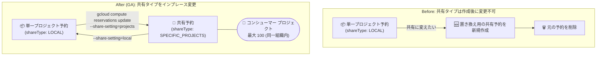

# Compute Engine: 予約の共有タイプ変更 (単一プロジェクト予約と共有予約の相互変換) が GA

**リリース日**: 2026-09-08

**サービス**: Compute Engine

**機能**: 予約の共有タイプ変更 (Modify the share type for a reservation)

**ステータス**: GA (一般提供)

📊 [このアップデートのインフォグラフィックを見る](https://takech9203.github.io/google-cloud-news-summary/20260908-compute-engine-reservation-share-type-conversion-ga.html)

## 概要

Compute Engine で、既存の予約 (Reservation) の共有タイプを変更する機能が一般提供 (GA) になりました。単一プロジェクト予約 (share type: `LOCAL`) を共有予約 (share type: `SPECIFIC_PROJECTS`) に変換したり、その逆に共有予約を単一プロジェクト予約に戻したりすることが、予約を作り直すことなく可能になります。

共有予約に変換すると、予約済みリソースを同一 Google Cloud 組織内の最大 100 個のコンシューマー プロジェクトと共有できます。逆に単一プロジェクト予約に変換すると、予約の利用をオーナー プロジェクトのみに制限できます。組織全体でコンピュート キャパシティを管理する管理者や、複数チーム・複数プロジェクトで GPU/VM キャパシティを融通し合いたい組織にとって、予約運用の柔軟性が大きく向上するアップデートです。

**アップデート前の課題**

- 予約の共有タイプは、変更可能なプロパティとして提供されておらず、作成後に単一プロジェクト予約と共有予約を切り替える手段がなかった
- 変更できないプロパティを変えるには、更新後のプロパティで置き換え用の予約を新規作成し、元の予約を削除するという手順が必要だった (公式ドキュメントの「Change other properties in a reservation」に記載の手順)
- 置き換え時には、キャパシティを確保し直せないリスクや、名前・ゾーン・プロパティを一致させる再作成の手間が発生していた

**アップデート後の改善**

- `gcloud compute reservations update` コマンドや `reservations.update` API (PATCH) で、既存予約の共有タイプをインプレースで変更できるようになった
- 単一プロジェクト予約を、組織内の最大 100 プロジェクトと共有する共有予約へ変換できるようになった
- 共有予約をオーナー プロジェクト専用の単一プロジェクト予約へ変換し、アクセスを制限できるようになった

## アーキテクチャ図



従来は共有タイプを変更するために予約の再作成が必要でしたが、GA となった本機能により、既存予約のまま単一プロジェクト予約と共有予約を双方向に変換できます。

## サービスアップデートの詳細

### 主要機能

1. **単一プロジェクト予約から共有予約への変換**
   - `--share-setting=projects` と `--add-share-with` フラグ (gcloud)、または `shareType: SPECIFIC_PROJECTS` と `projectMap` (REST) を指定して変換する
   - オーナー プロジェクトと同一組織内の最大 100 個のコンシューマー プロジェクトと予約済みリソースを共有できる

2. **共有予約から単一プロジェクト予約への変換**
   - `--share-setting=local` フラグ (gcloud)、または `shareType: LOCAL` (REST) を指定して変換する
   - 予約の利用をオーナー プロジェクトのみに制限できる

3. **変換前の考慮事項 (エラー回避)**
   - 共有予約への変換時: プロジェクトが共有予約を作成できるよう組織ポリシー (`compute.sharedReservationsOwnerProjects`) で許可されていること、および共有予約向けの追加クォータ要件を確認する
   - 単一プロジェクト予約への変換時: 特定ターゲット予約 (specifically targeted reservation) の場合、コンシューマー プロジェクト側でその予約を消費しているインスタンスを停止・一時停止・削除する必要がある (オーナー プロジェクトのインスタンスには適用されない)

## 技術仕様

### 共有タイプの比較

| 項目 | 単一プロジェクト予約 | 共有予約 |
|------|---------------------|----------|
| shareType | `LOCAL` | `SPECIFIC_PROJECTS` |
| 利用可能なプロジェクト | オーナー プロジェクトのみ | オーナー + コンシューマー プロジェクト (1〜100) |
| 共有範囲の条件 | - | オーナー プロジェクトと同一組織内のプロジェクトのみ |
| 作成・変更の前提 | - | 組織ポリシー `compute.sharedReservationsOwnerProjects` の許可リストに登録が必要 |
| クォータ | オーナー プロジェクトが予約リソース全体のクォータを消費 | オーナーは予約全体のクォータを消費、コンシューマーは消費したリソース分のみクォータを消費 |

### 変更可能な予約プロパティ

本アップデートにより、予約で変更できるプロパティは以下のとおりです (これ以外の変更は置き換え予約の作成が必要)。

| 変更可能なプロパティ | 内容 |
|------|------|
| 自動削除 (auto-delete) | 自動削除の有効化/無効化、削除日時の変更 (Preview) |
| コンシューマー プロジェクト | 共有予約のコンシューマー プロジェクトの追加・削除 |
| 予約インスタンス数 | 予約する Compute Engine インスタンス数の増減 |
| 共有ポリシー (sharing policy) | Vertex AI のトレーニング/予測ジョブによる GPU 予約消費の許可/禁止 |
| 共有タイプ (share type) | **単一プロジェクト予約と共有予約の相互変換 (今回 GA)** |

## 設定方法

### 前提条件

1. 共有予約へ変換する場合: プロジェクトが共有予約を作成できることを確認する (組織ポリシー `compute.sharedReservationsOwnerProjects` の許可リスト)
2. 共有予約へ変換する場合: 共有予約向けの追加クォータ要件を満たしていることを確認する
3. 単一プロジェクト予約へ変換する場合 (特定ターゲット予約): コンシューマー プロジェクトで予約を消費中のインスタンスを停止・一時停止・削除する

### 手順

#### ステップ 1: 単一プロジェクト予約を共有予約に変換

```bash
gcloud compute reservations update RESERVATION_NAME \
    --add-share-with=CONSUMER_PROJECT_IDS \
    --share-setting=projects \
    --zone=ZONE
```

`CONSUMER_PROJECT_IDS` には共有先プロジェクト ID をカンマ区切りで指定します (例: `project-1,project-2`)。同一組織内の最大 100 プロジェクトまで共有できます。

#### ステップ 2: 共有予約を単一プロジェクト予約に変換

```bash
gcloud compute reservations update RESERVATION_NAME \
    --share-setting=local \
    --zone=ZONE
```

REST API の場合は `reservations.update` メソッドに PATCH リクエストを送信し、クエリ パラメータ `paths=shareSettings.shareType` (共有予約への変換時は加えて `paths=shareSettings.projectMap.PROJECT_ID_OR_NUMBER`) を指定します。

```json
PATCH https://compute.googleapis.com/compute/v1/projects/PROJECT_ID/zones/ZONE/reservations/RESERVATION_NAME?paths=shareSettings.shareType
{
  "name": "RESERVATION_NAME",
  "shareSettings": {
    "shareType": "LOCAL"
  }
}
```

## メリット

### ビジネス面

- **キャパシティ運用の柔軟性向上**: 組織の成長やチーム構成の変化に応じて、確保済みのキャパシティの共有範囲を後から見直せる
- **予約の再作成リスクの回避**: 置き換え予約の作成・削除に伴うキャパシティ喪失リスクや運用ミスを避けられる

### 技術面

- **インプレース変換**: `gcloud compute reservations update` / `reservations.update` API のみで共有タイプを変更でき、予約名やゾーンを維持できる
- **双方向の変換**: 共有の拡大 (LOCAL → SPECIFIC_PROJECTS) と制限 (SPECIFIC_PROJECTS → LOCAL) の両方に対応

## デメリット・制約事項

### 制限事項

- 共有先はオーナー プロジェクトと同一組織内のプロジェクトに限られ、共有できるのは最大 100 プロジェクトまで
- 共有予約を作成・変更するには、プロジェクトが組織ポリシー `compute.sharedReservationsOwnerProjects` の許可リストに登録されている必要がある
- 特定ターゲット予約 (specifically targeted reservation) を単一プロジェクト予約へ変換する場合、コンシューマー プロジェクトで予約を消費中のインスタンスを事前に停止・一時停止・削除する必要がある

### 考慮すべき点

- コンシューマー プロジェクトで共有予約をターゲットとするインスタンスを停止・一時停止した場合、置き換え予約 (同じオーナー プロジェクト・ゾーン・名前・一致するプロパティ) を作成しない限り、再起動・再開できなくなる点に注意が必要
- 共有予約と単一プロジェクト予約ではクォータ要件が異なるため、共有予約へ変換する際は追加クォータが必要になる場合がある

## ユースケース

### ユースケース 1: 組織内でのキャパシティ融通

**シナリオ**: 特定プロジェクトで GPU VM のキャパシティを予約していたが、需要の変化により、同一組織内の別チームのプロジェクトでも同じキャパシティを利用したい。

**実装例**:
```bash
gcloud compute reservations update my-gpu-reservation \
    --add-share-with=team-b-project,team-c-project \
    --share-setting=projects \
    --zone=us-central1-a
```

**効果**: 予約を作り直すことなく、確保済みのキャパシティを複数プロジェクトで共有でき、未使用の予約リソースの無駄を削減できる。

### ユースケース 2: 共有していた予約のアクセス制限

**シナリオ**: プロジェクト再編に伴い、これまで複数プロジェクトと共有していた予約をオーナー プロジェクト専用に戻したい。

**効果**: `--share-setting=local` を指定するだけで予約の利用をオーナー プロジェクトのみに制限でき、キャパシティのガバナンスを強化できる。

## 料金

予約は、予約したリソース (未使用の VM を含む) に対してオンデマンド価格と同じレートで課金されます。共有予約の利用に追加料金はなく、単一プロジェクト予約と同じ価格で課金されます。共有予約では、デフォルトでオーナー プロジェクトに課金されますが、コンシューマー プロジェクトが予約リソースを消費している間は、そのコンシューマー プロジェクトに課金されます。確約利用割引 (CUD) や継続利用割引 (SUD) も通常の VM と同様に適用されます。

詳細は [VM インスタンスの料金ページ](https://cloud.google.com/compute/vm-instance-pricing) を参照してください。

## 関連サービス・機能

- **組織ポリシー (`compute.sharedReservationsOwnerProjects`)**: 共有予約を作成・変更できるプロジェクトを組織レベルで制御する制約。共有予約への変換にはこの許可リストへの登録が必要
- **確約利用割引 (CUD)**: 予約はリソースベースのコミットメントにアタッチ可能。課金対象プロジェクトに応じた割引が適用される
- **Vertex AI**: 予約の共有ポリシー (`serviceShareType: ALLOW_ALL`) を設定することで、GPU 予約を Vertex AI のカスタム トレーニング/予測ジョブから消費できる
- **GKE / Batch / Dataflow / Managed Service for Apache Spark**: Compute Engine 予約を消費できる Google Cloud プロダクト

## 参考リンク

- 📊 [インフォグラフィック](https://takech9203.github.io/google-cloud-news-summary/20260908-compute-engine-reservation-share-type-conversion-ga.html)
- [公式リリースノート](https://docs.cloud.google.com/release-notes#September_08_2026)
- [ドキュメント: Modify the share type for a reservation](https://docs.cloud.google.com/compute/docs/instances/reservations-modify#modify-share-type)
- [ドキュメント: 共有予約の作成](https://docs.cloud.google.com/compute/docs/instances/reservations-shared)
- [ドキュメント: 予約の概要 (共有予約の要件・制限)](https://docs.cloud.google.com/compute/docs/instances/reservations-overview)
- [料金ページ (VM インスタンスの料金)](https://cloud.google.com/compute/vm-instance-pricing)

## まとめ

既存の Compute Engine 予約の共有タイプを、再作成なしで単一プロジェクト予約と共有予約の間で相互変換できるようになりました。組織内でコンピュート キャパシティ (特に GPU など希少リソース) を予約している場合、共有範囲の見直しが格段に容易になります。共有予約への変換を検討する際は、組織ポリシーの許可リスト登録と追加クォータ要件を事前に確認することを推奨します。

---

**タグ**: Compute Engine, Reservations, Shared Reservations, Capacity Management, GA
