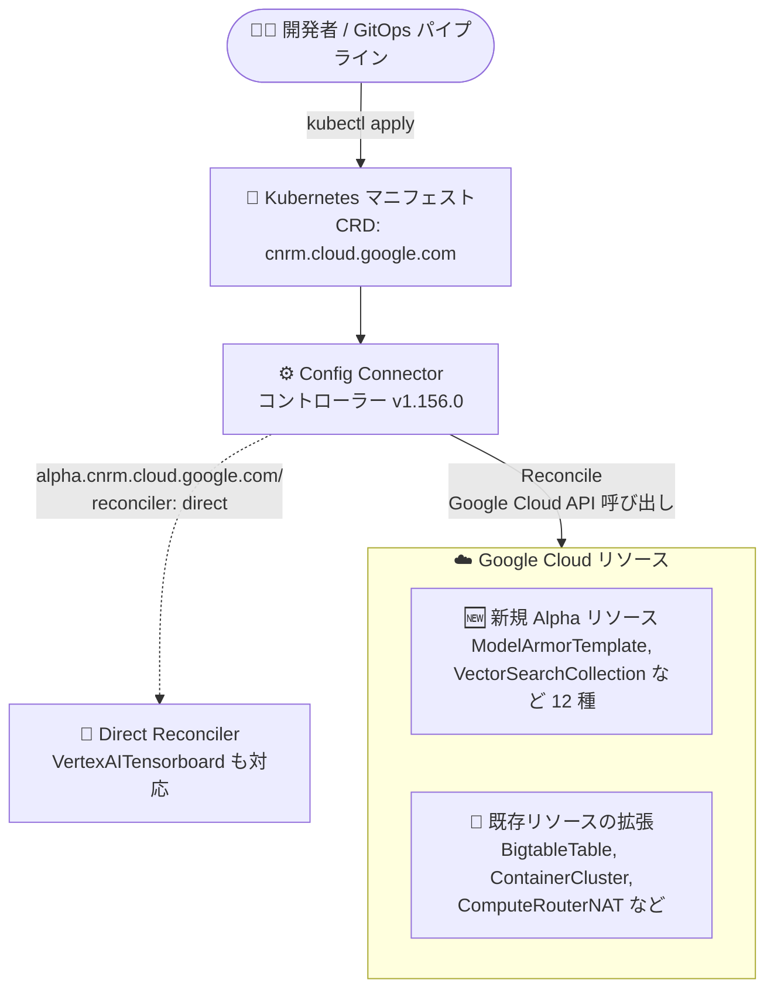

# Config Connector: バージョン 1.156.0 リリース

**リリース日**: 2026-09-08

**サービス**: Config Connector

**機能**: バージョン 1.156.0 (新規 Alpha リソース、新規フィールド、Direct Reconciler 拡充)

**ステータス**: リリース済み (新規リソースは Alpha)

📊 [このアップデートのインフォグラフィックを見る](https://takech9203.github.io/google-cloud-news-summary/20260908-config-connector-1-156-0.html)

## 概要

Config Connector バージョン 1.156.0 がリリースされました。Config Connector は、Kubernetes のカスタムリソース (CRD) とコントローラーを通じて Google Cloud リソースを宣言的に管理できるオープンソースの Kubernetes アドオンです。今回のリリースでは、Direct Reconciler ベースの新規 Alpha リソースが 12 種類追加されたほか、既存リソースへの新規フィールド追加、`ComputeRouterNAT` の `natIpAllocateOption` のオプション化、プレビューサマリー CLI の改善、`VertexAITensorboard` への Direct Reconciliation (オプトイン) 対応が含まれます。

対象ユーザーは、GitOps や Kubernetes ネイティブなワークフローで Google Cloud インフラを管理しているプラットフォームエンジニアや SRE です。特に Contact Center AI Insights、Discovery Engine、Model Armor、Vertex AI Vector Search などの AI 関連サービスを IaC (Infrastructure as Code) で管理したいチームにとって、管理可能なリソースの範囲が大きく広がるアップデートです。

**アップデート前の課題**

- CCInsightsQAScorecard や ModelArmorTemplate、VectorSearchCollection など、多くの新しい Google Cloud リソースが Config Connector に対応しておらず、これらは gcloud CLI や Terraform など別のツールで管理する必要があった
- `BigtableTable` の自動バックアップポリシーのロケーション指定や、`ContainerCluster` / `ContainerNodePool` のスワップ設定など、一部のフィールドを Config Connector から構成できなかった
- `ComputeRouterNAT` では `natIpAllocateOption` の指定が必須で、動的割り当てのユースケースに対応しづらかった
- `NetworkSecurityFirewallEndpoint` はプロジェクトレベルの参照 (`spec.projectRef`) が必須で、組織レベルでのリソース編成に対応していなかった
- プレビューサマリーレポートに Namespace や現在のステータスが含まれておらず、変更内容の確認がしづらかった

**アップデート後の改善**

- Direct Reconciler ベースの 12 種類の新規 Alpha リソースにより、Contact Center Insights、Document AI Warehouse、Developer Connect、Discovery Engine、GKE Hub、Model Armor、Network Security、Rapid Migration Assessment、Security Command Center、Storage Insights、Vertex AI Vector Search のリソースを Kubernetes マニフェストで管理可能になった
- `BigtableTable`、`ContainerCluster`、`ContainerNodePool`、`DataprocCluster`、`NetworkSecurityFirewallEndpoint` に新規フィールドが追加され、より細かい構成が可能になった
- `ComputeRouterNAT` の `natIpAllocateOption` がオプションになり、動的割り当てをサポートした
- `NetworkSecurityFirewallEndpoint` に `spec.organizationRef` が追加され、組織レベルでのリソース編成が可能になり、`spec.projectRef` はオプションになった
- プレビューサマリーレポートに Namespace と現在のステータスが表示されるようになった
- `VertexAITensorboard` が Direct Reconciliation (オプトイン) に対応した

## アーキテクチャ図



開発者が Kubernetes マニフェストとして宣言したリソースを Config Connector のコントローラーが検知し、Google Cloud API を通じて実際のリソース状態を宣言された状態に非同期で調整 (Reconcile) します。v1.156.0 では管理可能なリソースが 12 種追加され、Direct Reconciler の対応範囲も拡大しました。

## サービスアップデートの詳細

### 主要機能

1. **新規 Alpha リソース (Direct Reconciler) の追加**

   以下の 12 種類のリソースが Alpha として追加されました。

   | リソース | 対応する Google Cloud サービス / 用途 |
   |---------|----------------------------------|
   | `CCInsightsQAScorecard` | Contact Center Insights の QA スコアカード管理 (エージェントのパフォーマンス評価) |
   | `ContentWarehouseSynonymSet` | Document AI Warehouse のシノニムセット管理 (検索用カスタム同義語グループ) |
   | `DevConnectAccountConnector` | Developer Connect アカウントコネクタ管理 (GKE クラスタと開発者システムの接続) |
   | `DiscoveryEngineEngine` | Discovery Engine の検索エンジン管理 |
   | `DiscoveryEngineServingConfig` | Discovery Engine のサービング構成管理 (検索・レコメンデーション・リスティング機能の制御) |
   | `GKEHubFleet` | GKE Hub フリート管理 (クラスタの論理的なグループ化と管理) |
   | `ModelArmorTemplate` | Model Armor テンプレート管理 (LLM の安全性・セキュリティポリシー定義) |
   | `NetworkSecurityAuthzPolicy` | Network Security 承認ポリシー管理 (トラフィックの認可) |
   | `RapidMigrationAssessmentCollector` | Rapid Migration Assessment コレクタ管理 (クラウド移行のための環境ディスカバリデータ収集) |
   | `SecurityCenterManagementEventThreatDetectionCustomModule` | Security Command Center の Event Threat Detection カスタムモジュール管理 |
   | `StorageInsightsDatasetConfig` | Cloud Storage Insights データセット構成管理 (ストレージデータセットの自動インベントリと分析) |
   | `VectorSearchCollection` | Vertex AI Vector Search コレクション管理 (類似検索インデックス) |

2. **既存リソースへの新規フィールド追加**

   | リソース | 追加フィールド | 内容 |
   |---------|--------------|------|
   | `BigtableTable` | `spec.automatedBackupPolicy.locations` | 自動バックアップポリシーのロケーション指定 |
   | `ContainerCluster` | `spec.nodeConfig.swapConfig` | ノードのスワップ設定 |
   | `ContainerNodePool` | `spec.nodeConfig.swapConfig` | ノードのスワップ設定 |
   | `DataprocCluster` | `spec.secondaryWorkerConfig.instanceFlexibilityPolicy` | セカンダリワーカーのインスタンス柔軟性ポリシー |
   | `NetworkSecurityFirewallEndpoint` | `spec.organizationRef` | 組織レベルでのリソース編成をサポート。あわせて `spec.projectRef` がオプション化 |

3. **NAT IP Allocate Option のオプション化**
   - `ComputeRouterNAT` の `natIpAllocateOption` フィールドがオプションになり、動的割り当て (dynamic allocation) をサポートしました

4. **プレビューサマリー CLI の改善**
   - プレビューサマリーレポートに Namespace と現在のステータスが追加され、変更内容の確認性が向上しました

5. **Reconciliation の改善 (Direct Reconciler の拡充)**
   - `VertexAITensorboard` が Direct Reconciliation に対応しました (オプトイン)
   - API に変更はなく、Direct Reconciler を使用するには対象の Config Connector オブジェクトに `alpha.cnrm.cloud.google.com/reconciler: direct` アノテーションを追加します

## 技術仕様

### Direct Reconciler のオプトイン方法

Direct Reconciler は、対象リソースにアノテーションを付与することで有効化します。API (spec/status のスキーマ) は変更されません。

```yaml
apiVersion: vertexai.cnrm.cloud.google.com/v1beta1
kind: VertexAITensorboard
metadata:
  name: my-tensorboard
  annotations:
    alpha.cnrm.cloud.google.com/reconciler: direct
spec:
  # 既存の spec と同じ (API は変更なし)
```

### Config Connector の基本動作

| 項目 | 詳細 |
|------|------|
| 提供形態 | オープンソースの Kubernetes アドオン (CRD + コントローラー) |
| API グループ | `cnrm.cloud.google.com` |
| 調整方式 | 宣言された desired state と Google Cloud API の実際の状態を非同期に Reconcile (結果整合性) |
| 実行 ID | Config Connector 用 IAM サービスアカウントの ID で Google Cloud API を呼び出し |
| Namespace とプロジェクト | リソースを作成する Kubernetes Namespace が対応する Google Cloud プロジェクトを決定 (namespaced モードの場合) |

## デメリット・制約事項

### 制限事項

- 新規追加された 12 種類のリソースは **Alpha** ステージであり、本番環境での利用には注意が必要です
- Direct Reconciliation (`VertexAITensorboard`) はオプトイン方式であり、`alpha.cnrm.cloud.google.com/reconciler: direct` アノテーションを明示的に付与する必要があります

### 考慮すべき点

- Config Connector のバージョンアップ時は、利用中のリソース CRD のバージョン間差分を確認することが推奨されます (リファレンスドキュメントは最新バージョン基準)
- Config Connector は昇格された RBAC 権限を持つ Pod をデプロイするため、Config Connector オブジェクトを作成できるユーザーの管理 (信頼できるリポジトリからの適用など) が重要です

## ユースケース

### ユースケース 1: LLM の安全ポリシーを GitOps で管理

**シナリオ**: 生成 AI アプリケーションを運用するチームが、Model Armor による LLM の安全性・セキュリティポリシーをアプリケーションマニフェストと同じリポジトリでバージョン管理したい。

**効果**: `ModelArmorTemplate` リソースにより、Model Armor のテンプレートを Kubernetes マニフェストとして宣言的に管理でき、レビュー・監査・ロールバックが Git ベースで統一される。

### ユースケース 2: 組織レベルのファイアウォールエンドポイント管理

**シナリオ**: セキュリティチームが `NetworkSecurityFirewallEndpoint` を個別プロジェクトではなく組織レベルで編成して管理したい。

**効果**: 新しい `spec.organizationRef` フィールドにより組織レベルでのリソース編成が可能になり、`spec.projectRef` がオプション化されたことで柔軟な構成が実現できる。

### ユースケース 3: Vector Search インデックスの IaC 管理

**シナリオ**: RAG (検索拡張生成) アプリケーションのために Vertex AI Vector Search の類似検索インデックスをコードで管理したい。

**効果**: `VectorSearchCollection` リソースにより、Vector Search コレクションを他の Kubernetes リソースと同じワークフローで作成・管理できる。

## 関連サービス・機能

- **GKE (Google Kubernetes Engine)**: Config Connector は GKE クラスタ上で動作する Kubernetes アドオンとして利用できる
- **Vertex AI Vector Search / Model Armor / Discovery Engine**: 今回新たに Config Connector で管理可能になった AI 関連サービス
- **Security Command Center / Network Security**: 今回追加されたセキュリティ関連リソースの対象サービス
- **Terraform**: Google Cloud リソースを IaC で管理する代替手段。Kubernetes ネイティブなワークフローを重視する場合は Config Connector が適する

## 参考リンク

- 📊 [インフォグラフィック](https://takech9203.github.io/google-cloud-news-summary/20260908-config-connector-1-156-0.html)
- [公式リリースノート](https://docs.cloud.google.com/release-notes#September_08_2026)
- [Config Connector 概要](https://docs.cloud.google.com/config-connector/docs/overview)
- [Config Connector リソースリファレンス](https://docs.cloud.google.com/config-connector/docs/reference/overview)
- [BigtableTable リファレンス](https://cloud.google.com/config-connector/docs/reference/resource-docs/bigtable/bigtabletable)
- [ContainerCluster リファレンス](https://cloud.google.com/config-connector/docs/reference/resource-docs/container/containercluster)
- [ContainerNodePool リファレンス](https://cloud.google.com/config-connector/docs/reference/resource-docs/container/containernodepool)
- [DataprocCluster リファレンス](https://cloud.google.com/config-connector/docs/reference/resource-docs/dataproc/dataproccluster)
- [NetworkSecurityFirewallEndpoint リファレンス](https://cloud.google.com/config-connector/docs/reference/resource-docs/networksecurity/networksecurityfirewallendpoint)
- [Model Armor ドキュメント](https://cloud.google.com/model-armor/docs)
- [Vertex AI Vector Search ドキュメント](https://cloud.google.com/vertex-ai/docs/vector-search)

## まとめ

Config Connector 1.156.0 は、Model Armor や Vector Search、Discovery Engine といった AI 関連サービスを含む 12 種類の新規 Alpha リソースを追加し、Kubernetes ネイティブな IaC の適用範囲を大きく広げるリリースです。既存リソースのフィールド拡充や Direct Reconciler の拡大も進んでおり、GitOps で Google Cloud を管理しているチームはバージョンアップと新規リソースの評価を検討することを推奨します。Alpha リソースの本番利用はステージ制約を踏まえて慎重に判断してください。

---

**タグ**: Config Connector, Kubernetes, IaC, GitOps, GKE, Model Armor, Vector Search, Discovery Engine, リリース
