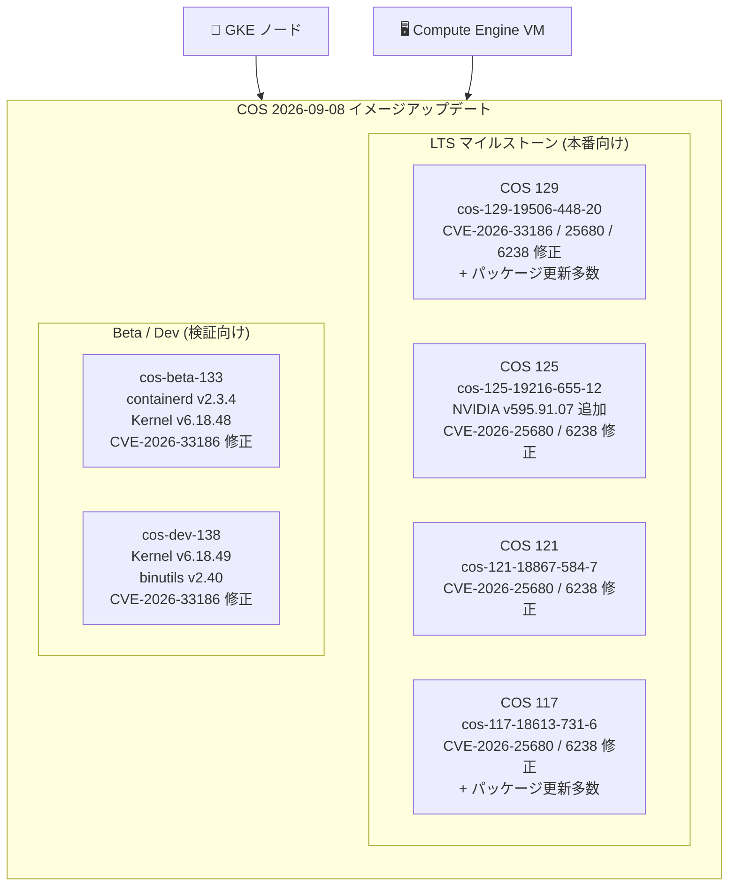

# Container-Optimized OS (COS): 複数イメージのセキュリティ修正・バージョンアップデート

**リリース日**: 2026-09-08

**サービス**: Container-Optimized OS (COS)

**機能**: セキュリティ修正 (CVE 対応)、カーネル・コンテナランタイム更新、NVIDIA ドライバ追加

**ステータス**: Available (Change / Fixed / Security)

📊 [このアップデートのインフォグラフィックを見る](https://takech9203.github.io/google-cloud-news-summary/20260908-container-optimized-os-image-updates.html)

## 概要

2026 年 9 月 8 日、Google Cloud は Container-Optimized OS (COS) の 6 つのイメージ (cos-beta-133、cos-dev-138、および LTS マイルストーンの COS 129 / COS 125 / COS 121 / COS 117) に対して、セキュリティ修正とバージョンアップデートを含む新しいイメージリリースを公開した。

今回のリリースの中心はセキュリティ修正であり、CVE-2026-33186 (docker、containerd、kubernetes、google-osconfig-agent、node-problem-detector、extensions-manager などの Go 系コンポーネント)、CVE-2026-25680 (dev-go/net、v0.55.0 への更新で修正)、CVE-2026-6238 (sys-libs/glibc) の 3 つの CVE が複数マイルストーンにわたって修正されている。また、シンボリックリンクされたバインドマウントを持つコンテナに対する `docker cp` の失敗が LTS 全マイルストーンと beta で修正され、COS 125 では NVIDIA ドライバ v595.91.07 のサポートが追加された。

本アップデートの対象ユーザーは、GKE ノードや Compute Engine VM で Container-Optimized OS を使用しているすべてのユーザーである。glibc やコンテナランタイム (containerd / docker) といった OS の中核コンポーネントの脆弱性修正が含まれるため、脆弱性スキャンで該当 CVE が検出されている環境では早期の適用が推奨される。

**アップデート前の課題**

- docker、containerd、kubernetes、google-osconfig-agent、node-problem-detector、extensions-manager の各コンポーネントに CVE-2026-33186 の脆弱性が存在していた
- dev-go/net に CVE-2026-25680 の脆弱性が存在していた
- sys-libs/glibc に CVE-2026-6238 の脆弱性が存在していた
- シンボリックリンクされたバインドマウントを持つコンテナとの間で `docker cp` によるファイルコピーが失敗する不具合があった
- COS 125 で NVIDIA ドライバ v595.91.07 が利用できなかった

**アップデート後の改善**

- 各マイルストーンの該当コンポーネントで CVE-2026-33186、CVE-2026-25680、CVE-2026-6238 が修正され、セキュリティリスクが軽減された
- `docker cp` のシンボリックリンクされたバインドマウントに関する不具合が cos-beta-133、COS 125、COS 121、COS 117 で修正された
- COS 125 で NVIDIA ドライバ v595.91.07 が利用可能になった
- cos-beta-133 で containerd が v2.3.4、カーネルが v6.18.48 に更新された
- cos-dev-138 でカーネルが v6.18.49、binutils が v2.40 に更新された
- COS 129 / COS 117 で sqlite、expat、xxhash、libnftnl、docker-credential-helpers など多数のパッケージがアップグレードされた

## アーキテクチャ図



今回のアップデートは LTS 4 マイルストーンと beta/dev チャネルの計 6 イメージに及び、GKE ノードと Compute Engine VM の両方に影響する。

## サービスアップデートの詳細

### 修正された CVE と対象コンポーネント

| CVE | 対象コンポーネント | 影響を受けるイメージ |
|------|------|------|
| CVE-2026-33186 | app-containers/docker | cos-beta-133 |
| CVE-2026-33186 | app-admin/extensions-manager | cos-dev-138 |
| CVE-2026-33186 | google-osconfig-agent、node-problem-detector、containerd、kubernetes | cos-129 |
| CVE-2026-25680 | dev-go/net (v0.55.0 に更新) | cos-129、cos-117、cos-121、cos-125 |
| CVE-2026-6238 | sys-libs/glibc | cos-129、cos-117、cos-121、cos-125 |

### イメージ別コンポーネントバージョン

| イメージ | Kernel | Docker | Containerd | 主な変更点 |
|------|------|------|------|------|
| cos-beta-133-19999-44-28 | COS-6.18.48 | v29.4.3 | v2.3.4 | containerd v2.3.4 / カーネル v6.18.48 更新、docker の CVE-2026-33186 修正、docker cp 修正 |
| cos-dev-138-20098-0-0 | COS-6.18.49 | v29.4.3 | v2.3.2 | カーネル v6.18.49 更新、extensions-manager の CVE-2026-33186 修正、binutils v2.40 |
| cos-129-19506-448-20 | COS-6.12.105 | v27.5.1 | v2.2.7 | CVE 3 件修正、パッケージ更新多数 |
| cos-125-19216-655-12 | COS-6.12.105 | v27.5.1 | v2.2.7 | NVIDIA ドライバ v595.91.07 追加、CVE 2 件修正 |
| cos-121-18867-584-7 | COS-6.6.153 | v27.5.1 | v2.0.10 | CVE 2 件修正、docker cp 修正 |
| cos-117-18613-731-6 | COS-6.6.153 | v24.0.9 | v1.7.34 | CVE 2 件修正、パッケージ更新多数 |

### cos-beta-133-19999-44-28

1. **containerd / containerd-test v2.3.4 への更新**
2. **Linux カーネル v6.18.48 への更新**
3. **CVE-2026-33186 の修正 (app-containers/docker)**
4. **docker cp 不具合の修正**
   - シンボリックリンクされたバインドマウントを持つコンテナとの間のコピー失敗を修正

### cos-dev-138-20098-0-0

1. **Linux カーネル v6.18.49 への更新**
2. **CVE-2026-33186 の修正 (app-admin/extensions-manager)**
3. **sys-devel/binutils v2.40 への更新**

### cos-129-19506-448-20

1. **CVE-2026-33186 の修正**
   - app-admin/google-osconfig-agent
   - app-admin/node-problem-detector
   - app-containers/containerd
   - app-emulation/kubernetes
2. **CVE-2026-25680 の修正**
   - dev-go/net を v0.55.0 に更新
3. **CVE-2026-6238 の修正 (sys-libs/glibc)**
4. **パッケージアップグレード**
   - dev-db/sqlite v3.53.4
   - dev-libs/expat v2.8.4
   - dev-libs/xxhash v0.8.3-r2
   - net-libs/libnftnl v1.2.9
   - app-containers/docker-credential-helpers v0.9.9
5. **Runtime sysctl 変更**
   - `net.ipv4.udp_mem`: 188034 250714 376068 → 188034 250715 376068

### cos-117-18613-731-6

1. **CVE-2026-6238 の修正 (sys-libs/glibc)**
2. **CVE-2026-25680 の修正 (dev-go/net v0.55.0)**
3. **docker cp 不具合の修正**
4. **パッケージアップグレード (多数)**
   - app-admin/google-guest-configs v20260819.00
   - app-arch/zstd v1.5.7-r1
   - app-containers/docker-credential-helpers v0.9.9
   - app-shells/dash v0.5.13.5
   - dev-db/sqlite v3.53.4
   - dev-libs/expat v2.8.3
   - dev-libs/libverto v0.3.2-r1
   - dev-libs/popt v1.19-r1
   - dev-libs/xxhash v0.8.3-r2
   - net-libs/libnftnl v1.2.9
   - sys-apps/acl v2.4.0-r2
   - sys-auth/passwdqc v2.0.3-r1
   - sys-process/lsof v4.99.7

### cos-121-18867-584-7

1. **CVE-2026-6238 の修正 (sys-libs/glibc)**
2. **CVE-2026-25680 の修正 (dev-go/net v0.55.0)**
3. **docker cp 不具合の修正**
4. **パッケージアップグレード**
   - app-admin/google-guest-configs v20260819.00
   - app-containers/docker-credential-helpers v0.9.9
   - dev-db/sqlite v3.53.4
   - net-libs/libnftnl v1.2.9
   - sys-auth/passwdqc v2.0.3-r1

### cos-125-19216-655-12

1. **NVIDIA ドライバ v595.91.07 のサポート追加**
2. **CVE-2026-6238 の修正 (sys-libs/glibc)**
3. **CVE-2026-25680 の修正 (dev-go/net v0.55.0)**
4. **docker cp 不具合の修正**
5. **パッケージアップグレード**
   - dev-db/sqlite v3.53.4
6. **Runtime sysctl 変更**
   - `net.ipv4.udp_mem`: 188034 250715 376068 → 188034 250714 376068

## 技術仕様

### COS マイルストーン別のサポート状況

| マイルストーン | 今回のイメージ | イメージファミリ | サポート終了 |
|------|------|------|------|
| COS 138 (DEV) | cos-dev-138-20098-0-0 | cos-dev | 未定 |
| COS 133 (BETA) | cos-beta-133-19999-44-28 | cos-beta | 未定 |
| COS 129 LTS | cos-129-19506-448-20 | cos-129-lts | 2028 年 7 月 |
| COS 125 LTS | cos-125-19216-655-12 | cos-125-lts | 2028 年 2 月 |
| COS 121 LTS | cos-121-18867-584-7 | cos-121-lts | 2027 年 3 月 |
| COS 117 LTS | cos-117-18613-731-6 | cos-117-lts | 2026 年 9 月 |

LTS マイルストーンは 26 か月間サポートされ、期間中はセキュリティスキャンとセキュリティ修正の適用が継続的に行われる。

## 設定方法

### 前提条件

1. Compute Engine または GKE で Container-Optimized OS イメージを使用していること
2. 本番環境では LTS ファミリ (`cos-[MILESTONE]-lts`) のイメージを使用すること

### 手順

#### ステップ 1: 最新イメージの確認

```bash
# COS 129 LTS ファミリの最新イメージを確認
gcloud compute images describe-from-family cos-129-lts \
  --project=cos-cloud
```

#### ステップ 2: 最新イメージで VM を作成

```bash
gcloud compute instances create my-cos-instance \
  --image=cos-129-19506-448-20 \
  --image-project=cos-cloud \
  --zone=us-central1-a
```

#### ステップ 3: GKE ノードの更新

```bash
# GKE ノードプールのアップグレード (ノードイメージの更新)
gcloud container clusters upgrade CLUSTER_NAME \
  --node-pool=POOL_NAME \
  --zone=ZONE
```

GKE では、ノード自動アップグレードが有効な場合、修正済みの COS イメージを含むノードバージョンへ順次自動更新される。

## メリット

### ビジネス面

- **セキュリティリスクの低減**: glibc、containerd、docker、kubernetes といった OS・ランタイムの中核コンポーネントの CVE が修正され、脆弱性スキャンやコンプライアンス要件への対応が容易になる
- **広範なカバレッジ**: サポート中の LTS 4 マイルストーンすべてに修正が提供されるため、旧マイルストーンを利用中の環境でも大規模な移行なしにセキュリティ修正を適用できる

### 技術面

- **運用上の不具合解消**: シンボリックリンクされたバインドマウントに対する `docker cp` の失敗が修正され、デバッグやファイル転送のワークフローが安定する
- **GPU ワークロード対応の拡充**: COS 125 で NVIDIA ドライバ v595.91.07 が利用可能になり、新しいドライバブランチを必要とするワークロードに対応できる
- **ランタイムの最新化**: beta チャネルで containerd v2.3.4 とカーネル v6.18 系が検証可能になり、次期 LTS (COS 133) への移行準備ができる

## デメリット・制約事項

### 制限事項

- COS 117 LTS のサポートは 2026 年 9 月に終了するため、今回の修正適用と併せて COS 121 以降への移行を早急に計画する必要がある
- cos-dev / cos-beta ファミリは検証用であり、本番ワークロードでの使用は推奨されない

### 考慮すべき点

- ノードイメージの更新には VM の再作成 (GKE の場合はノードの再作成) が伴うため、PodDisruptionBudget やメンテナンスウィンドウの設定を確認した上でロールアウトすべきである
- COS 129 と COS 125 では `net.ipv4.udp_mem` の sysctl 既定値が変更されている。UDP を多用するワークロードで sysctl 値に依存した設定がある場合は確認が必要
- 本番環境ではイメージファミリ API ではなく、検証済みの特定イメージ名 (例: `cos-129-19506-448-20`) を指定して使用することが推奨される

## ユースケース

### ユースケース 1: 脆弱性スキャン指摘への対応

**シナリオ**: セキュリティチームの脆弱性スキャンで、GKE ノードの glibc (CVE-2026-6238) と containerd (CVE-2026-33186) の脆弱性が検出され、対応期限が設定されている。

**実装例**:
```bash
# ノード自動アップグレードの有効化 (未設定の場合)
gcloud container node-pools update POOL_NAME \
  --cluster=CLUSTER_NAME \
  --zone=ZONE \
  --enable-autoupgrade
```

**効果**: 修正済み COS イメージを含むノードバージョンへ更新することで該当 CVE が解消され、スキャンアラートがクローズできる。

### ユースケース 2: docker cp を使った運用フローの安定化

**シナリオ**: Compute Engine 上の COS VM で、シンボリックリンクされたバインドマウントを持つコンテナに対して `docker cp` でファイルを転送する運用スクリプトが失敗していた。

**効果**: cos-117 / cos-121 / cos-125 / cos-beta-133 の最新イメージに更新することで `docker cp` の不具合が修正され、運用スクリプトが安定して動作する。

## 料金

Container-Optimized OS 自体は無料で利用でき、イメージ更新に伴う追加料金は発生しない。COS を実行する Compute Engine VM や GKE ノードの料金が通常どおり適用される。

- [Compute Engine の料金](https://cloud.google.com/compute/pricing)
- [GKE の料金](https://cloud.google.com/kubernetes-engine/pricing)

## 関連サービス・機能

- **Google Kubernetes Engine (GKE)**: COS は GKE ノードのデフォルトイメージ (`cos_containerd`) として使用され、ノード自動アップグレードで修正が展開される
- **Compute Engine**: COS イメージ (cos-cloud プロジェクト) を直接指定して VM を作成できる
- **OS Config (google-osconfig-agent)**: COS 129 で CVE-2026-33186 が修正されたエージェント。パッチ管理・構成管理に使用される
- **Security Command Center**: 脆弱なイメージを使用しているインスタンスの特定と CVE 状態の一元管理に使用

## 参考リンク

- 📊 [インフォグラフィック](https://takech9203.github.io/google-cloud-news-summary/20260908-container-optimized-os-image-updates.html)
- [公式リリースノート](https://docs.cloud.google.com/release-notes#September_08_2026)
- [COS 129 リリースノート](https://cloud.google.com/container-optimized-os/docs/release-notes/m129)
- [COS 125 リリースノート](https://cloud.google.com/container-optimized-os/docs/release-notes/m125)
- [COS 121 リリースノート](https://cloud.google.com/container-optimized-os/docs/release-notes/m121)
- [COS 117 リリースノート](https://cloud.google.com/container-optimized-os/docs/release-notes/m117)
- [COS バージョニングとライフサイクル](https://cloud.google.com/container-optimized-os/docs/concepts/versioning)
- [COS サポートポリシー](https://cloud.google.com/container-optimized-os/docs/resources/support-policy)

## まとめ

今回のアップデートは、Container-Optimized OS のサポート中の全 LTS マイルストーン (COS 117 / 121 / 125 / 129) と beta / dev チャネルにわたる広範なセキュリティリリースである。glibc の CVE-2026-6238、Go ネットワークライブラリの CVE-2026-25680、containerd / docker / kubernetes などに影響する CVE-2026-33186 という中核コンポーネントの修正が含まれるため、COS を使用するすべての環境で早期の適用を推奨する。また、COS 117 のサポートが 2026 年 9 月に終了するため、COS 117 利用者は修正適用と並行して COS 121 以降への移行計画を進めるべきである。

---

**タグ**: #ContainerOptimizedOS #COS #GKE #Security #CVE #Containerd #Docker #LinuxKernel #NVIDIA #LTS
