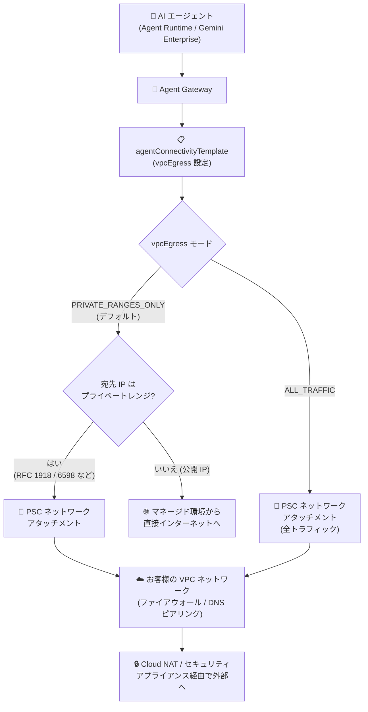

# Gemini Enterprise Agent Platform: Agent Gateway のエージェント接続テンプレートによる VPC 接続

**リリース日**: 2026-09-08

**サービス**: Gemini Enterprise Agent Platform (Agent Gateway)

**機能**: Agent connectivity templates for VPC connectivity in Agent Gateway

**ステータス**: Feature

📊 [このアップデートのインフォグラフィックを見る](https://takech9203.github.io/google-cloud-news-summary/20260908-gemini-agent-platform-agent-connectivity-templates.html)

## 概要

Gemini Enterprise Agent Platform のネットワーキングコンポーネントである Agent Gateway に、**エージェント接続テンプレート (`agentConnectivityTemplate`)** が導入されました。このリソースを使うことで、Agent Gateway から組織の VPC ネットワークへの Egress (アウトバウンド) 接続を宣言的に定義・管理できるようになります。

接続テンプレートの中核となるのが `vpcEgress` 設定です。エージェントから発信されるすべてのアウトバウンドトラフィックを VPC ネットワークにルーティングする **`ALL_TRAFFIC`** モードと、特定のプライベート IP アドレスレンジ宛のトラフィックのみを VPC にルーティングする **`PRIVATE_RANGES_ONLY`** モード (デフォルト) の 2 つから選択できます。VPC への接続は Private Service Connect (PSC) インターフェイスのネットワークアタッチメントを介して行われ、Cloud DNS ピアリングによるカスタム DNS 解決もテンプレート内で設定できます。

このアップデートは、AI エージェントのアウトバウンド通信に対して既存のエンタープライズネットワーク制御 (ファイアウォールポリシー、Cloud NAT、セキュリティアプライアンス、VPC Service Controls など) を適用したいエンタープライズのセキュリティ管理者・ネットワーク管理者に特に重要です。なお、翌日 (2026-09-09) には本テンプレートを基盤とした Agent Gateway の VPC Service Controls サポートも発表されており、別レポートで解説しています。

**アップデート前の課題**

- Agent Gateway から VPC ネットワークへの Egress 接続設定 (ネットワークアタッチメント、DNS 設定、ルーティング動作) を、独立した再利用可能なリソースとして定義・管理する仕組みがなかった
- エージェントのアウトバウンドトラフィックを「すべて VPC 経由」にするか「プライベートレンジ宛のみ VPC 経由」にするかを選択する `vpcEgress` のような明示的なルーティングモードがなかった
- エージェントトラフィックを組織の VPC に引き込み、既存のファイアウォールや Egress 制御 (Cloud NAT、セキュリティアプライアンス) 配下で一元的に統制することが難しかった

**アップデート後の改善**

- `agentConnectivityTemplate` リソースで Egress ネットワーキング設定 (PSC ネットワークアタッチメント、DNS ピアリング、`vpcEgress` モード) を一元的に定義し、Agent Gateway から参照できるようになった
- `ALL_TRAFFIC` / `PRIVATE_RANGES_ONLY` の 2 つのルーティングモードにより、エージェントトラフィックの VPC への引き込み範囲を明示的に制御できるようになった
- VPC 接続を有効にすると、Agent Gateway からの Egress トラフィックの送信元 IP が PSC ネットワークアタッチメントのサブネットの静的なプライベート IP レンジになり、VPC ファイアウォールポリシーでゲートウェイ発トラフィックを統制できるようになった
- `ALL_TRAFFIC` モードでは、すべてのエージェントトラフィックが VPC 経由となるため、組織の VPC Service Controls サービス境界のルールをエージェント通信にも適用できるようになった

## アーキテクチャ図



エージェント接続テンプレートの `vpcEgress` 設定に応じて、Agent Gateway がエージェントのアウトバウンドトラフィックを VPC ネットワークへルーティングする範囲が決まります。`ALL_TRAFFIC` ではインターネット宛を含む全トラフィックが VPC を経由するため、Cloud NAT やセキュリティアプライアンスでの一元統制が可能になります。

## サービスアップデートの詳細

### 主要機能

1. **エージェント接続テンプレート (`agentConnectivityTemplate`)**
   - Agent Gateway インスタンスの Egress ネットワーキング設定を定義・管理する専用リソース
   - PSC ネットワークアタッチメント、DNS ピアリング設定、VPC Egress モードを 1 つのテンプレートに集約
   - Agent Gateway リソースの `googleManaged.agentConnectivityTemplate` フィールドから参照して適用する

2. **VPC Egress ルーティングモード (`vpcEgress`)**
   - `PRIVATE_RANGES_ONLY` (デフォルト): 特定のプライベート IP アドレスレンジ宛のトラフィックのみを VPC にルーティング。インターネット宛トラフィックは VPC を経由せず、標準の公開 Google API エンドポイントへのリクエストはマネージドサービス環境内の限定公開の Google アクセスで自動処理される
   - `ALL_TRAFFIC`: 公開 IP や非 RFC 1918 アドレス宛を含む、エージェント発のすべてのアウトバウンドトラフィックを VPC にルーティング。VPC 側でのルーティングとセキュリティ管理 (デフォルトルート `0.0.0.0/0` の設定など) は利用者の責任となる

3. **静的な送信元 IP レンジ**
   - VPC 接続を有効にすると、Agent Gateway からの Egress トラフィックは PSC インターフェイスのネットワークアタッチメントに割り当てたサブネットのプライベート IP レンジを送信元 IP として使用する
   - この静的な送信元 IP レンジに基づいて、VPC ファイアウォールポリシーでゲートウェイ発トラフィックを統制できる
   - `ALL_TRAFFIC` モードでは、ネットワークアタッチメントのサブネットに Cloud NAT を構成することで、VPC 経由のインターネット Egress を有効化できる

4. **カスタム DNS 解決 (DNS ピアリング)**
   - テンプレートの `dnsPeeringConfig` で、特定のドメインサフィックスをターゲット VPC の限定公開 Cloud DNS マネージドゾーンで解決できる
   - エージェントは IP アドレスではなく、安定した人間可読の DNS 名でターゲット VPC 内のサービスに接続できる

5. **境界セキュリティとデータ漏洩防止**
   - `ALL_TRAFFIC` モードの接続テンプレートを構成すると、すべてのエージェントトラフィックがプライベートな VPC ネットワークアタッチメントを経由するため、組織の VPC Service Controls サービス境界のルールをエージェントトラフィックにも適用できる

## 技術仕様

### PRIVATE_RANGES_ONLY で VPC にルーティングされる IP レンジ

| 種別 | IP アドレスレンジ |
|------|-------------------|
| RFC 1918 | `10.0.0.0/8`, `172.16.0.0/12`, `192.168.0.0/16` |
| RFC 6598 | `100.64.0.0/10` |
| Class E | `240.0.0.0/4` |
| private.googleapis.com | `199.36.153.8/30` |
| restricted.googleapis.com | `199.36.153.4/30` |
| Google API 用 PSC エンドポイント | VPC 内の内部 IP を使うカスタム PSC エンドポイント宛のトラフィック (DNS ピアリングの構成が必要) |

### ネットワークアタッチメントとサブネットの要件

| 項目 | 詳細 |
|------|------|
| 接続設定 | ネットワークアタッチメントは接続を自動承認する設定 (`--connection-preference=ACCEPT_AUTOMATIC`) が必要 |
| サブネットサイズ | 最小 `/28` (使用可能 IP 12 個、Agent Gateway 1 インスタンス分)。複数ゲートウェイを同一アタッチメント/サブネットに接続する場合は `/26` や `/24` などより大きなサブネットを推奨 |
| 同一 VPC 要件 | ネットワークアタッチメントのサブネットと DNS ピアリングの `targetNetwork` は完全に同一の VPC ネットワークであること (異なる場合は構成検証が失敗) |
| 証明書要件 | 接続先エンドポイントは公的に署名された、または信頼された証明書による HTTP/HTTPS をサポートしている必要がある (検証できない場合は接続失敗) |
| Shared VPC | サブネットはホストプロジェクトに作成し、ネットワークアタッチメントはサービスプロジェクト (推奨) またはホストプロジェクトのいずれにも作成可能 |
| `networkAttachment` フィールド | 一度構成すると変更不可 (イミュータブル) |

### 接続テンプレートの YAML 定義例

```yaml
name: projects/AGENT_GATEWAY_PROJECT_ID/locations/LOCATION/agentConnectivityTemplates/CONNECTIVITY_TEMPLATE_NAME
accessPath: AGENT_TO_ANYWHERE
egressNetworkConfig:
  networkAttachment: PSC_NETWORK_ATTACHMENT_URI
  dnsPeeringConfig:
    domain: DOMAIN_NAME            # 例: corp.internal. (末尾のドットが必須)
    targetNetwork: TARGET_VPC_NETWORK_URI
  vpcEgress: VPC_EGRESS_MODE       # PRIVATE_RANGES_ONLY (デフォルト) または ALL_TRAFFIC
```

- `DOMAIN_NAME` は末尾にドット (`.`) が必要で、ターゲットネットワークで承認された完全一致の限定公開 Cloud DNS マネージドゾーンが存在する必要があります。ルート/ワイルドカードドメイン (`.` など) や Google サービスドメイン (`googleapis.com.` など) は使用できません
- `targetNetwork` は `projects/TARGET_VPC_PROJECT_ID/global/networks/TARGET_VPC_NETWORK_NAME` 形式で、ネットワークアタッチメントを作成した VPC と同一である必要があります

## 設定方法

### 前提条件

1. 接続先の VPC ネットワークに PSC インターフェイスのネットワークアタッチメント (最小 `/28` サブネット、自動承認設定) を作成しておく
2. DNS ピアリングを使う場合は、ターゲット VPC に対応する限定公開 Cloud DNS マネージドゾーンを用意しておく
3. Agent Gateway をデプロイする Google Cloud プロジェクトを準備する

### 手順

#### ステップ 1: エージェント接続テンプレートの YAML を作成

前述の YAML 定義例のとおり、`agw-connectivity-template.yaml` を作成し、ネットワークアタッチメント URI、DNS ピアリング設定、`vpcEgress` モードを定義します。

#### ステップ 2: 接続テンプレートを作成

```bash
gcloud network-services agent-connectivity-templates import CONNECTIVITY_TEMPLATE_NAME \
  --source="agw-connectivity-template.yaml" \
  --location=LOCATION
```

`LOCATION` には接続テンプレートリソースを作成するロケーション (例: `europe-west1`) を指定します。

#### ステップ 3: 接続テンプレートを参照する Agent Gateway を定義・作成

```yaml
# my-agent-gateway-vpc-egress.yaml
name: AGENT_GATEWAY_NAME
protocols:
- MCP
googleManaged:
  governedAccessPath: AGENT_TO_ANYWHERE
  agentConnectivityTemplate: projects/AGENT_GATEWAY_PROJECT_ID/locations/LOCATION/agentConnectivityTemplates/CONNECTIVITY_TEMPLATE_NAME
registries:
- AGENT_REGISTRY_PATH
```

```bash
gcloud network-services agent-gateways import AGENT_GATEWAY_NAME \
  --source="my-agent-gateway-vpc-egress.yaml" \
  --location=LOCATION
```

`registries` には Agent Registry のパスを指定します (Agent Runtime のエージェントはリージョナルレジストリ、Gemini Enterprise はデプロイに対応するグローバル/マルチリージョン/リージョナルレジストリ)。

## メリット

### ビジネス面

- **エンタープライズセキュリティ基準への適合**: AI エージェントのアウトバウンド通信を組織の VPC に引き込み、既存のファイアウォール、セキュリティアプライアンス、VPC Service Controls 境界といった統制の枠組みをそのまま適用できる
- **統制と俊敏性の両立**: セキュリティ/ネットワークチームが接続テンプレートでネットワークポリシーを定義し、エージェント開発者は複雑なネットワーキングを意識せずにエージェント開発に集中できる

### 技術面

- **宣言的で再利用可能な Egress 設定**: ネットワークアタッチメント、DNS ピアリング、ルーティングモードを 1 つのテンプレートリソースに集約し、Agent Gateway から参照するだけで適用できる
- **静的送信元 IP によるファイアウォール統制**: ゲートウェイ発トラフィックの送信元 IP がネットワークアタッチメントのサブネットレンジに固定されるため、VPC ファイアウォールポリシーで精緻な制御が可能
- **柔軟なルーティング制御**: `PRIVATE_RANGES_ONLY` でプライベート宛先のみ VPC 経由にする軽量構成から、`ALL_TRAFFIC` で全トラフィックを VPC 経由にする厳格構成まで、要件に応じて選択できる
- **DNS 名によるプライベートサービス接続**: DNS ピアリングにより、エージェントが IP アドレスではなく安定した DNS 名で VPC 内サービスに接続できる

## デメリット・制約事項

### 制限事項

- 接続テンプレートなしで作成された既存の Agent Gateway に後からテンプレートを適用することはできず、ゲートウェイを削除して新しい接続テンプレート付きで再作成する必要がある
- VPC Egress 設定 (ネットワークアタッチメント、サブネット、DNS ピアリング設定、`vpcEgress` モード) を変更するには、更新した構成で新しい接続テンプレートを作成し、Agent Gateway の参照先を新テンプレートに更新する必要がある
- `networkAttachment` フィールドは一度構成するとイミュータブル
- 接続先は公的に信頼された証明書による HTTP/HTTPS が必須 (自己署名証明書チェーンはサポートされない)
- DNS ピアリングのドメインにはルート/ワイルドカードドメインや Google サービスドメイン (`googleapis.com.` など) を指定できない

### 考慮すべき点

- `ALL_TRAFFIC` モードでは全アウトバウンドトラフィックのルーティングとセキュリティ管理が利用者の責任となる。VPC にデフォルトルート (`0.0.0.0/0`) を用意し、アウトバウンドゲートウェイやセキュリティアプライアンス (ネクストホップファイアウォール、Cloud Interconnect インターフェイスなど) へ転送する構成が必要
- `ALL_TRAFFIC` モードで VPC 経由のインターネットアクセスを許可する場合は、ネットワークアタッチメントのサブネットに Cloud NAT の構成が必要
- 複数の Agent Gateway を同一のネットワークアタッチメント/サブネットに接続する場合は、IP アドレス枯渇を避けるため `/26` や `/24` など大きめのサブネットを確保する

## ユースケース

### ユースケース 1: 社内 MCP サーバー・内部 API へのプライベート接続

**シナリオ**: Agent Runtime 上のエージェントが、VPC 内のプライベート IP でホストされている社内 MCP サーバーや内部 API に接続する必要がある。インターネット宛の通信は従来どおりマネージド環境から直接行いたい。

**実装例**:
```yaml
egressNetworkConfig:
  networkAttachment: projects/my-project/regions/europe-west1/networkAttachments/agw-attachment
  dnsPeeringConfig:
    domain: corp.internal.
    targetNetwork: projects/my-project/global/networks/corp-vpc
  vpcEgress: PRIVATE_RANGES_ONLY
```

**効果**: プライベートレンジ宛のトラフィックのみが VPC にルーティングされ、エージェントは `corp.internal.` の DNS 名で社内サービスにプライベート接続できる。

### ユースケース 2: 全エージェントトラフィックの一元検査とデータ漏洩防止

**シナリオ**: 金融機関などの規制業種で、AI エージェントのすべてのアウトバウンド通信 (インターネット宛を含む) を組織のセキュリティアプライアンスと VPC Service Controls 境界の配下で検査・統制したい。

**効果**: `ALL_TRAFFIC` モードにより全トラフィックが VPC 経由となり、ネクストホップファイアウォールや Cloud NAT での一元的な Egress 統制と、VPC Service Controls によるデータ漏洩防止をエージェント通信にも適用できる。

## 関連サービス・機能

- **Private Service Connect (ネットワークアタッチメント)**: Agent Gateway と VPC 間のプライベート接続の基盤。PSC インターフェイスのネットワークアタッチメントを介して Egress トラフィックが VPC に入る
- **Cloud DNS (限定公開ゾーン / DNS ピアリング)**: 接続テンプレートの `dnsPeeringConfig` により、ターゲット VPC の限定公開マネージドゾーンでエージェントの DNS 解決を行う
- **Cloud NAT**: `ALL_TRAFFIC` モードで VPC 経由のインターネット Egress を有効化する際に、ネットワークアタッチメントのサブネットに構成する
- **VPC Service Controls**: `ALL_TRAFFIC` モードの接続テンプレートと組み合わせることで、サービス境界のルールをエージェントトラフィックに適用できる (2026-09-09 発表の Agent Gateway VPC Service Controls サポートは本テンプレートを基盤とするアップデートで、別レポートで解説)
- **Agent Registry**: Agent Gateway が統制するエージェント・ツール・エンドポイントの登録先。ゲートウェイ定義の `registries` で参照する
- **Shared VPC**: ホストプロジェクトのサブネットを参照してサービスプロジェクトにネットワークアタッチメントを作成する構成 (推奨) に対応

## 参考リンク

- 📊 [インフォグラフィック](https://takech9203.github.io/google-cloud-news-summary/20260908-gemini-agent-platform-agent-connectivity-templates.html)
- [公式リリースノート](https://docs.cloud.google.com/release-notes#September_08_2026)
- [Set up VPC connectivity for Agent Gateway](https://docs.cloud.google.com/gemini-enterprise-agent-platform/govern/gateways/set-up-vpc-connectivity)
- [Agent Gateway overview](https://docs.cloud.google.com/gemini-enterprise-agent-platform/govern/gateways/agent-gateway-overview)
- [gcloud network-services agent-gateways リファレンス](https://docs.cloud.google.com/sdk/gcloud/reference/network-services/agent-gateways)

## まとめ

エージェント接続テンプレートの導入により、Agent Gateway の VPC への Egress 接続を宣言的かつ再利用可能なリソースとして管理できるようになり、`ALL_TRAFFIC` / `PRIVATE_RANGES_ONLY` の選択でエージェントトラフィックの統制範囲を明示的に制御できます。AI エージェントを本番導入するエンタープライズは、社内サービスへのプライベート接続や VPC Service Controls との組み合わせを見据えて、接続テンプレートを前提とした Agent Gateway のデプロイ設計を検討することを推奨します。なお、既存ゲートウェイへの後付けはできないため、テンプレート適用にはゲートウェイの再作成が必要な点に注意してください。

---

**タグ**: `Gemini Enterprise Agent Platform`, `Agent Gateway`, `VPC`, `Private Service Connect`, `ネットワーキング`, `セキュリティ`, `AI エージェント`, `Egress 制御`
