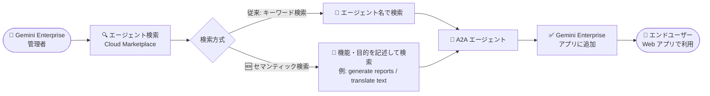

# Gemini Enterprise: Google Cloud Marketplace エージェント検索のセマンティック検索対応 (Preview)

**リリース日**: 2026-09-08

**サービス**: Gemini Enterprise

**機能**: Google Cloud Marketplace エージェント検索のセマンティック検索サポート

**ステータス**: Preview

📊 [このアップデートのインフォグラフィックを見る](https://takech9203.github.io/google-cloud-news-summary/20260908-gemini-enterprise-marketplace-semantic-search.html)

## 概要

Gemini Enterprise の管理者が Google Cloud Marketplace から A2A (Agent2Agent) エージェントを追加する際のエージェント検索が、セマンティック検索に対応しました (Preview)。「レポートを生成する (generate reports)」「テキストを翻訳する (translate text)」のように、エージェントの機能や目的を自然な言葉で記述するだけで、キーワードの完全一致に頼らずに目的のエージェントを見つけられるようになります。

Gemini Enterprise では、管理者が Cloud Marketplace で調達 (購入) した A2A プロトコル対応のパートナー製エージェントを Gemini Enterprise アプリに追加し、エンドユーザーが Gemini Enterprise Web アプリから利用できるようにする機能が提供されています。今回のアップデートは、この「エージェント追加」フローにおける Marketplace エージェントの検索体験を強化するものです。

Marketplace 上のエージェント数が増えるにつれて、正確な製品名を知らないと目的のエージェントにたどり着けないという課題が顕在化します。セマンティック検索により、管理者は「何をしたいか」を起点にエージェントを発見できるようになり、エージェントエコシステムの活用が促進されます。

**アップデート前の課題**

- Marketplace のエージェント検索は名前などのキーワードベースの検索であり、エージェントの正確な名前を知らないと目的のエージェントを見つけにくかった
- 「〇〇ができるエージェントが欲しい」という要件ベースの探し方をするには、検索結果を目視で確認したり、Marketplace のリストを個別に確認したりする必要があった
- パートナーベンダーごとに命名規則が異なるため、キーワードの完全一致に依存した検索では検索漏れが発生しやすかった

**アップデート後の改善**

- エージェントの機能や目的を記述するだけで検索できるようになった (例: 「generate reports」「translate text」)
- キーワードの完全一致が不要になり、意味的に関連するエージェントを発見できるようになった
- 従来どおりエージェント名による検索も引き続き利用可能で、名前が分かっている場合と要件から探す場合の両方に対応できる

## アーキテクチャ図



管理者が Cloud Marketplace のエージェントを検索する際、従来のエージェント名によるキーワード検索に加えて、機能や目的の記述によるセマンティック検索が利用可能になりました。見つけたエージェントは Gemini Enterprise アプリに追加され、エンドユーザーが Web アプリから利用できます。

## サービスアップデートの詳細

### 主要機能

1. **セマンティック検索によるエージェント発見**
   - エージェントの機能 (capabilities) や目的 (purpose) を記述して検索できる
   - 例: 「generate reports」「translate text」のような自然な表現で検索可能
   - キーワードの完全一致が不要になり、意味的な関連性でエージェントがヒットする

2. **既存のキーワード検索との併用**
   - エージェント名による従来の検索も引き続き利用可能
   - 名前が分かっている場合は名前で、要件から探す場合はセマンティック検索でと使い分けができる

3. **Gemini Enterprise のエージェント追加フローに統合**
   - Google Cloud コンソールの Gemini Enterprise ページで、対象アプリの「Agents」>「Add agent」>「Agents via Marketplace」から利用
   - 検索してエージェントを選択後、詳細確認と認証情報の入力を経てアプリへの追加が完了する

## 技術仕様

### Marketplace エージェント追加の前提条件

| 項目 | 詳細 |
|------|------|
| 必要なロール (1) | Gemini Enterprise Admin ロール |
| 必要なロール (2) | Consumer Procurement Entitlement Viewer ロール |
| 必要な API | Discovery Engine API の有効化 |
| 前提リソース | 既存の Gemini Enterprise アプリ |
| 対象エージェント | Cloud Marketplace に登録された A2A エージェント |
| ステータス | Preview (Pre-GA Offerings Terms が適用され、サポートが限定される場合がある) |

### Marketplace エージェントの仕組み

- Cloud Marketplace のエージェントは [Agent2Agent (A2A) プロトコル](https://a2a-protocol.org/latest/topics/what-is-a2a/)を使用して他の AI エージェントと通信・連携する
- パートナーベンダーは、A2A Agent Card 仕様に準拠した Agent Card (JSON) を作成して Marketplace に出品する。Agent Card にはエージェントの機能 (skills) や説明が定義される
- 調達 (購入) されたエージェントを管理者が Gemini Enterprise アプリに追加すると、エンドユーザーは Gemini Enterprise Web アプリからそのエージェントにアクセスできる

## 設定方法

### 前提条件

1. Gemini Enterprise Admin ロールおよび Consumer Procurement Entitlement Viewer ロールを保有していること
2. Discovery Engine API が有効化されていること
3. 追加先の Gemini Enterprise アプリが作成済みであること

### 手順

#### ステップ 1: エージェント追加フローを開く

1. Google Cloud コンソールで Gemini Enterprise ページに移動する
2. エージェントを追加するアプリの名前をクリックする
3. **Agents** > **Add agent** をクリックする
4. 「Choose an agent type」セクションで **Agents via Marketplace** の **Add** をクリックする

#### ステップ 2: セマンティック検索でエージェントを探す

検索欄にエージェント名を入力するか、エージェントの機能や目的を記述して検索します (例: 「generate reports」「translate text」)。目的のエージェントをクリックして選択します。

#### ステップ 3: 追加を完了する

1. **Next** をクリックし、エージェントの詳細を確認して **Next** をクリックする
2. 必要な認証情報を入力し、**Finish** をクリックする

## メリット

### ビジネス面

- **エージェント導入の迅速化**: 正確な製品名を知らなくても要件ベースでエージェントを発見できるため、パートナーエージェントの評価・導入サイクルが短縮される
- **エコシステム活用の促進**: Marketplace 上の多様なパートナーエージェントが発見されやすくなり、組織のニーズに合ったエージェントの活用が進む

### 技術面

- **検索精度の向上**: キーワードの完全一致に依存しないため、命名規則の違いによる検索漏れを軽減できる
- **管理者の運用負荷軽減**: ユーザーからの「〇〇ができるエージェントが欲しい」という要望に対して、その表現のまま検索して候補を特定できる

## デメリット・制約事項

### 制限事項

- Preview 機能であり、Pre-GA Offerings Terms (Service Specific Terms の General Service Terms セクション) が適用される。「現状有姿 (as is)」での提供となり、サポートが限定される場合がある
- Cloud Marketplace 経由で登録したエージェントには、Google Cloud コンソールの Gemini Enterprise 向け Model Armor 設定が自動適用されない。保護するには、開発者がエージェントのアプリケーションコード内で REST API を使用して Model Armor を構成する必要がある

### 考慮すべき点

- Cloud Marketplace の A2A エージェントが Gemini Enterprise 内で機能し続けるには、ベンダーによる継続的なメンテナンスが必要
- エンドユーザーへの表示範囲は管理者の Marketplace visibility 設定 (調達済みのみ表示、統合済みのみ表示、すべて表示など) に依存するため、検索で見つけたエージェントの公開ポリシーも合わせて設計する必要がある
- Agent Marketplace へのアクセスは Gemini Enterprise のエディションによって利用可否が異なる (Standard / Plus / Pay-as-you-go / Frontline で利用可能。詳細はエディション比較ページを参照)

## ユースケース

### ユースケース 1: 要件起点でのパートナーエージェント選定

**シナリオ**: 営業部門から「週次レポートの作成を自動化したい」という要望を受けた管理者が、対応可能なパートナーエージェントを探す。

**実装例**:
```text
1. Gemini Enterprise アプリの Agents > Add agent > Agents via Marketplace を開く
2. 検索欄に「generate reports」と入力してセマンティック検索を実行
3. ヒットしたエージェントの詳細 (Agent Card の機能説明) を確認して選定
4. 認証情報を設定してアプリに追加
```

**効果**: エージェントの製品名を事前に調査することなく、要件の記述だけで候補を絞り込め、選定から導入までの時間を短縮できる。

### ユースケース 2: 多言語対応のためのエージェント発見

**シナリオ**: グローバル展開する組織で、社内ドキュメントの翻訳を支援するエージェントを導入したい。ベンダー名や製品名の候補は不明。

**効果**: 「translate text」のような機能記述で検索することで、名称に「translate」を含まないエージェントも含めて意味的に関連する候補を発見でき、検索漏れを防げる。

## 料金

セマンティック検索機能自体の追加料金に関する情報はリリースノートおよびドキュメントには記載されていません。Marketplace エージェントの利用には、Cloud Marketplace でのエージェントの調達 (購入) と、Gemini Enterprise のサブスクリプションが必要です。Agent Marketplace へのアクセスはエディションにより利用可否が異なります。

詳細は以下を参照してください。

- [Gemini Enterprise エディション比較](https://docs.cloud.google.com/gemini/enterprise/docs/editions)

## 関連サービス・機能

- **Google Cloud Marketplace**: パートナーベンダーが A2A エージェントを出品するマーケットプレイス。管理者はここで調達したエージェントを Gemini Enterprise に追加する
- **Agent2Agent (A2A) プロトコル**: Marketplace エージェントが他の AI エージェントと通信・連携するためのオープンプロトコル。Agent Card (JSON) でエージェントの機能を定義する
- **Agent Gallery**: Gemini Enterprise Web アプリでエンドユーザーがエージェントを発見・実行・整理する画面。Marketplace セクションからパートナーエージェントへのアクセスをリクエストできる
- **Model Armor**: エージェントへのプロンプト攻撃などから保護するセキュリティ機能。Marketplace 経由のエージェントには自動適用されないため、開発者側での REST API による構成が必要
- **Discovery Engine API**: Gemini Enterprise のバックエンド API。Marketplace エージェントの追加に有効化が必要

## 参考リンク

- 📊 [インフォグラフィック](https://takech9203.github.io/google-cloud-news-summary/20260908-gemini-enterprise-marketplace-semantic-search.html)
- [公式リリースノート](https://docs.cloud.google.com/release-notes#September_08_2026)
- [Add and manage A2A agents from Google Cloud Marketplace](https://docs.cloud.google.com/gemini/enterprise/docs/register-and-manage-marketplace-agents)
- [Offer AI agents through Cloud Marketplace](https://docs.cloud.google.com/marketplace/docs/partners/ai-agents)
- [Agent Gallery](https://docs.cloud.google.com/gemini/enterprise/docs/agent-gallery)
- [Gemini Enterprise エディション比較](https://docs.cloud.google.com/gemini/enterprise/docs/editions)

## まとめ

Google Cloud Marketplace のエージェント検索がセマンティック検索に対応したことで、Gemini Enterprise 管理者は「何をしたいか」を記述するだけでパートナーエージェントを発見できるようになりました。Marketplace のエージェントエコシステムが拡大する中で、要件起点のエージェント選定を効率化する実用的な改善です。Preview 段階のため Pre-GA 条項の適用に留意しつつ、パートナーエージェントの導入を検討している組織は、この検索機能を活用してエージェントの評価を進めることを推奨します。

---

**タグ**: Gemini Enterprise, Google Cloud Marketplace, A2A, セマンティック検索, AI エージェント, Preview
