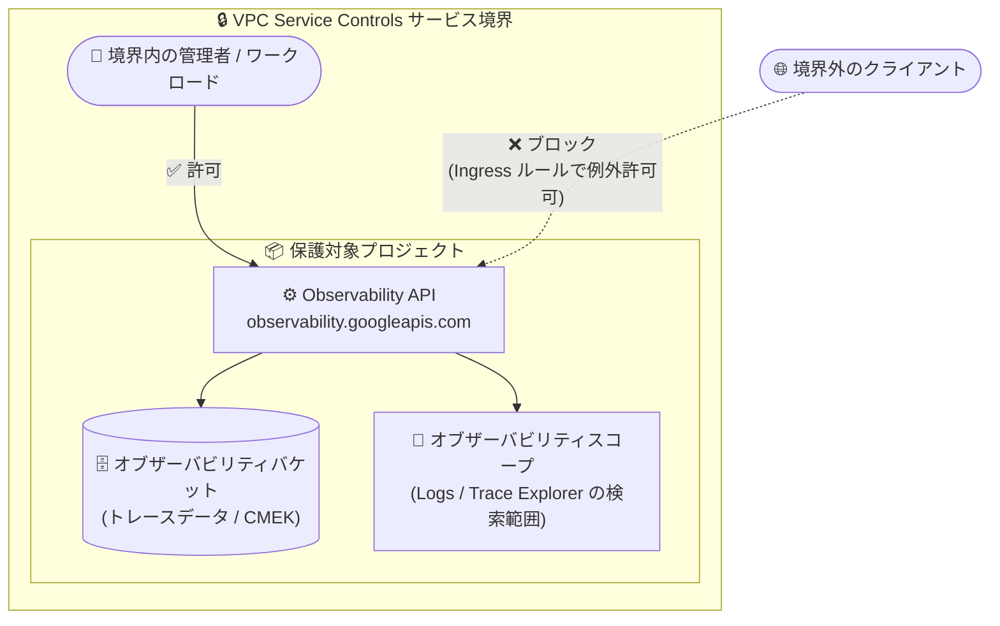

# Cloud Trace / VPC Service Controls: Observability API の VPC Service Controls 対応が GA

**リリース日**: 2026-09-08

**サービス**: Cloud Trace (Observability API) / VPC Service Controls

**機能**: Observability API の VPC Service Controls インテグレーション

**ステータス**: GA (一般提供)

📊 [このアップデートのインフォグラフィックを見る](https://takech9203.github.io/google-cloud-news-summary/20260908-observability-api-vpc-service-controls-ga.html)

## 概要

Observability API (`observability.googleapis.com`) が VPC Service Controls に対応し、このインテグレーションが一般提供 (GA) となりました。Cloud Trace 側と VPC Service Controls 側の両方の Release Notes で同時に発表されており、VPC Service Controls のサポート対象プロダクト一覧にも「Observability API: GA / 既知の制限なし」として掲載されています。

Observability API は、オブザーバビリティバケットのデフォルト設定 (保存ロケーション、CMEK 暗号化キー)、オブザーバビリティスコープ (Logs Explorer / Trace Explorer が既定で検索する対象の制御)、トレースデータを格納するオブザーバビリティバケットの管理、BigQuery リンクデータセットの作成などを担う API です。今回の GA により、この API をサービス境界 (Service Perimeter) の制限対象サービスに追加し、境界内から通常どおり利用できるようになりました。

コンプライアンス要件やデータ漏洩 (Exfiltration) 対策のために VPC Service Controls を利用している組織にとって、テレメトリーデータの保存設定・スコープ管理という機密性の高い操作経路を、Cloud Logging / Cloud Monitoring / Cloud Trace / Telemetry API と同じ境界防御の下に統一できるアップデートです。

**アップデート前の課題**

- Cloud Logging (`logging.googleapis.com`)、Cloud Monitoring (`monitoring.googleapis.com`)、Cloud Trace (`cloudtrace.googleapis.com`)、Telemetry API (`telemetry.googleapis.com`) は VPC Service Controls に対応済みだった一方、オブザーバビリティバケットやスコープを管理する Observability API は GA サポートの対象外だった
- そのため、テレメトリーの保存先ロケーションや CMEK 設定、BigQuery リンクデータセット作成といった管理操作を、他の Observability サービスと同じサービス境界で一貫して保護することができなかった

**アップデート後の改善**

- Observability API をサービス境界の制限対象サービス (Restricted Services) に追加できるようになり、境界外からの API アクセスを遮断できるようになった
- 本インテグレーションは「既知の制限なし (no known limitations)」で完全サポートされ、境界内では通常どおり Observability API を利用できる
- Google Cloud Observability を構成する主要 API (Logging / Monitoring / Trace / Error Reporting / Telemetry / Observability) すべてを単一の境界設計でカバーできるようになった

## アーキテクチャ図



サービス境界に `observability.googleapis.com` を追加すると、境界外からのバケット設定・スコープ管理などの API 呼び出しは遮断され、境界内からは通常どおり利用できます。境界外からの正当なアクセスは Ingress ルールやアクセスレベルで個別に許可します。

## サービスアップデートの詳細

### 主要機能

1. **Observability API のサービス境界保護 (GA)**
   - `observability.googleapis.com` を制限対象サービスとして境界に追加可能
   - VPC Service Controls サポート対象一覧でステータス「GA (fully supported)」、既知の制限なし
   - 境界内ではプロダクトを通常どおり利用可能

2. **保護対象となる Observability API の操作**
   - オブザーバビリティバケットのデフォルト設定 (新規バケットの保存ロケーション、ロケーションごとの Cloud KMS キー [CMEK])
   - オブザーバビリティスコープの構成 (Logs Explorer / Trace Explorer などが既定で検索するリソースの制御)
   - プロジェクト内のオブザーバビリティバケット (トレースデータの格納先) の一覧・管理
   - BigQuery からデータセットへ読み取りアクセスするためのリンクデータセット作成

3. **Google Cloud Observability 全体の境界カバレッジ完成**
   - Cloud Logging、Cloud Monitoring、Cloud Trace、Error Reporting、Telemetry API (OTLP) に加えて Observability API も保護対象に
   - テレメトリーの「送信・照会」だけでなく「保存設定・スコープ管理」まで同一境界で防御可能

## 技術仕様

### Observability API の概要

| 項目 | 詳細 |
|------|------|
| サービス名 | `observability.googleapis.com` |
| VPC Service Controls ステータス | GA (fully supported)、境界による保護可能 |
| 既知の制限 | なし |
| グローバルエンドポイント | `observability.googleapis.com` |
| リージョナルエンドポイント | `observability.REGION.rep.googleapis.com` (パスパラメータのロケーションとリージョンの一致が必要) |
| 主なリソース | `scopes`、`traceScopes`、`buckets`、`buckets.datasets`、`buckets.datasets.links`、`buckets.datasets.views`、`settings` |

### 関連する上限値

| 項目 | 上限 |
|------|------|
| プロジェクトあたりのオブザーバビリティスコープ数 | 1 |
| プロジェクトあたりのトレーススコープ数 | 100 |
| トレーススコープあたりのビュー数 | 20 |

## 設定方法

### 前提条件

1. 組織でアクセスポリシー (Access Context Manager) が作成済みであること
2. VPC Service Controls を管理するための必要なロールを持っていること
3. 保護対象プロジェクトがサービス境界に含まれていること

### 手順

#### ステップ 1: 既存のサービス境界に Observability API を追加

```bash
gcloud access-context-manager perimeters update PERIMETER_NAME \
    --add-restricted-services=observability.googleapis.com \
    --policy=POLICY_ID
```

既存のサービス境界の制限対象サービスに `observability.googleapis.com` を追加します。Google Cloud コンソールの場合は、[VPC Service Controls] ページで境界を編集し、[Restricted Services] に Observability API を追加します。

#### ステップ 2: 関連する Observability サービスもあわせて保護

```bash
gcloud access-context-manager perimeters update PERIMETER_NAME \
    --add-restricted-services=logging.googleapis.com,monitoring.googleapis.com,cloudtrace.googleapis.com,telemetry.googleapis.com \
    --policy=POLICY_ID
```

テレメトリーの送信・照会経路 (Logging / Monitoring / Trace / Telemetry API) も同じ境界で保護することで、Observability 全体を一貫した境界防御下に置けます。

#### ステップ 3: 境界外からの正当なアクセスを許可 (必要に応じて)

境界を有効化すると境界外からの API アクセスは遮断されるため、社内端末からの運用アクセスなどが必要な場合は、Ingress ルールまたはアクセスレベルで送信元・ID・サービスを指定して許可します。まずはドライランモードで影響を確認してから適用することが推奨されます。

## メリット

### ビジネス面

- **コンプライアンス対応の強化**: テレメトリーデータの保存ロケーションや CMEK 設定といった規制要件に直結する操作を、境界による防御下で管理できる
- **データ漏洩リスクの低減**: 境界外からのオブザーバビリティ設定変更やリンクデータセット経由のデータアクセス経路を遮断できる

### 技術面

- **境界設計の一貫性**: Google Cloud Observability の主要 API がすべて VPC Service Controls 対応となり、サービスごとの例外設計が不要になる
- **制限のない完全サポート**: 本インテグレーションは既知の制限なしの GA であり、境界内での利用に追加の回避策が不要

## デメリット・制約事項

### 考慮すべき点

- 境界を有効化すると、境界外 (例: 社内ネットワークの端末) からの Observability API アクセスも遮断されるため、運用に必要なアクセスは Ingress ルールやアクセスレベルの設計が必要
- オブザーバビリティスコープ関連の gcloud コマンド (`gcloud observability scopes`) の利用には gcloud CLI 563.0.0 以降が必要
- BigQuery リンクデータセットを利用する場合、BigQuery 側の境界設計 (BigQuery API の保護) もあわせて検討する必要がある

## ユースケース

### ユースケース 1: 規制業種でのテレメトリーデータ境界防御

**シナリオ**: 金融機関がログ・トレースデータの保存ロケーションと CMEK 暗号化を組織ポリシーで強制しており、これらの設定を変更できる経路を境界内に限定したい。

**実装例**:
```bash
gcloud access-context-manager perimeters update finance-perimeter \
    --add-restricted-services=observability.googleapis.com \
    --policy=123456789
```

**効果**: オブザーバビリティバケットのロケーション・CMEK 設定変更やリンクデータセット作成を境界内の許可された ID からのみに限定し、境界外からの設定改変・データ持ち出し経路を遮断できる。

### ユースケース 2: Observability スタック全体の統一境界設計

**シナリオ**: すでに Cloud Logging / Monitoring / Trace を VPC Service Controls で保護している組織が、Trace Explorer のスコープ管理やトレース保存設定を担う Observability API だけ境界外に残っている状態を解消したい。

**効果**: Observability API を境界に追加することで、テレメトリーの送信・照会・保存設定・スコープ管理のすべてを単一のサービス境界でカバーでき、セキュリティレビューや監査対応が簡素化される。

## 料金

VPC Service Controls の利用に追加料金はありません。Observability API 自体の追加料金に関する発表もこのリリースノートには含まれていません。トレースデータの取り込みなど Google Cloud Observability の料金は料金ページを参照してください。

- [Google Cloud Observability の料金](https://cloud.google.com/stackdriver/pricing)

## 関連サービス・機能

- **Cloud Trace**: トレースデータの送信・照会を担うサービス。トレースデータはオブザーバビリティバケットに保存され、その管理を Observability API が担う。`cloudtrace.googleapis.com` は VPC Service Controls 対応済み (GA)
- **Cloud Logging / Cloud Monitoring / Error Reporting**: いずれも VPC Service Controls 対応済みで、今回の GA により Observability 全体を同一境界で保護可能
- **Telemetry API**: OTLP 形式のログ・メトリクス・トレースを送信する API (`telemetry.googleapis.com`)。VPC Service Controls 対応済み (GA)
- **Cloud KMS (CMEK)**: Observability API で設定するオブザーバビリティバケットのデフォルト暗号化キーとして利用
- **BigQuery**: リンクデータセットにより、オブザーバビリティバケット内のデータセットへ BigQuery から読み取りアクセスが可能
- **Access Context Manager**: サービス境界のアクセスポリシー・アクセスレベルを管理

## 参考リンク

- 📊 [インフォグラフィック](https://takech9203.github.io/google-cloud-news-summary/20260908-observability-api-vpc-service-controls-ga.html)
- [公式リリースノート (2026 年 9 月 8 日)](https://docs.cloud.google.com/release-notes#September_08_2026)
- [Use VPC Service Controls with Google Cloud Observability](https://docs.cloud.google.com/stackdriver/docs/observability/use-vpc-service-controls)
- [Observability API overview](https://docs.cloud.google.com/stackdriver/docs/reference/api-overview)
- [VPC Service Controls サポート対象プロダクト: Observability API](https://docs.cloud.google.com/vpc-service-controls/docs/supported-products#table_observability_api)
- [Observability API REST リファレンス](https://docs.cloud.google.com/stackdriver/docs/reference/observability/api/rest)
- [Configure observability scopes](https://docs.cloud.google.com/stackdriver/docs/observability/scopes)

## まとめ

Observability API の VPC Service Controls 対応が GA となり、Google Cloud Observability の主要 API すべてをサービス境界で一貫して保護できるようになりました。すでに VPC Service Controls を運用している組織は、`observability.googleapis.com` を境界の制限対象サービスに追加し、テレメトリーの保存設定・スコープ管理まで境界防御に含めることを推奨します。適用前にはドライランモードで既存の運用アクセスへの影響を確認してください。

---

**タグ**: #CloudTrace #VPCServiceControls #ObservabilityAPI #GA #セキュリティ #Observability #DataExfiltration #CMEK
