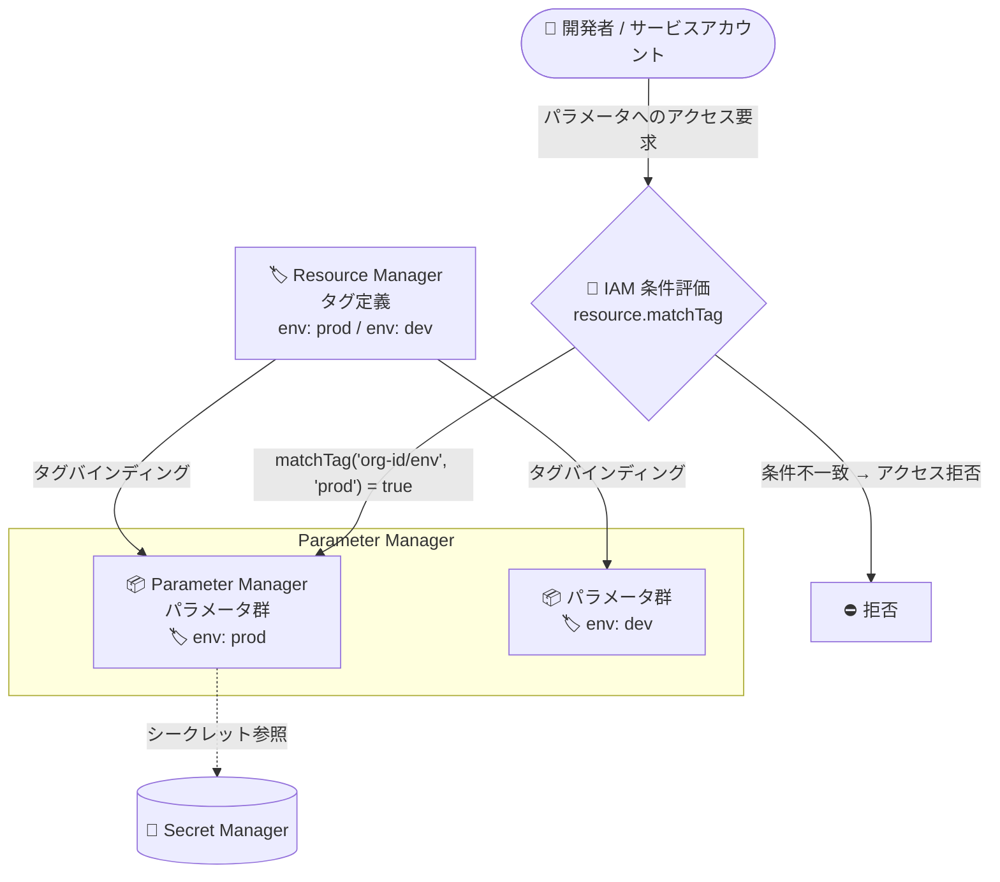

# Secret Manager (Parameter Manager): タグによるパラメータのグループ化と条件付き IAM アクセス制御をサポート

**リリース日**: 2026-09-08

**サービス**: Secret Manager (Parameter Manager)

**機能**: タグによるパラメータのグループ化と条件付き IAM アクセス制御

**ステータス**: GA (Feature)

📊 [このアップデートのインフォグラフィックを見る](https://takech9203.github.io/google-cloud-news-summary/20260908-secret-manager-parameter-manager-tags.html)

## 概要

Parameter Manager が、タグ (Tags) を使用したパラメータのグループ化・整理と、Identity and Access Management (IAM) ポリシーによる条件付きアクセス制御をサポートしました。タグは Google Cloud リソースにアタッチできる Key-Value ペアで、Resource Manager で組織またはプロジェクトレベルで一元的に定義・管理されます。

Parameter Manager は Secret Manager の拡張サービスであり、データベース接続文字列、環境別設定、フィーチャーフラグなどのワークロード構成データを一元管理するためのサービスです。今回のアップデートにより、パラメータ単位でタグバインディングを作成し、「特定のタグが付いたパラメータにのみアクセスを許可する」といった条件付き IAM ポリシーを適用できるようになりました。グローバルパラメータとリージョナルパラメータの両方でタグを利用できます。

多数のパラメータを環境 (dev/staging/prod) やチーム、コンポーネントごとに整理し、アクセス権限をスケーラブルに管理したい組織にとって重要なアップデートです。

**アップデート前の課題**

- Parameter Manager のパラメータにタグをアタッチできず、Resource Manager のタグ体系を使ったパラメータの分類・整理ができなかった
- タグに基づく条件付き IAM ポリシーをパラメータ単位で適用できず、環境別・用途別のアクセス制御には個別の IAM バインディングやプロジェクト分割などの運用が必要だった
- パラメータのメタデータ管理は主にラベル (labels) に依存しており、ポリシーエンジンとの連携によるガバナンス強化が難しかった

**アップデート後の改善**

- タグの Key-Value ペアをパラメータにアタッチし、関連するパラメータをグループ化・整理してメタデータを保持できるようになった
- タグの有無や値に基づいて IAM ロールを条件付きで付与 (または拒否) でき、`environment: production` などのタグを使ったスケーラブルなアクセス制御が可能になった
- パラメータ作成時のタグ付与 (REST API の `tags` フィールド) と、既存パラメータへのタグバインディング追加 (`gcloud resource-manager tags bindings create`) の両方に対応した

## アーキテクチャ図



Resource Manager で定義したタグをパラメータにアタッチし、IAM 条件 (`resource.matchTag` など) がタグを評価してアクセスを許可・拒否するフローを示しています。

## サービスアップデートの詳細

### 主要機能

1. **タグによるパラメータのグループ化・整理**
   - タグは Key-Value ペアとして Google Cloud リソースにアタッチされ、関連するパラメータをまとめて分類・整理できる
   - タグ定義 (キーと許可される値) は Resource Manager を使って組織またはプロジェクトレベルで作成・管理する
   - タグバインディングリソースを作成することで、タグ値と Parameter Manager のパラメータが紐付けられる

2. **タグに基づく条件付き IAM アクセス制御**
   - リソースに特定のタグが付いているかどうかに基づいて、IAM ロールを条件付きで付与できる
   - IAM 条件式では、永続 ID を使う `resource.matchTagId()` / `resource.hasTagKeyId()`、または名前空間付き名を使う `resource.matchTag()` / `resource.hasTagKey()` が利用できる
   - 例: `resource.matchTag('123456789012/env', 'prod')` で `env: prod` タグ付きリソースにのみロールを付与

3. **パラメータ作成時・作成後のタグ付与**
   - パラメータ作成時: REST API のリクエストボディに `"tags": { "TAG_KEY": "TAG_VALUE" }` を指定してタグ付きで作成できる
   - 既存パラメータ: `gcloud resource-manager tags bindings create` または Resource Manager の `tagBindings` API でタグバインディングを追加できる
   - グローバルパラメータ (`locations/global`) とリージョナルパラメータ (リージョナルエンドポイント経由) の両方に対応

## 技術仕様

### タグの識別子

| 識別子 | 説明 | 例 |
|------|------|-----|
| 永続 ID | グローバルに一意で再利用されない ID | `tagKeys/123456789012`, `tagValues/567890123456` |
| 短縮名 (short name) | プロジェクト/組織内で一意なキー名、キーごとに一意な値名 | キー: `env`、値: `prod` |
| 名前空間付き名 | 組織 ID またはプロジェクト ID + 短縮名 | `123456789012/env` |

### 必要な権限

タグの管理には以下の IAM ロールが必要です。

| 操作 | 必要なロール |
|------|------|
| タグが付いたリソースの閲覧 | Tag Viewer (`roles/resourcemanager.tagViewer`) |
| 組織レベルでのタグの表示・管理 | Organization Viewer (`roles/resourcemanager.organizationViewer`) |
| タグ定義の作成・更新・削除 | Tag Administrator (`roles/resourcemanager.tagAdmin`) |
| リソースへのタグのアタッチ・削除 | Tag User (`roles/resourcemanager.tagUser`) |
| パラメータへのタグバインディング操作 | Parameter Manager Admin (`roles/parametermanager.admin`) |

Parameter Manager 側では、以下の権限を含むカスタムロールでも代替できます。

- `parametermanager.googleapis.com/parameters.createTagBinding`
- `parametermanager.googleapis.com/parameters.deleteTagBinding`
- `parametermanager.googleapis.com/parameters.listTagBindings`
- `parametermanager.googleapis.com/parameters.listEffectiveTags`

### IAM 条件式の例

```text
# env: prod タグ付きリソースにロールを付与 (名前空間付き名)
resource.matchTag('123456789012/env', 'prod')

# 特定のタグキーを持つリソースに付与 (値は問わない)
resource.hasTagKey('123456789012/env')

# 永続 ID を使用 (キー・値の再利用リスクを最小化)
resource.matchTagId('tagKeys/123456789012', 'tagValues/567890123456')
```

## 設定方法

### 前提条件

1. Resource Manager でタグキーとタグ値を作成済みであること (組織またはプロジェクトレベル)
2. タグ操作に必要な IAM ロール (Tag User、Parameter Manager Admin など) が付与されていること

### 手順

#### ステップ 1: タグ付きでパラメータを作成する (REST API)

```bash
cat > request.json << 'EOF'
{
  "tags": {
    "TAG_KEY": "TAG_VALUE"
  }
}
EOF

curl -X POST \
  -H "Authorization: Bearer $(gcloud auth print-access-token)" \
  -H "Content-Type: application/json; charset=utf-8" \
  -d @request.json \
  "https://parametermanager.googleapis.com/v1/projects/PROJECT_ID/locations/global/parameters?parameterId=PARAMETER_ID"
```

`TAG_KEY` にはタグキーの名前空間付き名 (例: `123456789012/environment`)、`TAG_VALUE` にはタグ値の短縮名 (例: `production`) を指定します。複数のタグを指定する場合は `tags` オブジェクトに Key-Value ペアを追加します。

#### ステップ 2: 既存のパラメータにタグをアタッチする (gcloud)

```bash
# グローバルパラメータの場合
gcloud resource-manager tags bindings create \
  --tag-value=TAG_VALUE \
  --parent=//parametermanager.googleapis.com/projects/PROJECT_ID/locations/global/parameters/PARAMETER_ID

# リージョナルパラメータの場合
gcloud resource-manager tags bindings create \
  --tag-value=TAG_VALUE \
  --parent=//parametermanager.googleapis.com/projects/PROJECT_ID/locations/LOCATION/parameters/PARAMETER_ID \
  --location=LOCATION
```

`TAG_VALUE` にはタグ値の永続 ID (例: `tagValues/567890123456`) または名前空間付き名を指定します。

#### ステップ 3: タグに基づく条件付き IAM ポリシーを設定する

IAM のロールバインディングに条件式を追加し、特定のタグが付いたパラメータにのみアクセスを許可します。

```text
resource.matchTag('ORGANIZATION_ID/env', 'prod')
```

なお、Google Cloud コンソールの一部の画面はタグベースの条件付きロールバインディングを認識しない場合があるため、その場合は gcloud CLI などの代替手段を使用します。

## メリット

### ビジネス面

- **ガバナンスの強化**: 環境 (dev/staging/prod) やチーム、プロジェクト単位でパラメータへのアクセスをタグで一元制御でき、最小権限の原則を組織全体で適用しやすくなる
- **運用コストの削減**: パラメータごとの個別 IAM 設定が不要になり、タグの付与だけでアクセスポリシーが自動的に適用されるため、権限管理の工数を削減できる

### 技術面

- **スケーラブルなアクセス制御**: タグは親リソース (組織・フォルダ・プロジェクト) から継承されるため、大量のパラメータに対しても一貫したポリシー適用が可能
- **既存タグ体系との統合**: 他の Google Cloud リソースで使用している Resource Manager のタグ体系をそのまま Parameter Manager に拡張でき、組織全体で統一されたリソース分類が実現する

## デメリット・制約事項

### 制限事項

- タグを利用するには、事前に Resource Manager でタグキーとタグ値を定義する必要がある (タグ定義の作成には Tag Administrator ロールが必要)
- Google Cloud コンソールの一部の画面は、タグベースの条件付きロールバインディングを認識せず、操作が正しく行えない場合がある (gcloud CLI などでの代替操作が必要)

### 考慮すべき点

- タグには機密情報 (個人を特定できる情報など) を含めてはならない
- IAM 条件式で名前空間付き名/短縮名を使う場合、タグの削除・再作成後も条件が新しいタグに適用され続けるため、意図しないアクセス許可のリスクがある。リスクを最小化するには永続 ID の使用を検討する
- Terraform などの宣言的ツールで管理する場合は、再作成可能な名前空間付き名/短縮名の方が扱いやすいというトレードオフがある

## ユースケース

### ユースケース 1: 環境別のパラメータアクセス制御

**シナリオ**: 本番環境のパラメータ (データベース接続文字列など) には運用チームのみがアクセスでき、開発環境のパラメータには開発チームがアクセスできるようにしたい。

**実装例**:
```text
# 本番用パラメータに env: prod タグをアタッチし、
# 運用チームへのロール付与に以下の条件を設定
resource.matchTag('123456789012/env', 'prod')

# 開発チームへのロール付与には以下の条件を設定
resource.matchTag('123456789012/env', 'dev')
```

**効果**: パラメータの追加時にタグを付けるだけで適切なアクセス制御が自動適用され、環境間の誤アクセスを防止できる。

### ユースケース 2: コンポーネント別のパラメータ整理とメタデータ管理

**シナリオ**: マイクロサービス構成のアプリケーションで、フロントエンド・バックエンド・バッチ処理など、コンポーネントごとに多数のパラメータを管理している。

**効果**: `component: frontend`、`component: batch` のようなタグでパラメータをグループ化することで、整理・棚卸しやコスト追跡、ポリシーの自動適用が容易になる。

## 料金

タグ機能自体に関する Parameter Manager の追加料金は、リリースノートおよび参照ドキュメントには記載されていません。Parameter Manager / Secret Manager の料金の詳細は公式料金ページを参照してください。

- [Secret Manager 料金ページ](https://cloud.google.com/secret-manager/pricing)

## 利用可能リージョン

タグはグローバルパラメータとリージョナルパラメータの両方で利用できます。Parameter Manager のリージョナルエンドポイント対応ロケーションは、[Parameter Manager のロケーション一覧](https://docs.cloud.google.com/secret-manager/docs/locations#parameter_manager_locations) を参照してください。

## 関連サービス・機能

- **Resource Manager (Tags)**: タグキー・タグ値の定義とタグバインディングの管理を担う。タグの継承や組織全体のタグポリシーの基盤
- **Identity and Access Management (IAM)**: IAM Conditions によりタグに基づく条件付きロール付与・拒否を実現するポリシーエンジン
- **Secret Manager**: Parameter Manager の親サービス。パラメータからシークレットを参照でき、機密データはローテーションや監査機能を持つ Secret Manager 側で管理する

## 参考リンク

- 📊 [インフォグラフィック](https://takech9203.github.io/google-cloud-news-summary/20260908-secret-manager-parameter-manager-tags.html)
- [公式リリースノート](https://docs.cloud.google.com/release-notes#September_08_2026)
- [Create and manage tags (Parameter Manager)](https://docs.cloud.google.com/secret-manager/parameter-manager/docs/create-and-manage-tags)
- [Tags and access control (IAM)](https://docs.cloud.google.com/iam/docs/tags-access-control)
- [Tags overview (Resource Manager)](https://docs.cloud.google.com/resource-manager/docs/tags/tags-overview)
- [Parameter Manager overview](https://docs.cloud.google.com/secret-manager/parameter-manager/docs/overview)
- [料金ページ](https://cloud.google.com/secret-manager/pricing)

## まとめ

Parameter Manager がタグに対応したことで、他の Google Cloud リソースと同じタグ体系でパラメータを分類し、タグベースの条件付き IAM ポリシーによるスケーラブルなアクセス制御が可能になりました。多数のパラメータを環境別・チーム別に管理している組織は、Resource Manager でタグ体系を整備し、本番パラメータへの条件付きロール付与から導入を始めることを推奨します。

---

**タグ**: #SecretManager #ParameterManager #Tags #IAM #AccessControl #ResourceManager #Security
