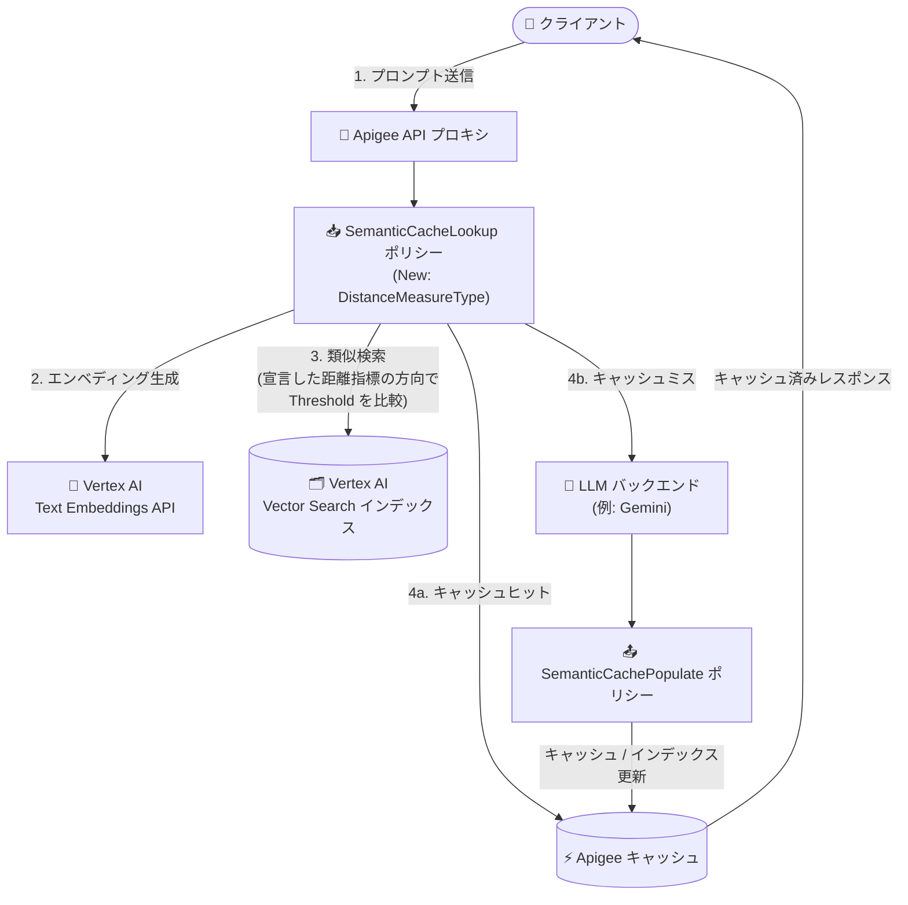

# Apigee X: SemanticCacheLookup ポリシーが非デフォルトの Vector Search 距離指標をサポート

**リリース日**: 2026-09-09

**サービス**: Apigee X

**機能**: SemanticCacheLookup ポリシーの `<DistanceMeasureType>` 要素追加

**ステータス**: リリース済み (Apigee 1-18-0-apigee-4 以降で利用可能)

📊 [このアップデートのインフォグラフィックを見る](https://takech9203.github.io/google-cloud-news-summary/20260909-apigee-x-semantic-cache-lookup-distance-measures.html)

## 概要

Apigee X の SemanticCacheLookup ポリシーに、オプションの `<DistanceMeasureType>` 要素が追加されました。この要素により、Vertex AI Vector Search インデックスで使用している距離指標 (Distance Measure) をポリシー側で宣言できるようになります。指定可能な値は `DOT_PRODUCT_DISTANCE` (デフォルト、従来の動作)、`COSINE_DISTANCE`、`SQUARED_L2_DISTANCE`、`L1_DISTANCE` の 4 種類です。本機能は Apigee 1-18-0-apigee-4 以降で利用できます。

SemanticCacheLookup ポリシーは、LLM ワークロード向けの高度なキャッシュポリシーです。Vertex AI Text Embeddings API でユーザープロンプトをエンベディングに変換し、Vector Search で意味的に類似する過去のプロンプトを検索することで、完全一致ではなくセマンティックな類似性に基づいてキャッシュ済みレスポンスを再利用します。これにより LLM への呼び出し回数を削減し、レイテンシとコストを最適化します。SemanticCachePopulate ポリシーと組み合わせて使用します。

今回のアップデートにより、ポリシーは宣言された距離指標が意味する方向で `<Threshold>` を比較するようになりました。そのため、非デフォルトの距離指標を宣言する場合は、同じ編集内でしきい値の再チューニングが必要です。また、`<Threshold>` に課されていた 0 から 1 の範囲制限も撤廃されました。

**アップデート前の課題**

- SemanticCacheLookup ポリシーの類似性判定は Vector Search のデフォルト距離指標 (`DOT_PRODUCT_DISTANCE`) を前提とした動作のみで、`COSINE_DISTANCE` や `SQUARED_L2_DISTANCE`、`L1_DISTANCE` で構成された Vector Search インデックスに合わせて距離指標を宣言する手段がなかった
- `<Threshold>` 要素は 0 以上 1 以下の値しか指定できず、範囲外の値を設定すると API プロキシのデプロイが失敗していた (この制約は L2 距離のように 1 を超えうる距離値と整合しない)

**アップデート後の改善**

- 新しい `<DistanceMeasureType>` 要素で `DOT_PRODUCT_DISTANCE`、`COSINE_DISTANCE`、`SQUARED_L2_DISTANCE`、`L1_DISTANCE` の 4 つの距離指標を宣言できるようになった
- ポリシーが宣言された距離指標の意味する方向で `<Threshold>` を比較するようになり、距離指標ごとに正しいキャッシュヒット判定が行われるようになった
- `<Threshold>` の 0〜1 の範囲制限が撤廃され、距離指標に応じた柔軟なしきい値設定が可能になった

## アーキテクチャ図



SemanticCacheLookup ポリシーがプロンプトをエンベディング化して Vector Search で類似検索を行い、キャッシュヒット時は LLM を呼び出さずにキャッシュ済みレスポンスを返します。今回のアップデートで、この類似検索に使う距離指標を `<DistanceMeasureType>` で宣言できるようになりました。

## サービスアップデートの詳細

### 主要機能

1. **`<DistanceMeasureType>` 要素の追加 (オプション)**
   - SemanticCacheLookup ポリシーで Vector Search の距離指標を宣言できる新しいオプション要素
   - 指定可能な値: `DOT_PRODUCT_DISTANCE` (デフォルト、従来の動作)、`COSINE_DISTANCE`、`SQUARED_L2_DISTANCE`、`L1_DISTANCE`
   - Apigee 1-18-0-apigee-4 以降で利用可能

2. **距離指標に応じた `<Threshold>` の比較方向の適正化**
   - ポリシーは宣言された距離指標が意味する方向でしきい値を比較するようになった
   - 非デフォルトの距離指標を宣言する場合は、同じ編集内で `<Threshold>` の再チューニングが必要

3. **`<Threshold>` の 0〜1 範囲制限の撤廃**
   - 従来は「SimilaritySearch/Threshold element must be >= 0 and <= 1」のデプロイエラーにより 0〜1 以外の値が使用できなかったが、この制限が撤廃された

## 技術仕様

### サポートされる距離指標

Vertex AI Vector Search インデックスの `distanceMeasureType` に対応する 4 つの値を指定できます。

| 距離指標 | 説明 (Vector Search ドキュメントより) |
|------|------|
| `DOT_PRODUCT_DISTANCE` | デフォルト値。ドット積の負値として定義される。従来の SemanticCacheLookup の動作 |
| `COSINE_DISTANCE` | コサイン距離。Vector Search では `DOT_PRODUCT_DISTANCE` + `UNIT_L2_NORM` の使用が推奨されている (数学的に同等のランキングで、アルゴリズムがより最適化されている) |
| `SQUARED_L2_DISTANCE` | ユークリッド (L2) 距離 |
| `L1_DISTANCE` | マンハッタン (L1) 距離 |

### ポリシー構成例

`<DistanceMeasureType>` は `<SimilaritySearch>` の類似検索設定と合わせて使用します。以下は SemanticCacheLookup ポリシーの基本構文です (公式リファレンスの構文に新要素を加えた例)。

```xml
<SemanticCacheLookup async="false" continueOnError="false" enabled="true" name="SCL-lookup">
  <DisplayName>SCL-lookup</DisplayName>
  <IgnoreUnresolvedVariables>false</IgnoreUnresolvedVariables>
  <UserPromptSource>{jsonPath('$.contents[-1].parts[-1].text',request.content,true)}</UserPromptSource>
  <Embeddings>
    <VertexAI>
      <URL>https://{LOCATION}-aiplatform.googleapis.com/v1/projects/{PROJECT_ID}/locations/{LOCATION}/publishers/google/models/{MODEL_ID}:predict</URL>
    </VertexAI>
  </Embeddings>
  <SimilaritySearch>
    <VertexAI>
      <URL>https://{PUBLIC_DOMAIN_NAME}/v1/projects/{PROJECT_ID}/locations/{LOCATION}/indexEndpoints/{INDEX_ENDPOINT_ID}:findNeighbors</URL>
      <DeployedIndexID>{DEPLOYED_INDEX_ID}</DeployedIndexID>
      <DistanceMeasureType>COSINE_DISTANCE</DistanceMeasureType>
      <Threshold>{距離指標に合わせて再チューニングした値}</Threshold>
    </VertexAI>
  </SimilaritySearch>
</SemanticCacheLookup>
```

### 前提条件 (SemanticCacheLookup ポリシー共通)

| 項目 | 詳細 |
|------|------|
| ランタイムバージョン | Apigee 1-18-0-apigee-4 以降 (本機能の場合) |
| 環境タイプ | Intermediate または Comprehensive 環境のみでデプロイ可能 |
| 必要な IAM ロール | プロキシのデプロイに使用するサービスアカウントに AI Platform User (`roles/aiplatform.user`) |
| 必要な API | Compute Engine、Vertex AI、Cloud Storage の各 API を有効化 |
| 事前準備 | Vector Search インデックスの作成、インデックスエンドポイントの作成、SemanticCachePopulate ポリシーの構成 |

## メリット

### ビジネス面

- **既存の Vector Search 資産の活用**: 既にコサイン距離や L2 距離で構築・チューニング済みの Vector Search インデックスを、セマンティックキャッシュ用に作り直すことなく利用しやすくなる
- **キャッシュ精度の向上によるコスト最適化**: エンベディングモデルやユースケースに適した距離指標としきい値を選択することで、キャッシュヒット判定の精度を高め、LLM 呼び出しコストの削減効果を最大化できる

### 技術面

- **距離指標としきい値の整合性**: ポリシーが距離指標の意味する方向でしきい値を比較するため、距離指標ごとに正しいセマンティクスでキャッシュヒットを判定できる
- **しきい値の柔軟性**: 0〜1 の範囲制限が撤廃され、L2 距離のように 1 を超えうる距離値にもしきい値を設定できる

## デメリット・制約事項

### 制限事項

- Apigee 1-18-0-apigee-4 より前のランタイムでは利用できない
- セマンティックキャッシュポリシー共通の制限として、キャッシュ可能なテキストの最大サイズは 256 KB
- Vector Search がサポートされないリージョンでは、Apigee 組織と異なるリージョンにインデックスエンドポイントを作成する必要がある
- EventFlows を使用した Server-Sent Events (SSE) の継続的レスポンスストリーミングを行う API プロキシでは、セマンティックキャッシュポリシーは使用できない
- Apigee hybrid では Google Cloud 上のインストールのみサポートされ、フォワードプロキシとの併用はサポートされない

### 考慮すべき点

- **非デフォルトの距離指標を宣言する場合は、同じ編集内で `<Threshold>` の再チューニングが必須**。しきい値の比較方向が距離指標に依存するため、従来の値をそのまま流用するとキャッシュヒット判定が意図しない動作になる可能性がある
- Vector Search インデックス側の `distanceMeasureType` とポリシー側の `<DistanceMeasureType>` の宣言を一致させる運用管理が必要になる
- Vector Search のドキュメントでは、コサイン距離の代わりに `DOT_PRODUCT_DISTANCE` + `UNIT_L2_NORM` の使用が推奨されている点にも留意する
- SemanticCacheLookup は Extensible ポリシーであり、Apigee のライセンスによってはコストや使用量への影響がある

## ユースケース

### ユースケース 1: コサイン距離で構築済みの Vector Search インデックスをセマンティックキャッシュに利用

**シナリオ**: 社内の RAG 基盤などで `COSINE_DISTANCE` を指定して構築した Vector Search インデックスがあり、同じ距離指標の運用ノウハウを活かして LLM API プロキシにセマンティックキャッシュを導入したい。

**実装例**:
```xml
<SimilaritySearch>
  <VertexAI>
    <URL>https://{PUBLIC_DOMAIN_NAME}/v1/projects/{PROJECT_ID}/locations/{LOCATION}/indexEndpoints/{INDEX_ENDPOINT_ID}:findNeighbors</URL>
    <DeployedIndexID>{DEPLOYED_INDEX_ID}</DeployedIndexID>
    <DistanceMeasureType>COSINE_DISTANCE</DistanceMeasureType>
    <Threshold>{コサイン距離向けに再チューニングした値}</Threshold>
  </VertexAI>
</SimilaritySearch>
```

**効果**: インデックスの距離指標とポリシーの類似性判定が整合し、意図したとおりのキャッシュヒット率で LLM 呼び出しを削減できる。

### ユースケース 2: L2 / L1 距離ベースのエンベディング運用に合わせたしきい値チューニング

**シナリオ**: エンベディングの特性上、ユークリッド距離 (`SQUARED_L2_DISTANCE`) やマンハッタン距離 (`L1_DISTANCE`) で類似性を評価しており、距離値が 1 を超える前提でしきい値を設計したい。

**効果**: `<Threshold>` の 0〜1 制限が撤廃されたため、距離指標の実際の値域に合わせたしきい値を設定でき、キャッシュヒット判定の精度を距離指標に合わせて最適化できる。

## 関連サービス・機能

- **Vertex AI Vector Search**: 類似プロンプト検索の基盤。インデックス作成時の `distanceMeasureType` が今回ポリシー側で宣言可能になった距離指標に対応する
- **Vertex AI Text Embeddings API**: ユーザープロンプトをエンベディングに変換するために使用
- **SemanticCachePopulate ポリシー**: レスポンスフロー側でキャッシュと Vector Search インデックスを更新する、SemanticCacheLookup と対になるポリシー
- **Apigee キャッシュ**: 類似プロンプトが見つかった場合にレスポンスを返すキャッシュ機構 (キャッシュ値の上限は 256 KB)

## 参考リンク

- 📊 [インフォグラフィック](https://takech9203.github.io/google-cloud-news-summary/20260909-apigee-x-semantic-cache-lookup-distance-measures.html)
- [公式リリースノート](https://docs.cloud.google.com/release-notes#September_09_2026)
- [SemanticCacheLookup ポリシー リファレンス](https://docs.cloud.google.com/apigee/docs/api-platform/reference/policies/semantic-cache-lookup-policy)
- [SemanticCachePopulate ポリシー リファレンス](https://docs.cloud.google.com/apigee/docs/api-platform/reference/policies/semantic-cache-populate-policy)
- [セマンティックキャッシュポリシーの利用開始 (チュートリアル)](https://docs.cloud.google.com/apigee/docs/api-platform/tutorials/using-semantic-caching-policies)
- [Vector Search インデックスの構成 (DistanceMeasureType)](https://docs.cloud.google.com/vertex-ai/docs/vector-search/configuring-indexes#distance-measure-type)

## まとめ

Apigee X の SemanticCacheLookup ポリシーが Vector Search の 4 つの距離指標に対応し、既存のインデックス設計に合わせたセマンティックキャッシュの構成が可能になりました。コサイン距離や L2/L1 距離でインデックスを運用しているチームは、Apigee 1-18-0-apigee-4 以降で `<DistanceMeasureType>` の宣言を検討してください。その際は、しきい値の比較方向が距離指標に依存するため、必ず同じ編集内で `<Threshold>` を再チューニングすることが重要です。

---

**タグ**: #ApigeeX #SemanticCache #VectorSearch #VertexAI #LLM #APIManagement #生成AI
