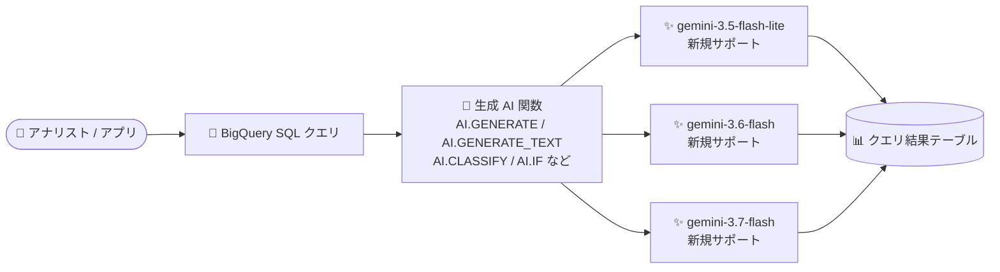

# BigQuery: 生成 AI 関数が新しい Gemini モデル (gemini-3.5-flash-lite / gemini-3.6-flash / gemini-3.7-flash) をサポート

**リリース日**: 2026-09-09

**サービス**: BigQuery

**機能**: 生成 AI 関数における新規 Gemini モデルのサポート

**ステータス**: リリース済み (Feature)

📊 [このアップデートのインフォグラフィックを見る](https://takech9203.github.io/google-cloud-news-summary/20260909-bigquery-generative-ai-new-gemini-models.html)

## 概要

BigQuery の生成 AI 関数で、新たに以下の 3 つの Gemini モデルが利用可能になりました。

- `gemini-3.5-flash-lite`
- `gemini-3.6-flash`
- `gemini-3.7-flash`

BigQuery の生成 AI 関数は、SQL クエリの中から Gemini などの事前学習済みモデルを直接呼び出し、テキスト生成、感情分析、分類、構造化データ抽出、要約などを実行できる機能です。今回のアップデートにより、既存のサポートモデル (`gemini-3.1-flash-lite`、`gemini-3.5-flash`) に加えて上記 3 モデルが選択肢に加わり、公式ドキュメント上のサポートモデルは計 5 つになりました。

データウェアハウス上のデータに対して LLM 推論をバッチ実行しているデータアナリスト、データエンジニアにとって、タスクの要件 (品質・レイテンシ・コスト) に応じたモデル選択の幅が広がるアップデートです。

**アップデート前の課題**

- BigQuery の生成 AI 関数で指定できる Gemini モデルは `gemini-3.1-flash-lite` や `gemini-3.5-flash` などに限られており、より新しい世代の Flash 系モデルを SQL から直接利用できなかった
- 新しいモデルを使いたい場合は、BigQuery の外部で Vertex AI API を直接呼び出すパイプラインを別途構築する必要があった

**アップデート後の改善**

- `gemini-3.5-flash-lite`、`gemini-3.6-flash`、`gemini-3.7-flash` を BigQuery の生成 AI 関数のエンドポイントとして指定できるようになった
- 軽量・低コスト志向の flash-lite 系と、より新しい世代の flash 系を、ワークロードの特性に応じて SQL レベルで使い分けられるようになった

## アーキテクチャ図



BigQuery の SQL クエリから生成 AI 関数を呼び出すと、リモートモデル経由で Gemini モデルに推論リクエストが送信され、結果がクエリ結果として返ります。今回のアップデートで、この推論先として 3 つの新しい Gemini モデルを指定できるようになりました。

## サービスアップデートの詳細

### 主要機能

1. **新規サポートモデルの追加**
   - `gemini-3.5-flash-lite`、`gemini-3.6-flash`、`gemini-3.7-flash` の 3 モデルが生成 AI 関数で利用可能になった
   - 公式ドキュメントに記載されたサポートモデルは以下の 5 つ:
     - `gemini-3.1-flash-lite`
     - `gemini-3.5-flash`
     - `gemini-3.5-flash-lite` (新規)
     - `gemini-3.6-flash` (新規)
     - `gemini-3.7-flash` (新規)

2. **BigQuery の生成 AI 関数群で利用可能**
   - **汎用 AI 関数**: `AI.GENERATE` (最も柔軟な推論関数)、`AI.GENERATE_TEXT` (テーブル値関数)、`AI.GENERATE_TABLE` / `AI.GENERATE_BOOL` / `AI.GENERATE_DOUBLE` / `AI.GENERATE_INT` (構造化出力)
   - **マネージド AI 関数**: `AI.IF` (自然言語条件でのフィルタ)、`AI.SCORE` (スコアリング)、`AI.CLASSIFY` (分類)、`AI.AGG` (集約・要約)
   - **ユーティリティ関数**: `AI.COUNT_TOKENS` (クエリ実行前の入力トークン数見積もり)

3. **テキストだけでなくマルチモーダルデータに対応**
   - 生成 AI 関数はテキスト、画像、音声、動画、PDF データの分析に利用できる

## 技術仕様

### エンドポイントの指定と選択ルール

これらの Gemini モデルは、Vertex AI 側でマルチリージョンエンドポイントのみをサポートします (リージョナルエンドポイントは非サポート)。リージョンを省略した短いエンドポイント名 (例: `gemini-3.5-flash`) を指定した場合、BigQuery は以下のルールでエンドポイントを選択します。

| クエリの実行ロケーション | 使用されるエンドポイント |
|------|------|
| `us` マルチリージョン、または US 内の単一リージョン | `us` エンドポイント |
| `eu` マルチリージョン、または EU 内の単一リージョン (`europe-west2`、`europe-west6` を除く) | `eu` エンドポイント |
| その他のロケーション (`europe-west2`、`europe-west6` を含む) | `global` エンドポイント |

特定のエンドポイントを明示的に指定する場合は、以下の形式の完全修飾名を使用します。

```
https://aiplatform.us.rep.googleapis.com/v1/projects/PROJECT_ID/locations/us/publishers/google/models/MODEL_ID
https://aiplatform.eu.rep.googleapis.com/v1/projects/PROJECT_ID/locations/eu/publishers/google/models/MODEL_ID
https://aiplatform.googleapis.com/v1/projects/PROJECT_ID/locations/global/publishers/google/models/MODEL_ID
```

なお、`asia-south1` リージョンでクエリを実行する場合は、完全修飾の global エンドポイント名の使用が必須です。

### トークン使用量のトラッキング

Gemini モデルを使う生成 AI 関数を呼び出したクエリでは、「ジョブ情報」からクエリで処理されたトークン数を確認できます。

| カウント | 内容 |
|------|------|
| 入力トークン数 | クエリ内のすべての生成 AI 関数への入力トークンの合計 |
| 出力トークン数 | 生成されたすべての候補レスポンスのトークン合計 |
| 思考トークン数 | モデルの思考 (thinking) に使われたトークン合計 (該当する場合) |
| キャッシュトークン数 | 暗黙的にキャッシュされた入力トークンの合計 |

## デメリット・制約事項

### 制限事項

- これらのモデルは Vertex AI のマルチリージョンエンドポイント (`us` / `eu` / `global`) のみをサポートし、リージョナルエンドポイントは利用できない
- 生成 AI 関数は、参照するリモートモデルと同じリージョンまたはマルチリージョンで実行する必要がある
- VPC Service Controls の境界内では、委任アクセス (delegated access) を使う `ObjectRef` 値を AI 関数で処理できない (署名付き HTTPS URL の取得がブロックされるため)。代わりに `OBJ.MAKE_REF(uri)` による直接アクセスを使用する

### 考慮すべき点

- リモートエンドポイントへの API 呼び出しが Vertex AI 側のクォータを超えると、クエリジョブ自体は成功しても一部の行に `RESOURCE EXHAUSTED` エラーが返ることがある (並列バッチクエリで発生しやすい)
- モデルごとに品質・レイテンシ・コスト特性が異なるため、切り替え時は既存ワークロードでの出力品質とコストの再評価を推奨

## 料金

BigQuery の生成 AI 関数は、クエリ実行に使用する BigQuery のコンピュートリソースに対する課金に加えて、リモートモデル経由で Vertex AI のモデルを呼び出すため Vertex AI 側の課金も発生します。

- クエリ実行前に `AI.COUNT_TOKENS` 関数で入力トークン数を見積もり可能
- Cloud Billing のレポートで、`bigquery_job_id_prefix` ラベルを使ってジョブ単位の Vertex AI コストを追跡可能
- コスト管理にはトークンクォータによる制御も利用可能

詳細は [BigQuery ML の料金ページ](https://cloud.google.com/bigquery/pricing#bqml) を参照してください。

## 利用可能リージョン

サポートされるロケーションはモデルのタイプとバージョンによって異なります。詳細は公式ドキュメントの [Locations セクション](https://docs.cloud.google.com/bigquery/docs/generative-ai-overview#locations) を参照してください。

## 関連サービス・機能

- **Vertex AI (Gemini Enterprise Agent Platform)**: 生成 AI 関数はリモートモデル経由で Vertex AI 上の Gemini モデルを呼び出す。Provisioned Throughput を購入すれば、安定した高スループットでの推論も可能
- **BigQuery ML リモートモデル**: `CREATE MODEL` で作成するリモートモデルが、SQL と Gemini エンドポイントを橋渡しする
- **Cloud Billing**: ジョブラベルによる生成 AI 関数のコスト追跡に使用

## 参考リンク

- 📊 [インフォグラフィック](https://takech9203.github.io/google-cloud-news-summary/20260909-bigquery-generative-ai-new-gemini-models.html)
- [公式リリースノート](https://docs.cloud.google.com/release-notes#September_09_2026)
- [ドキュメント: BigQuery 生成 AI 概要 (Locations)](https://docs.cloud.google.com/bigquery/docs/generative-ai-overview#locations)
- [ドキュメント: AI.GENERATE_TEXT 関数リファレンス](https://docs.cloud.google.com/bigquery/docs/reference/standard-sql/bigqueryml-syntax-ai-generate-text)
- [料金ページ: BigQuery ML](https://cloud.google.com/bigquery/pricing#bqml)

## まとめ

BigQuery の生成 AI 関数から新世代の Gemini Flash 系モデル 3 種を直接利用できるようになり、SQL ベースの LLM 推論におけるモデル選択の幅が広がりました。既存のワークロードで生成 AI 関数を利用している場合は、新モデルでの出力品質・トークンコストを `AI.COUNT_TOKENS` や少量データでの検証クエリで評価し、要件に合ったモデルへの移行を検討することを推奨します。

---

**タグ**: BigQuery, Gemini, 生成AI, BigQuery ML, AI.GENERATE, Vertex AI
