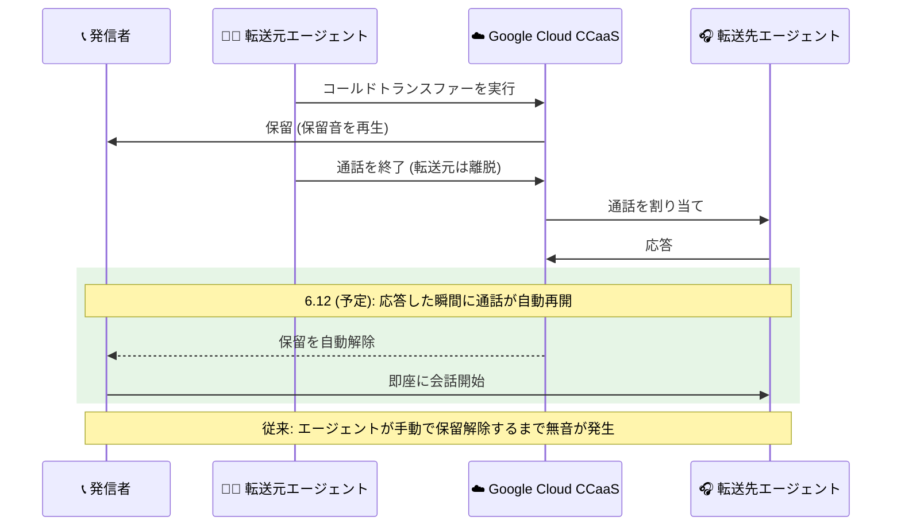

# Google Cloud Contact Center as a Service: コールドトランスファー自動再開と Agent Desktop 強化 (プレリリースノート 6.12)

**リリース日**: 2026-09-09

**サービス**: Google Cloud Contact Center as a Service (CCaaS)

**機能**: コールドトランスファー自動再開、HubSpot 電話番号単位の Do Not Call 設定、Agent Desktop ネットワーク診断ツール、CCaaS ポータルからの Agent Desktop 起動、バグ修正

**ステータス**: プレリリース (次期バージョン 6.12 として公開予定)

📊 [このアップデートのインフォグラフィックを見る](https://takech9203.github.io/google-cloud-news-summary/20260909-ccaas-cold-transfer-and-agent-desktop-updates.html)

## 概要

Google Cloud CCaaS の次期バージョン 6.12 のプレリリースノートが公開されました。プレリリースノートは、次のバージョンがリリースされた際に提供される見込みの新機能を事前に示すものです。なお、公式ドキュメントには「次のバージョンは 6.12 より大きい番号になる可能性がある」と明記されています。

今回のプレリリースノートには、コンタクトセンターの通話品質と運用効率に直結する 4 つの新機能が含まれています。特に注目すべきは「コールドトランスファーの自動再開」で、転送先エージェントが応答した瞬間に通話が自動的に再開されるようになり、従来発生していた「エージェントが応答してから保留解除するまでの無音時間」が解消されます。そのほか、HubSpot 統合における電話番号単位の Do Not Call (発信禁止) 設定、Agent Desktop の新しいネットワーク診断ツール、CCaaS ポータルの Apps メニューからの Agent Desktop 起動が追加されます。また、40 件を超える不具合修正も含まれており、レポーティング精度やキャパシティ制御、エージェントデスクトップの安定性が改善されます。

対象ユーザーは、Google Cloud CCaaS を利用するコンタクトセンターの管理者、スーパーバイザー、およびエージェントです。

**アップデート前の課題**

- コールドトランスファーでは、転送先エージェントが通話に応答した後、手動で発信者の保留を解除する必要があり、応答から保留解除までの間に無音時間が発生していた
- HubSpot 統合の Do Not Call 設定は、コンタクトまたは企業レコード全体に対してのみ設定可能で、特定の電話番号だけを発信禁止にすることができなかった。また、オプトアウトのマッチングは大文字・小文字を区別していた
- エージェントがネットワーク起因の接続問題に直面した際、Agent Desktop 上でネットワーク状態を確認する手段がなかった
- CCaaS ポータルと Agent Desktop を行き来する導線が整備されていなかった

**アップデート後の改善**

- コールドトランスファー時、転送先エージェントが応答した瞬間に通話が自動的に再開され、手動での保留解除が不要になった
- HubSpot 統合で、レコード全体ではなく特定の電話番号単位で Do Not Call を設定できるようになった。オプトアウトのマッチングは大文字・小文字を区別しなくなった
- Agent Desktop のナビゲーションメニューにネットワーク診断ツールが追加され、ネットワーク強度と診断情報を表示して接続問題を迅速にトラブルシューティングできるようになった
- CCaaS ポータルの「Apps > Agent Desktop」から Agent Desktop を新しいブラウザタブで開けるようになり、ポータルのセッションを終了せずに両者を行き来できるようになった

## アーキテクチャ図

コールドトランスファーの自動再開フローを示したシーケンス図です。従来は転送先エージェントの応答後に手動の保留解除操作が必要で無音時間が発生していましたが、今後は応答と同時に通話が自動再開されます。

## サービスアップデートの詳細

### 主要機能

1. **コールドトランスファーの自動再開**
   - エージェントがコールドトランスファーを実行すると、転送先エージェントが通話に応答した瞬間に通話が再開される
   - 転送先エージェントが手動で発信者の保留を解除する必要がなくなる
   - エージェントの応答から保留解除までの間に発生していた無音時間が解消される
   - なお、CCaaS のコールドトランスファーは、転送元エージェントが回線に留まらずに転送を完了する方式で、エージェントまたはリーフキュー宛てにのみ実行できる (ブランチキュー、サードパーティ、サードパーティへ自動転送するキュー宛てはサポート外)

2. **HubSpot: 電話番号単位の Do Not Call 設定**
   - HubSpot 統合において、コンタクトや企業レコード全体ではなく、特定の電話番号に対して Do Not Call を設定可能になる
   - オプトアウトのマッチングが大文字・小文字を区別しなくなる
   - 管理者向けに、CRM ペインに新しい「Do Not Call Configuration」セクションが追加される (場所: Settings > Developer Settings で HubSpot を選択)

3. **Agent Desktop: ネットワーク診断ツール**
   - Agent Desktop のナビゲーションメニューに、ネットワーク強度と診断情報を表示する新しいネットワーク診断ツールが追加される
   - ネットワークの健全性を迅速に評価し、接続問題のトラブルシューティングに役立てられる

4. **Agent Desktop: CCaaS ポータルからの起動**
   - 新しい Apps メニューから Agent Desktop にアクセス可能になる
   - CCaaS ポータルで「Apps > Agent Desktop」をクリックすると、Agent Desktop が新しいブラウザタブで開く
   - ポータルのセッションを終了することなく、ポータルと Agent Desktop の間を行き来できる

5. **バグ修正 (40 件以上)**

   主な修正内容は以下のカテゴリに分類できます。

   | カテゴリ | 主な修正内容 |
   |---------|-------------|
   | キャパシティ制御・ルーティング | 1 分未満の推定待ち時間が 0 に切り捨てられ過負荷アクションが発動しない問題、コール急増時にチームのキャパシティ保護がバイパスされる問題、過負荷時の電話デフレクションがエージェント直通コールで動作しない問題などを修正 |
   | レポーティング・SLA | 完了した転送で重複したキュー滞在時間レコードが生成されキュー量と SLA 指標が過大計上される問題、手動ラップアップが無関係な直近のコールに紐付けられる問題、作業時間と待ち時間が重複計上される問題などを修正 |
   | Agent Desktop・アダプター | カスタムデータのネストされたオブジェクトが `[object Object]` と表示される問題、切断後に必須ディスポジションのプロンプトが表示されない問題、チャット割り当て時にトランスクリプトの代わりにローディング表示が続く問題などを修正 |
   | 音声・録音・ボイスメール | 過負荷でボイスメールにデフレクトされた通話の録音が外部ストレージにエクスポートされない問題、高負荷リダイレクト時にボイスメールが保存されない問題、応答済みコールが終話後に意図しない 2 回目のコールバックを発生させる問題などを修正 |
   | 統合・接続 | Vonage BYOC コールで Agent Assist のリアルタイム文字起こしが開始されない問題、IMAP 接続拒否によるメール取得の長時間停止、Twilio ICE トークン取得時の一時的な接続エラーでコールセットアップが失敗する問題などを修正 |
   | 監査・アクセシビリティ | ブラウザ以外 (API クライアントやバックグラウンドジョブ) からの変更で監査ログが生成されない問題、Web SDK のチャットウィジェットで非インタラクティブなテキストがキーボードフォーカスを受け取る問題などを修正 |

## メリット

### ビジネス面

- **顧客体験の向上**: コールドトランスファー時の無音時間が解消され、発信者が「つながっていないのではないか」と不安になる瞬間がなくなる
- **コンプライアンス強化**: 電話番号単位の Do Not Call 設定により、HubSpot 統合環境での発信規制対応をより細かく制御できる
- **レポーティング精度の向上**: 転送時の重複レコードやラップアップの誤帰属などの修正により、キュー量・SLA 指標に基づく運用判断の信頼性が高まる

### 技術面

- **エージェント操作の削減**: 転送先エージェントの手動保留解除が不要になり、操作ミスによる保留放置のリスクがなくなる
- **トラブルシューティングの迅速化**: ネットワーク診断ツールにより、エージェント自身が接続問題の一次切り分けを行える
- **ワークフローの継続性**: ポータルセッションを維持したまま Agent Desktop を別タブで開けるため、管理業務とエージェント業務の切り替えがスムーズになる

## デメリット・制約事項

### 制限事項

- これはプレリリースノートであり、記載された機能は次期バージョンのリリース時に提供される見込みの内容である。実際のリリース時に内容が変わる可能性があり、次のバージョン番号も 6.12 より大きくなる可能性がある
- コールドトランスファーは従来どおり、エージェントまたはリーフキュー宛てにのみ実行できる。ブランチキュー、サードパーティ、サードパーティへ自動転送するキューへのコールドトランスファーはサポートされない

### 考慮すべき点

- コールドトランスファーは過負荷デフレクション (Overcapacity Deflection) の対象となる (ウォームトランスファーは対象外) という既存の挙動は引き続き留意が必要
- 電話番号単位の Do Not Call 設定を利用するには、管理者が CRM ペインの新しい「Do Not Call Configuration」セクション (Settings > Developer Settings、HubSpot 選択時) で設定を行う必要がある
- インスタンスへの適用タイミングは、選択しているデプロイメントスケジュールに依存する

## ユースケース

### ユースケース 1: 繁忙期のコールセンターにおける迅速な転送

**シナリオ**: 問い合わせが集中する時間帯に、一次受付のエージェントが専門チームのキューへコールドトランスファーで通話を引き継ぐ。

**効果**: 転送先エージェントが応答した瞬間に会話が始まるため、無音による顧客の不安や「もしもし?」の確認のやり取りがなくなり、平均処理時間の短縮と顧客体験の改善につながる。

### ユースケース 2: HubSpot 連携環境での発信規制の精緻化

**シナリオ**: 1 つの企業レコードに複数の電話番号 (代表番号、担当者直通など) が登録されており、特定の番号からのみ発信拒否の要望を受けている。

**効果**: レコード全体を発信禁止にすることなく、要望のあった電話番号だけを Do Not Call に設定でき、他の番号への正当なアウトバウンド業務を継続できる。

### ユースケース 3: 在宅エージェントの接続品質の自己診断

**シナリオ**: リモート勤務のエージェントが通話の音声品質低下を感じた際、Agent Desktop のナビゲーションメニューからネットワーク診断ツールを開く。

**効果**: ネットワーク強度と診断情報をエージェント自身が確認でき、サポート部門への問い合わせ前に一次切り分けが可能になる。

## 関連サービス・機能

- **HubSpot CRM 統合**: 今回の Do Not Call 設定強化の対象。CCaaS の CRM ペインから開発者設定を通じて構成する
- **Agent Assist**: バグ修正により Vonage BYOC コールでのリアルタイム文字起こしの問題が解消される
- **仮想エージェント (Virtual Agent)**: バグ修正により、仮想エージェントからの人間へのエスカレーションに関するキュー滞在時間や SLA 指標の不整合が解消される

## 参考リンク

- 📊 [インフォグラフィック](https://takech9203.github.io/google-cloud-news-summary/20260909-ccaas-cold-transfer-and-agent-desktop-updates.html)
- [公式リリースノート](https://docs.cloud.google.com/release-notes#September_09_2026)
- [CCaaS リリースノート](https://docs.cloud.google.com/contact-center/ccai-platform/docs/release-notes)
- [通話の転送 (ウォームトランスファーとコールドトランスファー)](https://docs.cloud.google.com/contact-center/ccai-platform/docs/call-adapter-transfer)

## まとめ

Google Cloud CCaaS の次期バージョン 6.12 のプレリリースノートでは、コールドトランスファーの自動再開による無音時間の解消、HubSpot 統合での電話番号単位の Do Not Call 設定、Agent Desktop のネットワーク診断ツールとポータルからの起動導線という、現場の使い勝手に直結する改善が予告されています。プレリリースノートのため内容は変わる可能性がありますが、コンタクトセンター管理者は正式リリースに備え、転送オペレーションの手順書更新や HubSpot の Do Not Call 設定方針の見直しを検討しておくことを推奨します。

---

**タグ**: #GoogleCloud #CCaaS #ContactCenter #AgentDesktop #HubSpot #ColdTransfer #コンタクトセンター
