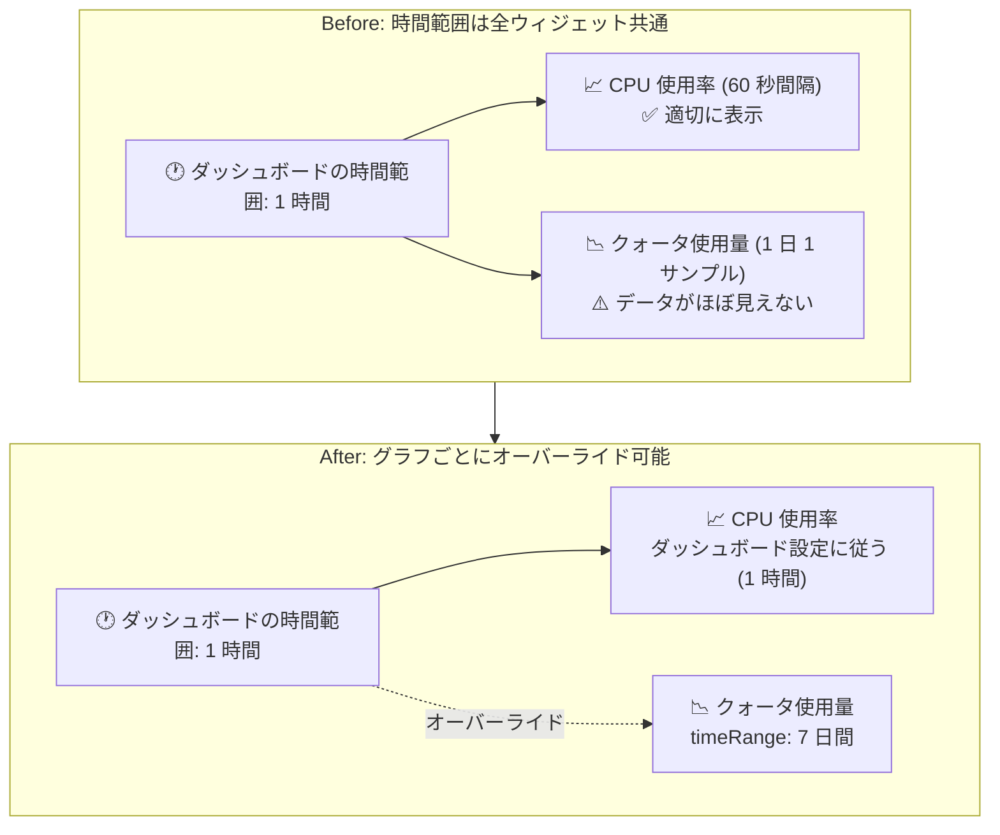

# Cloud Monitoring: ダッシュボードのグラフごとの時間範囲オーバーライドが GA

**リリース日**: 2026-09-09

**サービス**: Cloud Monitoring

**機能**: ダッシュボード上のグラフ (チャート) ごとの時間範囲オーバーライド

**ステータス**: GA (一般提供)

📊 [このアップデートのインフォグラフィックを見る](https://takech9203.github.io/google-cloud-news-summary/20260909-cloud-monitoring-chart-time-range-override.html)

## 概要

Cloud Monitoring のカスタムダッシュボードにおいて、個々のグラフ (チャート) がダッシュボード全体の時間範囲設定をオーバーライド (上書き) できる機能が一般提供 (GA) になりました。これまでダッシュボードのツールバーで設定した時間範囲はすべてのウィジェットに一律に適用されていましたが、この機能により、特定のグラフだけを異なる時間範囲で表示できます。

この機能が特に有効なのは、サンプリング頻度の異なるメトリクスを同じダッシュボードに並べるケースです。たとえば、1 日 1 サンプルしか記録されないクォータ系メトリクスと、60 秒ごとに記録される CPU 使用率を同じダッシュボードで扱う場合、クォータの推移を見るには 1 週間以上の時間範囲が必要ですが、その時間範囲では CPU 使用率のスパイクが見えなくなります。時間範囲オーバーライドを使えば、この競合を 1 つのダッシュボード内で解決できます。

Google Cloud コンソールでの設定に加えて、Dashboard API では `XyChart` ウィジェットの `timeRange` フィールドとして設定できるため、ダッシュボードの IaC 管理 (JSON 定義) にも組み込めます。

**アップデート前の課題**

- ダッシュボードの時間範囲設定はすべてのウィジェットに一律に適用され、グラフごとに表示期間を変えられなかった
- サンプリング頻度が低いメトリクス (例: 1 日 1 サンプルのクォータ指標) と高頻度メトリクス (例: 60 秒間隔の CPU 使用率) を同じダッシュボードで適切に表示するには、時間範囲の異なる複数のダッシュボードを使い分ける必要があった
- 同一メトリクスの「長期トレンド」と「直近の詳細」を並べて確認する構成が 1 つのダッシュボードでは実現しにくかった

**アップデート後の改善**

- グラフ単位で相対時間範囲 (例: 直近 6 時間) または絶対時間範囲 (特定の日付範囲) を指定し、ダッシュボードの時間範囲設定をオーバーライドできるようになった
- 長期トレンド用グラフ (例: 8 日間) と直近データ用グラフ (例: 1 時間) を同一ダッシュボードに共存させられるようになった
- コンソールの操作だけでなく、Dashboard API の `widget.timeRange` フィールドでも設定でき、GA としてプロダクション利用に適したサポートレベルになった

## アーキテクチャ図



アップデート前はダッシュボードの時間範囲が全グラフに一律適用されていましたが、アップデート後はグラフ単位で時間範囲をオーバーライドし、性質の異なるメトリクスを 1 つのダッシュボードで適切に表示できます。

## サービスアップデートの詳細

### 主要機能

1. **グラフ単位の時間範囲オーバーライド**
   - グラフの「Time range override」フィールドを設定すると、そのグラフはダッシュボードの時間範囲設定ではなく指定した時間範囲でデータを表示する
   - 相対時間範囲 (relative) と絶対時間範囲 (absolute) の両方を指定可能
   - オーバーライドを設定しない場合は、従来どおり親 (カスタムダッシュボードまたは Metrics Explorer) の時間範囲設定が適用される

2. **Google Cloud コンソールでの設定**
   - ダッシュボード上のグラフの編集画面で、「Display」ペインの「Time range override」を展開して設定する
   - グルーピングウィジェット内に含まれるグラフに対しても設定できる

3. **Dashboard API での設定 (`XyChart` ウィジェット)**
   - `widget.timeRange` フィールドで時間範囲オーバーライドを指定できる
   - 例: `"timeRange": { "relativeDuration": "21600s" }` を設定すると、そのグラフは直近 6 時間のデータを表示する

## 技術仕様

### 時間範囲の決定ロジック

| 条件 | 表示期間 |
|------|---------|
| グラフに Time range override が設定されている | オーバーライドで指定した時間範囲 (相対または絶対) |
| グラフのクエリ自体が時間範囲を指定している | クエリで指定された時間範囲 |
| 上記以外 | 親 (ダッシュボードまたは Metrics Explorer) の時間範囲設定 |

- グラフが表示できる期間は 1 分から 6 週間まで
- グラフの時間範囲を変更すると、時系列のリアライメント (再整列) が発生する場合がある

### API 設定例 (Dashboard API / XyChart)

```json
{
  "widget": {
    "title": "VM Instance - CPU utilization [MEAN]",
    "timeRange": {
      "relativeDuration": "21600s"
    },
    "xyChart": {
      "dataSets": [
        {
          "minAlignmentPeriod": "60s",
          "plotType": "LINE",
          "timeSeriesQuery": {
            "timeSeriesFilter": {
              "aggregation": {
                "alignmentPeriod": "60s",
                "perSeriesAligner": "ALIGN_MEAN"
              },
              "filter": "metric.type=\"compute.googleapis.com/instance/cpu/utilization\" resource.type=\"gce_instance\""
            }
          }
        }
      ]
    }
  }
}
```

`timeRange.relativeDuration` に `21600s` (6 時間) を指定した例です。ダッシュボードの時間範囲設定にかかわらず、このグラフは常に直近 6 時間のデータを表示します。

## 設定方法

### 前提条件

1. Cloud Monitoring のカスタムダッシュボードが作成済みであること
2. オーバーライドを設定する対象がこの機能をサポートするグラフウィジェットであること (対応していないウィジェットでは「Time range override」オプションが表示されない)

### 手順 (Google Cloud コンソール)

#### ステップ 1: ダッシュボードを開く

Google Cloud コンソールで「ダッシュボード」ページ (Monitoring) に移動し、プロジェクトを選択して対象のカスタムダッシュボードを開きます。

#### ステップ 2: グラフの時間範囲オーバーライドを設定する

1. 時間範囲オーバーライドを設定したいグラフのツールバーで「編集」を選択します (グルーピングウィジェット内のグラフも選択可能)
2. 「Display」ペインで「Time range override」を展開し、相対時間範囲または絶対時間範囲を指定します
3. 「Apply」または「Save」をクリックします

## メリット

### ビジネス面

- **ダッシュボードの集約**: サンプリング頻度や参照期間が異なるメトリクスのために複数のダッシュボードを使い分ける必要がなくなり、運用チームは 1 つのダッシュボードで全体を把握できる
- **インシデント対応の効率化**: 長期トレンドと直近の詳細データを 1 画面で比較でき、異常の検知から原因分析までの流れがスムーズになる

### 技術面

- **メトリクス特性に合わせた最適表示**: 1 日 1 サンプルのクォータ系メトリクスと 60 秒間隔のパフォーマンスメトリクスを、それぞれに適した時間範囲で同じダッシュボードに表示できる
- **API による IaC 管理**: `XyChart` の `timeRange` フィールドとして JSON で定義できるため、ダッシュボード定義のコード管理・自動デプロイに組み込める
- **GA によるサポートレベルの確立**: 一般提供となり、プロダクション環境での利用に適したステータスになった

## デメリット・制約事項

### 制限事項

- アラートポリシーに関連付けられたグラフを表示するウィジェットでは、時間範囲オーバーライドを設定できない
- テーブルなどのグラフ以外のウィジェットタイプでは利用できない
- ダッシュボードのズームリセット操作は、時間範囲オーバーライドが設定されたグラフには影響しない。また、オーバーライドが設定されたグラフはポインタ操作による解像度 (ズーム) 変更ができない

### 考慮すべき点

- グラフの時間範囲を変更すると時系列のリアライメントが発生する場合があり、表示されるデータポイントの集計粒度が変わることがある
- オーバーライドされたグラフはダッシュボードの時間範囲セレクタに追従しなくなるため、閲覧者が「すべてのグラフが同じ期間を表示している」と誤解しないよう、グラフのタイトルなどで表示期間を明示するとよい

## ユースケース

### ユースケース 1: クォータ監視と CPU 監視の同居

**シナリオ**: 運用ダッシュボードで、1 日 1 サンプルのクォータ使用量メトリクスと 60 秒間隔の CPU 使用率を並べて監視したい。クォータの推移確認には 1 週間程度の期間が必要だが、CPU のスパイクを確認するには直近 1 時間程度の表示が適切。

**実装例**:
ダッシュボードの時間範囲を「直近 1 時間」に設定し、クォータ使用量のグラフにのみ時間範囲オーバーライド (例: 7 日間) を設定する。

**効果**: 1 つのダッシュボードで、クォータの長期トレンドと CPU のリアルタイムな変動の両方を適切な粒度で確認できる。

### ユースケース 2: 同一メトリクスのトレンドと現在値の並列表示

**シナリオ**: あるメトリクスについて、長期トレンドと直近の測定値の両方を確認したい。

**実装例**:
同じメトリクスのグラフをダッシュボードに 2 つ配置し、一方に時間範囲オーバーライドとして 8 日間を設定する。もう一方はダッシュボードの時間範囲設定 (例: 1 時間) に従わせる。

**効果**: 週次のトレンドと直近 1 時間の詳細な動きを 1 画面で比較でき、「普段と比べて今どうか」を即座に判断できる。

## 料金

この機能はダッシュボードのグラフ表示オプションであり、料金に関する記載はリリースノートおよびドキュメントにありません。Cloud Monitoring 全体の料金体系は公式の料金ページを参照してください。

- [Google Cloud Observability の料金](https://cloud.google.com/stackdriver/pricing)

## 関連サービス・機能

- **Metrics Explorer**: ダッシュボードに保存する前のグラフでも「Time range override」を設定可能。保存しないグラフの場合はツールバーの時間範囲セレクタの利用が推奨されている
- **Cloud Monitoring Dashboard API**: `XyChart` ウィジェットの `timeRange` フィールドで時間範囲オーバーライドをプログラマティックに定義でき、ダッシュボードの IaC 管理と組み合わせられる
- **アラートポリシー**: アラートポリシーが監視するデータを表示するグラフは本機能の対象外であるため、アラート関連の可視化では従来どおりダッシュボードの時間範囲設定が適用される

## 参考リンク

- 📊 [インフォグラフィック](https://takech9203.github.io/google-cloud-news-summary/20260909-cloud-monitoring-chart-time-range-override.html)
- [公式リリースノート](https://docs.cloud.google.com/release-notes#September_09_2026)
- [ドキュメント: グラフまたはグループの時間範囲オーバーライドを設定する](https://docs.cloud.google.com/monitoring/charts/chart-view-options#override-dashboard-time-range)
- [ドキュメント: 時間範囲オーバーライドを設定する XyChart ウィジェットのダッシュボード例 (API)](https://docs.cloud.google.com/monitoring/dashboards/api-examples#dashboard_with_a_time_range)
- [料金ページ](https://cloud.google.com/stackdriver/pricing)

## まとめ

Cloud Monitoring ダッシュボードのグラフ単位の時間範囲オーバーライドが GA となり、サンプリング頻度や参照期間が異なるメトリクスを 1 つのダッシュボードで適切に可視化できるようになりました。クォータ系メトリクスと高頻度メトリクスの同居や、トレンドと現在値の並列表示など、これまで複数ダッシュボードに分けていた構成の集約を検討することをおすすめします。API (`XyChart` の `timeRange`) でも設定できるため、ダッシュボード定義を IaC 管理している場合はテンプレートへの反映も容易です。

---

**タグ**: #CloudMonitoring #Dashboard #Observability #GA #TimeRange
